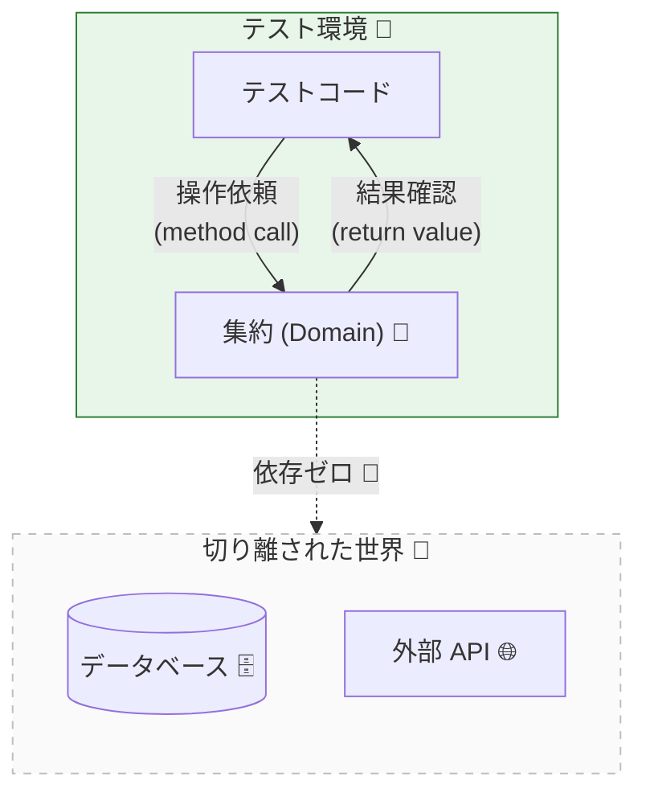

# 第23章：テスト戦略①（集約ユニットテスト）🧪✅

## この章のゴール🎯

* 集約（Aggregate）の「壊れたら困るルール（不変条件🔒）」を、ユニットテストで守れるようになる😊
* 「集約の外（DBやHTTP）」に触れない、速くて安定したテストが書けるようになる🏎️💨
* TDDライト（軽めに Red→Green→Refactor）で、安心して改修できる土台を作る🧱✨

---

## 1) 集約ユニットテストってなに？🤔🧺




---
集約は「一貫性✅（= 不変条件🔒）」を守るための“まとまり”だったよね。
だからテストも **集約の入口（集約ルート）だけ** を触って、**不変条件が絶対に破れない**ことを確認するのが基本だよ🧪✨

## ユニットテストで守るもの🛡️

* ✅ 不変条件（例：合計がマイナスにならない、支払い後に明細が増えない）
* ✅ 状態遷移（例：Draft → Paid はOK、Paid → Draft はNG）
* ✅ 失敗のしかた（例：在庫不足ならそのエラーで落ちる／Resultで返る）

---

## 2) テストが「速い・安定」になるコツ🏎️✨


集約ユニットテストは、ここを守ると強いよ💪

* 🚫 DBに保存しない
* 🚫 HTTPを呼ばない
* 🚫 現在時刻を勝手に読む（必要なら引数で渡す）
* ✅ ただの関数呼び出しみたいに、集約を生成→操作→結果確認

---

## 3) テストフレームワークはどうする？🧪🧰

2026のTypeScript環境では、**Vitest** が「速い・設定が軽い・Jest互換が高い」方向でよく選ばれるよ🫶
（Jest互換APIが多く、移行もしやすいよ〜という立て付けになってる）([Vitest][1])

> ちなみにTypeScriptは 5.9 系が現行の最新リリースノートとして整理されてるよ📚([TypeScript][2])

---

## 4) まずは Vitest を使えるようにする🔧🧪


## インストール📦

```bash
npm i -D vitest
```

## package.json のスクリプト🧷

```json
{
  "scripts": {
    "test": "vitest",
    "test:run": "vitest run"
  }
}
```

* 「test」：監視モード（書いた瞬間に回って気持ちいい😆）
* 「test:run」：CI向けに1回だけ回す🏁

> Vitest は “グローバルAPI（describe/it/expectをimport無しで使う）” もできるけど、デフォルトは明示的（importする）だよ🧠
> 必要なら設定で globals を true にできるよ。([Vitest][3])

---

## 5) 例題：Order集約（最小モデル）🛒📦💳


ここからは「集約ユニットテスト」を書くための、超ミニの Order 集約を用意するね😊
ポイントは **“集約の入口メソッドだけをテストする”** ことだよ🚪👑

## ドメイン：Result型（成功/失敗を型で返す）📦

```ts
// src/domain/result.ts
export type Ok<T> = { ok: true; value: T };
export type Err<E> = { ok: false; error: E };
export type Result<T, E> = Ok<T> | Err<E>;

export const ok = <T>(value: T): Ok<T> => ({ ok: true, value });
export const err = <E>(error: E): Err<E> => ({ ok: false, error });
```

## ドメイン：エラー（仕様として固定する）🚨🧱

```ts
// src/domain/errors.ts
export type DomainError =
  | { type: "InvalidQuantity"; quantity: number; message: string }
  | { type: "InvalidMoney"; yen: number; message: string }
  | { type: "DiscountTooLarge"; discountYen: number; subtotalYen: number; message: string }
  | { type: "OrderIsEmpty"; message: string }
  | { type: "OrderAlreadyPaid"; message: string };
```

## Value Object：Quantity（1以上の整数）🔢🔒

```ts
// src/domain/quantity.ts
import { Result, ok, err } from "./result";
import { DomainError } from "./errors";

export class Quantity {
  private constructor(private readonly value: number) {}

  static of(value: number): Result<Quantity, DomainError> {
    if (!Number.isInteger(value) || value <= 0) {
      return err({ type: "InvalidQuantity", quantity: value, message: "数量は1以上の整数だよ🧺" });
    }
    return ok(new Quantity(value));
  }

  toNumber(): number {
    return this.value;
  }
}
```

## Value Object：Money（0以上の円）💴🔒

```ts
// src/domain/money.ts
import { Result, ok, err } from "./result";
import { DomainError } from "./errors";
import { Quantity } from "./quantity";

export class Money {
  private constructor(private readonly yen: number) {}

  static yen(value: number): Result<Money, DomainError> {
    if (!Number.isInteger(value) || value < 0) {
      return err({ type: "InvalidMoney", yen: value, message: "金額は0以上の整数（円）だよ💴" });
    }
    return ok(new Money(value));
  }

  add(other: Money): Money {
    return new Money(this.yen + other.yen);
  }

  multiply(qty: Quantity): Money {
    return new Money(this.yen * qty.toNumber());
  }

  toNumber(): number {
    return this.yen;
  }
}
```

## 集約：Order（不変条件を守る“最後の砦”）🏰🔒

今回の不変条件（例）：

* 🔒 合計（小計−割引）はマイナスにならない
* 🔒 空の注文は支払えない
* 🔒 支払い後は明細を変更できない

```ts
// src/domain/order.ts
import { Result, ok, err } from "./result";
import { DomainError } from "./errors";
import { Money } from "./money";
import { Quantity } from "./quantity";

type OrderStatus = "Draft" | "Paid";

type OrderItem = {
  productId: string;
  unitPrice: Money;
  quantity: Quantity;
};

export class Order {
  private status: OrderStatus = "Draft";
  private items: OrderItem[] = [];
  private discount: Money;

  private constructor(discount: Money) {
    this.discount = discount;
  }

  static create(): Result<Order, DomainError> {
    const zero = Money.yen(0);
    if (!zero.ok) return err(zero.error);
    return ok(new Order(zero.value));
  }

  getStatus(): OrderStatus {
    return this.status;
  }

  getSubtotalYen(): number {
    return this.items
      .map((i) => i.unitPrice.multiply(i.quantity).toNumber())
      .reduce((a, b) => a + b, 0);
  }

  getTotalYen(): number {
    return this.getSubtotalYen() - this.discount.toNumber();
  }

  addItem(productId: string, unitPrice: Money, quantity: Quantity): Result<void, DomainError> {
    if (this.status === "Paid") {
      return err({ type: "OrderAlreadyPaid", message: "支払い後は明細をいじれないよ💳🚫" });
    }
    this.items.push({ productId, unitPrice, quantity });
    return ok(undefined);
  }

  applyDiscount(discount: Money): Result<void, DomainError> {
    if (this.status === "Paid") {
      return err({ type: "OrderAlreadyPaid", message: "支払い後は割引も変更できないよ💳🚫" });
    }
    const subtotal = this.getSubtotalYen();
    const d = discount.toNumber();
    if (subtotal - d < 0) {
      return err({
        type: "DiscountTooLarge",
        discountYen: d,
        subtotalYen: subtotal,
        message: "割引が大きすぎて合計がマイナスになるよ😵",
      });
    }
    this.discount = discount;
    return ok(undefined);
  }

  pay(): Result<void, DomainError> {
    if (this.items.length === 0) {
      return err({ type: "OrderIsEmpty", message: "空の注文は支払えないよ🛒🚫" });
    }
    if (this.status === "Paid") {
      return err({ type: "OrderAlreadyPaid", message: "二重払いはダメだよ😱💳" });
    }
    this.status = "Paid";
    return ok(undefined);
  }
}
```

---

## 6) いよいよ本題：不変条件テストを3本書く🧪🧷


テストは「集約ルートの操作 → 結果（Result/状態）を見る」だけに集中するよ😊

## テストファイル🧫

```ts
// test/order.test.ts
import { describe, it, expect } from "vitest";
import { Order } from "../src/domain/order";
import { Money } from "../src/domain/money";
import { Quantity } from "../src/domain/quantity";

const money = (yen: number) => {
  const r = Money.yen(yen);
  if (!r.ok) throw new Error(r.error.message);
  return r.value;
};

const qty = (n: number) => {
  const r = Quantity.of(n);
  if (!r.ok) throw new Error(r.error.message);
  return r.value;
};

describe("Order（集約）🧺", () => {
  it("不変条件①：割引で合計がマイナスにならない💴🔒", () => {
    const created = Order.create();
    expect(created.ok).toBe(true);
    if (!created.ok) return;
    const order = created.value;

    // 小計 1000 円
    order.addItem("P-1", money(1000), qty(1));

    // 割引 2000 円は大きすぎる（合計が -1000 になる）
    const res = order.applyDiscount(money(2000));
    expect(res.ok).toBe(false);
    if (!res.ok) {
      expect(res.error.type).toBe("DiscountTooLarge");
    }

    // ちゃんと合計はマイナスになってない（割引が適用されてない）✅
    expect(order.getTotalYen()).toBe(1000);
  });

  it("不変条件②：空の注文は支払えない🛒🚫", () => {
    const created = Order.create();
    expect(created.ok).toBe(true);
    if (!created.ok) return;
    const order = created.value;

    const res = order.pay();
    expect(res.ok).toBe(false);
    if (!res.ok) {
      expect(res.error.type).toBe("OrderIsEmpty");
    }

    // 状態も変わってない✅
    expect(order.getStatus()).toBe("Draft");
  });

  it("不変条件③：支払い後は明細を変更できない💳🚫", () => {
    const created = Order.create();
    expect(created.ok).toBe(true);
    if (!created.ok) return;
    const order = created.value;

    order.addItem("P-1", money(500), qty(1));
    const paid = order.pay();
    expect(paid.ok).toBe(true);
    expect(order.getStatus()).toBe("Paid");

    // 支払い後に addItem しようとしても失敗する
    const res = order.addItem("P-2", money(300), qty(1));
    expect(res.ok).toBe(false);
    if (!res.ok) {
      expect(res.error.type).toBe("OrderAlreadyPaid");
    }
  });
});
```

---

## 7) 境界値テスト（強くなるやつ💪）🔢✨


「不変条件」は **境界（0、1、ちょうど、1つ超え）** が弱点になりがち😇
たとえば Quantity はこういうのが怖いよね👇

* 0（ダメ）
* -1（ダメ）
* 1（OK）
* 1.5（ダメ：整数じゃない）

必要になったら、同じパターンを並べるのもアリだよ🧪（VitestはJest互換APIが多いよ）([Vitest][1])

---

## 8) 集約テストを「書きやすくする設計小ワザ」🪄🧺

* 🧷 集約の状態を外から直接いじれない（メソッド経由にする）
* 🧷 「結果」を Result で返す（失敗の仕様がテストしやすい）
* 🧷 “現在時刻”みたいな外部依存は、引数で渡す（I/O分離）🔌🚫

---

## 9) AI活用：テストケースの抜けを列挙させる🤖🧪


AIは「テスト観点の洗い出し」がめちゃ得意だよ✨（ただし採用は人間が判断ね✅）

## そのまま使えるお願い文📝

```text
次のOrder集約の不変条件テスト観点を、境界値込みで列挙して。
・空の注文は支払えない
・支払い後は明細変更できない
・合計がマイナスにならない
出力は「観点」「理由」「具体テスト例（Given/When/Then）」で。
```

## さらに強くする追加質問🔥

```text
上の観点のうち「事故りやすい順」に並べ替えて。
その理由と、最小のテスト3本に絞るならどれ？も出して。
```

---

## 章末ミニ課題🎓✨

1. 「二重払い防止😱💳」をテストで追加してみよう（payを2回呼ぶ）
2. 「割引の境界値🔢」を追加してみよう（小計=1000、割引=1000 はOK、割引=1001 はNG）
3. 失敗時に「状態が変わってないこと」も必ず確認してみよう✅（地味だけど超大事！）

---

## まとめ🧺✅

* 集約ユニットテストは「不変条件🔒」と「状態遷移🔁」を守るための最強の保険🧪✨
* DBなし・HTTPなしで、速くて壊れにくいテストが作れる🏎️💨
* まずは“不変条件3本”を固定すると、改修が怖くなくなるよ😊

[1]: https://vitest.dev/guide/comparisons?utm_source=chatgpt.com "Comparisons with Other Test Runners | Guide"
[2]: https://www.typescriptlang.org/docs/handbook/release-notes/typescript-5-9.html?utm_source=chatgpt.com "Documentation - TypeScript 5.9"
[3]: https://vitest.dev/config/globals?utm_source=chatgpt.com "globals | Config"
