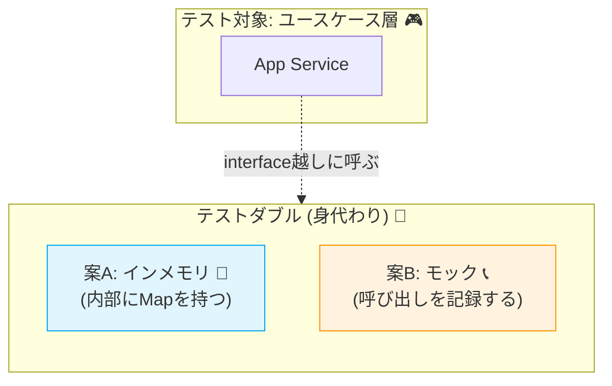

# 第24章：テスト戦略②（ユースケースのテスト）🎮🧪

## 24.1 今日のゴール🎯✨

この章が終わったら、こうなれます👇💖

* **ユースケース（アプリケーションサービス）をテストで守れる**✅
* **Repositoryを差し替えて**（インメモリ・モック/スタブ）**速くて安定したテスト**が書ける🚀
* テストが **読みやすい（Given/When/Then）** 形にできる📖✨

---

## 24.2 最新メモ（本日時点）🆕📌

「今どきの定番」を軽く押さえておくよ〜😊💡

* TypeScript は npm 上の **最新版が 5.9.3**（2026年1月時点）🧷 ([npmjs.com][1])
* Node.js は **v24 が Active LTS**、**v25 が Current**（2026年1月時点）🌿⚡ ([nodejs.org][2])
* Jest は **30.0 が Stable** として案内されてるよ🧪 ([jestjs.io][3])
* TypeScript の世界でユニットテストは **Vitest が人気枠**（チュートリアル追加の動きもあり）💛 ([typescriptbook.jp][4])

※この章では、ユースケーステスト例を **Vitest** で書くよ🧡（Jestでも考え方は同じ！）

---

## 24.3 ユースケースのテストってなに？🤔🎮


**ユースケース（アプリケーションサービス）**は、だいたいこの形でしたよね👇✨

* Repositoryから集約を **取得**📥
* 集約のメソッドで **変更**🔧（不変条件は集約が守る🔒）
* Repositoryで **保存**📤
* 必要なら「イベント発行」などの **次の処理へ橋渡し**📣

つまりユースケースは、**“手順の指揮者”**🎼👩‍✈️
だからユースケーステストは、こういうのを確認します👇

* 手順が正しい順で呼ばれてる？🔁
* エラーのときに余計な保存してない？🚫
* Repository差し替えで **I/Oなし** でも検証できる？🔌✨

---

## 24.4 どこまでテストする？（第23章との分担）🧩🧪

ここめっちゃ大事〜！😊💖
テストがダブると、つらくなるからね…🥲

| テスト種類              | 守るもの🛡️            | 速さ🏎️ | 例                 |
| ------------------ | ------------------ | ----: | ----------------- |
| 集約ユニットテスト（第23章）    | 不変条件🔒（壊れないルール）    |    最速 | 金額マイナス不可、在庫0未満不可  |
| **ユースケーステスト（この章）** | 手順の正しさ🎮（取得→変更→保存） |    速い | 注文作成→保存、失敗時は保存しない |
| 結合/統合テスト           | DB/外部込みの動作🌍       |    遅め | 実DBで保存できる、HTTP含む  |

👉 この章は **“集約の中身を細かくテストしない”** のがコツだよ🎀
（集約の中身は第23章でガチガチに守ってる前提！）

---

## 24.5 まずは最小ユースケースを1つ決めよう🛒✨

ここでは、いちばん分かりやすいこれ👇

**「注文作成 → 保存」**🛍️📦

* 入力：商品行（商品ID、数量、単価）🧾
* 出力：成功なら orderId、失敗ならエラー🚨
* 保存先：OrderRepository📥📤

---

## 24.6 Repository差し替えの2パターン🧸🔁

### パターンA：インメモリRepository（スタブ寄り）🧺✨

**実装を差し替える**方式。メリット👇

* 本物っぽく動く💡
* テストが自然で読みやすい📖
* “保存されたか”が状態として見える👀

デメリット👇

* ちょい実装が必要🛠️

### パターンB：モック（呼ばれたか確認）📞✅

**saveが呼ばれた？呼ばれてない？** を見る方式。メリット👇

* 書くのが早い🏃‍♀️💨
* 「失敗時に保存してない」確認が超ラク🚫

デメリット👇

* モックだらけにすると、テストが“手続きの暗記”になりがち🥺

👉 おすすめは **Aを基本にして、Bはピンポイント**🎯💕



---

## 24.7 手を動かす：ユースケーステストを書こう✍️🧪

### 24.7.1 必要ファイル（最小）📁

* `domain/`：Order（集約）🧺
* `application/`：PlaceOrder（ユースケース）🎮
* `tests/`：ユースケーステスト🧪

---

### 24.7.2 まずは最小の型（Result）を用意📦✨

「例外でドカーン💥」を避けたいので、**Result型**で返すよ😊
（第20章の流れとも相性よし💖）

```ts
// shared/result.ts
export type Result<T, E> =
  | { ok: true; value: T }
  | { ok: false; error: E };

export const ok = <T>(value: T): Result<T, never> => ({ ok: true, value });
export const err = <E>(error: E): Result<never, E> => ({ ok: false, error });
```

---

### 24.7.3 ドメイン（Order集約）を“最小”で用意🧺🔒

この章では、集約の不変条件を「軽く」入れるだけでOK👌
（本気の不変条件テストは第23章でやってる前提だよ🫶）

```ts
// domain/order.ts
import { Result, ok, err } from "../shared/result";

export type OrderError =
  | "EMPTY_ITEMS"
  | "INVALID_QUANTITY"
  | "INVALID_UNIT_PRICE";

export type OrderId = string;

export type OrderItem = {
  productId: string;
  quantity: number;
  unitPrice: number;
};

export class Order {
  private constructor(
    public readonly id: OrderId,
    private readonly items: OrderItem[],
  ) {}

  static create(id: OrderId, items: OrderItem[]): Result<Order, OrderError> {
    if (items.length === 0) return err("EMPTY_ITEMS");
    if (items.some((x) => x.quantity <= 0)) return err("INVALID_QUANTITY");
    if (items.some((x) => x.unitPrice < 0)) return err("INVALID_UNIT_PRICE");
    return ok(new Order(id, items));
  }

  // この章では「合計計算」くらいに留める（詳細は第23章で！）
  total(): number {
    return this.items.reduce((sum, x) => sum + x.quantity * x.unitPrice, 0);
  }
}
```

---

### 24.7.4 Repository（インターフェース）🧩📥📤

```ts
// domain/orderRepository.ts
import { Order, OrderId } from "./order";

export interface OrderRepository {
  save(order: Order): Promise<void>;
  findById(id: OrderId): Promise<Order | null>;
}
```

---

### 24.7.5 インメモリRepository（差し替え用）🧺✨

```ts
// tests/inMemoryOrderRepository.ts
import { Order, OrderId } from "../domain/order";
import { OrderRepository } from "../domain/orderRepository";

export class InMemoryOrderRepository implements OrderRepository {
  private store = new Map<OrderId, Order>();

  async save(order: Order): Promise<void> {
    this.store.set(order.id, order);
  }

  async findById(id: OrderId): Promise<Order | null> {
    return this.store.get(id) ?? null;
  }

  // テスト用：今入ってるデータを覗ける👀✨
  dumpIds(): OrderId[] {
    return [...this.store.keys()];
  }
}
```

---

### 24.7.6 ユースケース（注文作成→保存）🎮🛒

ここがテスト対象だよ〜😊🧡

```ts
// application/placeOrder.ts
import { Order, OrderError, OrderItem } from "../domain/order";
import { OrderRepository } from "../domain/orderRepository";
import { Result, ok, err } from "../shared/result";

export type PlaceOrderInput = {
  orderId: string;
  items: OrderItem[];
};

export type PlaceOrderOutput = {
  orderId: string;
  total: number;
};

export class PlaceOrderService {
  constructor(private readonly orderRepo: OrderRepository) {}

  async execute(
    input: PlaceOrderInput,
  ): Promise<Result<PlaceOrderOutput, OrderError>> {
    const created = Order.create(input.orderId, input.items);
    if (!created.ok) return err(created.error);

    await this.orderRepo.save(created.value);

    return ok({
      orderId: created.value.id,
      total: created.value.total(),
    });
  }
}
```

---

### 24.7.7 ユースケーステスト（Vitest）🧪🎉

#### ✅ テスト1：成功したら保存される

```ts
// tests/placeOrder.usecase.test.ts
import { describe, it, expect } from "vitest";
import { PlaceOrderService } from "../application/placeOrder";
import { InMemoryOrderRepository } from "./inMemoryOrderRepository";

describe("PlaceOrderService（ユースケース）", () => {
  it("注文作成に成功したら、保存されて orderId と total を返す 🎉", async () => {
    // Given 🌸
    const repo = new InMemoryOrderRepository();
    const service = new PlaceOrderService(repo);

    // When 🎬
    const result = await service.execute({
      orderId: "order-001",
      items: [
        { productId: "p-1", quantity: 2, unitPrice: 300 },
        { productId: "p-2", quantity: 1, unitPrice: 500 },
      ],
    });

    // Then ✅
    expect(result.ok).toBe(true);
    if (result.ok) {
      expect(result.value.orderId).toBe("order-001");
      expect(result.value.total).toBe(2 * 300 + 1 * 500);
    }

    // 保存されてる？👀
    expect(repo.dumpIds()).toContain("order-001");
  });
});
```

---

#### ✅ テスト2：失敗したら保存しない（モックをピンポイントで）🚫🧸

「不正な入力のときに save されない」は、モック確認がラクだよ😊✨

```ts
// tests/placeOrder.usecase.fail.test.ts
import { describe, it, expect, vi } from "vitest";
import { PlaceOrderService } from "../application/placeOrder";
import { OrderRepository } from "../domain/orderRepository";

describe("PlaceOrderService（失敗パターン）", () => {
  it("数量が不正なら、エラーを返して保存しない 🚫", async () => {
    // Given 🌸
    const repo: OrderRepository = {
      save: vi.fn(),
      findById: vi.fn(),
    };
    const service = new PlaceOrderService(repo);

    // When 🎬
    const result = await service.execute({
      orderId: "order-002",
      items: [{ productId: "p-1", quantity: 0, unitPrice: 300 }], // 👈 NG
    });

    // Then ✅
    expect(result.ok).toBe(false);
    if (!result.ok) {
      expect(result.error).toBe("INVALID_QUANTITY");
    }

    // 保存されてない？🚫
    expect(repo.save).not.toHaveBeenCalled();
  });
});
```

---

## 24.8 Given/When/Then をもっと読みやすくするコツ📖✨

テストって「将来の自分」への手紙💌だから、読みやすさが大事〜🥰

### 🧁 コツ1：変数名に気持ちを込める

* `repo` → `orderRepo`
* `service` → `placeOrder`

### 🧁 コツ2：期待値は「何が嬉しいか」で書く

* ❌ `expect(result.ok).toBe(true)` だけ
* ✅ 「保存される」「totalが合う」も一緒に書く

### 🧁 コツ3：1テスト1メッセージ🎯

「何を守ってるテストか」が1行で言えるようにするよ💡

---

## 24.9 よくある事故😱💥（あるある救急箱🚑✨）

### 😵 事故1：ユースケーステストで集約の中身を全部検証し始める

➡️ 集約の細かい不変条件は **第23章（集約テスト）** に寄せる🔒
ユースケース側は「手順」と「境界」の確認がメイン🎮

### 😵 事故2：DBやHTTPを叩き始めてテストが遅い＆不安定

➡️ Repository差し替えで **I/Oを消す**🔌✨
遅いテストは、やらなくなる…🥲（超もったいない！）

### 😵 事故3：モックだらけで、実装変更に弱い

➡️ **基本はインメモリ（状態で確認）**🧺
「呼ばれないこと」だけモックでピン留め📌🧸

---

## 24.10 仕上げチェックリスト✅🧡

ユースケーステストが書けたら、ここチェックしてね👀✨

* [ ] テストが **速い**（すぐ終わる）🏎️
* [ ] I/O（DB/HTTP/時刻など）に触ってない🔌🚫
* [ ] “手順”が守れてる（取得→変更→保存）🔁
* [ ] 失敗時に **保存してない**🚫
* [ ] テスト名だけで意図が分かる📛✨

---

## 24.11 練習問題✍️🎀（ミニ課題で定着！）

できそうなところからでOKだよ〜😊🌸

### 問1️⃣：空アイテムのとき保存されないテストを書こう🧪

* `items: []` で呼ぶ
* `EMPTY_ITEMS` が返る
* `save` が呼ばれない

### 問2️⃣：合計金額が想定通りのテストをもう1本追加しよう💰

* 端数が出ない例でOK
* `total` の期待値を分かりやすく書く

### 問3️⃣：Given/When/Then を「コメントなしでも読める」形に整えてみよう📖✨

* 変数名
* 期待値の書き方
* 1テスト1メッセージ

---

## 24.12 AI活用🤖✨（テストがスラスラになる魔法🪄）

AIは「丸投げ」じゃなくて、**読みやすくする相棒**にすると強いよ💖

### 🪄 プロンプト例1：Given/When/Then整形

「このテストコードを Given/When/Then の意図が一目で分かるように、変数名と期待値を改善して。仕様は変えないで。」

### 🪄 プロンプト例2：抜け漏れテスト洗い出し

「PlaceOrderService のユースケーステスト観点を列挙して。成功/失敗/境界値/保存されない条件を中心に。」

### 🪄 プロンプト例3：失敗時の副作用チェック

「失敗時に save が呼ばれないことを保証するテストを、Vitestで追加して。最小のモックで。」

---

## まとめ🎀🧪

ユースケーステストは、**“手順の正しさ”を守るテスト**🎮✨
Repositoryを差し替えれば、I/Oなしで **速く・安定して・読みやすい** テストが書けるようになります🧺💖

[1]: https://www.npmjs.com/package/typescript?activeTab=versions&utm_source=chatgpt.com "typescript"
[2]: https://nodejs.org/en/about/previous-releases?utm_source=chatgpt.com "Node.js Releases"
[3]: https://jestjs.io/versions?utm_source=chatgpt.com "Jest Versions"
[4]: https://typescriptbook.jp/releasenotes/2026-01-13?utm_source=chatgpt.com "2026-01-13 チュートリアル大幅刷新など"
