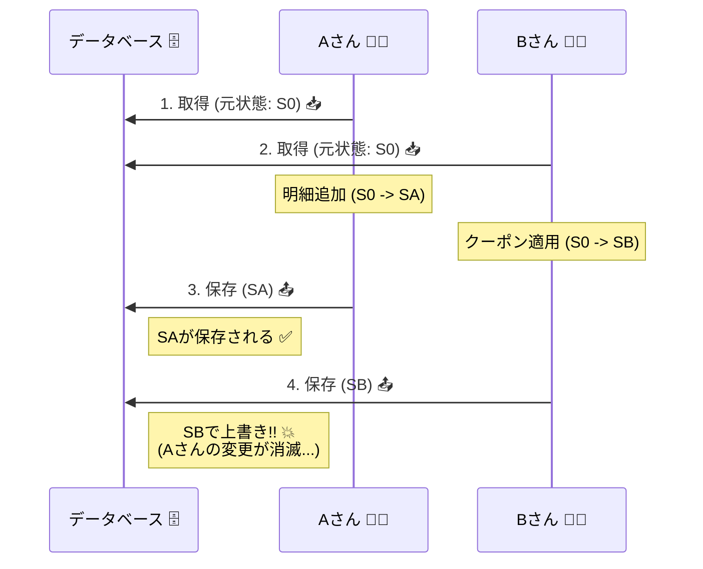

# 第25章：同時更新で起きる事故（ロストアップデート等）😱🔁

## この章でできるようになること🎯

* 「同時に更新されたら何が壊れるの？」を**具体例**で説明できるようになる😊
* 代表的な事故（ロストアップデート等）の**起き方を再現**できる🧨
* 「集約（Aggregate）をちゃんと作っても、まだ事故る理由」が分かる🧱💥
* 次章の「楽観ロック（version）」が**なぜ必要か**、納得できる🙂🔢

---

## まず結論：同時更新は“あるある”で、放置すると普通に壊れる😵‍💫

同じ注文（Order）を、

* ブラウザの別タブで操作したり🪟🪟
* 管理画面とユーザー画面で同時に触ったり👩‍💼🧑‍💻
* リトライやキュー処理で同時に当たったり🔁📨

…すると、**「片方の変更が消える」**とか、**「在庫がマイナス」**とか、普通に起きます😱

---

## よくある事故パターン4つ🚨（ミニEC版）


### 1) ロストアップデート（上書き事故）🫠

* Aさん：商品を追加🛒
* Bさん：クーポンを適用🏷️
* 結果：**最後に保存した方が勝って、片方の変更が消える**😭

### 2) 二重更新・重複実行（ダブり）🔂

* ボタン連打、通信リトライ、タイムアウト復帰などで
  **同じ処理が2回走る**😇
* 結果：明細が2行増える、支払いが2回…など💥（冪等性の章でガッツリやるよ🔑）

### 3) 二重引当（在庫の取り合い）📦⚔️

* 「残り1個」の商品を、同時に2注文が引当しようとする
* 結果：片方は買えないはずなのに、両方が買えたことになる😱

### 4) “途中状態”が見える（整合しない読み）👀

* 変更の途中（まだ整ってない状態）を、別処理が読んでしまう
* 結果：「支払い済みなのに明細が空」みたいな変な画面が出る🌀

---

## 事故が起きる典型形：Read → Modify → Write の罠🔁🧨




---
同時更新の事故の正体は、だいたいこれ👇

1. **Read**：DB/Repository から読み込む📥
2. **Modify**：メモリ上で変更する🛠️
3. **Write**：保存する📤

これを、AとBが同時にやると…

| 時刻 | Aさん🧑‍💻       | Bさん👩‍💻         |
| -- | -------------- | ---------------- |
| t0 | 注文を読む（状態=S0）📥 | 注文を読む（状態=S0）📥   |
| t1 | 明細を追加（S0→SA）🛒 | クーポン適用（S0→SB）🏷️ |
| t2 | 保存（SAを保存）📤    | 保存（SBを保存）📤      |

最後に保存したほうが **S0起点の変更**で上書きしちゃうので、
**SAかSBのどっちかが消える**（＝ロストアップデート）ってわけ😵‍💫

---

## ハンズオン：わざとロストアップデートを起こしてみよう🧨😈

ここは「壊して学ぶ回」だよ〜💥
テストで再現できると、めっちゃ腹落ちする😊🧪

### 作るもの🧩


* Order（集約ルート）🧺
* InMemoryOrderRepository（スナップショット保存）📦
* 2つのコマンド（同時に投げる）🔁

---

## 実装例（最小セット）🧪💻

※ このコードは「事故を再現するために、あえて危ない構造」にしてるよ⚠️
（直し方は次章の楽観ロックへ🛡️🔢）

```ts
// sleep.ts
export const sleep = (ms: number) => new Promise<void>(r => setTimeout(r, ms));
```

```ts
// order.ts
export type OrderId = string;

export type OrderSnapshot = {
  id: OrderId;
  items: Array<{ sku: string; qty: number }>;
  couponCode?: string;
};

export class Order {
  private constructor(
    private readonly id: OrderId,
    private items: Array<{ sku: string; qty: number }>,
    private couponCode?: string,
  ) {}

  static create(id: OrderId) {
    return new Order(id, []);
  }

  static restore(s: OrderSnapshot) {
    return new Order(s.id, [...s.items], s.couponCode);
  }

  addItem(sku: string, qty: number) {
    if (qty <= 0) throw new Error("qty must be positive");
    this.items.push({ sku, qty });
  }

  applyCoupon(code: string) {
    if (!code.trim()) throw new Error("coupon code required");
    this.couponCode = code;
  }

  toSnapshot(): OrderSnapshot {
    return {
      id: this.id,
      items: [...this.items],
      couponCode: this.couponCode,
    };
  }

  // デバッグ用（教材なので見える化🙂）
  debugView() {
    return this.toSnapshot();
  }
}
```

```ts
// orderRepository.ts
import { Order, OrderId, OrderSnapshot } from "./order";

export interface OrderRepository {
  findById(id: OrderId): Promise<Order | null>;
  save(order: Order): Promise<void>;
  seed(order: Order): Promise<void>;
}

export class InMemoryOrderRepository implements OrderRepository {
  private store = new Map<OrderId, OrderSnapshot>();

  async findById(id: OrderId) {
    const s = this.store.get(id);
    return s ? Order.restore(s) : null; // ここが「古い状態のコピー」を返すポイント📌
  }

  async save(order: Order) {
    // 「最後に保存したやつが勝つ」構造😇（事故再現用）
    this.store.set(order.toSnapshot().id, order.toSnapshot());
  }

  async seed(order: Order) {
    await this.save(order);
  }
}
```

```ts
// orderCommandService.ts
import { OrderRepository } from "./orderRepository";
import { OrderId } from "./order";
import { sleep } from "./sleep";

export class OrderCommandService {
  constructor(private readonly repo: OrderRepository) {}

  async addItem(orderId: OrderId, sku: string, qty: number, processingDelayMs = 0) {
    const order = await this.repo.findById(orderId);
    if (!order) throw new Error("order not found");

    order.addItem(sku, qty);

    // 現実の「計算」「外部呼び出し」「画面操作待ち」みたいな遅延を再現⏳
    await sleep(processingDelayMs);

    await this.repo.save(order);
  }

  async applyCoupon(orderId: OrderId, code: string, processingDelayMs = 0) {
    const order = await this.repo.findById(orderId);
    if (!order) throw new Error("order not found");

    order.applyCoupon(code);
    await sleep(processingDelayMs);
    await this.repo.save(order);
  }
}
```

---

## テスト：同時に投げて壊す🧪💥


ここが本番😈
「クーポンが消える」事故を確定で起こすために、わざと遅延時間をずらすよ⏱️

```ts
// lostUpdate.test.ts
import { describe, it, expect } from "vitest";
import { Order } from "./order";
import { InMemoryOrderRepository } from "./orderRepository";
import { OrderCommandService } from "./orderCommandService";

describe("同時更新：ロストアップデート😱", () => {
  it("クーポン適用が消える（最後の保存が上書きする）", async () => {
    const repo = new InMemoryOrderRepository();
    const service = new OrderCommandService(repo);

    const orderId = "order-1";
    const order = Order.create(orderId);
    order.addItem("SKU-A", 1);
    await repo.seed(order);

    // ✅ 同時に実行（片方は遅く保存する）
    await Promise.all([
      service.addItem(orderId, "SKU-B", 1, 50),      // 遅く保存（最後に保存しがち）
      service.applyCoupon(orderId, "OFF10", 10),     // 先に保存
    ]);

    const final = await repo.findById(orderId);
    expect(final).not.toBeNull();

    const view = final!.debugView();

    // 😭 ここが落ちる（クーポンが消えてる想定）
    expect(view.couponCode).toBe("OFF10");
  });
});
```

---

## 何が起きた？（結果の読み解き）🔎😵‍💫

このテストはだいたいこうなる👇

* クーポンを先に保存（OFF10）🏷️✅
* でも、遅い方（明細追加）が **古い状態を起点に保存**してしまう
* その保存が最後に来て、**クーポンがなかったことにされる**🫠

つまり、集約がどれだけ綺麗でも、
**「同じ集約を同時に別トランザクションで更新」**すると、普通に事故る😱

---

## じゃあ集約（Aggregate）って意味ないの？🧱🥺


意味あるよ〜！！めっちゃある😊✨

集約が守るのは主にこれ👇

* 1回の操作（1トランザクション）の中で、不変条件を壊さない🔒✅
* 外からの入口を1つにして、ルールを集中させる🚪👑

でも同時更新は、**別トランザクション同士のケンカ**だから、
追加で「ケンカのルール」が必要になるの🥊🙂
それが次章の **楽観ロック（version）** につながるよ🛡️🔢

---

## 現場での「事故のサイン」👀🚨


ログや問い合わせでこういうのが出たら、同時更新を疑ってね👇

* 「さっき入れたクーポンが消えました」🏷️💨
* 「明細が増えたり減ったりする」🛒🌀
* 「在庫が合わない」📦😇
* 「たま〜にだけ壊れる」←これ最強に怪しい😱

---

## この章の範囲での“応急処置”🧯（まだ完全解決はしない）


完全に直すのは次章でやるけど、ここで方向だけ掴もう🙂

* **同じ集約を同時に更新しうる**なら、何かしらの競合対策が必要⚠️
* 対策の代表は2つ👇

  * **楽観ロック**：version を見て「古い更新」を拒否🛡️🔢
  * **悲観ロック**：ロックして順番にやる🔒⏳

この教材では、まず実装しやすい **楽観ロック** を採用していくよ🙂✨

---

## AI活用プロンプト例🤖✨（コピペOK）

* 「このテストが失敗する理由を、時系列（t0〜t3）で図解して」🕒
* 「ロストアップデートが起きる“典型パターン”を、ミニEC例であと5個出して」🛒
* 「このコードの“同時更新に弱いポイント”をレビューして。直すなら何を足す？」🧠
* 「Given-When-Then形式で、テストの説明文を書いて」🧪

---

## 2026年時点メモ📝✨

* TypeScript は **5.9 系**が最新安定版として公開されているよ🟦✨。([GitHub][1])
* Node.js は **v24 がActive LTS**、v22/v20 は Maintenance LTS という位置づけだよ🟢🟡。([Node.js][2])
* 2026年1月のセキュリティ更新では、Node.js 24.13.0 / 22.22.0 / 20.20.0 などが案内されてるよ🔐。([Node.js][3])

---

## まとめ🧾🎉

* 同時更新は **Read→Modify→Write** の形でめちゃ起きる🔁
* 代表事故は **ロストアップデート（上書き）** 😱
* 集約だけでは「別トランザクション同士の競合」は止めきれない🧱💥
* だから次章で **version（楽観ロック）** を入れて守る🛡️🔢

[1]: https://github.com/microsoft/typescript/releases?utm_source=chatgpt.com "Releases · microsoft/TypeScript"
[2]: https://nodejs.org/en/about/previous-releases?utm_source=chatgpt.com "Node.js Releases"
[3]: https://nodejs.org/en/blog/vulnerability/december-2025-security-releases?utm_source=chatgpt.com "Tuesday, January 13, 2026 Security Releases"
