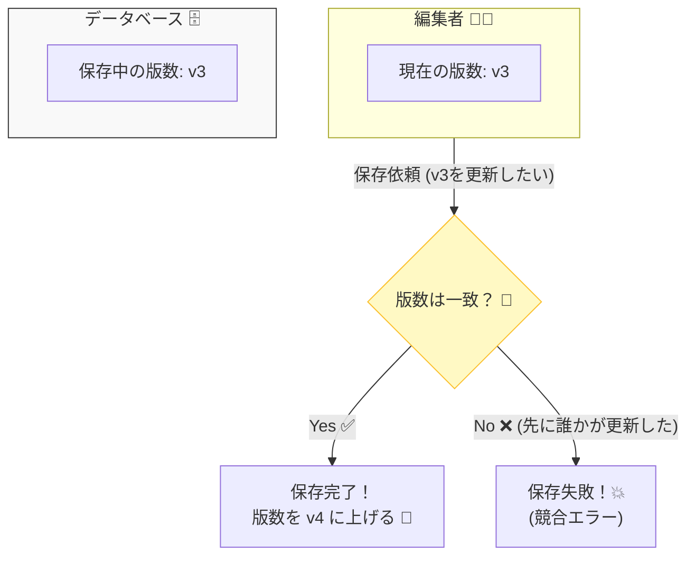
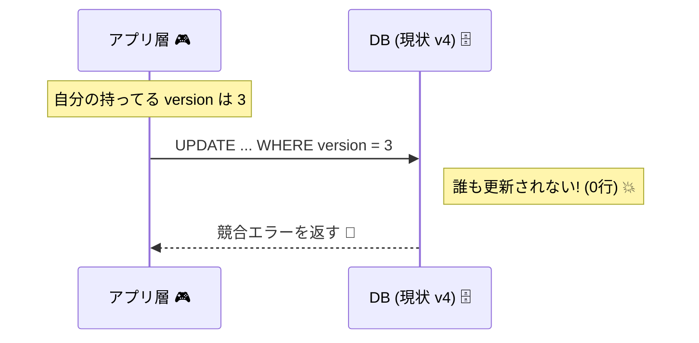

# 第26章：楽観ロック（version）で守る🛡️🔢

## 0. 今日やること（ゴール）🎯✨

「同時更新で“古いデータの上書き事故”が起きる」問題を、**version（版数）**で防ぎます🙂🔒
やりたいことはコレだけ👇

* 注文（Order）に **version** を持たせる🔢
* 保存するときに **「DBにあるversion」と「自分が持ってるversion」が一致してるか**チェック✅
* 一致しなければ **保存を拒否（=競合エラー）**🚫💥

---

## 1. まず事故を1つ思い出そ？😱🧨（ロストアップデート）

同じ注文を、2人（または2画面）が同時に編集すると…

* Aさん：商品を1個追加🛒
* Bさん：配送先を変更🏠

…みたいに別々の変更でも、**最後に保存した人が“丸ごと上書き”**してしまうことがあります💥
これが「ロストアップデート（上書き事故）」😵‍💫

楽観ロックはこれを **versionで検知**して止めます🛡️✨

---

## 2. 楽観ロックってなに？🙂🔢（超やさしく）




---
## 2.1 発想は「ノートの版数」📓✨

注文データをノートだと思ってください🙂

* ノートに「version=3」って書いてある📓🔢
* あなたはそれを読んで編集して保存しようとする🖊️
* でもその間に、誰かが先に保存して「version=4」になってたら…？

👉 **あなたの編集は“古い版”なので拒否**🚫
（= 競合を検知して事故らない🙆‍♀️）

---

## 3. 今回のミニECでの設計方針🧱🛒

## 3.1 versionはどこに置く？🤔

基本は **Aggregate Root（Order）に持たせる**のがシンプルです🙂
理由：保存時に比較するのは結局「注文」だし、Orderが“いま自分が持ってる版”を知ってる必要があるからです🔢

* Order.version は **読み取り専用（外から勝手に変えられない）**にする🔒
* 保存成功したら、Repository側で **versionを+1**して返す（or Orderに反映）✅

---

## 4. 実装してみよう（インメモリRepository版）🚀🧪

DBなしでまず動かします！理解優先🙂✨
（DB版は後半に「実務メモ」で出します📌）

---

## 4.1 最小のドメイン型（Order + version）🧺🔢

```ts
// domain/order.ts
export type OrderId = string;

export type OrderItem = {
  sku: string;
  qty: number;
};

export class Order {
  private _items: OrderItem[];
  private _version: number;

  private constructor(
    public readonly id: OrderId,
    items: OrderItem[],
    version: number,
  ) {
    this._items = items;
    this._version = version;
  }

  // 新規作成は version=0 からスタート（未保存の状態）
  static createNew(id: OrderId): Order {
    return new Order(id, [], 0);
  }

  // Repositoryから復元するとき用
  static rehydrate(id: OrderId, items: OrderItem[], version: number): Order {
    return new Order(id, items, version);
  }

  get items(): ReadonlyArray<OrderItem> {
    return this._items;
  }

  get version(): number {
    return this._version;
  }

  addItem(sku: string, qty: number): void {
    if (qty <= 0) throw new Error("qty must be positive");
    this._items = [...this._items, { sku, qty }];
  }

  // Repositoryが保存成功したときに呼ぶ（外からは触らせない）
  _bumpVersion(): void {
    this._version += 1;
  }

  toSnapshot(): { id: OrderId; items: OrderItem[]; version: number } {
    return { id: this.id, items: [...this._items], version: this._version };
  }
}
```

ポイント✅

* `version=0` は「まだ保存してない新規」🍼
* `rehydrate` で取り出したOrderは、DB（=Repository）が持ってる版数を持つ🔢

---

## 4.2 競合エラー（楽観ロック用）🚨🧱

```ts
// application/errors.ts
export class OptimisticLockConflictError extends Error {
  constructor(message = "Order was updated by someone else.") {
    super(message);
    this.name = "OptimisticLockConflictError";
  }
}
```

---

## 4.3 Repositoryインターフェース📥📤

```ts
// domain/orderRepository.ts
import { Order, OrderId } from "./order";

export interface OrderRepository {
  findById(id: OrderId): Promise<Order | null>;
  save(order: Order): Promise<void>; // ここで version チェックする
}
```

---

## 4.4 インメモリ実装（ここが本丸！）🧠🔥

「保存するときに version を比べる」だけです🙂

```ts
// infrastructure/inMemoryOrderRepository.ts
import { Order, OrderId } from "../domain/order";
import { OrderRepository } from "../domain/orderRepository";
import { OptimisticLockConflictError } from "../application/errors";

type StoredOrder = {
  id: OrderId;
  items: { sku: string; qty: number }[];
  version: number;
};

export class InMemoryOrderRepository implements OrderRepository {
  private store = new Map<OrderId, StoredOrder>();

  async findById(id: OrderId): Promise<Order | null> {
    const row = this.store.get(id);
    if (!row) return null;

    // 取り出した瞬間のスナップショットで Order を復元
    return Order.rehydrate(row.id, row.items, row.version);
  }

  async save(order: Order): Promise<void> {
    const snap = order.toSnapshot();
    const current = this.store.get(snap.id);

    // 新規保存（まだ無い）
    if (!current) {
      // 新規は version=0 で来る想定
      if (snap.version !== 0) {
        throw new OptimisticLockConflictError("Unexpected version for new order.");
      }

      // 保存成功 → versionを1にして格納
      this.store.set(snap.id, { ...snap, version: 1 });
      order._bumpVersion(); // Order側も追従
      return;
    }

    // 既存更新：versionが一致するかチェック！
    if (current.version !== snap.version) {
      throw new OptimisticLockConflictError(
        `Conflict. expected=${snap.version}, actual=${current.version}`,
      );
    }

    // 一致した → 保存成功、versionを+1
    const nextVersion = current.version + 1;
    this.store.set(snap.id, { ...snap, version: nextVersion });
    order._bumpVersion();
  }
}
```

ここ、超重要✅

* **「比較」→「保存（version+1）」が1つの操作として成り立ってる**のがポイントです🔢✨
  （DBなら「WHERE version=?」付きUPDATEで“1発”にするのがコツ！後半でやるよ🙂）

---

## 5. 事故を再現するテスト🧪😈（そして守る）

「同じ注文を2つ取り出して、先に保存した方だけ通る」ことを確認します✅

```ts
// tests/optimisticLock.test.ts
import { describe, it, expect } from "vitest";
import { Order } from "../src/domain/order";
import { InMemoryOrderRepository } from "../src/infrastructure/inMemoryOrderRepository";
import { OptimisticLockConflictError } from "../src/application/errors";

describe("Optimistic Lock (version)", () => {
  it("2つの同時更新で、後からの保存が弾かれる", async () => {
    const repo = new InMemoryOrderRepository();

    // まず注文を作って保存（version: 0 -> 1）
    const order = Order.createNew("order-1");
    order.addItem("SKU-AAA", 1);
    await repo.save(order);

    // 同じ注文を2回取り出す（=2画面を想定）
    const a = await repo.findById("order-1");
    const b = await repo.findById("order-1");
    if (!a || !b) throw new Error("order not found");

    // それぞれ別の変更
    a.addItem("SKU-BBB", 1);
    b.addItem("SKU-CCC", 1);

    // Aが先に保存（OK）
    await repo.save(a);

    // Bが保存しようとすると（古いversionのまま）→ 競合で弾かれる
    await expect(repo.save(b)).rejects.toBeInstanceOf(OptimisticLockConflictError);
  });
});
```

テストが通ったら🎉

* 「上書き事故」は起きない🙆‍♀️
* 代わりに「競合」が検知できる🔔✨

---

## 6. 競合が起きたらどうする？😵‍💫➡️🙂（基本の3択）

楽観ロックは「拒否」まではしてくれるけど、**その後の対応**を決める必要があります📌

## 6.1 いちばん多い：ユーザーに“更新してね”🔄🙂

* 画面に「他の人が先に更新しました。最新を読み直してもう一度お願いします」みたいに出す🪟✨
* 管理画面・業務系でよくあるやつ！

## 6.2 自動リトライ（安全な操作だけ）🔁🛡️

* 例：「数量+1」みたいに機械的に再適用できる操作
* ただし、**支払い確定**みたいな操作は危険⚠️（冪等性の章でやるよ🔂）

## 6.3 マージ画面（差分を見せて選ばせる）🧩👀

* Wikiやフォームの編集などで見かけるやつ！
* 実装コストは上がるけど親切🙂💕

---

## 7. 実務メモ：DBでの実装はこうする🗄️🔢（超大事）

## 7.1 “1発UPDATE”が基本（WHERE version）⚡

DBで正しくやるコツはコレ👇
**UPDATEをするときに「id AND version」で絞る**✅
更新できた行数が0なら、競合です🚫

（例：SQLイメージ）

```sql
UPDATE orders
SET items_json = ?, version = version + 1
WHERE id = ? AND version = ?;
```



---
* これができると、比較と更新が“同時に成立”するので強い💪✨
* ORMでも最終的にはこの発想に寄せるのが安全です🙂

---

## 7.2 Prismaでの考え方（versionフィールド推奨）🧠✨

Prismaは「versionフィールドを使った楽観的並行制御（OCC）」を推奨しています📌 ([Prisma][1])
また、古いバージョンでは更新時に非ユニーク条件での絞り込み制約があった話もあります（今使ってるバージョンの仕様は要確認）📝 ([Prisma][2])

---

## 7.3 TypeORMのロック指定（参考）🔐

TypeORMには楽観ロックの指定例がドキュメントにあります（取得時にversionを指定してロックモードを使う形）📚 ([typeorm.io][3])

---

## 8. 2026年の周辺事情ちょいメモ（教材の鮮度）🆕✨

* Node.js は「v24 が Active LTS」「v25 が Current」として公開されています📌（本番は基本LTSが安心🙂） ([Node.js][4])
* TypeScript は 5.9 系のリリースノートが継続更新されていて、次の大きな流れ（6/7）について公式ブログでも進捗が出ています📝 ([TypeScript][5])

---

## 9. まとめ（今日のチェック✅）🧾✨

* 楽観ロックは **versionで“古い更新”を拒否**する仕組み🙂🔢
* 実装の心臓は「保存時に version を比較」✅
* DBでは **WHERE id AND version の1発UPDATE**が強い💪⚡
* 競合が起きたら「更新してね🔄」「安全な操作だけリトライ🔁」「マージ🧩」のどれかで扱う🙂

---

## 10. ミニ課題（手を動かそう）🖊️🎮

1. テストを1本追加🧪✨

* 「Aが保存したあと、Bが保存失敗したら、Bは最新を取り直す」までを書いてみよう🔄🙂

2. 競合メッセージを改善💬💕

* `expected` と `actual` を含めてログに出す（運用で超助かる🔍）

3. ちょいクイズ🎯

* 「versionを比較する場所」を Repository じゃなくて ApplicationService に置いたら、何が起きそう？🤔💥（ヒント：抜け道ができる🚪😈）

[1]: https://www.prisma.io/docs/orm/reference/prisma-client-reference?utm_source=chatgpt.com "Prisma Client API Reference"
[2]: https://www.prisma.io/docs/orm/prisma-client/queries/transactions?utm_source=chatgpt.com "Transactions and batch queries (Reference) - Prisma Client"
[3]: https://typeorm.io/docs/working-with-entity-manager/find-options/?utm_source=chatgpt.com "Find Options"
[4]: https://nodejs.org/en/about/previous-releases?utm_source=chatgpt.com "Node.js Releases"
[5]: https://www.typescriptlang.org/docs/handbook/release-notes/typescript-5-9.html?utm_source=chatgpt.com "Documentation - TypeScript 5.9"
