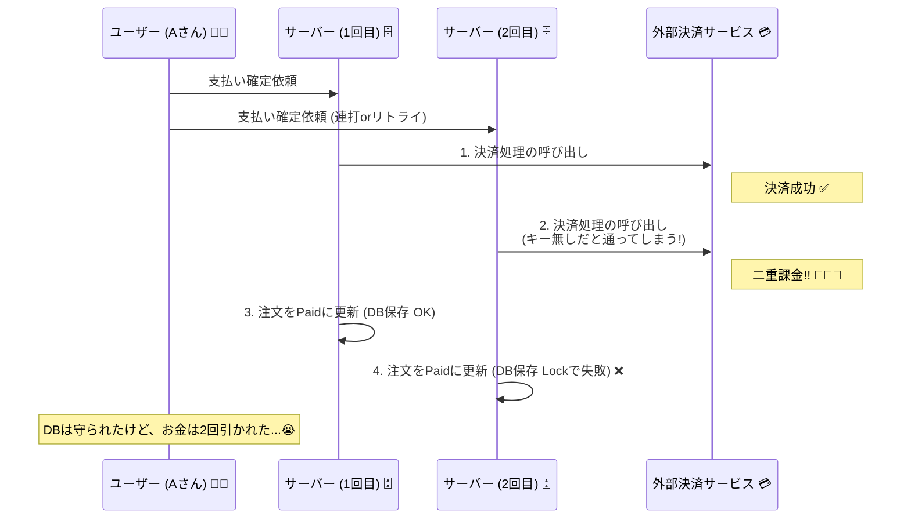

# 第27章：冪等性①（なぜ必要？二重送信の世界）🔂🌍

## この章でできるようになること🎯✨

* 「二重送信」って何が怖いのか、**具体例で**説明できるようになる😱💥
* 「楽観ロック（version）」だけでは**守れない穴**を理解する🕳️🛡️
* ミニEC（注文🛒・在庫📦・支払い💳）で、**冪等性が必要な操作**をリストアップできる📝✅
* 次章（冪等キー設計🔑🛠️）に向けて、**仕様（期待する振る舞い）**をテストで書ける🧪✨

---

## まずは現実：二重送信って「バグ」じゃなくて「日常」😇📡

二重送信が起きる理由は、だいたいこのへん👇（ぜんぶ“あるある”）

* 通信が不安定でタイムアウト → クライアントがリトライ🔁📶
* クリック連打（決済ボタン連打）🖱️💥💥
* 画面が固まったように見えて再送🔁😵
* モバイルで電波が切れたり復帰したり📱⚡
* キューやWebhookが「最低1回は届ける」方式で、同じイベントが来る📨📨

つまり「同じ要求がもう一度来る」ことを**前提**にしないと、いつか事故ります😱🧯

---

## 冪等性（Idempotency）ってなに？🔂🧠


ざっくり言うと…

**「同じリクエストを何回送っても、サーバーの最終結果が1回と同じ」**になる性質だよ✅🔂

HTTPの世界でもちゃんと定義があって、
**“同じことを複数回やっても、意図された効果が1回と同じ”**が冪等だよ〜って説明されてる🧠✨ ([rfc-editor.org][1])

そしてHTTP的には、一般に

* PUT / DELETE は冪等（同じものを何回やっても結果は同じになりやすい）
* POST は冪等が保証されない（作成やコマンド実行で副作用が出やすい）

…みたいな整理がよく出てくるよ📮⚙️ ([Microsoft Learn][2])

---

## ミニECで起きる地獄：支払い確定が2回来たら？💳😱

### 例：ユーザーが「支払い確定」ボタンを押した瞬間…

1回目のリクエストで決済が成功💳✅
でも、その直後に通信が切れて**レスポンスが返らない**📶💥
ユーザーは「失敗したのかな？」と思って、もう1回押す or 自動リトライ🔁😵

**結果：二重決済** 😭💸💸
（しかも運が悪いと、注文も2つ作られたり、メールが2通飛んだり…📧📧）

### タイムラインで見るとこんな感じ🕒

* T0: クライアント → サーバー「支払い確定して！」(1回目)
* T1: サーバー → 決済サービス「課金して！」→ 成功✅
* T2: サーバー → DB「注文をPaidに更新」→ 成功✅
* T3: **通信断**でクライアントが成功を受け取れない📶💥
* T4: クライアント → サーバー「支払い確定して！」(2回目) 🔁

この「T4」が来た瞬間、設計が甘いとまた課金しちゃう😱💳💥

---

## 「じゃあ、Paidだったら弾けばいいじゃん？」が罠😈🪤

たしかに「もうPaidならエラーにする」は一見正しそう👇

* 2回目が来たら「すでに支払い済みです！」って返す🚫💬

でも、これだとユーザー視点では

* 「えっ…じゃあ成功したの？失敗したの？どっち？」😵‍💫
* 「注文履歴にも反映されてない気がする…」😢

みたいに**UXが地獄**になりがち😇🌀
本当に欲しいのはだいたいこれ👇

* 2回目が来ても **“1回目と同じ成功結果”** を返して安心させたい✅😊

---

## さらに重要：楽観ロック（version）でも防げない事故がある😱🔢

楽観ロックは「同時更新の上書き事故」を防ぐのに強い🛡️
でも **“外部副作用”**（決済・メール送信・ポイント付与など）が絡むと穴が出る💥

### 最悪パターン：同時に2発来たら？💥💥

2つのリクエストがほぼ同時に来ると…👇

* リクエストA：注文(Pending v1)を読んだ
* リクエストB：注文(Pending v1)を読んだ（同じv1）
* A：決済サービスに課金 → 成功💳✅
* B：決済サービスに課金 → 成功💳✅（ここで二重決済😭）
* A：注文をPaidにして保存 → 成功（v2へ）✅
* B：保存しようとしてversion不一致 → 失敗🚫（でも課金はもう終わってる😇）

つまり、楽観ロックでDBは守れても、**決済は守れない**ことがある💳😱
この「決済みたいな外部I/Oの副作用」は、冪等性で守る発想が超大事になるよ🔂🛡️



---

## 冪等性が特に必要な操作リスト📝🔂（ミニEC版）

次のどれかに当てはまったら、だいたい冪等性が必要✨👇

### チェックリスト✅

* お金が動く💳💸
* 在庫が動く📦🔁
* 「一回だけ起きてほしい」こと（メール送信、ポイント付与など）📧🎁
* 外部サービス呼び出しがある（決済、配送、税計算など）🌐🔌
* リトライが起きうる（ネットワークは信用しない）📶🔁

### ミニECの例🛒

* 注文確定（placeOrder）🛒✅
* 支払い確定（confirmPayment）💳✅
* 在庫引当（reserveStock）📦✅
* 出荷確定（shipOrder）🚚✅
* 返金（refund）↩️💸
* ポイント付与（grantPoints）🎁✨
* メール送信（sendOrderEmail）📧

---

## “冪等にする”ための代表アイデア（この章は概念まで）🔑🧠

### 1) 冪等キー（Idempotency Key / Token）を使う🔑✨

「この操作は同じキーなら1回とみなす！」っていう方式だよ🔂
AWSのガイドでも、**トークンを見て重複なら保存済みの応答を返す**、みたいな考え方が紹介されてる📦✅ ([AWS ドキュメント][3])

決済系だと、Stripeみたいに **POSTでも冪等キーで安全にリトライできる**設計が有名だよ💳🔂 ([Stripe ドキュメント][4])

### 2) PUT的に「同じ結果になる形」で設計する🧱

HTTP的には PUT は冪等であるべき、という整理がよく使われるよ📌 ([Microsoft Learn][2])
ただ、現実の「支払い確定」みたいな“コマンド”はPOSTでやりがちなので、冪等キー方式が出番になりやすい🔑✨

> 実装の本番は次章（第28章）でガッツリやるよ〜！🛠️🔥
> この章は「なぜ必要？」と「どこに必要？」を身体に入れる回💪😊

---

## 手を動かす🧪✨：二重送信で壊れるテストを書いてみよう（わざと壊す😈🧨）

## ゴール🎯

* **二重送信が起きたら何がダメか**を、テストで“見える化”する👀🧪
* 次章で「冪等にする」ための**期待仕様**を先に書く✍️✅

---

## ステップ1：今回の最小モデル（支払い確定だけ）💳📦

ここではシンプルに👇

* Order（注文）は `paymentStatus: "Pending" | "Paid"` を持つ
* 「支払い確定」は外部の `PaymentGateway` を呼ぶ（＝副作用）
* いまは冪等性ゼロ（わざと）😈

```typescript
// domain/order.ts
export type PaymentStatus = "Pending" | "Paid";

export class Order {
  constructor(
    public readonly id: string,
    public paymentStatus: PaymentStatus,
    public paidTransactionId: string | null,
    public version: number,
  ) {}

  markPaid(txId: string) {
    // いったん超単純（この章では “なぜ必要か” が主役なので）
    this.paymentStatus = "Paid";
    this.paidTransactionId = txId;
  }
}
```

```typescript
// application/paymentGateway.ts
export interface PaymentGateway {
  charge(orderId: string, amountYen: number): Promise<{ transactionId: string }>;
}
```

```typescript
// application/orderRepository.ts
import { Order } from "../domain/order";

export interface OrderRepository {
  findById(id: string): Promise<Order | null>;
  save(order: Order): Promise<void>;
}
```

```typescript
// application/confirmPaymentUseCase.ts
import { OrderRepository } from "./orderRepository";
import { PaymentGateway } from "./paymentGateway";

export class ConfirmPaymentUseCase {
  constructor(
    private readonly repo: OrderRepository,
    private readonly gateway: PaymentGateway,
  ) {}

  async execute(input: { orderId: string; amountYen: number }) {
    const order = await this.repo.findById(input.orderId);
    if (!order) throw new Error("OrderNotFound");

    // ここが “素朴設計” のままなのがポイント😇
    // 二重送信が来たら、また gateway.charge() してしまう危険がある💳💥
    const res = await this.gateway.charge(order.id, input.amountYen);

    order.markPaid(res.transactionId);
    order.version += 1;

    await this.repo.save(order);

    return { orderId: order.id, transactionId: res.transactionId };
  }
}
```

---

## ステップ2：テストで「二重送信すると二重課金っぽくなる」を再現😱💳💥

`FakePaymentGateway` が呼ばれた回数を数えて、2回課金されちゃう雰囲気を作るよ🧪🔁

```typescript
// tests/confirmPayment.doubleSubmit.spec.ts
import { ConfirmPaymentUseCase } from "../application/confirmPaymentUseCase";
import { Order } from "../domain/order";
import type { OrderRepository } from "../application/orderRepository";
import type { PaymentGateway } from "../application/paymentGateway";

class InMemoryOrderRepo implements OrderRepository {
  private store = new Map<string, Order>();

  seed(order: Order) {
    this.store.set(order.id, order);
  }

  async findById(id: string) {
    return this.store.get(id) ?? null;
  }

  async save(order: Order) {
    // 超簡易（version整合などは第26章で扱った想定）
    this.store.set(order.id, order);
  }
}

class FakePaymentGateway implements PaymentGateway {
  public chargeCount = 0;

  async charge(orderId: string, amountYen: number) {
    this.chargeCount += 1;
    return { transactionId: `tx_${orderId}_${this.chargeCount}` };
  }
}

test("二重送信で、課金が2回走ってしまう（冪等性がない世界😇）", async () => {
  const repo = new InMemoryOrderRepo();
  repo.seed(new Order("order-1", "Pending", null, 1));

  const gw = new FakePaymentGateway();
  const useCase = new ConfirmPaymentUseCase(repo, gw);

  await useCase.execute({ orderId: "order-1", amountYen: 1000 });
  await useCase.execute({ orderId: "order-1", amountYen: 1000 }); // 🔁 二重送信のつもり

  expect(gw.chargeCount).toBe(2); // 😱💳💥
});
```

このテストの `expect(gw.chargeCount).toBe(2)` が通るのが、**“事故が起きる設計”**だよ😇🧨
（「え、これ普通に起きるの…？」って思ったら勝ち🎉）

---

## ステップ3：次章のために「こうなってほしい」仕様を書いておく✍️✅

理想はだいたいこう👇

* 二重送信が来ても課金は1回だけ
* 2回目は「1回目と同じ結果」を返す（安心UX😊）

次章で冪等キーを入れたら、これを通しに行くよ🛠️🔥

```typescript
test("理想：二重送信でも課金は1回で、結果は同じ（次章で実現🔑✨）", async () => {
  // ここは “期待仕様” だけ先に置くイメージ📝
  // 第28章で Idempotency Key を入れたら通す！💪
  expect(true).toBe(true);
});
```

---

## AI活用🤖✨：この章で使うと強いプロンプト例（コピペOK📝）

* 「ミニECで二重送信が起きるケースを10個、ユーザー視点で挙げて。決済/在庫/メール/配送を混ぜて」🤖📝
* 「“楽観ロックでは防げない二重実行”のタイムライン例を3つ、わかりやすく書いて」🤖🕒
* 「支払い確定の冪等性が必要な理由を、初心者向けに比喩で説明して」🤖🎀
* 「Given-When-Thenで、二重送信テストの観点を増やして（境界値も）」🤖🧪

---

## 章末チェック✅🎓（サクッと）

1. 二重送信が起きるのは、どんなとき？（3つ言えたらOK）📡🔁
2. 楽観ロックが得意なのは何？苦手なのは何？🔢🛡️
3. ミニECで「冪等性が必要な操作」を5つ挙げてみよう🛒📦💳
4. 「二重送信でも同じ成功結果を返したい」理由を1つ説明してみよう😊✅

---

## まとめ🧺✨

* 二重送信は“普通に起きる”から、設計で受け止めるのが前提🔁📡
* 冪等性は「同じ操作を繰り返しても結果が同じ」って性質🔂✅ ([rfc-editor.org][1])
* PUTは冪等として扱われやすい一方、POSTは冪等が保証されないことが多い📮⚙️ ([Microsoft Learn][2])
* 外部副作用（決済など）は、楽観ロックだけだと守れない穴がある💳😱
* そこで冪等キー（Idempotency Key/Token）みたいな仕組みが超重要になる🔑✨（次章で実装！） ([AWS ドキュメント][3])

[1]: https://www.rfc-editor.org/rfc/rfc9110.html?utm_source=chatgpt.com "RFC 9110: HTTP Semantics"
[2]: https://learn.microsoft.com/en-us/azure/architecture/best-practices/api-design?utm_source=chatgpt.com "Web API Design Best Practices - Azure Architecture Center"
[3]: https://docs.aws.amazon.com/wellarchitected/latest/reliability-pillar/rel_prevent_interaction_failure_idempotent.html?utm_source=chatgpt.com "REL04-BP04 Make mutating operations idempotent"
[4]: https://docs.stripe.com/api/idempotent_requests?utm_source=chatgpt.com "Idempotent requests | Stripe API Reference"
