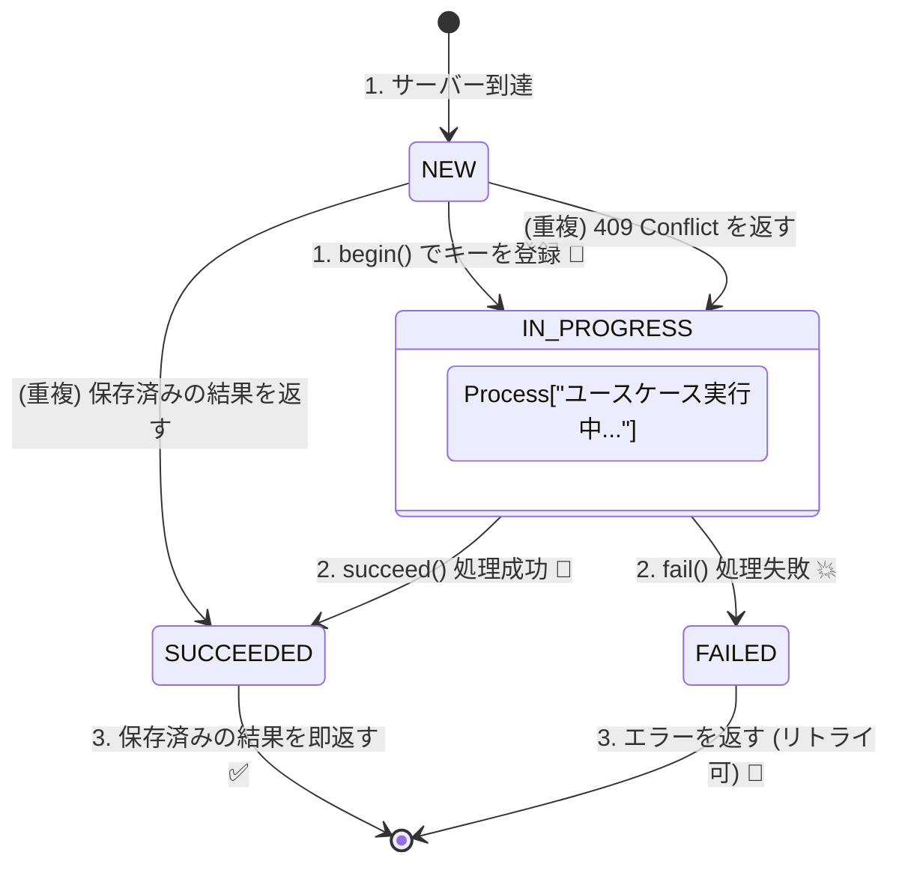

# 第28章：冪等性②（冪等キーの設計と実装方針）🔑🛠️

## ねらい 🎯

この章では「冪等キー（Idempotency Key）をどこで持つ？どう保存する？どう実装する？」を、ミニECの **「支払い確定」** を題材にして、設計メモに落とせるようになります 😊✨
ゴールはこれ👇

* 二重クリック🖱️🖱️／通信リトライ🔁／タイムアウト⌛ でも **二重課金しない** 💳🚫
* 2回目以降は **1回目と同じ結果（レスポンス）** を返せる 📦✨
* 「同じキーで違う内容が来た」事故を **検知して止める** 🧯

---

## 1) 冪等キーってなに？（最新の仕様動向も含めて）🧠🔑


### 1-1. ざっくり意味 ✨

冪等キーは「この操作、**同じものをもう一回送ってるだけだよ**」ってサーバに伝えるためのキーです🔑
特に **POST/PATCHみたいな“本来は冪等じゃない”HTTP操作** を、リトライに強くするために使われます。 ([datatracker.ietf.org][1])

### 1-2. 仕様の流れ（2025〜2026の“今”）📜✨

IETF（インターネット標準を作ってるところ）で **`Idempotency-Key` ヘッダー** を標準化しよう、という Draft が進んでいます。
そこでは👇みたいな基本ルールがハッキリ書かれています。 ([datatracker.ietf.org][1])

* キーは **UUID みたいなランダム識別子推奨**（衝突しにくい） ([datatracker.ietf.org][1])
* **同じキーは、違うリクエスト内容に使い回しちゃダメ**（事故る） ([datatracker.ietf.org][1])
* サーバ側は必要なら **fingerprint（リクエストの指紋）** を作って「同じ内容か」を判定できる ([datatracker.ietf.org][1])
* ルール違反のときの例として

  * キーなし：**400** ([datatracker.ietf.org][1])
  * 同じキーで別payload：**422** ([datatracker.ietf.org][1])
  * 同じキーの処理がまだ終わってない：**409** ([datatracker.ietf.org][1])

---

## 2) どこで冪等キーを持つ？設計3案 🧩📦


ここ、めっちゃ大事です🥹✨
「キーをどこに保存するか」で、事故りやすさが変わります。

### 案A：注文（Order）側に持つ 🛒🔑

**例**：Order に `processedIdempotencyKeys: string[]` を持つ

* 👍 良いところ

  * 「注文に対する操作」だけなら、注文集約の中で完結しやすい
* 👎 つらいところ

  * キーが増えると肥大化しやすい😵‍💫（掃除ルールも必要）
  * 「支払い」みたいに外部連携が絡むと、責務が混ざりやすい⚠️

### 案B：支払い（Payment / PaymentAttempt）側に持つ 💳🔑

**例**：PaymentAttempt に `idempotencyKey` を必須にする（自然キーっぽく扱う）

* 👍 良いところ

  * 「支払い」の重複防止にドンピシャ
  * 決済系のAPIは idempotency key 前提のものが多い（Stripe / Square等） ([Stripe ドキュメント][2])
* 👎 つらいところ

  * さらに「注文確定」「配送依頼」など別操作にも広げると、結局バラける

### 案C：専用の“冪等ストア”を作る（おすすめ）🏆📮

**例**：`IdempotencyRecord` みたいな保存場所（テーブル/コレクション）を作る

* 👍 良いところ

  * どの操作にも共通で使える✨
  * **fingerprint＋結果（レスポンス）まで保存** しやすい
  * 「まだ処理中（in-progress）」も扱いやすい（409など） ([datatracker.ietf.org][1])
* 👎 つらいところ

  * 1つコンポーネントが増える（でも慣れると最強💪）

この章のハンズオンは **案C** でいきます😊🔑

---

## 3) 先に決める！冪等キー設計のチェックリスト ✅🔍


### 3-1. スコープ（“どこまで同一扱い？”）🧭

最低でもこの3点で “同じ操作” を区別するのが定番です👇

* `operation`（例：`ConfirmPayment`）
* `actor`（例：userId / customerId）
* `idempotencyKey`

> 同じキーでも、ユーザーが違ったら別物扱いが安全だよ🛡️

### 3-2. 有効期限（どれくらい保持？）⏳

決済系の現場感だと「ある程度の時間だけ保持」が多いです。
Stripe は **最低24時間以上経ったキーは自動的に削除してよい** としていて、同じキーでも削除後は新規扱いになりえます。 ([Stripe ドキュメント][2])

> 自分のアプリも、まずは **24時間** を目安にすると実装しやすいよ⏰

### 3-3. fingerprint（“同じ内容？”の判定）🧾🔏

IETF Draft でも「payloadのチェックサムやフィールド一致で fingerprint を作る」話が出ています。 ([datatracker.ietf.org][1])
Stripe も「同じキーでパラメータが違うとエラーにする」方針です。 ([Stripe ドキュメント][2])

> これがないと「同じキーで違う金額」の事故が起きうる😱

### 3-4. 2回目以降は何を返す？📦

Square は「同じ CreatePayment を同じキーで送ると、二度目は課金せず **最初の成功レスポンスを返す**」と明記しています。 ([Square][3])
Stripe も冪等リクエストの考え方は “同じ結果を返す” が基本です。 ([Stripe ドキュメント][4])

> “成功済みなら成功レスポンスを再送” が一番わかりやすい😊✨

### 3-5. 「同じキーの処理がまだ終わってない」時は？🚧

IETF Draft では「同じキーが処理中なら **409 Conflict**（resource conflict）を返す」例が載っています。 ([datatracker.ietf.org][1])

> ここは実装が楽な割に、事故が減る神ポイント🧯✨

---

## 4) ハンズオン：支払い確定を冪等化しよう 💳🔁✨

### 4-1. まずは“データ設計”を決める 🧱

冪等ストアに入れたいものはコレ👇（最低限）

* `operation`（例：`ConfirmPayment`）
* `actorId`（例：userId）
* `idempotencyKey`
* `fingerprint`（リクエスト内容の指紋）
* `status`（`IN_PROGRESS | SUCCEEDED | FAILED`）
* `response`（成功時に返した内容）
* `createdAt` / `expiresAt`

---

## 5) TypeScript実装（まずはインメモリ版）🧪🚀


> まず動く形を作って理解するよ😊
> そのあと「DBならこうする」で現実版に寄せる✨



### 5-1. 型を作る 🧩

```ts
export type IdempotencyKey = string;

export type IdempotencyStatus = "IN_PROGRESS" | "SUCCEEDED" | "FAILED";

export type IdempotencyBeginResult<T> =
  | { kind: "NEW"; token: string }
  | { kind: "DUPLICATE_SUCCEEDED"; response: T }
  | { kind: "DUPLICATE_IN_PROGRESS" }
  | { kind: "KEY_MISMATCH" }; // 同じキーでfingerprintが違う

export interface IdempotencyStore<T> {
  begin(params: {
    operation: string;
    actorId: string;
    key: IdempotencyKey;
    fingerprint: string;
    ttlMs: number;
  }): IdempotencyBeginResult<T>;

  succeed(params: { token: string; response: T }): void;
  fail(params: { token: string }): void;

  // お掃除（期限切れを消す）
  sweep(now: number): void;
}
```

### 5-2. インメモリ実装（MapでOK）🗺️✨

```ts
type Stored<T> = {
  operation: string;
  actorId: string;
  key: string;
  fingerprint: string;
  status: "IN_PROGRESS" | "SUCCEEDED" | "FAILED";
  response?: T;
  expiresAt: number;
};

export class InMemoryIdempotencyStore<T> implements IdempotencyStore<T> {
  private byToken = new Map<string, Stored<T>>();
  private tokenByUniq = new Map<string, string>(); // uniqKey -> token

  begin(params: {
    operation: string;
    actorId: string;
    key: string;
    fingerprint: string;
    ttlMs: number;
  }) {
    const now = Date.now();
    this.sweep(now);

    const uniqKey = `${params.operation}::${params.actorId}::${params.key}`;
    const existingToken = this.tokenByUniq.get(uniqKey);
    if (existingToken) {
      const stored = this.byToken.get(existingToken);
      if (!stored) {
        // 念のため（整合が壊れてたら新規扱い）
        this.tokenByUniq.delete(uniqKey);
      } else {
        if (stored.fingerprint !== params.fingerprint) return { kind: "KEY_MISMATCH" as const };
        if (stored.status === "IN_PROGRESS") return { kind: "DUPLICATE_IN_PROGRESS" as const };
        if (stored.status === "SUCCEEDED") return { kind: "DUPLICATE_SUCCEEDED" as const, response: stored.response as T };
        // FAILEDなら「新規扱いでやり直し」もアリだけど、ここではIN_PROGRESS扱いにして保守的に止める
        return { kind: "DUPLICATE_IN_PROGRESS" as const };
      }
    }

    const token = crypto.randomUUID(); // Node/Web標準（UUID v4）
    const record: Stored<T> = {
      operation: params.operation,
      actorId: params.actorId,
      key: params.key,
      fingerprint: params.fingerprint,
      status: "IN_PROGRESS",
      expiresAt: now + params.ttlMs,
    };
    this.byToken.set(token, record);
    this.tokenByUniq.set(uniqKey, token);
    return { kind: "NEW" as const, token };
  }

  succeed(params: { token: string; response: T }) {
    const stored = this.byToken.get(params.token);
    if (!stored) return;
    stored.status = "SUCCEEDED";
    stored.response = params.response;
  }

  fail(params: { token: string }) {
    const stored = this.byToken.get(params.token);
    if (!stored) return;
    stored.status = "FAILED";
  }

  sweep(now: number) {
    // 雑に全走査（学習用）。DBならexpiresAtで消すのが定番✨
    for (const [token, rec] of this.byToken) {
      if (rec.expiresAt <= now) {
        this.byToken.delete(token);
        const uniqKey = `${rec.operation}::${rec.actorId}::${rec.key}`;
        if (this.tokenByUniq.get(uniqKey) === token) this.tokenByUniq.delete(uniqKey);
      }
    }
  }
}
```

✨ポイント解説（超重要）

* **同じキーでfingerprintが違う** → `KEY_MISMATCH`（IETF Draftでは 422 の例） ([datatracker.ietf.org][1])
* **処理中に同じキーが来た** → `DUPLICATE_IN_PROGRESS`（409の例） ([datatracker.ietf.org][1])
* **成功済みならレスポンスを再利用**（Square/Stripeの考え方） ([Square][3])

---

## 6) ユースケースに組み込む（支払い確定コマンド）🎮🛠️

### 6-1. コマンドとfingerprint 🧾🔏


fingerprintは「同じ操作か」を判定できればOK。
まずは **JSONを安定化してハッシュ** するのが手軽です😊

```ts
import { createHash } from "node:crypto";

type ConfirmPaymentCommand = {
  actorId: string;     // ログインユーザーなど
  orderId: string;
  amount: number;
  currency: "JPY";
  idempotencyKey: string;
};

function fingerprintOf(cmd: ConfirmPaymentCommand): string {
  // “同じキーで違う内容” を検知したい項目だけ入れるのがコツ🧠✨
  const core = {
    actorId: cmd.actorId,
    orderId: cmd.orderId,
    amount: cmd.amount,
    currency: cmd.currency,
  };
  const json = JSON.stringify(core);
  return createHash("sha256").update(json).digest("hex");
}
```

### 6-2. ユースケース本体（疑似コード寄り）💳✅

```ts
type ConfirmPaymentResponse = {
  orderId: string;
  status: "PAID";
  paidAt: string;
};

type DomainError =
  | { kind: "IDEMPOTENCY_IN_PROGRESS" }
  | { kind: "IDEMPOTENCY_KEY_MISMATCH" }
  | { kind: "ORDER_NOT_FOUND" }
  | { kind: "INVALID_STATE" };

export class ConfirmPaymentService {
  constructor(
    private readonly idem: IdempotencyStore<ConfirmPaymentResponse>,
    private readonly orders: { findById(id: string): Promise<any | null>; save(order: any): Promise<void> },
  ) {}

  async execute(cmd: ConfirmPaymentCommand): Promise<{ ok: true; value: ConfirmPaymentResponse } | { ok: false; error: DomainError }> {
    const operation = "ConfirmPayment";
    const fp = fingerprintOf(cmd);

    const begin = this.idem.begin({
      operation,
      actorId: cmd.actorId,
      key: cmd.idempotencyKey,
      fingerprint: fp,
      ttlMs: 24 * 60 * 60 * 1000, // 24h目安（Stripe等の運用感）:contentReference[oaicite:19]{index=19}
    });

    if (begin.kind === "DUPLICATE_SUCCEEDED") {
      return { ok: true, value: begin.response };
    }
    if (begin.kind === "DUPLICATE_IN_PROGRESS") {
      return { ok: false, error: { kind: "IDEMPOTENCY_IN_PROGRESS" } };
    }
    if (begin.kind === "KEY_MISMATCH") {
      return { ok: false, error: { kind: "IDEMPOTENCY_KEY_MISMATCH" } };
    }

    // ここから先は「このキーでは初回」✅
    try {
      const order = await this.orders.findById(cmd.orderId);
      if (!order) {
        this.idem.fail({ token: begin.token });
        return { ok: false, error: { kind: "ORDER_NOT_FOUND" } };
      }

      // 例：order.confirmPayment(cmd.amount) みたいな集約操作（詳細は前章までの流れ）
      // - すでにPAIDなら “同じ結果” を返す設計もアリ（冪等化の一部）
      if (order.status === "PAID") {
        const res: ConfirmPaymentResponse = { orderId: cmd.orderId, status: "PAID", paidAt: order.paidAt };
        this.idem.succeed({ token: begin.token, response: res });
        return { ok: true, value: res };
      }

      order.confirmPayment(cmd.amount);

      await this.orders.save(order);

      const response: ConfirmPaymentResponse = {
        orderId: cmd.orderId,
        status: "PAID",
        paidAt: order.paidAt,
      };

      this.idem.succeed({ token: begin.token, response });
      return { ok: true, value: response };
    } catch (e) {
      this.idem.fail({ token: begin.token });
      return { ok: false, error: { kind: "INVALID_STATE" } };
    }
  }
}
```

---

## 7) “現実版”の実装方針（DBにするなら）🏗️🗃️


インメモリは学習用🧪
本番はだいたい **DB＋ユニーク制約** で守ります🔒✨

### 7-1. テーブル例（イメージ）🧾

* `operation` + `actor_id` + `idempotency_key` に **UNIQUE**
* `fingerprint` と `status` と `response_json` を持つ

### 7-2. 処理の流れ（超重要）⚛️

1回のトランザクションでこうやるのが強いです💪

1. `INSERT`（status=IN_PROGRESS）

* できた → 初回
* UNIQUE違反 → 既存を `SELECT`

  * SUCCEEDED → response返す
  * IN_PROGRESS → 409（処理中） ([datatracker.ietf.org][1])
  * fingerprint違い → 422（使い回し） ([datatracker.ietf.org][1])

2. 注文更新（支払い確定）
3. `UPDATE`（status=SUCCEEDED, response保存）

これで「二重実行」が入り込む余地がめっちゃ減ります😊✨

---

## 8) テスト（3本だけでも効果バツグン）🧪💕

### テスト1：同じキーを2回 → 2回目は同じ結果 ✅🔁

* 1回目：PAIDになる
* 2回目：状態を変えず、同じレスポンスが返る

### テスト2：処理中に同じキー → “処理中”エラー 🛑

* 1回目をわざと止める（IN_PROGRESSのまま）
* 2回目は `IDEMPOTENCY_IN_PROGRESS`（HTTPなら409相当） ([datatracker.ietf.org][1])

### テスト3：同じキーで金額だけ変える → mismatch 🧨

* 1回目：amount=1000
* 2回目：amount=2000（同じキー）
  → `IDEMPOTENCY_KEY_MISMATCH`（HTTPなら422相当） ([datatracker.ietf.org][1])

---

## 9) よくある落とし穴（ここで差がつく）⚠️😇


* ❌ リトライのたびに新しいキーを作っちゃう
  → 冪等にならない（ただの別リクエスト）😵‍💫
* ❌ 「キーが来たら弾く」だけで、**同じレスポンスを返さない**
  → クライアント側が「成功したの？失敗したの？」で混乱する
  → Squareは“同じレスポンス返す”方針を明示してるよ ([Square][3])
* ❌ fingerprintを取らない
  → “同じキーで違う内容” の事故がすり抜ける（IETF Draftでも禁止） ([datatracker.ietf.org][1])
* ❌ 保持期間を無限にする
  → ストレージ増え続ける📈😱（Stripeは24h程度の運用方針がある） ([Stripe ドキュメント][2])

---

## 10) AI活用（設計が早く固まるプロンプト）🤖✨

### 比較表を作らせる📊

* 「冪等キーの保存場所を、注文側・支払い側・専用ストアの3案で比較して。観点は安全性/実装コスト/運用/拡張性で、表にして」

### fingerprint項目の相談🧾

* 「ConfirmPaymentのfingerprintに入れるべき項目を提案して。入れない場合に起きる事故もセットで」

### テストケースの洗い出し🧪

* 「冪等キー実装のテストケースを、正常系/重複/並行/キー使い回し/期限切れに分けて列挙して」

---

## まとめ（この章で持ち帰る“型”）🔑✨

* 冪等キーは **POST/PATCHのリトライ耐性** を作る定番手段 ([datatracker.ietf.org][1])
* **UUIDみたいなランダムキー＋fingerprint** が王道 ([datatracker.ietf.org][1])
* **成功済みは同じレスポンスを返す**（決済APIの実例でもそう） ([Square][3])
* **専用の冪等ストア** を作ると、他ユースケースにも広げやすい🏆

[1]: https://datatracker.ietf.org/doc/draft-ietf-httpapi-idempotency-key-header/ "
            
    
        draft-ietf-httpapi-idempotency-key-header-07 - The Idempotency-Key HTTP Header Field
    

        "
[2]: https://docs.stripe.com/api/idempotent_requests?utm_source=chatgpt.com "Idempotent requests | Stripe API Reference"
[3]: https://developer.squareup.com/docs/build-basics/common-api-patterns/idempotency?utm_source=chatgpt.com "Idempotency"
[4]: https://docs.stripe.com/error-low-level?utm_source=chatgpt.com "Advanced error handling"
