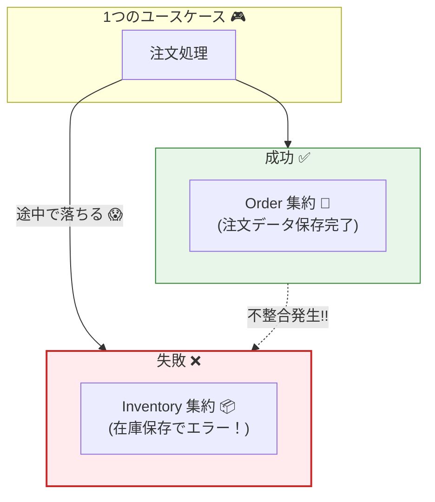

# 第29章：集約をまたぐ更新が危ない①（悪い例を作って理解）⚠️🧨

## この章でできるようになること🎯✨

* 「注文🛒を更新するついでに在庫📦も更新」みたいな **集約またぎ更新** が、なぜ事故りやすいか説明できる😱
* **わざと悪い実装** を書いて、事故の起き方を体験できる🧪💥
* 「どこが危険か」を **赤ペン添削🟥** できる（＝設計の目が育つ👀✨）

---

## 2026の最新メモ🔎🆕

* TypeScriptは **5.9** のリリースノートが公開されていて（2026-01更新）、TS自体も進化し続けてるよ🧠⚡ ([TypeScript][1])
* 集約は「**トランザクション整合性の境界**」として扱うのが実務で超重要、という整理がMicrosoftのDDD解説でも明確だよ📘🧱 ([Microsoft Learn][2])
* Aggregateの基本定義（「まとまりとして扱う単位」）はMartin Fowlerの解説が分かりやすいよ📚 ([martinfowler.com][3])

---

## 1) 今回の舞台：ミニECの2つの集約🛒📦

この章は **Order集約** と **Inventory集約** を分けて考えるよ😊

## Order集約🛒（注文）

* 例：注文の状態、明細、合計、支払い状態…など
* 不変条件の例🔒

  * 注文明細は0件にできない（注文として成立しない）
  * 支払い済みの注文は明細をいじれない

## Inventory集約📦（在庫）

* 例：商品ごとの在庫数、引当数…など
* 不変条件の例🔒

  * 在庫数は0未満にしない

> ポイント🧠：この2つは「別のルールを守る別チーム」くらい別物。混ぜると事故の香りがする…😇🔥

---

## 2) まず結論：集約またぎ更新が危ない理由💣




---
MicrosoftのDDD解説でも「集約＝トランザクション整合性の境界」として扱うよ、ってはっきり書かれてる📘🧱 ([Microsoft Learn][2])
つまり…

* **1回の更新（成功/失敗が一緒）で守れるのは、基本1集約まで** ✅
* 2集約を「同時に確実に」守ろうとすると、途端に難易度が跳ね上がる😱📈

  * 片方だけ保存される
  * 例外で途中終了
  * 競合で順序が崩れる
  * テストが地獄になる

---

## 3) 悪い例を作ろう⚠️🧨（わざと越境する）

ここでは **「注文作る → 在庫減らす」** を、1ユースケースでまとめてやっちゃう（危険）例を書くよ💥
さらに、**在庫保存だけ失敗** するようにして「片方だけ成功」を再現する😈🧪

---

## 3-1) ドメイン（集約）を用意する🧩

### Order（注文）🛒

```ts
// domain/orders/Order.ts
export class Order {
  constructor(
    public readonly id: string,
    private items: Array<{ sku: string; qty: number }>,
  ) {}

  addItem(sku: string, qty: number) {
    if (qty <= 0) throw new Error("qty must be positive");
    this.items.push({ sku, qty });
  }

  getItems() {
    return [...this.items];
  }
}
```

### InventoryItem（在庫）📦

```ts
// domain/inventory/InventoryItem.ts
export class InventoryItem {
  constructor(
    public readonly sku: string,
    private stock: number,
  ) {}

  decrease(qty: number) {
    if (qty <= 0) throw new Error("qty must be positive");
    if (this.stock - qty < 0) throw new Error("out of stock");
    this.stock -= qty;
  }

  getStock() {
    return this.stock;
  }
}
```

---

## 3-2) Repository（わざと失敗する仕掛け付き）🧨

```ts
// infrastructure/repositories/InMemoryRepos.ts
import { Order } from "../../domain/orders/Order";
import { InventoryItem } from "../../domain/inventory/InventoryItem";

export class InMemoryOrderRepo {
  private store = new Map<string, Order>();

  async findById(id: string) {
    return this.store.get(id) ?? null;
  }

  async save(order: Order) {
    this.store.set(order.id, order);
  }
}

export class InMemoryInventoryRepo {
  private store = new Map<string, InventoryItem>();

  // 「在庫保存だけ失敗する」スイッチ😈
  constructor(private failOnSave = false) {}

  async findBySku(sku: string) {
    return this.store.get(sku) ?? null;
  }

  async save(item: InventoryItem) {
    if (this.failOnSave) throw new Error("DB error while saving inventory 😱");
    this.store.set(item.sku, item);
  }

  seed(item: InventoryItem) {
    this.store.set(item.sku, item);
  }
}
```

---

## 3-3) 悪いユースケース（集約をまたいで更新）💥

ここが主役の “悪い例” 😇🔥

```ts
// application/PlaceOrder_Bad.ts
import { Order } from "../domain/orders/Order";
import { InMemoryOrderRepo, InMemoryInventoryRepo } from "../infrastructure/repositories/InMemoryRepos";

export class PlaceOrderBad {
  constructor(
    private orderRepo: InMemoryOrderRepo,
    private inventoryRepo: InMemoryInventoryRepo,
  ) {}

  async execute(orderId: string, sku: string, qty: number) {
    // ① Order更新
    const order = (await this.orderRepo.findById(orderId)) ?? new Order(orderId, []);
    order.addItem(sku, qty);

    // ② Inventory更新（別集約！）
    const inv = await this.inventoryRepo.findBySku(sku);
    if (!inv) throw new Error("inventory not found");
    inv.decrease(qty);

    // ③ 保存（ここが地雷💣）
    // Order保存は成功したのに…
    await this.orderRepo.save(order);

    // Inventory保存が失敗すると…
    await this.inventoryRepo.save(inv);

    // → 結果：「注文には追加された」けど「在庫は減ってない」みたいな矛盾が起きる😱
  }
}
```

---

## 4) 実験：本当に壊れるの？🧪💥（テストで体験）

「在庫保存が落ちる」ようにして、矛盾を確定させるよ😈🧨

```ts
// tests/placeOrderBad.spec.ts
import { describe, it, expect } from "vitest";
import { InventoryItem } from "../domain/inventory/InventoryItem";
import { InMemoryOrderRepo, InMemoryInventoryRepo } from "../infrastructure/repositories/InMemoryRepos";
import { PlaceOrderBad } from "../application/PlaceOrder_Bad";

describe("PlaceOrderBad", () => {
  it("在庫保存が失敗すると、注文だけ更新されて矛盾する😱", async () => {
    const orderRepo = new InMemoryOrderRepo();
    const inventoryRepo = new InMemoryInventoryRepo(true); // failOnSave = true 😈
    inventoryRepo.seed(new InventoryItem("SKU-1", 10));

    const uc = new PlaceOrderBad(orderRepo, inventoryRepo);

    await expect(uc.execute("ORDER-1", "SKU-1", 3)).rejects.toThrow();

    // 注文は保存されてしまっている（＝片方だけ成功）💥
    const savedOrder = await orderRepo.findById("ORDER-1");
    expect(savedOrder?.getItems().length).toBe(1);

    // 在庫は保存されていない（状態がズレる）😵
    const inv = await inventoryRepo.findBySku("SKU-1");
    expect(inv?.getStock()).toBe(7); // ← ここ、メモリ上は減ってるけど保存失敗だと現実では…が混ざって地獄🌀
  });
});
```

> このテストは「メモリだから7になってる」けど、現実のDBや別サービスだと
>
> * 注文だけDBに残った
> * 在庫は更新されてない
>   みたいな **“片肺飛行”** が普通に起きるよ😱🛩️💥

---

## 5) 赤ペン添削🟥：この実装の「危険ポイント」チェック✅😇

さっきの `PlaceOrderBad` を、赤ペンでぶった切るよ🟥✂️

## 🟥危険①：「成功/失敗を一緒にできない」問題

* Order保存✅ → Inventory保存❌ で **矛盾が確定** 😱
* これ、いわゆる「二重書き込み（dual write）」の地雷と同系統💣
  ※「DB更新＋イベント送信」の二重書き込み問題を避ける文脈でOutboxが語られるのも、この怖さが理由だよ📮 ([microservices.io][4])

## 🟥危険②：不変条件の責任がボヤける🌫️

* Orderのルール？Inventoryのルール？どっちが守ってるの？が混ざる😵
* 「集約はまとまりとして扱う単位」だからこそ、ルールも “まとまりの中” に閉じたい📚 ([martinfowler.com][3])

## 🟥危険③：テストが重く、つらくなる🧪🥲

* Orderのテスト書きたいだけなのに、Inventoryの準備が必要
* Inventoryの失敗ケースも混ぜないと怖い
  → 「テストの意図」が濁って、メンテ地獄に…🌀

## 🟥危険④：同時更新・競合の複雑さが倍増🔁😱

* 2集約を同時に触る＝ロック範囲が広がる
* 運が悪いとデッドロックや待ちが発生しやすい（現実あるある）⚠️

## 🟥危険⑤：あとで分割（マイクロサービス化等）がほぼ無理になる🚧

* 「別集約を1回で必ず更新」前提のコードは、分割した瞬間に破綻しやすい😵
* 実務で「集約＝整合性境界」って言われるのはこのためだよ🧱 ([Microsoft Learn][2])

---

## 6) ミニまとめ：この章で覚える“合言葉”🧠🔑

* **集約は “整合性の境界”** 🧱 ([Microsoft Learn][2])
* **集約をまたいで1発で更新しようとすると、失敗・競合・テストで爆発しやすい** 💥😱
* 悪い例を見分けるサイン🚨

  * 1ユースケースで複数集約を更新してる
  * 保存が複数回に分かれてて途中で落ちる余地がある
  * 「ついで更新」が多い（注文ついでに在庫、在庫ついでに決済…）

---

## 7) AI活用🤖✨（Copilot/Codex向け：そのまま貼れるプロンプト例）

## 危険ポイントの指摘をさせる🟥

* 「この `PlaceOrderBad` の危険点を、(1)整合性 (2)テスト容易性 (3)同時更新 の観点で箇条書きにして。初心者向けに説明して」

## 事故るテストケースを増やす🧪💥

* 「在庫保存失敗、注文保存失敗、競合（2並列）を想定したテストケース案を10個出して。Given/When/Thenで」

## “越境”を自動検出する観点を作らせる👀

* 「集約またぎ更新の匂い（コードスメル）チェックリストを作って。レビューで使えるYES/NO形式で」

---

## 8) 練習問題🎮📝（5分）

次のうち「赤信号🚨」はどれ？（複数OK🙆‍♀️）

1. Order集約のメソッドが `inventory.decrease()` を呼ぶ
2. ユースケースが OrderとInventoryを読み、片方だけ更新して保存する
3. ユースケースが OrderとInventoryを読み、両方更新して保存する
4. OrderはInventoryを `skuId`（ID）として持つだけで、中身は触らない

答えの目安✅

* 🚨：1, 3（越境＆二重保存が濃い）
* ⚠️：2（状況次第で事故の匂い）
* ✅：4（境界を守りやすい）

---

[1]: https://www.typescriptlang.org/docs/handbook/release-notes/typescript-5-9.html?utm_source=chatgpt.com "Documentation - TypeScript 5.9"
[2]: https://learn.microsoft.com/en-us/azure/architecture/microservices/model/tactical-ddd?utm_source=chatgpt.com "Using tactical DDD to design microservices"
[3]: https://martinfowler.com/bliki/DDD_Aggregate.html?utm_source=chatgpt.com "D D D_ Aggregate"
[4]: https://microservices.io/patterns/data/transactional-outbox.html?utm_source=chatgpt.com "Pattern: Transactional outbox"
