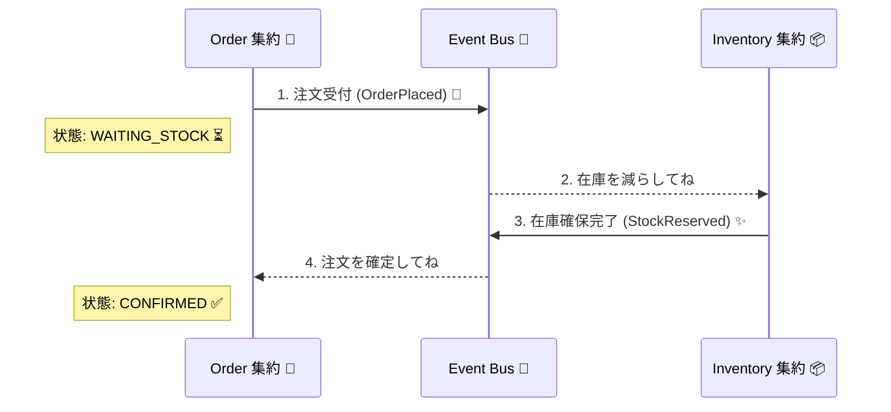

# 第30章：集約をまたぐ更新が危ない②（逃がし方：最終的整合性）⏳🧩

---

## この章でできるようになること😊✨

* 「集約をまたぐ更新」を **“今すぐ一貫” から “あとで一貫”** に逃がす発想がわかる🧠💡
* **最終的整合性（Eventual Consistency）** を、ミニECの流れに当てはめられる🛒📦
* ユーザー体験（待ち表示・状態・失敗時の見せ方）を設計できる👀🧾
* 非同期メッセージで「注文🛒 ↔ 在庫📦」をつなぐ、超ミニ実装が書ける🛠️🤖
* 失敗やリトライが来ても壊れないための「守りどころ」がわかる🛡️🔁

---

## 1. まず大事な結論🎯


**集約をまたぐ一貫性** を「1回のトランザクション」でやろうとすると、だいたい地獄😇🔥
だから基本はこうするよ👇

* **集約の中**：1回の更新で **絶対に一貫** ✅（ここはブレない！🔒）
* **集約の外（別集約）**：**イベント／メッセージでつなぐ** 📨➡️
  → **少し遅れて整う（最終的整合性）** ⏳✅

分散環境では「全部まとめて一発で更新」が難しくなるので、**整合性は “設計で扱うもの”** になるよ、という話。 ([martinfowler.com][1])

---

## 2. 最終的整合性ってなに？⏳🧠




---
ざっくり言うと👇

> いま見た瞬間はズレてることがあるけど、更新が止まれば、そのうち全部が同じ状態に収束するよ✅

こういう「最終的整合」の考え方は、分散システムでよく出てくるよ〜っていうのが定番。 ([microsoft.com][2])

たとえば DynamoDB には **Eventually Consistent Read**（結果整合）と **Strongly Consistent Read**（強い整合）が明確に分かれてたりするよ📚 ([AWS ドキュメント][3])

---

## 3. 「逃がす」ときの3点セット🧩🛠️


集約をまたぐ更新を “最終的整合性” に逃がすとき、ほぼ毎回この3点セットになるよ👇

## ① 状態を増やす（途中状態を許す）🧾⏳

「まだ在庫確定してないけど、注文は受けた」みたいな **中間状態** を作る💡
例：`WAITING_STOCK`（在庫待ち）とかね📦⌛

## ② 非同期でつなぐ（イベント/メッセージ）📨🔁

注文が確定したら「在庫引当してね〜」って **メッセージを投げる** 📨
在庫側はそれを受けて処理する📦🛠️

## ③ 失敗とリトライを前提にする😇🧯

非同期は **必ず失敗する**（通信・一時障害・再実行・重複…）ので

* **冪等性（同じのが2回来ても大丈夫）** 🔂
* **補償（取り消しの道）** ↩️
  が重要になるよ✨（Sagaがまさにこれを整理してくれる） ([Microsoft Learn][4])

---

## 4. 仕分けワーク：「今すぐ必須」vs「あとでOK」✅⏳

ミニEC（注文🛒・在庫📦・支払い💳）を例に、仕分けしてみよう😊✨

| 例                   | 今すぐ必須？ | 理由📝                            |
| ------------------- | -----: | ------------------------------- |
| 注文の合計金額がマイナスにならない   |      ✅ | 注文集約の不変条件だから🔒                  |
| 注文が「支払い済み」になったら戻らない |      ✅ | 状態遷移の不変条件🔒                     |
| 在庫引当（別集約）           |      ⏳ | 混む/外部要因/競合が多いので、メッセージで後追いが現実的📦 |
| 注文確認メール送信           |      ⏳ | 多少遅れてもOK📩                      |
| ポイント付与              |      ⏳ | 遅延してもUX崩れにくい🎁                  |
| 画面の「確定」表示           |    ✅/⏳ | “確定の定義” を設計で決める（後述）👀           |

ポイントはこれ👇
**「今すぐ必須」は “集約内の不変条件” に寄せる** 🔒
**「あとでOK」は “イベントで収束させる”** 📨⏳

---

## 5. 実装ミニラボ：注文🛒→在庫📦 を “最終的整合性” にする🛠️✨

## ゴール🎯

* 注文作成で **注文は確定（在庫はまだ）**
* 非同期で在庫を引き当てて、結果で注文状態が変わる

  * 成功→`CONFIRMED` ✅
  * 失敗→`CANCELLED` ↩️😢

---

## 5.1 ファイル構成（超ミニ）📁✨

* `src/domain.ts`（ドメインの型＆集約）
* `src/bus.ts`（イベントバス）
* `src/app.ts`（ユースケース＆ハンドラ）
* `src/demo.ts`（動かす）

---

## 5.2 セットアップ（最小）⚙️💻

```bash
npm init -y
npm i -D typescript tsx
npx tsc --init
```

（TypeScriptは2026年1月時点で 5.9 のリリースノートが更新されてるよ📌） ([TypeScript][5])

---

## 5.3 ドメイン：注文集約🛒📦（中間状態を持つ）

```ts
// src/domain.ts
export type OrderId = string;
export type Sku = string;

export type OrderStatus =
  | "WAITING_STOCK"   // 在庫待ち⏳
  | "CONFIRMED"       // 確定✅
  | "CANCELLED";      // 取消↩️

export type OrderItem = { sku: Sku; qty: number };

export class Order {
  public readonly id: OrderId;
  public status: OrderStatus;
  public readonly items: OrderItem[];

  private constructor(id: OrderId, items: OrderItem[]) {
    // 不変条件🔒（例：数量は1以上）
    if (items.length === 0) throw new Error("items required");
    if (items.some(x => x.qty <= 0)) throw new Error("qty must be > 0");

    this.id = id;
    this.items = items;
    this.status = "WAITING_STOCK";
  }

  static place(id: OrderId, items: OrderItem[]) {
    return new Order(id, items);
  }

  confirm() {
    if (this.status !== "WAITING_STOCK") return; // 冪等っぽくしとく🔂
    this.status = "CONFIRMED";
  }

  cancel() {
    if (this.status === "CANCELLED") return; // 冪等🔂
    this.status = "CANCELLED";
  }
}

export class Inventory {
  private stock = new Map<Sku, number>();

  setStock(sku: Sku, qty: number) {
    this.stock.set(sku, qty);
  }

  reserve(items: OrderItem[]): "RESERVED" | "OUT_OF_STOCK" {
    // 先にチェック（途中で減らして失敗…を避ける）👀
    for (const it of items) {
      const have = this.stock.get(it.sku) ?? 0;
      if (have < it.qty) return "OUT_OF_STOCK";
    }
    // まとめて減らす📦
    for (const it of items) {
      const have = this.stock.get(it.sku) ?? 0;
      this.stock.set(it.sku, have - it.qty);
    }
    return "RESERVED";
  }
}
```

ここでのポイント😍

* **注文は「在庫待ち」状態で確定させる**（これが “逃がし”）⏳
* 在庫は別集約なので、**同じメソッド内で触らない** 🚫📦

---

## 5.4 イベント：非同期でつなぐ📨✨


```ts
// src/bus.ts
export type Event =
  | { type: "OrderPlaced"; eventId: string; orderId: string }
  | { type: "StockReserved"; eventId: string; orderId: string }
  | { type: "StockFailed"; eventId: string; orderId: string; reason: string };

type Handler = (e: Event) => Promise<void> | void;

export class InMemoryBus {
  private handlers: Record<string, Handler[]> = {};
  private queue: Event[] = [];

  // 冪等用：eventIdの重複処理を防ぐ🛡️🔂（超ミニ版）
  private processed = new Set<string>();

  on(type: Event["type"], handler: Handler) {
    (this.handlers[type] ??= []).push(handler);
  }

  publish(e: Event) {
    this.queue.push(e);
  }

  async drainOnce() {
    const e = this.queue.shift();
    if (!e) return;

    if (this.processed.has(e.eventId)) return; // 重複イベントを捨てる🔂
    this.processed.add(e.eventId);

    for (const h of this.handlers[e.type] ?? []) {
      await h(e);
    }
  }
}
```

ここも大事😍

* 非同期は **重複** する前提 → `eventId` で弾く🔂
* 本番は「永続キュー」や「Outbox」で信頼性を上げる（次章でやるやつ📮✨）

---

## 5.5 アプリ層：注文→イベント→在庫→結果イベント→注文更新🔁🛒📦

```ts
// src/app.ts
import { InMemoryBus } from "./bus";
import { Inventory, Order, OrderId, OrderItem } from "./domain";
import type { Event } from "./bus";

const uid = () => Math.random().toString(16).slice(2);

export class OrderRepo {
  private store = new Map<OrderId, Order>();
  save(o: Order) { this.store.set(o.id, o); }
  get(id: OrderId) {
    const o = this.store.get(id);
    if (!o) throw new Error("order not found");
    return o;
  }
}

export function wire(bus: InMemoryBus, orders: OrderRepo, inv: Inventory) {
  // 在庫ハンドラ📦
  bus.on("OrderPlaced", (e) => {
    const o = orders.get(e.orderId);
    const result = inv.reserve(o.items);

    if (result === "RESERVED") {
      bus.publish({ type: "StockReserved", eventId: uid(), orderId: o.id });
    } else {
      bus.publish({
        type: "StockFailed",
        eventId: uid(),
        orderId: o.id,
        reason: "OUT_OF_STOCK",
      });
    }
  });

  // 注文ハンドラ🛒
  bus.on("StockReserved", (e) => {
    const o = orders.get(e.orderId);
    o.confirm();
    orders.save(o);
  });

  bus.on("StockFailed", (e) => {
    const o = orders.get(e.orderId);
    o.cancel(); // 補償っぽい↩️（在庫は減ってない前提）
    orders.save(o);
  });
}

export function placeOrder(
  bus: InMemoryBus,
  orders: OrderRepo,
  orderId: OrderId,
  items: OrderItem[],
) {
  const o = Order.place(orderId, items);
  orders.save(o);

  const ev: Event = { type: "OrderPlaced", eventId: uid(), orderId: o.id };
  bus.publish(ev);
}
```

---

## 5.6 動かしてみる🎮✨（「あとで整う」を体感）

```ts
// src/demo.ts
import { InMemoryBus } from "./bus";
import { Inventory } from "./domain";
import { OrderRepo, placeOrder, wire } from "./app";

const bus = new InMemoryBus();
const orders = new OrderRepo();
const inv = new Inventory();
wire(bus, orders, inv);

// 在庫をセット📦
inv.setStock("APPLE", 1);

// ① 在庫足りる注文✅
placeOrder(bus, orders, "order-1", [{ sku: "APPLE", qty: 1 }]);
console.log("order-1 直後:", orders.get("order-1").status); // WAITING_STOCK⏳

await bus.drainOnce(); // OrderPlaced -> 在庫処理
await bus.drainOnce(); // StockReserved -> 注文確定
console.log("order-1 後で:", orders.get("order-1").status); // CONFIRMED✅

// ② 在庫足りない注文😢
placeOrder(bus, orders, "order-2", [{ sku: "APPLE", qty: 1 }]);
console.log("order-2 直後:", orders.get("order-2").status); // WAITING_STOCK⏳

await bus.drainOnce();
await bus.drainOnce();
console.log("order-2 後で:", orders.get("order-2").status); // CANCELLED↩️
```

実行👇

```bash
npx tsx src/demo.ts
```

---

## 6. ユーザー体験（UX）設計のコツ👀✨


最終的整合性を採用すると、**画面が超大事** になるよ😌🧡
おすすめパターン👇

## ✅ “確定” を2段階にする🧾🪜

* 「注文受付」✅（すぐ返す）
* 「注文確定」✅（在庫・支払いなどが揃ったら）

表示例：

* `処理中…⏳（在庫確認中）`
* `確定しました✅`
* `在庫不足でキャンセルになりました😢↩️`

## ✅ “待ち” には期限をつける⏱️

ずっと `WAITING` は不安💦

* 30秒超えたら「混雑中😵 少し待ってね」
* 2分超えたら「いったん保留📝」＋通知（メール/画面更新）

## ✅ “失敗” はユーザーのせいにしない😇

* 「在庫が足りませんでした」＋代替提案（数量変更など）🛒✨

---

## 7. AI活用プロンプト例🤖💬（そのまま投げてOK）

* 「注文の中間状態（WAITING/CONFIRMED/CANCELLED）を、初心者でも破綻しない粒度で提案して」🧾✨
* 「イベント駆動で起こりがちなバグ（重複・順序逆転・取りこぼし）を10個出して、対策も添えて」😱🛡️
* 「このユースケースの Given-When-Then テストを3本作って」🧪📌
* 「UIで“最終的整合性”を自然に見せる文言を5案」👀📝

---

## 8. よくある落とし穴あるある😇⚠️


* 「非同期にしたのに、結局アプリ層で同期呼び出しして跨いでる」🚫📞
* 「イベントが2回届いて、在庫が2回減った」😱📦（→ 冪等性🔂）
* 「在庫引当成功→注文更新失敗で、状態がズレたまま」😵（→ 補償↩️／再試行🔁）
* 「“確定” の定義が曖昧で、画面が嘘をつく」🌀（→ UX設計👀）

---

## 9. まとめ🧠✨

* 集約内は **強い一貫性** ✅🔒
* 集約をまたぐときは **イベントでつなぎ、最終的整合性で収束** 📨⏳✅
* そのために必要なのは
  **中間状態🧾** ＋ **非同期📨** ＋ **冪等🔂/補償↩️** の3点セット✨
* “動く設計” にするには、**UX** まで含めて設計するのが勝ち👀🏆

---

## 確認クイズ📝🎀（サクッと）

1. 集約をまたぐ更新を1トランザクションでやると何がつらい？😇
2. 最終的整合性を採用するとき「状態を増やす」のはなぜ？🧾
3. 非同期処理で「必ず起きる」前提の事故を2つ言ってみて🔁
4. “確定” を2段階にするUXの狙いは？👀
5. `eventId` を使ったミニ冪等ガードは、何を防いでる？🔂

（答えはこの章の本文の中に全部あるよ📌✨）

[1]: https://martinfowler.com/articles/microservices.html?utm_source=chatgpt.com "Microservices"
[2]: https://www.microsoft.com/en-us/research/publication/principles-of-eventual-consistency/?utm_source=chatgpt.com "Principles of Eventual Consistency - Microsoft Research"
[3]: https://docs.aws.amazon.com/amazondynamodb/latest/developerguide/HowItWorks.ReadConsistency.html?utm_source=chatgpt.com "DynamoDB read consistency"
[4]: https://learn.microsoft.com/en-us/azure/architecture/patterns/saga?utm_source=chatgpt.com "Saga Design Pattern - Azure Architecture Center"
[5]: https://www.typescriptlang.org/docs/handbook/release-notes/typescript-5-9.html?utm_source=chatgpt.com "Documentation - TypeScript 5.9"
