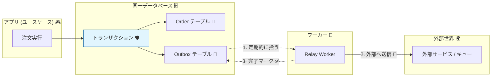

# 第31章：ドメインイベント＋Outboxの発想（取りこぼし対策）📣📮

## この章でできるようになること 🎯✨

* 「ドメインイベント」って何かを、**コードの形**で説明できるようになる 👩‍💻📣
* 「DB更新」と「イベント送信」を両方やる時に起きる **取りこぼし事故** を回避できる ✅🧯
* **Outbox** を使って「落ちてもあとで必ず送れる」仕組みを作れる 📮🔁
* 「複数ワーカーで安全にOutboxを処理する」基本（`SKIP LOCKED` など）を掴める 🧵🧠

---

## 1. まず “取りこぼし事故” を1分で理解 😱💥

ミニECでよくある流れ👇

* 注文が支払い完了になる（DB更新）🧾✅
* そのあと「支払い完了イベント」を発行して、在庫サービスや通知サービスに伝える（イベント送信）📣➡️📦📩

ここで事故る典型👇

1. DB更新は成功 ✅
2. でもイベント送信の直前にアプリが落ちる 💻💥
3. “支払い完了” はDBにあるのに、周辺が気づかない 😭

この「**DBは成功したのに、イベントが飛んでない**」問題は **Dual-write問題** としてよく知られてて、Outboxはその定番の解決策の1つだよ📮✨ ([decodable.co][1])

---

## 2. ドメインイベントってなに？📣🧠（超大事なイメージ）

### ✅ ドメインイベント = 「ドメイン上の事実」を表すメモ

* 例：`OrderPaid`（注文が支払われた）💳✅
* 例：`OrderCancelled`（注文がキャンセルされた）↩️❌

ポイントはこれ👇

* **過去形**（起きた事実）で命名しがち 🕰️
* 「誰がどう処理するか」は **イベント側は知らない** 🙅‍♀️
* ただ「起きた」という事実だけを出す 📣✨

---

## 3. Outboxってなに？📮✨（1枚で）




---
Outboxはざっくりこう👇

* **同じDB** に `outbox` テーブルを用意する 📦🗃️
* 集約の更新と同じトランザクションで、**イベントも outbox に書く** ✍️✅
* 別プロセス（ワーカー）が outbox を拾って外に送る 📤🤖
* 送れたら「送った印」をつける ✅🧾

つまり…
**「イベント送信」そのものをトランザクションに入れない**（ネットワークは信用しない）
→ 代わりに **“送るべきイベント” をDBに確実に残す** 📮🧠 ([Trade Republic Engineering][2])

---

## 4. この章の完成図（ミニEC）🛒📦💳

### Order集約の中

* 支払い完了のときに `OrderPaid` を発生させる 📣
* でも外部通知（メール送信とか）は **集約の外** ✋📩

### アプリケーション層（ユースケース）

* `Order` を更新して保存する 🧾
* 同じトランザクションで `outbox` も書く 📮

### Outbox Relay（ワーカー）

* `outbox` を定期的に取り出す ⏱️
* メッセージング（例：Kafka/RabbitMQ/HTTP）へ送る 📤
* 成功/失敗を記録してリトライ 🔁🧯

---

## 5. 実装していくよ 🛠️✨（TypeScript）

ここからは “形” を作るよ💪
フォルダの置き場所イメージ👇（第5章の層分けに乗せる感じ）📁✨

* `src/domain/...`
* `src/application/...`
* `src/infrastructure/...`
* `src/worker/...`

---

## 5-1. Domain：イベントを溜める仕組み 🧺📣

「集約がイベントを発生させたら、いったん集約の中に溜めておく」方式が定番だよ✨
（＝保存したあとで取り出せる）

```ts
// src/domain/events/DomainEvent.ts
export interface DomainEvent {
  readonly type: string;          // 例: "OrderPaid"
  readonly occurredAt: Date;      // いつ起きた？
  readonly payload: unknown;      // 外に渡す最小データ（あとで整える）
}
```

```ts
// src/domain/common/AggregateRoot.ts
import type { DomainEvent } from "../events/DomainEvent";

export abstract class AggregateRoot {
  private readonly domainEvents: DomainEvent[] = [];

  protected addDomainEvent(event: DomainEvent) {
    this.domainEvents.push(event);
  }

  /** 保存後に回収する（回収したら空にする） */
  pullDomainEvents(): DomainEvent[] {
    const events = [...this.domainEvents];
    this.domainEvents.length = 0;
    return events;
  }
}
```

---

## 5-2. Domain：Orderが支払い完了したらイベントを出す 💳📣

```ts
// src/domain/order/Order.ts
import { AggregateRoot } from "../common/AggregateRoot";

type OrderStatus = "Draft" | "Paid" | "Cancelled";

export class Order extends AggregateRoot {
  private constructor(
    private readonly id: string,
    private status: OrderStatus,
  ) {
    super();
  }

  static create(id: string) {
    return new Order(id, "Draft");
  }

  pay(paidAt: Date) {
    if (this.status !== "Draft") {
      throw new Error("支払いは Draft のときだけOKだよ❌");
    }

    this.status = "Paid";

    // ✅ 事実を記録（副作用はしない）
    this.addDomainEvent({
      type: "OrderPaid",
      occurredAt: paidAt,
      payload: { orderId: this.id },
    });
  }

  getId() { return this.id; }
  getStatus() { return this.status; }
}
```

ここで大事👀✨

* `pay()` は「状態遷移＋不変条件」を守るだけ
* 「メール送る」「在庫引く」はここでやらない 🙅‍♀️📩📦

---

## 5-3. Outboxテーブル（最小構成）📮🗃️

Outboxは「送るべきイベントのキュー」みたいなもの📮
最低限はこんな列があると便利👇

* `id`（イベントID）🆔
* `type`（イベント種別）🏷️
* `payload`（JSON）📦
* `occurred_at`（発生時刻）🕰️
* `status`（PENDING / IN_PROGRESS / SENT / FAILED など）🚦
* `attempts`, `next_attempt_at`, `last_error`（リトライ用）🔁🧯

Outboxを「どう拾うか」は **ポーリング** が基本で、複数ワーカーなら **行ロック（`FOR UPDATE SKIP LOCKED`）** がよく使われるよ🔒🚶‍♀️🚶‍♂️ ([milanjovanovic.tech][3])

---

## 5-4. Application：保存とOutbox書き込みを “同じトランザクション” でやる ✅📮

ここが第31章の核心だよ💥✨
1ユースケースの中で👇

* `Order` を更新して保存
* `Order` からイベントを回収
* `outbox` に書く
  これを **同じトランザクション** でまとめる✅

Prismaを例にすると、`$transaction(async (tx) => ...)` が使えるよ🧪
（Interactive Transaction） ([Prisma][4])

```ts
// src/application/usecases/payOrder.ts
import { Order } from "../../domain/order/Order";

export async function payOrder(input: { orderId: string; paidAt: Date }, deps: {
  orderRepo: {
    findById(orderId: string): Promise<Order | null>;
    save(order: Order): Promise<void>;
  };
  outboxRepo: {
    enqueue(events: { type: string; occurredAt: Date; payload: unknown }[]): Promise<void>;
  };
}) {
  const order = await deps.orderRepo.findById(input.orderId);
  if (!order) throw new Error("注文がないよ😢");

  order.pay(input.paidAt);

  // ✅ 保存
  await deps.orderRepo.save(order);

  // ✅ outbox に積む（同じTXでやるのが理想）
  const events = order.pullDomainEvents();
  await deps.outboxRepo.enqueue(events);
}
```

> 実際は `orderRepo.save` と `outboxRepo.enqueue` を **同じDBトランザクション** に入れたいので、`deps` の中で `tx` を渡して統一する作りにするよ（Repository側で吸収）😊🔧

---

## 5-5. Worker：Outbox Relay（拾って送る）🤖📤

## ✨コツ：トランザクションを短くする

Outbox Relayはこう分けるのが安全👇

1. **トランザクション内**：送る対象を “確保（claim）” する（ロックしてIN_PROGRESSへ）🔒
2. **トランザクション外**：外部送信（ネットワーク）📡
3. 成功/失敗だけDBに反映 ✅/❌

長いトランザクションはロックを持ちっぱなしになって詰まりやすいので、短くするのがおすすめだよ🧯✨（Prismaも「長いトランザクションはロック/競合の原因」的な話をしてる） ([Prisma][5])

## 代表的な “確保クエリ” の考え方 🔒🧠

* `FOR UPDATE SKIP LOCKED` を使うと、複数ワーカーが同時に動いても「同じ行を取り合わない」ようにできるよ✨ ([milanjovanovic.tech][3])

（雰囲気コード）

```ts
// src/worker/outboxRelay.ts
type OutboxRow = {
  id: string;
  type: string;
  payload: unknown;
};

export async function runOutboxRelayOnce(deps: {
  claimBatch(limit: number): Promise<OutboxRow[]>;
  markSent(ids: string[]): Promise<void>;
  markFailed(id: string, error: string): Promise<void>;
  publish(event: OutboxRow): Promise<void>;
}) {
  const batch = await deps.claimBatch(20);
  if (batch.length === 0) return;

  for (const msg of batch) {
    try {
      await deps.publish(msg);          // ← 外部送信（ここはTX外が基本）
      await deps.markSent([msg.id]);    // 成功記録
    } catch (e) {
      await deps.markFailed(msg.id, String(e)); // 失敗記録＆リトライへ
    }
  }
}
```

---

## 6. LISTEN/NOTIFYって使える？🔔🐘（使いどころ注意）

PostgreSQLの `LISTEN/NOTIFY` は「すぐ気づける」ので遅延を減らせることがあるよ⚡
でも、**それ単体を “取りこぼしゼロの保証” として使うのは危険** と言われがち。
よくある現実解は👇

* **Outboxで耐久性（durability）** を担保 📮✅
* **LISTEN/NOTIFYで速度（latency）** を改善 🔔⚡
* 最後はポーリングでも拾えるようにして保険をかける ⏱️🧯 ([Neon][6])

---

## 7. 受け取り側（コンシューマ）の大原則：重複に強くする 🔁🛡️

Outboxは基本 **「少なくとも1回」(at-least-once)** になりやすいよ✅
つまり「同じイベントが2回届く」可能性がある前提で設計するのが安全✨

* 受け取り側で **イベントIDを記録して二重処理を防ぐ**（Inbox/重複排除）🧾🛡️
* 第27〜28章の冪等性とセットで最強になるよ🔑✨

（この考え方はOutbox周辺の定番としてよく語られるよ） ([SoftwareMill][7])

---

## 8. 手を動かす課題 📝💪✨

### 課題A：イベントを2つ増やす 📣📣

* `OrderCancelled`
* `OrderPaymentFailed`（失敗も「事実」なのでイベントにしてOK👍）

やること👇

* `Order` にメソッド追加
* 不変条件（状態遷移）も追加 🔒
* `payload` の最小データを決める（`orderId` は鉄板）🆔

### 課題B：Outbox Relayを “わざと落として” みる 💥🤖

* `publish()` の直前で例外を投げる
* それでも outbox に残っていれば再実行で送れる ✅📮

### 課題C：複数ワーカーっぽく動かす 🧵🧵

* `runOutboxRelayOnce()` を2プロセス/2ターミナルで同時実行した体で
* “同じイベントを取り合わない” 設計を確認する
  （`SKIP LOCKED` の発想につながるよ） ([milanjovanovic.tech][3])

---

## 9. AI活用（そのままコピペOK）🤖🪄

```text
次の条件で、ドメインイベント名を提案して：
- ミニEC（注文・在庫・支払い）
- “過去形の事実”として命名
- 境界をまたぐ処理で役に立つものを優先
- payloadに入れる最小データ案も添えて
```

```text
Outboxテーブル設計をレビューして：
- status遷移（PENDING/IN_PROGRESS/SENT/FAILED）
- リトライ（attempts/next_attempt_at）
- 重複対策（idempotency/inbox）
- 運用で欲しい列（相関ID、last_error等）
指摘は「なぜ必要か」も書いて
```

---

## 10. よくある落とし穴まとめ ⚠️🧨

* ❌ 集約の中で外部I/O（メール送信、HTTP呼び出し）しちゃう → 落ちた時に地獄 👿
* ❌ DB更新→イベント送信を直列でやって、送信失敗で取りこぼす → まさにDual-write問題 😭 ([decodable.co][1])
* ❌ Outboxを複数ワーカーで処理するのにロック無し → 同じイベントを二重で処理しがち 🔁💥

  * ✅ `FOR UPDATE SKIP LOCKED` などで “確保” の仕組みを入れると安定しやすいよ 🔒✨ ([milanjovanovic.tech][3])
* ❌ Relayのトランザクションが長い → ロックで詰まって遅くなる 😵‍💫

  * ✅ 「確保は短TX」「送信はTX外」が基本 🧠✨ ([Prisma][5])

---

## まとめ 🧾✨

* ドメインイベントは「起きた事実」📣
* Outboxは「送るべき事実をDBに確実に残す箱」📮
* 集約更新とOutbox書き込みを **同一トランザクション** に入れるのが核心 ✅📦
* Relayは **短いTXで確保→TX外で送信→結果だけ記録** が安全 🤖📤✅
* 重複は起こりうるので、受け取り側は冪等に 🛡️🔁

[1]: https://www.decodable.co/blog/revisiting-the-outbox-pattern?utm_source=chatgpt.com "Revisiting the Outbox Pattern"
[2]: https://engineering.traderepublic.com/postgresql-outbox-pattern-revamped-part-1-90827bc395f4?utm_source=chatgpt.com "PostgreSQL + Outbox Pattern Revamped Part 1"
[3]: https://www.milanjovanovic.tech/blog/implementing-the-outbox-pattern?utm_source=chatgpt.com "Implementing the Outbox Pattern"
[4]: https://www.prisma.io/docs/orm/prisma-client/queries/transactions?utm_source=chatgpt.com "Transactions and batch queries (Reference) - Prisma Client"
[5]: https://www.prisma.io/docs/postgres/query-optimization/recommendations/long-running-transactions?utm_source=chatgpt.com "Optimize Recommendations: Avoid long-running transactions"
[6]: https://neon.com/blog/postgres-as-your-platform?utm_source=chatgpt.com "Postgres as Your Platform: Building Event-Driven Systems ..."
[7]: https://softwaremill.com/microservices-101/?utm_source=chatgpt.com "Microservices 101: Transactional Outbox and Inbox"
