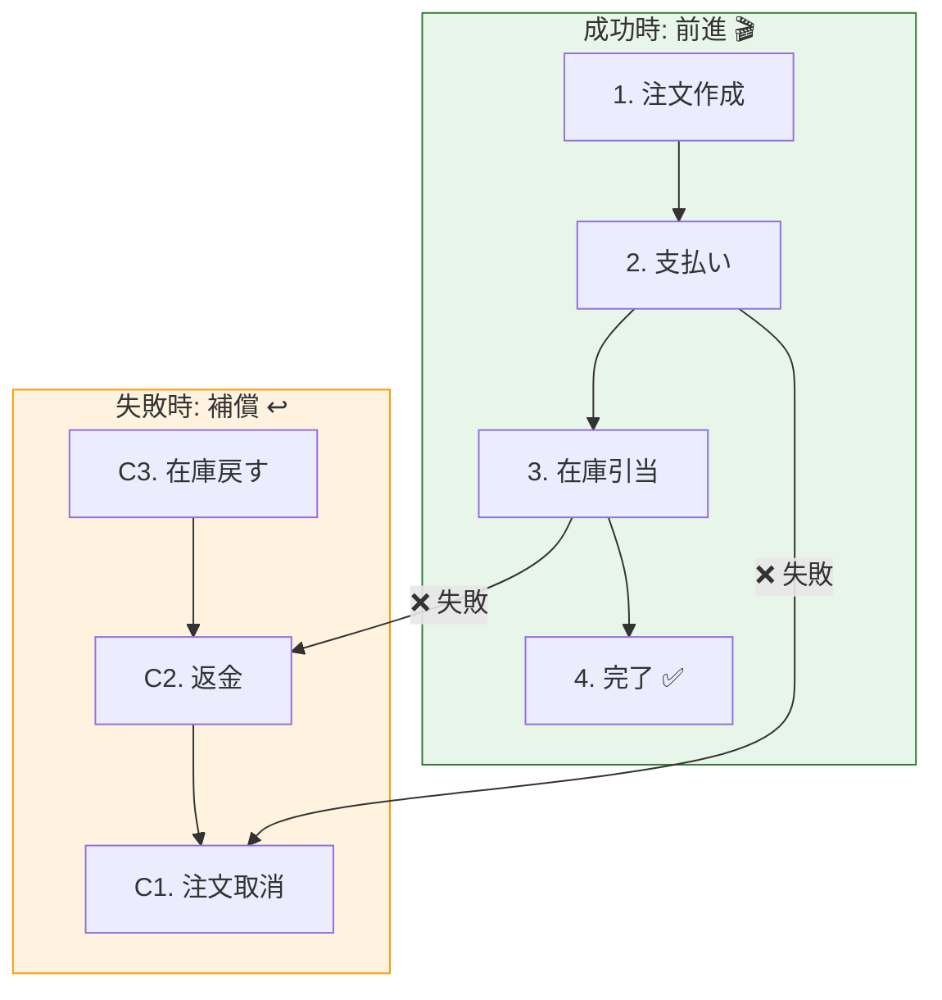

# 第32章：Saga＋観測性＋ADR（総合演習で完成）🎓🏁🔍🧾

## この章でできるようになること ✅✨

* **集約をまたぐ処理**（注文🛒・支払い💳・在庫📦）を **Saga** で成立させられる
* 失敗したら **補償処理↩️** で“なかったことにする”流れを作れる
* **相関ID🔍** と **分散トレーシング🧵** で「何が起きたか」を追える
* 「なぜその境界にしたか」を **ADR🧾** でチーム共有できる

---

## 1. Sagaってなに？（超ざっくり）🧵😊




---

**Saga** は、**複数の集約（やサービス）にまたがる処理**を、
「小さな手順の列（ステップ）」として進めていく考え方だよ〜！✨

* 各ステップは **“自分の境界の中だけ” をトランザクションで確実に更新**する✅
* 途中で失敗したら、**すでに成功したステップを逆順に取り消す（補償↩️）**

> つまり「1発の巨大トランザクション」で全部を無理やりやらない💪😇
> そのかわり「戻せる設計」にするのがコツ！

---

## 2. 今日のゴール：ミニECのチェックアウトSaga 🛒💳📦

### フロー（成功✅）

1. 注文作成（Order集約）🧾
2. 支払い確定（Payment集約）💳
3. 在庫引当（Inventory集約）📦
4. 注文確定（Order集約）🎉

### フロー（失敗😱 → 補償↩️）


* 在庫引当に失敗 → **支払い返金↩️** → **注文キャンセル↩️**
* 支払い確定に失敗 → **注文キャンセル↩️**（在庫は触ってないのでOK）

---

## 3. 実装の方針（設計の気持ちいい形）🧠✨

* **ステップは “execute” と “compensate” を持つ** 🧩
* Saga本体は

  * executeを順に呼ぶ
  * 失敗したら成功済みステップを逆順にcompensateする ↩️
* 観測性は

  * **correlationId（相関ID）** を全ログに入れる🔍
  * **OpenTelemetry** で traceId/spanId をログに混ぜる🧵

OpenTelemetry の JS SDK は **2.x系**が案内されていて、SDK 2.0 の発表も出てるよ〜。([OpenTelemetry][1])
（この章のコードも 2.x を前提で書くね。GitHubのリリースも 2.3.0 が見えるよ〜）([GitHub][2])

---

## 4. ハンズオン：Sagaを“動く形”で作る 🛠️🚀

### 4.1 追加する依存パッケージ（観測性用）📦🔍

（OpenTelemetry NodeのGetting Startedが入口として分かりやすいよ）([OpenTelemetry][3])

```bash
npm i @opentelemetry/api @opentelemetry/sdk-node @opentelemetry/auto-instrumentations-node
```

> Nodeは **v24がActive LTS** として案内されてるので、教材的にも安心寄り😊([nodejs.org][4])
> （v25はCurrent枠だよ）([nodejs.org][4])
> TypeScriptは **5.9系のリリースノート**が公式にあるよ〜([TypeScript][5])
> TS 6.0 / 7.0 に向けた進捗も公式ブログで語られてる！([Microsoft for Developers][6])

---

## 5. コード：Sagaの最小コア（成功→失敗→補償）🧵↩️

### 5.1 Result型（例外を暴れさせない😇）📦

```ts
// src/shared/result.ts
export type Result<T, E> =
  | { ok: true; value: T }
  | { ok: false; error: E };

export const ok = <T>(value: T): Result<T, never> => ({ ok: true, value });
export const err = <E>(error: E): Result<never, E> => ({ ok: false, error });
```

### 5.2 ドメインエラー（最低限だけ）🚨

```ts
// src/domain/errors.ts
export type DomainError =
  | { type: "PaymentDeclined"; reason: string }
  | { type: "OutOfStock"; sku: string; requested: number; available: number }
  | { type: "InvalidState"; message: string };
```

### 5.3 相関ID（correlationId）🔍

```ts
// src/observability/correlation.ts
import { randomUUID } from "node:crypto";

export type CorrelationId = string & { readonly __brand: unique symbol };

export const newCorrelationId = (): CorrelationId =>
  randomUUID() as CorrelationId;
```

---

## 6. 観測性：ログに traceId/spanId も混ぜる 🧵🪄


### 6.1 OpenTelemetry 初期化（Console exporterでOK）🧪

```ts
// src/observability/otel.ts
import { NodeSDK } from "@opentelemetry/sdk-node";
import { getNodeAutoInstrumentations } from "@opentelemetry/auto-instrumentations-node";

export async function startOtel() {
  const sdk = new NodeSDK({
    instrumentations: [getNodeAutoInstrumentations()],
  });

  await sdk.start();
  return sdk;
}
```

> ここは“とにかく動く”最小形だよ😊
> 本番はOTLP exporterで収集基盤に送るのが一般的だけど、まずは **traceIdが出る**体験が大事✨
> OpenTelemetryは「テレメトリ（traces/metrics/logs）」を集める枠組みとして説明されてるよ〜([OpenTelemetry][7])

### 6.2 ログ関数（相関ID＋traceId＋spanId）🪵🔍

```ts
// src/observability/log.ts
import { context, trace } from "@opentelemetry/api";
import type { CorrelationId } from "./correlation.js";

type Level = "info" | "warn" | "error";

export function log(
  level: Level,
  message: string,
  fields: Record<string, unknown> & { correlationId?: CorrelationId } = {},
) {
  const span = trace.getSpan(context.active());
  const sc = span?.spanContext();

  const payload = {
    ts: new Date().toISOString(),
    level,
    message,
    traceId: sc?.traceId,
    spanId: sc?.spanId,
    ...fields,
  };

  console.log(JSON.stringify(payload));
}
```

---

## 7. Sagaのインターフェース＆実行エンジン 🧵⚙️

### 7.1 ステップ定義（execute / compensate）🧩


```ts
// src/application/saga/sagaStep.ts
import type { Result } from "../../shared/result.js";
import type { DomainError } from "../../domain/errors.js";

export interface SagaStep<C> {
  name: string;
  execute(ctx: C): Promise<Result<void, DomainError>>;
  compensate(ctx: C): Promise<void>;
}
```

### 7.2 Sagaランナー（失敗したら逆順補償↩️）🏃‍♀️💨

```ts
// src/application/saga/runSaga.ts
import type { SagaStep } from "./sagaStep.js";
import type { Result } from "../../shared/result.js";
import { ok } from "../../shared/result.js";
import type { DomainError } from "../../domain/errors.js";
import { log } from "../../observability/log.js";

export async function runSaga<C>(
  ctx: C & { correlationId: string },
  steps: SagaStep<C>[],
): Promise<Result<void, DomainError>> {
  const completed: SagaStep<C>[] = [];

  for (const step of steps) {
    log("info", "saga.step.start", { correlationId: ctx.correlationId, step: step.name });

    const r = await step.execute(ctx);

    if (!r.ok) {
      log("error", "saga.step.failed", {
        correlationId: ctx.correlationId,
        step: step.name,
        error: r.error,
      });

      // 補償は逆順！
      for (const done of [...completed].reverse()) {
        try {
          log("warn", "saga.compensate.start", { correlationId: ctx.correlationId, step: done.name });
          await done.compensate(ctx);
          log("warn", "saga.compensate.ok", { correlationId: ctx.correlationId, step: done.name });
        } catch (e) {
          // 補償失敗は「二次災害」なので観測性が超大事😇
          log("error", "saga.compensate.failed", {
            correlationId: ctx.correlationId,
            step: done.name,
            error: String(e),
          });
        }
      }

      return r;
    }

    log("info", "saga.step.ok", { correlationId: ctx.correlationId, step: step.name });
    completed.push(step);
  }

  log("info", "saga.ok", { correlationId: ctx.correlationId });
  return ok(undefined);
}
```

---

## 8. 例：チェックアウトSaga（Order/Payment/Inventoryの3ステップ）🛒💳📦

ここからは「集約の中身」は最小のダミーでもOK！
ポイントは **Sagaの形** と **ログ＆トレースが追えること** だよ😊✨

### 8.1 Context（Sagaが持ち回る情報）🧺

```ts
// src/application/checkout/checkoutContext.ts
import type { CorrelationId } from "../../observability/correlation.js";

export type CheckoutContext = {
  correlationId: CorrelationId;
  orderId: string;
  sku: string;
  qty: number;
  amount: number;
};
```

### 8.2 ステップ例（ダミー実装）🧩

```ts
// src/application/checkout/steps.ts
import type { SagaStep } from "../saga/sagaStep.js";
import { ok, err } from "../../shared/result.js";
import type { CheckoutContext } from "./checkoutContext.js";
import { log } from "../../observability/log.js";

export function createOrderStep(): SagaStep<CheckoutContext> {
  return {
    name: "CreateOrder",
    async execute(ctx) {
      log("info", "order.created", { correlationId: ctx.correlationId, orderId: ctx.orderId });
      return ok(undefined);
    },
    async compensate(ctx) {
      log("warn", "order.cancelled", { correlationId: ctx.correlationId, orderId: ctx.orderId });
    },
  };
}

export function capturePaymentStep(options?: { fail?: boolean }): SagaStep<CheckoutContext> {
  return {
    name: "CapturePayment",
    async execute(ctx) {
      if (options?.fail) {
        return err({ type: "PaymentDeclined", reason: "card_declined" });
      }
      log("info", "payment.captured", { correlationId: ctx.correlationId, orderId: ctx.orderId, amount: ctx.amount });
      return ok(undefined);
    },
    async compensate(ctx) {
      log("warn", "payment.refunded", { correlationId: ctx.correlationId, orderId: ctx.orderId, amount: ctx.amount });
    },
  };
}

export function reserveStockStep(options?: { available?: number }): SagaStep<CheckoutContext> {
  return {
    name: "ReserveStock",
    async execute(ctx) {
      const available = options?.available ?? 999;
      if (available < ctx.qty) {
        return err({ type: "OutOfStock", sku: ctx.sku, requested: ctx.qty, available });
      }
      log("info", "stock.reserved", { correlationId: ctx.correlationId, sku: ctx.sku, qty: ctx.qty });
      return ok(undefined);
    },
    async compensate(ctx) {
      log("warn", "stock.released", { correlationId: ctx.correlationId, sku: ctx.sku, qty: ctx.qty });
    },
  };
}

export function confirmOrderStep(): SagaStep<CheckoutContext> {
  return {
    name: "ConfirmOrder",
    async execute(ctx) {
      log("info", "order.confirmed", { correlationId: ctx.correlationId, orderId: ctx.orderId });
      return ok(undefined);
    },
    async compensate(ctx) {
      // confirmまで行った後に全体失敗するなら、ここは普通呼ばれない想定だけど…
      // “設計の保険”として書いておくのもアリ🙂
      log("warn", "order.unconfirmed", { correlationId: ctx.correlationId, orderId: ctx.orderId });
    },
  };
}
```

---

## 9. 実行：トレースの中でSagaを回す 🧵🏁


```ts
// src/main.ts
import { trace } from "@opentelemetry/api";
import { startOtel } from "./observability/otel.js";
import { newCorrelationId } from "./observability/correlation.js";
import { runSaga } from "./application/saga/runSaga.js";
import { createOrderStep, capturePaymentStep, reserveStockStep, confirmOrderStep } from "./application/checkout/steps.js";

const sdk = await startOtel();
const tracer = trace.getTracer("mini-ec");

const correlationId = newCorrelationId();

await tracer.startActiveSpan("CheckoutSaga", async (span) => {
  try {
    // 失敗を見たいときは、ここをいじるよ👇😈
    const failPayment = false;
    const stockAvailable = 0; // 0にすると在庫不足で失敗！

    const ctx = {
      correlationId,
      orderId: "order-001",
      sku: "sku-TSHIRT",
      qty: 1,
      amount: 4200,
    };

    const steps = [
      createOrderStep(),
      capturePaymentStep({ fail: failPayment }),
      reserveStockStep({ available: stockAvailable }),
      confirmOrderStep(),
    ];

    const r = await runSaga(ctx, steps);

    if (!r.ok) {
      // 失敗の“結果”はここでまとめて扱える😊
      // （UI表示、リトライ、アラート、など）
      console.log("FINAL RESULT: FAILED", r.error);
      return;
    }

    console.log("FINAL RESULT: OK");
  } finally {
    span.end();
  }
});

await sdk.shutdown();
```

### 9.1 期待する挙動（在庫不足のとき）😱↩️

* CreateOrder ✅
* CapturePayment ✅
* ReserveStock ❌（OutOfStock）
* 補償：CapturePayment↩️（返金） → CreateOrder↩️（キャンセル）
* ログには **correlationId と traceId** が入って追える🔍🧵

---

## 10. AI活用（Copilot / Codex）で爆速にするプロンプト例 🤖✨

### 10.1 ステップ追加（配送手配🚚）して、失敗時に取り消す↩️

**プロンプト例：**

* 「Checkout Sagaに `ArrangeShipping` ステップを追加して。executeは shippingId を作ってctxに入れる。compensateは shipping cancel ログを出す。テストも追加して」

### 10.2 “補償漏れ”チェック ✅

* 「このSagaのステップ順と補償順をレビューして。補償し忘れが起きそうな箇所と改善案を挙げて」

### 10.3 観測性の強化 🔍

* 「ログに `eventName` を統一形式で入れて。さらに error には `errorType` と `retryable` を入れる設計にして」

---

## 11. ADR：意思決定を1枚で残す 🧾✨


### 11.1 ADRテンプレ（コピペOK）📋

```md
## ADR-0001: CheckoutはSagaでオーケストレーションする

## Status
Accepted

## Context
- 注文（Order）・支払い（Payment）・在庫（Inventory）が別集約であり、単一トランザクションに統合しない方針
- ただしユーザー体験として「購入完了」を提供する必要がある
- 失敗時に整合性を戻せる仕組み（補償）が必要

## Decision
- CheckoutはSaga（オーケストレーション）で実装する
- 各ステップは execute / compensate を持つ
- 相関ID（correlationId）を全ログに付与し、OpenTelemetryのtraceId/spanIdも併記する

## Consequences
### Pros
- 集約の境界を保ったまま、跨ぎ処理が可能
- 失敗時の補償で“戻せる”
- 観測性により運用時の原因追跡が容易

### Cons / Risks
- 補償の実装・テストが必須で、手間が増える
- 補償失敗という二次災害が起こり得る（監視・アラートが必要）

## Alternatives Considered
- 巨大トランザクションで統合（境界が崩れて保守困難）
- イベント連鎖のみ（コレオグラフィ）：全体像の把握が難しく、初心者には事故りやすい

## Links
- docs/adr/0001-checkout-saga.md
- src/application/saga/runSaga.ts
```

> ADRは「後から来た人が、なぜそうしたのか分かる」が最強だよ🧾✨
> 書けるとチーム開発が一気に安定する😊

---

## 12. 仕上げチェックリスト ✅🏁

* [ ] Sagaが **成功ルート** を通る
* [ ] 失敗時に **補償が逆順で走る** ↩️
* [ ] **correlationId** が全ログに入っている🔍
* [ ] **traceId/spanId** もログに出ている🧵
* [ ] ADRが1枚あり、「なぜこの境界？」が説明できる🧾

---

### （参考：ツールの最新状況メモ）📝✨

* VS Code のリリースノート（1.108 / 2026-01-08公開）が確認できるよ([Visual Studio Code][8])
* Node.js は v24 が Active LTS、v25 は Current として案内されてるよ([nodejs.org][4])
* OpenTelemetry JS は 2.x 系の案内と、SDK 2.0 の告知があるよ([OpenTelemetry][1])

[1]: https://opentelemetry.io/blog/2025/otel-js-sdk-2-0/?utm_source=chatgpt.com "Announcing the OpenTelemetry JavaScript SDK 2.0"
[2]: https://github.com/open-telemetry/opentelemetry-js/releases?utm_source=chatgpt.com "Releases · open-telemetry/opentelemetry-js"
[3]: https://opentelemetry.io/docs/languages/js/getting-started/nodejs/?utm_source=chatgpt.com "Node.js"
[4]: https://nodejs.org/en/about/previous-releases?utm_source=chatgpt.com "Node.js Releases"
[5]: https://www.typescriptlang.org/docs/handbook/release-notes/typescript-5-9.html?utm_source=chatgpt.com "Documentation - TypeScript 5.9"
[6]: https://devblogs.microsoft.com/typescript/progress-on-typescript-7-december-2025/?utm_source=chatgpt.com "Progress on TypeScript 7 - December 2025"
[7]: https://opentelemetry.io/docs/languages/js/?utm_source=chatgpt.com "JavaScript"
[8]: https://code.visualstudio.com/updates?utm_source=chatgpt.com "December 2025 (version 1.108)"
