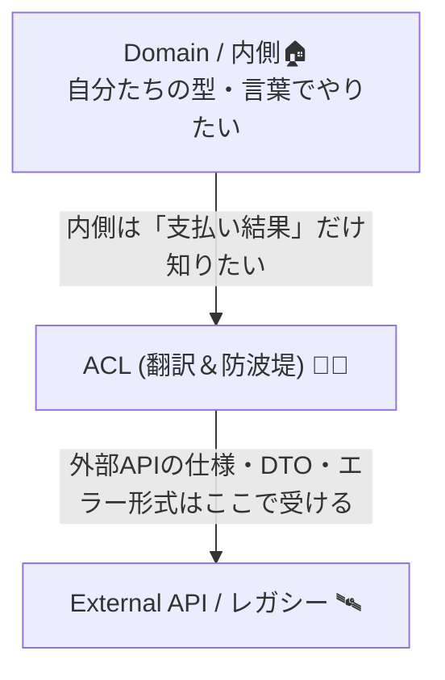

# 第01章：ACLってなに？ “腐敗”ってなに？（最短でイメージ）🧼💡

## 1. まず結論：ACLは「翻訳＆防波堤」🧱🌊

ACL（腐敗防止層 / Anti-Corruption Layer）を一言で言うと👇

* **外部システムのクセや仕様を、内側の設計に持ち込ませないための“翻訳＆防波堤”**だよ🧼🧱✨ ([Microsoft Learn][1])


つまり、

* 外側（外部API・レガシーDB・他チームのサービス）🛰️
* 内側（自分たちのドメインモデル・業務ルール）🏠

この間に **「クッション」**を挟んで、内側を守るのがACLだよ😊🛡️

---

## 2. “腐敗”ってなに？（設計がジワジワ壊れる現象）🧟‍♀️🦠

ここでいう「腐敗」は、ざっくり言うと👇

> 外部の都合（変な命名、値の意味、エラー形式、欠損だらけ…）が、
> だんだん内側のコードに染み込んで、内側の設計が崩れていくこと😵‍💫

よくある “腐敗のサイン” はこんな感じ👇

* **ドメイン（業務）のコードなのに、外部DTOが登場する**📦😇
* `status == "00"` みたいな **謎コード**が内側に散らばる🕵️‍♀️
* 金額が `int amount` だけで、**通貨や単位が不明**（円？ドル？cents？）💸❓
* `DateTime` が文字列で飛び交って **タイムゾーン事故**が起こる⏰💥
* 外部都合の命名（`cust_cd`, `pay_flg`）が、内側のクラス名・変数名に侵食する😇🧪
* 外部エラーの形式がそのままUIに出て、ユーザーが泣く😭📛

ACLは、こういう腐敗を **境界で止める** 役目なんだよ🧱🛑 ([Microsoft Learn][1])

---

## 3. たとえ話：海外のルールを“家の中”に持ち込まない🏡✈️

たとえば、海外の学校に通うとして…

* 学校のルールは外側（テスト形式、評価方法、提出サイトのクセ）📚🌍
* でも家の中（自分の生活ルール）まで、全部それに合わせたらしんどいよね😵‍💫

だから家の玄関に「翻訳＆整理」する人がいると楽になる✨
それがACLのイメージだよ🧑‍🏫🧱

---

## 4. ミニ用語メモ（今日だけ覚えればOK）📘✨

* **ドメイン**：業務の“意味”と“ルール”の世界（例：注文、支払い、会員）🏠
* **外部**：他社API、レガシー、別チームのサービスなど（自分で変えられない）🛰️
* **DTO**：通信や保存のための“入れ物”（外部の形そのままになりがち）📦
* **ACL**：外部DTOや外部仕様を、内側の言葉に翻訳して渡す層🧼🧱

---

## 5. ハンズオン：ダメ例コードを眺めて「どこが腐ってる？」探しゲーム👀🎮

次のコードは **“わざと腐ってる例”**だよ😈
（読むだけでOK！ビルドしなくてOK！）

```csharp
using System.Net.Http;
using System.Text.Json;

public class OrderService
{
    private readonly HttpClient _http = new HttpClient(); // ← いきなり作ってる😇

    public async Task<string> PlaceOrderAsync(string memberId, int amount)
    {
        // 外部APIの要求に合わせた “外部用の形” を内側で直接作ってる📦
        var requestObj = new
        {
            member_id = memberId,   // snake_case が侵食🐍
            pay_amount = amount,    // 単位不明（円？cents？）💸❓
            currency = "JPY"
        };

        var json = JsonSerializer.Serialize(requestObj);

        // 外部のURLやパスが内側にベタ書き🌐
        var res = await _http.PostAsync(
            "https://api.example-pay.com/v1/pay",
            new StringContent(json)
        );

        var body = await res.Content.ReadAsStringAsync();

        // 外部レスポンスDTOを内側で直読み📦😇
        using var doc = JsonDocument.Parse(body);
        var status = doc.RootElement.GetProperty("status").GetString(); // "00" とか来るやつ…

        if (status == "00")
        {
            return "OK"; // 内側の成功判定が外部コードに依存😵‍💫
        }

        var errorCode = doc.RootElement.GetProperty("error_code").GetString();
        return $"NG:{errorCode}"; // 外部エラーをそのまま返す📛
    }
}
```

---

## 6. 腐敗ポイント探し（答え合わせ）✅🧼

上のコード、腐敗ポイントはいっぱいあるよ〜！😵‍💫
どれが気づけたかな？👀✨

1. `new HttpClient()` を毎回／その場で作りがち（運用でハマりやすい）🌪️
   → .NETでは **ガイドライン**があって、`IHttpClientFactory` の利用などが推奨されるよ📌 ([Microsoft Learn][2])

2. 外部APIのURLが内側に直書き🌐🧨
   → 仕様変更に弱い＆テストしづらい💥

3. snake_case（`member_id`）が内側に侵入🐍
   → 内側の言葉（命名）を外に寄せ始めるのが腐敗の第一歩😇

4. `amount` の単位が不明（円？cents？）💸❓
   → “意味”がズレると事故る。ACLで正規化したくなるポイント✨

5. 外部JSONを `JsonDocument` で直読みしてる📦
   → 外部の構造変更が、そのまま内側の破壊になる😵‍💫

6. 成功判定が `status == "00"` に依存🕵️‍♀️
   → その謎コードが内側に散らばる未来が見える…😇

7. エラーが `NG:{errorCode}` の文字列で返る📛
   → “エラー設計”ができない（後で地獄）🔥

8. 返り値が `string`（OK/NGの文字列）
   → 呼び出し側がまた分岐地獄になる😵‍💫

9. “注文”という業務なのに、支払いAPIの都合が中心になってる🛒➡️💳
   → 内側の主役が外部になってるのも腐敗サイン😇

10. テストがしんどい（外部呼び出しが直で入ってる）🧪💥
    → ACL + DI で差し替えできると楽になる世界があるよ🔌✨

---

## 7. じゃあACLがあると、何が変わるの？（超ざっくり図）🧱✨

イメージはこれ👇

* 内側は「自分たちの言葉」だけで話す🏠🗣️
* 外側のクセはACLが吸収する🧼🧱



ACLの中には、だいたい👇みたいな部品が入ることが多いよ（今は名前だけでOK）🧰✨

* **Client**（外部を呼ぶ係）📡
* **Translator**（外部DTO→内側モデルに変換する係）🈯
* **Facade/Adapter**（使いやすい窓口にする係）🚪

この「翻訳する層を挟む」って発想自体がACLの核だよ🧠✨ ([Microsoft Learn][1])

---

## 8. ミニ課題：外部の都合でつらかった話を1個メモ📝😭

次のテンプレで、過去の経験を1つだけ書いてみてね（箇条書きでOK）✨

* 何が外部都合だった？（仕様・命名・単位・エラー形式・欠損…）🛰️
* それが内側にどう影響した？（分岐だらけ、命名が崩壊、バグ…）😵‍💫
* その時どう対処した？（気合、if地獄、場当たり…）🔥

これ、後の章でACLの“効きどころ”が分かる宝物になるよ💎😊

---

## 9. AI活用：AIに「腐敗ポイント」を見つけてもらう🤖🔎✨

### 9.1 まずは“観察力”をAIでブースト🚀

次のお願いを、Copilot / Codex系に投げてみてね👇

* 「このコードの**腐敗ポイント**を、設計の観点で**箇条書き10個**で教えて」🤖🧼
* 「このコードにACLを入れるなら、**境界（どこからが外部？）**を言葉で説明して」🧱🗣️
* 「外部の `status == "00"` を、内側の**意味ある結果型**にする案を3つ出して」✨📦

### 9.2 注意ポイント（ここだけ人間の仕事）🧠⚠️

AIの提案は便利だけど👇は必ず人間が決めようね💡

* “内側の言葉”を何にするか（命名・意味）🗣️
* “成功/失敗”の定義（業務ルール）✅
* “未知値や欠損”をどう扱うか（安全設計）🧯

---

## 10. よくある誤解（最初に潰すやつ）😇🔨

* **誤解①：ACLってDTO変換だけでしょ？**
  → 変換は大事だけど、それだけじゃないよ！
  “外部の都合”が内側に入らないように **方針ごと封じ込める**のがACL🧱✨ ([Microsoft Learn][1])

* **誤解②：外部の項目名はそのまま使った方が分かりやすい**
  → 短期的には楽。でも長期的に内側が“外部の奴隷”になる😭🪦

* **誤解③：まず動けばOK、設計は後で**
  → もちろん最初は動かすの大事！
  でも外部統合は腐敗が早いから、ACLは“早めに薄く”入れると将来がラク🌱🧼

---

## 11. 今日できるようになったこと（1分で復習）⏱️🎉

* ACLは **翻訳＆防波堤**🧱🌊
* 腐敗は「外部のクセが内側の設計を壊す」現象🦠😵‍💫
* ダメ例コードから、腐敗ポイントを見つける目が育った👀✨

---

## 参考（公式・一次情報）📚✨

* Anti-Corruption Layer pattern（Microsoft） ([Microsoft Learn][1])
* Anti-corruption layer pattern（AWS Prescriptive Guidance） ([AWS ドキュメント][3])
* Anti-Corruption Layer（DevIQ） ([DevIQ][4])
* HttpClient guidelines / IHttpClientFactory（Microsoft） ([Microsoft Learn][5])
* C# 14 / .NET 10（Microsoft） ([Microsoft Learn][6])

[1]: https://learn.microsoft.com/en-us/azure/architecture/patterns/anti-corruption-layer?utm_source=chatgpt.com "Anti-corruption Layer pattern - Azure Architecture Center"
[2]: https://learn.microsoft.com/en-us/dotnet/core/extensions/httpclient-factory?utm_source=chatgpt.com "Use the IHttpClientFactory - .NET"
[3]: https://docs.aws.amazon.com/prescriptive-guidance/latest/cloud-design-patterns/acl.html?utm_source=chatgpt.com "Anti-corruption layer pattern - AWS Prescriptive Guidance"
[4]: https://deviq.com/domain-driven-design/anti-corruption-layer?utm_source=chatgpt.com "Anti-Corruption Layer"
[5]: https://learn.microsoft.com/en-us/dotnet/fundamentals/networking/http/httpclient-guidelines?utm_source=chatgpt.com "Guidelines for using HttpClient"
[6]: https://learn.microsoft.com/ja-jp/dotnet/csharp/whats-new/csharp-14?utm_source=chatgpt.com "C# 14 の新機能"
