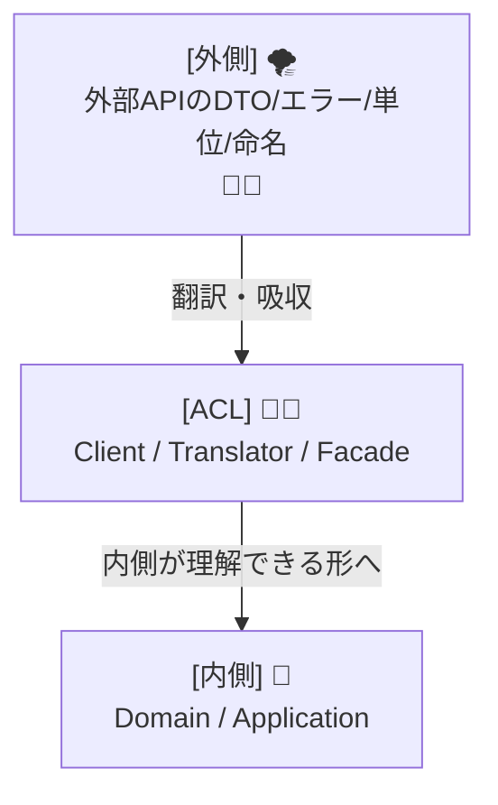
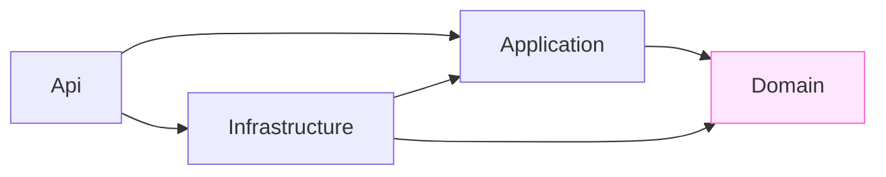

# 第02章：教材の全体地図＆題材システム紹介（ミニEC/フリマ）🗺️🛒

## 2.1 この教材でできるようになること（ゴール）🎯✨

この教材の最終ゴールは、こんな状態になることです👇💕

* 外部APIの“クセ”が強くても、内側（自分の設計）をキレイに守れる🧼🧱
* 「外の都合（DTO・命名・単位・エラー形式）」を、そのまま内側に持ち込まない🙅‍♀️
* 仕様変更やレガシー改修が来ても、壊れる場所が“外側だけ”に限定できる🛡️
* **翻訳（変換）テスト**で、外部変更を早めに検知できる✅

---

## 2.2 題材システム：ミニEC／フリマの世界観 🛍️📦💳

登場するのは、超ミニ版の「売買アプリ」だと思ってください😊✨
ざっくり流れはこう👇

1. 会員（Member）がいる👤
2. 商品を買って注文（Order）する🛒
3. 決済（Payment）して支払い完了にする💳✅

この教材では「Web画面」よりも、まず **Web API（サーバー側）**を作っていきます🌐🧑‍💻
（後からUIを付けたくなったら付けられる構造にしておくのが狙いです✨）

---

## 2.3 “内側”と“外側”の登場人物（ここ超大事）🧩🧠


### 内側（自分たちの世界）🌸

内側は「自分たちがコントロールできる」エリアです😊
ここは **言葉・型・ルール**をキレイに保ちたい✨

* 注文：Order 🛒
* 支払い：Payment 💳
* 会員：Member 👤

✅ 内側の理想：

* 命名が自然（OrderId / Money / PaymentStatus など）
* 値が正規化されてる（通貨・単位・時刻がきっちり）
* 不正な状態が入ってこない（null地獄しない🙅‍♀️）

---

### 外側（外部サービスの世界）🌪️

外側は「相手の都合で変わる」エリアです😇
クセが強いこと、普通にあります…

* 決済API（クセあり）💳🌀
* レガシー会員API（古い・歪みあり）🧓📼

#### 例：決済APIが返す“クセ強めJSON”😵‍💫


* `snake_case`
* 金額が **cents（最小単位）**
* ステータスが増えたり名前が変わったりする

```json
{
  "payment_id": "p_123",
  "amount_cents": 1299,
  "currency": "JPY",
  "status": "succeeded",
  "created_at_utc": "2026-01-28T01:23:45Z"
}
```

#### 例：レガシー会員APIの“古い事情”😇

* 変な略語・古い命名
* 日付が文字列で形式バラバラ
* true/false が "0"/"1" の文字列だったりする

```json
{
  "mem_no": "00001234",
  "mailaddr": "a@example.com",
  "rank_cd": "G",
  "birth": "1999/07/01",
  "is_stop": "0"
}
```

---

## 2.4 ACLはどこに置くの？（まだ作らないけど、地図だけ見る）🧱🌊


ACL（腐敗防止層）は一言でいうと…

**外側の“変な形/意味”を、内側の“キレイな形/意味”に翻訳する通訳さん**🧑‍🏫✨
そして、内側を守る防波堤🌊🧱

イメージ図（超重要）👇



内側が外側に直接つながると、こうなりがち👇😇

* ドメインに `HttpClient` が出てくる
* 外部DTOがそのまま内側を走り回る
* 外部の命名が内側のクラス名に感染する（腐敗🧟‍♀️）

それを **ACLで止める**のが、この教材のテーマです🧼🧱✨

---

## 2.5 プロジェクト構成（全体地図）🗺️🏗️

この教材では、最初から「分ける前提」で雛形を作ります😊✨
（後で分けようとすると、だいたいしんどいので…🥹）

### 4プロジェクト構成（おすすめ）💡


* `MiniECommerce.Api`

  * Web API（エンドポイント、DI設定、起動）🌐
* `MiniECommerce.Application`

  * “やりたいこと”（ユースケース）📌
* `MiniECommerce.Domain`

  * “大事なルール”（型・不変条件・ドメインモデル）🧠🛡️
* `MiniECommerce.Infrastructure`

  * DBや外部API、ACL（外側との接続）🔌🌪️

依存の向き（めちゃ大事！）👇




---

## 2.6 ハンズオン：雛形を作る（Visual Studio）🧰🪄

### Step 1：ソリューション作成🗂️

1. 新規プロジェクト作成で「空のソリューション」またはソリューション作成
2. ソリューション名：`MiniECommerce`（好きな名前でOK）🫶

### Step 2：プロジェクトを4つ追加➕

ソリューションに次を追加します👇

* `MiniECommerce.Api`：ASP.NET Core Web API（または Empty + Minimal API）🌐
* `MiniECommerce.Application`：クラスライブラリ📌
* `MiniECommerce.Domain`：クラスライブラリ🛡️
* `MiniECommerce.Infrastructure`：クラスライブラリ🔌

※ 2026時点の最新スタックとして、`.NET 10 / C# 14` を使う想定です。([Microsoft for Developers][1])

### Step 3：参照設定（依存の向きを作る）🔗

参照はこう👇（ここ間違えると後で地獄🥹）

* `Application` → `Domain`
* `Infrastructure` → `Application` と `Domain`
* `Api` → `Application` と `Infrastructure`

💡 Visual Studio：
各プロジェクトの **依存関係 → プロジェクト参照の追加** でOKです✅

### Step 4：ソリューションフォルダを作る（見た目の整理）📁✨

ソリューション上で、フォルダを作るとスッキリします💕

* `src`（4プロジェクトを入れる）
* `docs`（後でメモや図を置くなら）

---

## 2.7 ハンズオン：雛形を作る（VS Code / CLI）⌨️🧰

VS Code派は、コマンドで一気に作れます🚀
（慣れてる人はこっちが速い✨）

```powershell
mkdir MiniECommerce
cd MiniECommerce

dotnet new sln -n MiniECommerce

dotnet new webapi  -n MiniECommerce.Api           -f net10.0
dotnet new classlib -n MiniECommerce.Domain       -f net10.0
dotnet new classlib -n MiniECommerce.Application  -f net10.0
dotnet new classlib -n MiniECommerce.Infrastructure -f net10.0

dotnet sln add .\MiniECommerce.Api\MiniECommerce.Api.csproj
dotnet sln add .\MiniECommerce.Domain\MiniECommerce.Domain.csproj
dotnet sln add .\MiniECommerce.Application\MiniECommerce.Application.csproj
dotnet sln add .\MiniECommerce.Infrastructure\MiniECommerce.Infrastructure.csproj

dotnet add .\MiniECommerce.Application\MiniECommerce.Application.csproj reference .\MiniECommerce.Domain\MiniECommerce.Domain.csproj
dotnet add .\MiniECommerce.Infrastructure\MiniECommerce.Infrastructure.csproj reference .\MiniECommerce.Application\MiniECommerce.Application.csproj
dotnet add .\MiniECommerce.Infrastructure\MiniECommerce.Infrastructure.csproj reference .\MiniECommerce.Domain\MiniECommerce.Domain.csproj
dotnet add .\MiniECommerce.Api\MiniECommerce.Api.csproj reference .\MiniECommerce.Application\MiniECommerce.Application.csproj
dotnet add .\MiniECommerce.Api\MiniECommerce.Api.csproj reference .\MiniECommerce.Infrastructure\MiniECommerce.Infrastructure.csproj
```

---

## 2.8 動作確認：最初の “Ping” を作って起動する ✅🚀


`MiniECommerce.Api` の `Program.cs` に、まずは生存確認エンドポイントを追加します🐣✨
（Minimal APIの書き方はこの形が基本です）([Microsoft Learn][2])

```csharp
app.MapGet("/ping", () => Results.Ok(new { message = "pong 🏓" }));
```

起動して、ブラウザで👇を開いて確認します😊

* `https://localhost:xxxx/ping`

`{"message":"pong 🏓"}` が返ってきたらOK🎉🎉🎉

---

## 2.9 ここから先の“作業の進み方”イメージ 🧭📚

この教材は、毎章こんな感じで進みます👇✨

1. **地図を見る**（内側/外側/境界を意識）🗺️
2. **小さく実装**（壊れにくい形で）🧩
3. **変換テスト**で守りを固める✅
4. 外部が変でも、内側はいつもキレイ🧼🧱

---

## 2.10 ミニ課題：フォルダ構成の意図を1行で説明✍️📝

次のどれかを、**1行**で書いてみてください（短くてOK）😊💕

* 「なぜ Domain を分けたの？」
* 「なぜ Infrastructure に外部API（ACL）を置くの？」
* 「Api が Domain を直接触らないのはなぜ？」

例（あくまで例だよ）👇

* 「外部の都合が変わっても、内側のルールを守るため」🧱✨

---

## 2.11 AI活用：フォルダ構成案を3パターン出させる 🤖🧠

Copilot / Codex などに、こう聞くと捗ります⚡

```text
ミニECのACL教材用に、C#/.NET 10で
Api / Application / Domain / Infrastructure を前提にした
フォルダ構成案を3パターンください。
それぞれ「メリット/デメリット」も短く添えてください。
ACL（外部決済API・レガシー会員API）の置き場所も明示して。
```

💡コツ😊

* AIが出した案をそのまま採用しなくてOK🙆‍♀️
* 「依存の向き（Domainが外を知らない）」だけは死守🛡️
* 迷ったら、この章の4プロジェクト構成に戻ればOKです🫶

[1]: https://devblogs.microsoft.com/dotnet/announcing-dotnet-10/?utm_source=chatgpt.com "Announcing .NET 10"
[2]: https://learn.microsoft.com/en-us/aspnet/core/tutorials/min-web-api?view=aspnetcore-10.0&utm_source=chatgpt.com "Tutorial: Create a Minimal API with ASP.NET Core"
