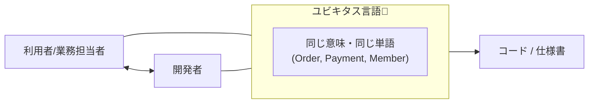
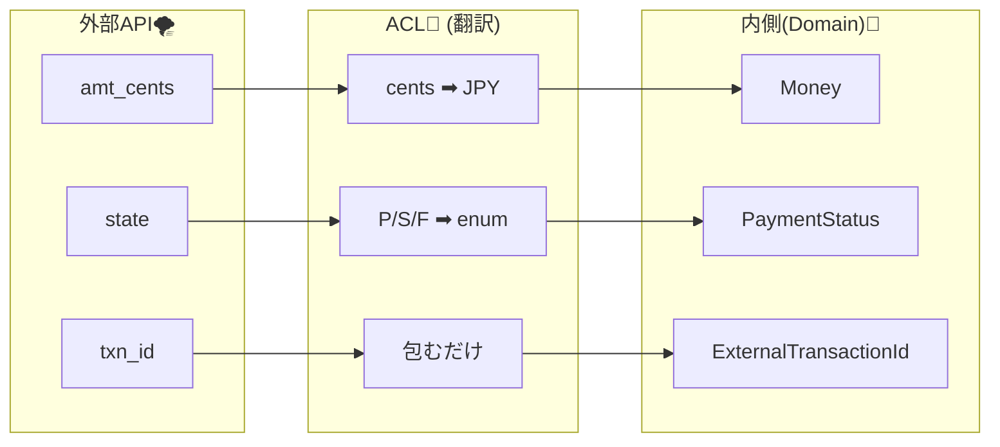

# 第04章：超入門DDD：ドメインの“言葉”を決める（ユビキタス言語っぽく）🗣️📘


## この章のゴール 🎯

この章を終えると、次の3つができるようになります😊

* **システムの内側で使う言葉（ドメイン用語）**を、自分で決められる🧠✨
* “似てるけど意味がズレる言葉”を見つけて、**1つの定義に固定**できる🔒
* 決めた言葉を、**C#の型（enum/record/record structなど）**に落として、コード上でもブレにくくできる🧱💻

---

## 1) なんで「言葉決め」がそんなに大事なの？😵‍💫➡️😌


DDDの超・入口でいちばん効くのが **ユビキタス言語（Ubiquitous Language）** です🌸
ざっくり言うと、

* 開発者と利用者（や業務の人）が
* **同じ意味で同じ単語を使う**ようにして
* 会話も仕様もコードも、ブレないようにする

っていう考え方だよ〜！📣✨ ([martinfowler.com][1])
25: 


そしてACL（腐敗防止層）って、外側の世界を**翻訳**する層なんだけど…
翻訳ってさ、**翻訳先の言葉（内側の辞書）**が決まってないと無理じゃない？📚😇
だからこの章で **「内側の辞書」** を先に作るよ〜！🧼🧱

---

## 2) “腐敗”って、言葉から始まることが多い 🙃🌀


たとえば「Order」って単語、日常だと軽く見えるけど…現場だとブレやすい代表選手👀

* Order = 注文（購入の意思決定）？
* Order = 受注（店側が受け付けた状態）？
* Order = 発注（仕入れの注文）？
* Order = 取引（支払いまで含む）？

この状態で外部APIの言葉（Transaction / Charge / Purchase / Deal…）が入ってくると、
コードがこうなりがち👇😇

* `Order` の中に `TransactionId` が混ざる
* `PaymentStatus` のつもりが外部の `state` をそのまま使っちゃう
* 「金額」が `int amount` で、単位が円なのかセントなのか不明

こういう “言葉の混線” が、設計をじわじわ壊します🧟‍♀️🧨

---

## 3) この教材の題材（ミニEC/フリマ）で使う「内側の言葉」候補 🛒💳👤


この教材の内側（ドメイン側）は、まずはこの3つ中心で行くよ😊

* 注文：`Order`
* 支払い：`Payment`
* 会員：`Member`

ここに対して外側（例：決済API・レガシー会員API）が、
別の言葉・別の単位・別の状態名でしゃべってくる想定！🌪️

だから内側の言葉は、**内側の都合で決めてOK**🙆‍♀️
（むしろ決めないと、外側に引っ張られる💥）

---

## 4) 用語辞書（ミニ）を作ろう📒✨（ハンズオン）

### 4-1. まず「曖昧語リスト」を出す 🔎📝

最初は雑でOK！とにかく候補を出すよ〜

**例（この題材で曖昧になりやすい）**

* Order / Purchase / Deal
* Payment / Charge / Transaction
* Member / User / Customer
* Amount / Price / Fee / Tax
* Status / State
* Refund / Cancel

---

### 4-2. “この教材ではこういう意味！”を1行で固定する 🔒✍️

ここが超大事💡
辞書は「正しさ」より **“チーム内でブレないこと”** が勝ち！

---

### 4-3. 用語辞書テンプレ（そのままコピペOK）🧾

プロジェクトに `Docs/Glossary.md` を作って、まずは10語だけ埋めよう😊

| カテゴリ | 用語（内側）        | 定義（この教材での意味）              | 例（文章で）          | 禁止/避けたい言い方         |
| ---- | ------------- | ------------------------- | --------------- | ------------------ |
| 注文   | Order         | 購入者が注文を確定したもの（支払い前も含む）    | 「Orderを作成する」    | Transaction / Deal |
| 支払い  | Payment       | Orderに対する支払い行為（外部決済に依頼する） | 「Paymentを開始する」  | Charge（外部用語として隔離）  |
| 金額   | Money         | 通貨と金額をセットで扱う              | 「MoneyはJPYで保持」  | int amount（単位不明）   |
| 状態   | PaymentStatus | 支払いの状態（内側のenum）           | 「Succeededなら完了」 | 外部のstateを直で使う      |

> コツ：禁止/避けたい言い方は、**“混ざると事故る言葉”**を書いておくと強いよ💪🔥

---

### 4-4. Visual Studioでの作り方（さくっと）🧰✨

* ソリューション内で `Docs` フォルダを作る
* `Glossary.md` を追加して、上の表を貼る
* 最初は10語でOK🙆‍♀️（増やすのは後でいくらでもできる）

---

## 5) 決めた言葉を「C#の型」にして、ブレを減らす 🧱💻（ハンズオン）


言葉を辞書に書くだけでも効果あるけど、
**コードを“言葉の辞書”にしちゃう**とさらに強いよ✨

ここでは「最低限の型」を作って、**単位不明のプリミティブ地獄**を避ける入口を作るよ〜🚪😇

### 5-1. `PaymentStatus`（内側の状態）を enum で固定する ✅

```csharp
namespace MiniEC.Domain.Payments;

public enum PaymentStatus
{
    Pending = 0,     // まだ確定してない（開始直後など）
    Succeeded = 1,   // 成功（支払い完了）
    Failed = 2,      // 失敗（残高不足など）
    Canceled = 3     // 取り消し（利用者操作など）
}
```

ポイント💡
外部APIが `state = "S"` とか返してきても、**内側は絶対にこれだけ**を見る👀✨
（外部の文字列はACL側で翻訳する予定🧱）

---

### 5-2. `OrderId`（内側のID）を “区別できる型” にする 🪪✨

「IDなんて string でいいじゃん」って思うんだけど、
外部IDと混ざる事故がめっちゃ多いので、型で分けると安心🥹🛟

```csharp
namespace MiniEC.Domain.Orders;

public readonly record struct OrderId(Guid Value)
{
    public override string ToString() => Value.ToString();
}
```

---

### 5-3. “外部の言葉” も型で区別しておく（超おすすめ）🚧

内側と外側が混ざるのが腐敗の入口なので、外側用のIDは別にするよ！

```csharp
namespace MiniEC.Infrastructure.PaymentGateway;

// 外部決済サービスが発行するID（内側のOrderIdと混ぜない！）
public readonly record struct ExternalTransactionId(string Value)
{
    public override string ToString() => Value;
}
```

> これだけで「OrderIdに外部IDを入れちゃった😇」みたいな事故が減るよ〜！

---

## 6) “翻訳のための対応表”を作る（ACLの下準備）🗺️🧱


次章以降でACLを実装するとき、これがあると爆速⚡

例：外部決済APIがこう返すとする👇

* `amt_cents`（セント単位）
* `state`（"P","S","F" みたいな1文字コード）
* `txn_id`（外部トランザクションID）

内側はこうしたい👇

* `Money`（通貨込み、円）
* `PaymentStatus`（enum）
* `ExternalTransactionId`（外部IDと明示）

なので、表にしちゃう😊

| 外部フィールド     | 意味      | 内側の言葉（型）                | 変換ルール                                  |
| ----------- | ------- | ----------------------- | -------------------------------------- |
| `amt_cents` | 金額（セント） | `Money`                 | cents → JPY（四捨五入？切り捨て？は方針）             |
| `state`     | "P/S/F" | `PaymentStatus`         | "P"→Pending, "S"→Succeeded, "F"→Failed |
| `txn_id`    | 取引ID    | `ExternalTransactionId` | 文字列をそのまま包む                             |

この「変換ルール」が、ACLでやる仕事そのものだよ🧑‍🏫✨
（実装は後の章でガッツリやる！）



---

## 7) AI活用（この章はめっちゃ相性いい）🤖💕


AIは “候補出し” が得意！でも **最終決定はあなた** がやるのが大事だよ🧠✨

### 7-1. 曖昧語の洗い出しプロンプト例 🔎

```text
ミニEC（注文・支払い・会員）で、意味がズレやすい用語を20個出して。
それぞれ「ズレ方の例」も1行で添えて。
```

### 7-2. 用語辞書のたたき台プロンプト例 📒

```text
以下の用語について「この教材での定義」を短く1行ずつ作って。
用語: Order, Payment, Member, Money, PaymentStatus, Refund, Cancel
「禁止/避けたい言い方」も一緒に提案して。
```

### 7-3. “外部→内側”の対応表プロンプト例 🗺️

```text
外部決済APIのフィールド(txn_id, amt_cents, state)を、
内側のモデル(ExternalTransactionId, Money, PaymentStatus)に変換する対応表を作って。
未知のstateが来たときの方針も3案出して。
```

---

## 8) ちょいメモ：2026のC#（C# 14）で書きやすくなってる話 ✨🧩

最近のC#は、ボイラープレート減らして書きやすくなってるよ〜！
たとえば **C# 14** では `field` キーワードで「プロパティの裏フィールド」に触れて、検証ロジックを書きやすくなったりする🧸（細かい活用は後の章でも登場するよ） ([Microsoft Learn][2])

あと **.NET 10** では C# 14 が使えるのが公式に整理されてるよ📌 ([Microsoft Learn][3])

---

## 9) ミニ課題（提出物イメージ）📝✨

### 課題1：曖昧語を3つ選んで、定義を書く 🗣️

例：

* `Order`：この教材では「◯◯」
* `Cancel`：この教材では「◯◯」
* `Refund`：この教材では「◯◯」

### 課題2：禁止ワードを各1つ決める 🚫

例：

* `Payment` の禁止：`Transaction`（混ざると意味がズレるから）
* `Member` の禁止：`User`（対象が広すぎるから）

### 課題3：外部→内側の対応表を3行だけ作る 🗺️

さっきの表を、自分の言葉で書き直せばOK🙆‍♀️

---

## 10) まとめ（この章で“土台”ができた！）🎁✨

* DDDの超入口として、**ユビキタス言語＝ブレない共通語**を作るのが強い ([martinfowler.com][1])
* 辞書（Glossary）で定義を固定し、さらに **C#の型**で固定するともっと強い🧱
* ACLは翻訳担当。翻訳には **内側の辞書** が必要📘➡️ この章がそれ！🧼

[1]: https://martinfowler.com/bliki/UbiquitousLanguage.html?utm_source=chatgpt.com "Ubiquitous Language"
[2]: https://learn.microsoft.com/en-us/dotnet/csharp/whats-new/csharp-14?utm_source=chatgpt.com "What's new in C# 14"
[3]: https://learn.microsoft.com/en-us/dotnet/core/whats-new/dotnet-10/overview?utm_source=chatgpt.com "What's new in .NET 10"
