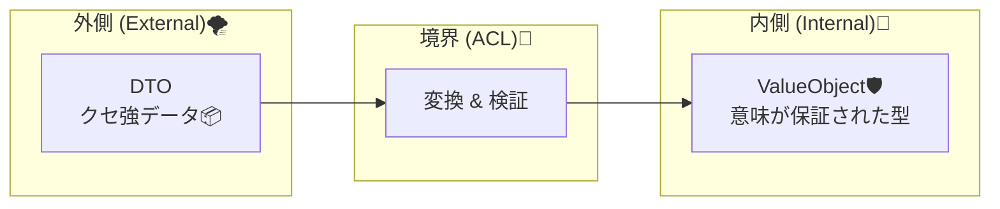
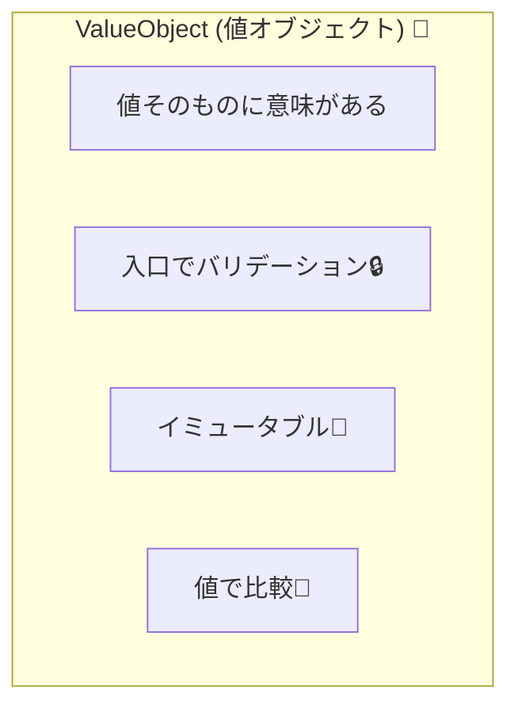

# 第05章：ValueObject入門（住所・金額・期間を“型”で守る）🧱💰

## 5-1. ValueObject（値オブジェクト）ってなに？🧠✨

ValueObject（VO）は、ざっくり言うと **「値そのものに意味がある小さな型」** です😊
たとえば👇

* `1000円`（金額）💴
* `komi@example.com`（メール）📩
* `2026/01/01〜2026/01/31`（期間）📅
* `東京都○○区…`（住所）🏠

こういうのって、ただの `string` や `int` のままだと、**変な値が簡単に入り込む**んだよね…😵‍💫
そこで VO にすると **「変な値を入口で止める」** ことができるようになるよ🔒✨

---

## 5-2. ACL（腐敗防止層）とVOは相性バツグン🧱🌊✨


21: 


外部APIやレガシー連携って、だいたいこんな “クセ” がある😇

* 金額が `cents`（セント）で来る（円じゃない）💸
* `null` や空文字が平気で来る🫠
* メールが `aaaa` とか来る（それメールじゃない！）📩❓
* 日付が `"2026-01-28T12:34:56Z"` みたいな文字列で来る🕒

ACLの仕事は **外のクセを内側に持ち込まないこと**。
その時、内側の「受け皿」として VO があるとめちゃ強いよ💪✨

* 外：DTO（ただの箱）📦
* 境界：ACLで変換＆検証🧱
* 内：VO（ちゃんと意味が保証された型）🛡️

---

## 5-3. VOの“お約束” 3つだけ覚えよ🧁✨


41: 


### お約束①：同一性じゃなく「値」で等価になる🟰

VOは「IDが同じか」じゃなくて、「値が同じか」で同じ扱いにするよ😊
`1000円` はどこから来ても `1000円`。

### お約束②：基本はイミュータブル（作ったら変えない）🧊

後から書き換えできると、いつの間にか壊れるので…
**作る瞬間にチェックして、作れたら安心**が理想✨

record は “値で比較” が得意で、VOに向いてるよ（record class / record struct）📘 ([Microsoft Learn][1])

### お約束③：バリデーションは「入口」でやる🔒

VOを作るときにチェックする！
そうすると **内側は「VOなら信用できる」** が成立するよ😌✨

---

## 5-4. ハンズオン①：`Money` を VO にする💰🧱

### まずは「ただのdecimal」だと何がつらい？😵

* マイナス金額が入る（返品？割引？意図不明）🫠
* 通貨が分からない（円？ドル？）💱
* 「税込？税抜？」が混ざる（地獄）🔥

ここでは最小でいくよ👇

* **0円以上**
* **通貨はJPY固定**（まずは簡単に）💴

### `Money.cs`（Domain/ValueObjects あたりに置く想定📁）

```csharp
namespace MiniECommerce.Domain.ValueObjects;

public sealed record Money
{
    public decimal Amount { get; }  // 円
    private Money(decimal amount) => Amount = amount;

    public static Money Create(decimal amount)
    {
        if (amount < 0)
            throw new ArgumentOutOfRangeException(nameof(amount), "金額は0以上にしてね💦");

        // 例：円は小数いらない方針にしたいなら丸める/弾く、などもここで決められるよ😊
        return new Money(amount);
    }

    public override string ToString() => $"{Amount:N0}円";
}
```

### 使ってみる👀✨

```csharp
var price = Money.Create(1200m);
Console.WriteLine(price); // 1,200円

// var bad = Money.Create(-1m); // ここで止まる（内側に入らない）🧱
```

### “値で等価” を体感しよう🟰

```csharp
var a = Money.Create(1000m);
var b = Money.Create(1000m);

Console.WriteLine(a == b); // True ✅（recordだから値で比較しやすい）
```

---

## 5-5. ハンズオン②：`Email` を VO にする📩🧱

外部から来るメールって、ほんとに自由😇
だから「Emailとして成立してるか」を入口で守ろう🔒✨

ここでは **シンプル判定**でOK（教材なので）😊

* 空文字NG
* `@` を含む
* 前後の空白は許さない（Trimしてからチェック）✂️

### `Email.cs`

```csharp
namespace MiniECommerce.Domain.ValueObjects;

public sealed record Email
{
    public string Value { get; }

    private Email(string value) => Value = value;

    public static Email Create(string? value)
    {
        var v = value?.Trim();

        if (string.IsNullOrEmpty(v))
            throw new ArgumentException("Emailが空だよ💦", nameof(value));

        if (!v.Contains('@'))
            throw new ArgumentException("Emailに @ がないよ💦", nameof(value));

        return new Email(v);
    }

    public override string ToString() => Value;
}
```

### 使ってみる📩✨

```csharp
var email = Email.Create(" komi@example.com ");
Console.WriteLine(email.Value); // komi@example.com

// var bad = Email.Create("aaaa"); // 入口で止まる🧱
```

---

## 5-6. ハンズオン③：`DateRange`（期間）を VO にする📅🧱

期間は「開始〜終了」だけど、外部の値が変だと壊れがち😵‍💫

* 開始が終了より後（逆転）🙃
* そもそも日付が未指定（null）🫠

### `DateRange.cs`

```csharp
namespace MiniECommerce.Domain.ValueObjects;

public sealed record DateRange
{
    public DateOnly Start { get; }
    public DateOnly End { get; }

    private DateRange(DateOnly start, DateOnly end)
    {
        Start = start;
        End = end;
    }

    public static DateRange Create(DateOnly start, DateOnly end)
    {
        if (end < start)
            throw new ArgumentException("期間が逆転してるよ💦（EndはStart以上にしてね）");

        return new DateRange(start, end);
    }

    public int Days => End.DayNumber - Start.DayNumber + 1; // ざっくり日数
}
```

---

## 5-7. よくあるミス集（ここで潰すと成長が早い）🚀🧯

### ミス①：VOなのに set できるようにしちゃう😇

`public set;` があると、後から壊せちゃう…
VOは **作るときに決めて、作ったら固定** が基本だよ🧊✨

### ミス②：VOを作らずに `string` がドメイン中に広がる🫠

最初は楽だけど、あとで「どれがEmail？どれが住所？」って崩壊しやすい💥
**“意味がある値” は VO にする** のがコツ😊

### ミス③：検証があちこちに散らばる🌀

UIでもチェック、APIでもチェック、ドメインでもチェック…で二重三重😵‍💫
まずは **VOのCreateに寄せる** のがスッキリするよ🔒✨

---

## 5-8. ミニ課題（手を動かすと一気に身につく）📝💪✨

### 課題A：VOにしたい項目を3つ考えよう🧠💡

例👇

* `PhoneNumber` 📞
* `PostalCode` 🏣
* `ProductName` 🏷️

「どんな値を弾きたいか」も一言書けたら満点💯✨

### 課題B：`Money` にルールを1つ足してみよう➕💰

例👇

* 1円未満はダメ（小数禁止）🚫
* 上限を決める（例：1,000万円まで）🏦
* 税込み/税抜きフラグを持つ（将来版）🧾

---

## 5-9. AI活用（雛形はAI、ルールは自分）🤖✍️✨

### そのまま使えるお願いテンプレ（コピペOK）📋✨

* **VOの雛形を作ってもらう**

  * 「C#のrecordで `PostalCode` のValueObjectを作って。Createで空・桁数・数字以外を弾いて。例外メッセージも付けて😊」

* **“弾くべき悪い入力” を出してもらう（超便利）😈**

  * 「`Email` の入力で想定される悪いパターンを20個、理由つきで列挙して」

* **テスト観点を増やしてもらう✅**

  * 「`DateRange` の境界値（同日/逆転/極端な未来日など）のテストケース案を出して」

C# 14 は .NET 10 SDK で使えるよ（最新の言語機能まとめはここ）📘 ([Microsoft Learn][2])
.NET 10 は 2025-11-11 にリリースされて、LTSでサポートが続くよ🧱✨ ([Microsoft Learn][3])

---

## 5-10. まとめ（この章で持ち帰ること）🎁✨

* VOは **「意味のある値を、型で守る」** 🧱
* VOを作る瞬間にチェックして **内側を安全地帯にする** 🔒
* record は **値で等価** を作りやすく、VOに向いてる😊 ([Microsoft Learn][1])
* ACLで外部DTOを受けたら、内側に入れる前に **VOに変換** できると最強🛡️✨

[1]: https://learn.microsoft.com/en-us/dotnet/csharp/language-reference/builtin-types/record?utm_source=chatgpt.com "Records - C# reference"
[2]: https://learn.microsoft.com/en-us/dotnet/csharp/whats-new/csharp-14?utm_source=chatgpt.com "What's new in C# 14"
[3]: https://learn.microsoft.com/ja-jp/lifecycle/products/microsoft-net-and-net-core?utm_source=chatgpt.com "Microsoft .NET および .NET Core - Microsoft Lifecycle"
