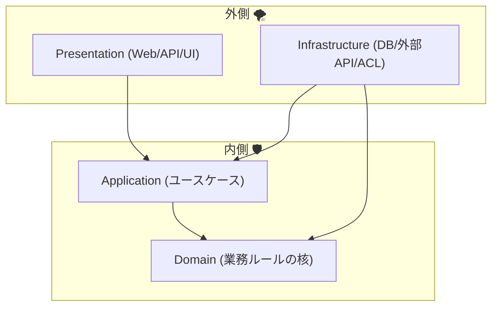
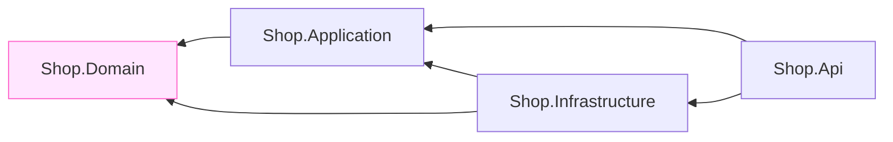
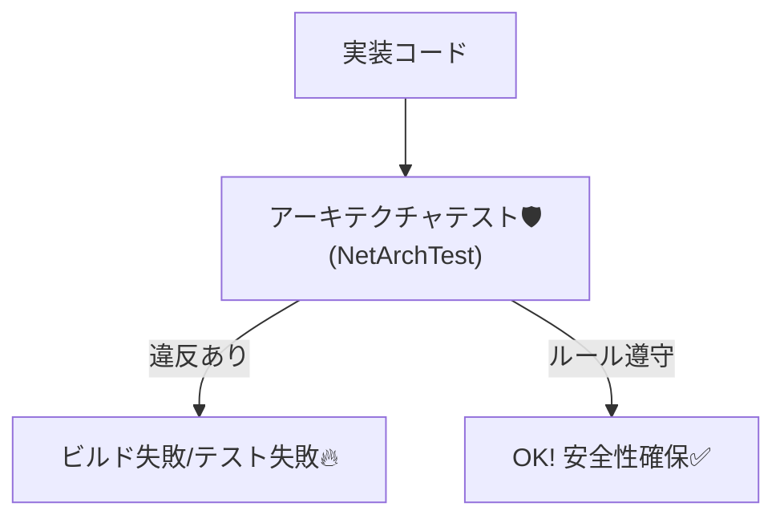

# 第07章：境界の引き方（内側/外側）と依存関係ルール⬅️🧭


## 7.1 今日のゴール🎯✨

この章を終えたら、次の3つができるようになります😊💪

* 「内側（守りたい核）」と「外側（変わりやすい世界）」をスパッと分けられる🧠✂️
* **依存の向き**を間違えない（＝内側が外側を知らない）ルールを言える🧱➡️
* ルールを“気合い”じゃなくて **仕組みで守る**（プロジェクト参照＋テスト）までできる🔒✅

---

### 7.2 まず「境界」ってなに？🧃🧱

境界（Boundary）は、ざっくり言うと…

> **「ここから内側は“自分たちの言葉・ルール”で生きる！」って線引き**💃🧠
> **「外側の都合（仕様変更・フォーマット・障害）を内側に持ち込まない！」って防波堤**🌊🧱

たとえばミニECならこんな感じ👇

* 内側（守りたい）🛡️

  * 注文のルール（例：合計金額はマイナス禁止）
  * 支払い状態の扱い（例：Paid / Pending / Failed…）
  * 金額 `Money` やメール `Email` みたいな「意味のある型」
* 外側（変わりやすい）🌪️

  * 決済API（突然レスポンスの形が変わる😇）
  * レガシー会員API（項目名が古い・欠損が多い😇）
  * DB/EF Core、HTTP、JSON、クラウド設定など

---

### 7.3 依存関係ルール（Dependency Rule）ってこれ！⬅️🧭✨


この教材での一番大事な合言葉はこれです👇

> **依存（参照）は “内向き” にそろえる**⬅️🧲
> **内側（ドメイン）は外側（DB/HTTP/外部API）を参照しない**🙅‍♀️🧱

これができると何が嬉しいの？😊✨

* 外部APIが変わっても、内側の設計が壊れにくい🧱✨
* テストが簡単になる（外部なしでも内側を検証できる）🧪✅
* “外側の事情”に引きずられてドメインの言葉が腐りにくい🧼

※この「内側が外側を知らない」考え方は、Clean Architectureの要点としてもよく語られます。([Microsoft Learn][1])

---

### 7.4 “内側/外側” の4レイヤー地図🗺️✨（超よくある形）

迷ったら、いったんこの分け方に寄せると楽です😊🍀



#### それぞれの役目（超ざっくり）🍙

* **Domain（内側の中心）**🛡️

  * ルール、Entity、ValueObject、不変条件
  * 「注文とは何か」「金額とは何か」みたいな意味の世界
* **Application（内側の実行係）**🎮

  * ユースケース（例：注文確定、支払い開始）
  * Domainを使って“手順”を組み立てる
* **Infrastructure（外側の実装）**🔌

  * DB/HTTP/外部API/レガシー統合
  * **ACL（腐敗防止層）はだいたいここに置かれる**ことが多いよ🧼🧱
* **Presentation（入り口）**🚪

  * Web API、UI、Controller
  * リクエストを受けて Application を呼ぶ

Microsoftのガイドでも「永続化などの関心事をドメインの外に置く」考え方が説明されています。([Microsoft Learn][2])

---

### 7.5 ハンズオン：プロジェクト境界を“参照”で固定しよう🧩🔒

ここが超重要ポイント！
**フォルダ分けだけだと破られやすい**ので、**プロジェクト参照（Project Reference）**でガチガチにします💪😺

#### ① プロジェクト構成（例）📁✨

* `Shop.Domain`
* `Shop.Application`
* `Shop.Infrastructure`
* `Shop.Api`（Web API）
* `Shop.ArchTests`（アーキテクチャテスト用）

#### ② 参照ルール（これを正解にする）✅

* `Shop.Domain` → （参照なし）🧘‍♀️✨
* `Shop.Application` → `Shop.Domain` ✅
* `Shop.Infrastructure` → `Shop.Application`（＋必要なら `Shop.Domain`）✅
* `Shop.Api` → `Shop.Application`（＋ `Shop.Infrastructure` をDI登録のために使うのはOK）✅



💡ポイント：**Domain が Infrastructure を参照しない**ようにするのが最優先！🧱⬅️

#### ③ “これをやると腐敗しやすい”NG例🙅‍♀️💥

* Domain に `HttpClient` を置く🌐（外部I/Oが混ざる）
* Domain が `Infrastructure` のクラスを new する🔌（依存が逆流）
* Application が EF Core の `DbContext` にべったり🧟‍♀️（外側技術が内側に侵入）

---

### 7.6 “禁止依存リスト”を作ろう📝🚫

ここはチームで揉めやすいので、先に決めると強いです😊✨
例として、こんな「禁止」を置くと迷子が減ります👇

#### Domain（絶対に入れない）🛡️🚫

* 外部APIクライアント（HTTP通信）🌐🚫
* DBアクセス（EF Coreなど）🗄️🚫
* JSONシリアライズ（外部フォーマット依存）📦🚫
* Infrastructure の名前空間参照🔌🚫

#### Application（なるべく入れない）🧠🚫

* 外部APIのDTO（外の形を持ち込まない）📦🚫
* DBの具体実装（Repositoryの実装は外側へ）🗄️🚫

#### Infrastructure（外側なのでOK）🔌✅

* HTTP/DB/ファイル/外部SDK など、現実の処理ぜんぶOK✨
* その代わり、**内側の言葉に翻訳して渡す**（＝ACLの仕事）🧼🧱✨

---

### 7.7 仕組みで守る①：コンパイルで“逆流”を止める🧱🚧

プロジェクト参照が正しいと、**間違った参照はビルドが通らない**ので最強です💪😆

たとえば Domain から Infrastructure の型を使おうとすると…

* そもそも参照できない → コンパイルエラーで止まる🔥

これが「境界を守る基本装備」です🧱✨

---

### 7.8 仕組みで守る②：アーキテクチャテストで監視する👀✅




「参照は守ってるのに、うっかり `System.Net.Http` をDomainで使っちゃった」みたいな事故、起きます😇💥
そこで **アーキテクチャテスト**を入れると、“境界違反”をテストで検知できます🧪🚨

ここで便利なのが **NetArchTest**（依存・命名・レイヤー違反などをテストできるライブラリ）です📦✨([GitHub][3])

#### ① `Shop.ArchTests` を作って NuGet を追加📦

* `NetArchTest.Rules`
* テストフレームワーク（xUnitなど）

#### ② Domainが外側に依存してないかチェックする例✅

```csharp
using NetArchTest.Rules;
using Xunit;

namespace Shop.ArchTests;

public sealed class DomainDependencyTests
{
    [Fact]
    public void Domain_Should_Not_Depend_On_Infrastructure()
    {
        // AssemblyMarker は Shop.Domain 側に置いた空クラス（後述）
        var domainAssembly = typeof(Shop.Domain.AssemblyMarker).Assembly;

        var result = Types.InAssembly(domainAssembly)
            .ShouldNot()
            .HaveDependencyOn("Shop.Infrastructure")
            .GetResult();

        Assert.True(
            result.IsSuccessful,
            "境界違反！\n" + string.Join("\n", result.FailingTypeNames)
        );
    }

    [Fact]
    public void Domain_Should_Not_Do_Http()
    {
        var domainAssembly = typeof(Shop.Domain.AssemblyMarker).Assembly;

        var result = Types.InAssembly(domainAssembly)
            .ShouldNot()
            .HaveDependencyOn("System.Net.Http")
            .GetResult();

        Assert.True(
            result.IsSuccessful,
            "DomainでHTTP依存してるよ！\n" + string.Join("\n", result.FailingTypeNames)
        );
    }
}
```

NetArchTest を使ったアーキテクチャテストの考え方・例は実例記事でもよく紹介されています。([Code Maze][4])

#### ③ Domain側に “AssemblyMarker” を置く🧷

```csharp
namespace Shop.Domain;

// 何も入れない“目印”クラス（テストがDomainのAssemblyを拾うため）
public sealed class AssemblyMarker { }
```

---

### 7.9 “どこに置くか迷うもの”あるある判定🔎😺

迷ったらこの質問を自分にしてみてね👇

#### Q1：それは「業務の意味」？それとも「技術の都合」？🧠🔧

* 業務の意味 → Domain / Application 寄り🛡️
* 技術の都合（HTTP、DB、JSON、SDK） → Infrastructure 寄り🔌

#### Q2：それ、外部が変わったら一緒に変わる？🌪️

* 変わる → 外側（Infrastructure/ACLで隔離）🧼🧱
* 変わらない（ルール）→ 内側（Domain）🛡️✨

---

### 7.10 ミニ課題（手を動かすやつ）📝💪✨

#### 課題A：境界図を1枚作る🧭🖊️

* Domain / Application / Infrastructure / Presentation を箱で描く
* 矢印（参照）を **内向き**にする⬅️✨

#### 課題B：「禁止依存リスト」を10個書く🚫📝

例：

* Domain は `System.Net.Http` を使わない
* Domain は `Shop.Infrastructure` を参照しない
* Application は外部DTOを参照しない
  …みたいにルールを文章にする✍️

#### 課題C：アーキテクチャテストを1本通す🧪✅

* “DomainがInfrastructureに依存しない” テストを成功させる🎉
* わざと違反コードを書いて、テストが落ちるのも体験してみる😈💥

---

### 7.11 AI活用（Copilot / Codex で時短）🤖⚡

AIは「設計判断の代わり」じゃなくて、**文章化・下書き・洗い出し**が得意です😊✨

#### ① 依存ルールを“チーム向け文章”にする✍️🤖

プロンプト例：

* 「次のプロジェクト構成で、依存関係ルールを短い箇条書きにして。Domainを最も厳しくして。違反例も3つ入れて。」

#### ② 禁止依存の洗い出し🔎🤖

プロンプト例：

* 「Domain層に入れると腐敗しやすい依存（HTTP/DB/JSONなど）を10個列挙して、理由を1行ずつ。」

#### ③ NetArchTest のテスト雛形を作る🧪🤖

プロンプト例：

* 「NetArchTest.Rules で、Domainが System.Net.Http と Infrastructure に依存しないことを検証する xUnit テストを書いて。失敗型名も出して。」

---

### 7.12 まとめ（この章で覚えた一言）🧠✨

* **境界＝内側を守る線引き**🧱
* **依存は内向き**⬅️🧲
* **ルールは“仕組み”で守る（参照＋アーキテクチャテスト）**🔒✅

ちなみに今どきのC#/.NETの最新ラインでは、.NET 10 がLTSとして提供され、C# 14 は .NET 10 上でサポートされています（Visual Studio 2026 も含めて案内されています）。([Microsoft for Developers][5])

[1]: https://learn.microsoft.com/en-us/dotnet/architecture/modern-web-apps-azure/common-web-application-architectures?utm_source=chatgpt.com "Common web application architectures - .NET"
[2]: https://learn.microsoft.com/en-us/dotnet/architecture/microservices/microservice-ddd-cqrs-patterns/infrastructure-persistence-layer-design?utm_source=chatgpt.com "Designing the infrastructure persistence layer - .NET"
[3]: https://github.com/BenMorris/NetArchTest?utm_source=chatgpt.com "BenMorris/NetArchTest: A fluent API for .Net that can ..."
[4]: https://code-maze.com/csharp-architecture-tests-with-netarchtest-rules/?utm_source=chatgpt.com "Architecture Tests in .NET with NetArchTest.Rules"
[5]: https://devblogs.microsoft.com/dotnet/announcing-dotnet-10/?utm_source=chatgpt.com "Announcing .NET 10"
