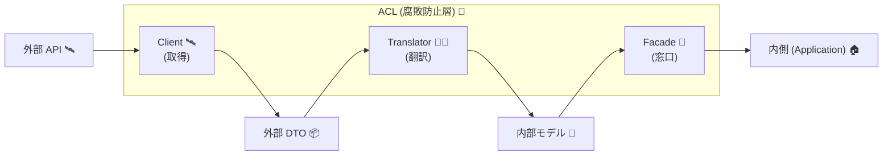
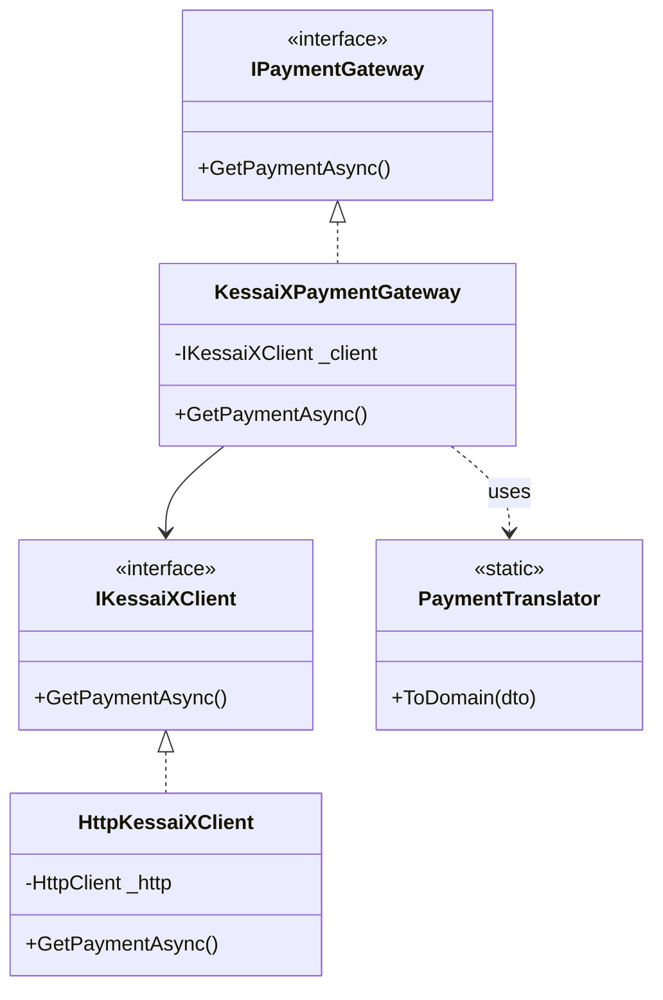

# 第08章：ACLの基本形（Client / Translator / Facade）を覚える🧰🧱


## 0. 今日のゴール🎯✨

この章のゴールはシンプル！
**ACLを“いつも同じ型”で組めるようになること**だよ〜😆🧱

* ✅ 外部サービスをつなぐとき、毎回「同じ部品」で作れる
* ✅ 外部のクセ（変な命名・変な型・変な値）が**内側に漏れない**
* ✅ 「どこに何を書く？」で迷いにくくなる🧠💡

ちなみに今の現行LTSは **.NET 10（C# 14）** で、統合まわり（HTTP/DI/ツール）もこの前提で考えるのがいちばん素直だよ🧡 ([Microsoft for Developers][1])

---

### 1. ACLの3点セットってなに？🧩✨（まず絵で！）


ACLの基本形はこれだけ覚えて〜！👇😍

* 🛰️ **Client**：外部APIと会話する係（HTTP・認証・URL・リトライ…）
* 🧑‍🏫 **Translator**：外→内の翻訳係（DTO→ドメイン型、単位変換、命名変換）
* 🧱 **Facade**：内側に見せる窓口（内側が欲しい形で提供、Client+Translatorをまとめる）

流れはこう！🚰✨

**外部** →（Clientで取得📡）→ 外部DTO →（Translatorで変換🧑‍🏫）→ 内部モデル →（Facadeで提供🧱）→ **内側（アプリ/ドメイン）**



---

### 2. それぞれの責務（やること／やらないこと）📝🧠


#### 🛰️ Client（外の世界担当）

**やること✅**

* HTTPで叩く（URL組み立て、ヘッダー、認証、タイムアウト…）
* 外部のレスポンスを **外部DTO** にする
* 通信失敗（タイムアウト等）の「外側っぽい例外」を受け取る

**やらないこと❌**

* 変換ロジック（単位変換・意味変換）を混ぜない
* ドメイン型を返さない（返すのは外部DTOまで）

> HttpClientは、今どきは **IHttpClientFactory** を使うのが定番（設定の集中管理、ハンドラー構成など）だよ〜📌
> この章では“形”を作るのが目的だから、まずは骨組みだけ作って、HTTP本番は後の章でガッツリやる感じでOK🙆‍♀️✨ ([Microsoft Learn][2])

#### 🧑‍🏫 Translator（翻訳担当）

**やること✅**

* 外部DTO → 内部モデル（or ドメイン型）の変換
* 変換のルール（命名、単位、enum、日付など）を集める

**やらないこと❌**

* HTTPしない
* DB触らない
* DIとか設定とか、外部環境の事情を持ち込まない

> Translatorは**純粋関数っぽく**しておくと最強💪✨
> 入力→出力が固定で、テストもしやすいよ〜✅

#### 🧱 Facade（内側の窓口担当）

**やること✅**

* 内側（アプリ層など）が欲しい形でメソッドを用意
* Client呼ぶ → Translator呼ぶ → 結果を返す
* “外側っぽい情報”を**内側用に隠す**（エラー翻訳は後の章で強化！）

**やらないこと❌**

* DTOや外部エンドポイント詳細を内側に見せない
* Translatorの詳細ルールを散らかさない（Facadeに詰めない）

---

### 3. 例題：クセあり決済API「KessaiX」をACLで包む💳🧱✨


外部からこんなレスポンスが来るとするね👇（例）

* `pay_id`（命名が外側っぽい）
* `amount_cents`（単位がcents）
* `status` が `"S" "F" "P"`（謎の1文字）
* `paid_at_utc` が文字列（UTC）

内側はこうしたい👇😍

* `PaymentId`（型で守る）
* `Money`（金額＋通貨）
* `PaymentStatus`（enumで意味をハッキリ）
* `DateTimeOffset?`（時刻の型で守る）

---

## 4. ハンズオン：3点セットの空実装を作る🛠️💖（まず“型”を固定！）

ここでは **「動く最小」** を作って、形を身体に入れちゃうよ〜！😆✨
（HTTP本番はあとで強化するので、今回は `FakeClient` でOK👌）

---

### 4-1. 置き場所（おすすめ）📁✨


例：`Infrastructure` の中に外部サービスごとのフォルダを作る感じ💡

* `Infrastructure/Payments/KessaiX/`

  * `PaymentApiResponseDto.cs`（外部DTO）
  * `IKessaiXClient.cs`（Clientの抽象）
  * `FakeKessaiXClient.cs`（まずは偽物）
  * `HttpKessaiXClient.cs`（HTTP版の骨組み）
  * `PaymentTranslator.cs`（Translator）
  * `KessaiXPaymentGateway.cs`（Facade）



---

### 4-2. 外部DTO（外の形をそのまま受ける）📦🌍


```csharp
using System.Text.Json.Serialization;

namespace MyShop.Infrastructure.Payments.KessaiX;

// 外部APIレスポンスを “そのまま” 受けるDTO
public sealed record PaymentApiResponseDto(
    [property: JsonPropertyName("pay_id")] string PayId,
    [property: JsonPropertyName("amount_cents")] long AmountCents,
    [property: JsonPropertyName("currency")] string Currency,
    [property: JsonPropertyName("status")] string Status,
    [property: JsonPropertyName("paid_at_utc")] string? PaidAtUtc
);
```

ポイント💡😍

* 外の命名（snake_case）を**ここで止める**のが超大事🧱
* `JsonPropertyName` で外の形を吸収できるよ✨

---

### 4-3. 内側のモデル（最低限の例）🧱💎

（すでに `Money` などがあるなら、それを使ってOKだよ🙆‍♀️）

```csharp
namespace MyShop.Domain.Payments;

public readonly record struct PaymentId(string Value);

public readonly record struct Money(decimal Amount, string Currency)
{
    // cents(=2桁) を通貨の小数に戻す例
    public static Money FromMinorUnits(long minor, string currency, int minorUnit = 2)
    {
        decimal factor = 1m;
        for (var i = 0; i < minorUnit; i++) factor *= 10m;

        return new Money(minor / factor, currency);
    }
}

public enum PaymentStatus
{
    Succeeded,
    Failed,
    Pending,
    Unknown
}

public sealed record PaymentReceipt(
    PaymentId PaymentId,
    Money Money,
    PaymentStatus Status,
    DateTimeOffset? PaidAtUtc
);
```

---

### 4-4. Translator（翻訳だけ！I/O禁止！）🧑‍🏫🧡


```csharp
using System.Globalization;
using MyShop.Domain.Payments;

namespace MyShop.Infrastructure.Payments.KessaiX;

public static class PaymentTranslator
{
    public static PaymentReceipt ToDomain(PaymentApiResponseDto dto)
    {
        var status = dto.Status switch
        {
            "S" => PaymentStatus.Succeeded,
            "F" => PaymentStatus.Failed,
            "P" => PaymentStatus.Pending,
            _   => PaymentStatus.Unknown,
        };

        DateTimeOffset? paidAt = null;
        if (!string.IsNullOrWhiteSpace(dto.PaidAtUtc) &&
            DateTimeOffset.TryParse(dto.PaidAtUtc, CultureInfo.InvariantCulture,
                DateTimeStyles.AssumeUniversal | DateTimeStyles.AdjustToUniversal, out var parsed))
        {
            paidAt = parsed;
        }

        // 例：amount_cents を Money に戻す（cents前提）
        var money = Money.FromMinorUnits(dto.AmountCents, dto.Currency, minorUnit: 2);

        return new PaymentReceipt(
            new PaymentId(dto.PayId),
            money,
            status,
            paidAt
        );
    }
}
```

Translatorのいいところ😍✨

* “外部の謎値”をここで **意味のある型** に変換できる
* テストしやすい（章20で強化するよ✅）

---

### 4-5. Client（まずは抽象＋FakeでOK）🛰️🎭


```csharp
namespace MyShop.Infrastructure.Payments.KessaiX;

public interface IKessaiXClient
{
    Task<PaymentApiResponseDto> GetPaymentAsync(string payId, CancellationToken ct = default);
}
```

Fake版（まずこれで動かすよ〜😆）

```csharp
namespace MyShop.Infrastructure.Payments.KessaiX;

public sealed class FakeKessaiXClient : IKessaiXClient
{
    public Task<PaymentApiResponseDto> GetPaymentAsync(string payId, CancellationToken ct = default)
    {
        var dto = new PaymentApiResponseDto(
            PayId: payId,
            AmountCents: 1299,
            Currency: "JPY",
            Status: "S",
            PaidAtUtc: DateTimeOffset.UtcNow.ToString("O")
        );

        return Task.FromResult(dto);
    }
}
```

HTTP版の骨組み（今は“置くだけ”でOK🙆‍♀️✨）

```csharp
using System.Text.Json;

namespace MyShop.Infrastructure.Payments.KessaiX;

public sealed class HttpKessaiXClient : IKessaiXClient
{
    private readonly HttpClient _http;

    public HttpKessaiXClient(HttpClient http)
    {
        _http = http;
    }

    public async Task<PaymentApiResponseDto> GetPaymentAsync(string payId, CancellationToken ct = default)
    {
        var response = await _http.GetAsync($"/payments/{Uri.EscapeDataString(payId)}", ct);
        response.EnsureSuccessStatusCode();

        await using var stream = await response.Content.ReadAsStreamAsync(ct);
        var dto = await JsonSerializer.DeserializeAsync<PaymentApiResponseDto>(stream, cancellationToken: ct);

        return dto ?? throw new InvalidOperationException("Payment API returned empty body.");
    }
}
```

> 本番のHTTP運用では **IHttpClientFactory** を使って、Clientの設定（BaseAddress/ヘッダー/ハンドラー）をまとめるのが今の定番だよ📌✨ ([Microsoft Learn][2])

---

### 4-6. Facade（内側に見せる窓口）🧱🚪✨


内側が見る“窓口インターフェース”を用意（例：Application層）

```csharp
using MyShop.Domain.Payments;

namespace MyShop.Application.Payments;

public interface IPaymentGateway
{
    Task<PaymentReceipt> GetPaymentAsync(PaymentId paymentId, CancellationToken ct = default);
}
```

Facade実装（Client + Translator をまとめる！）

```csharp
using MyShop.Application.Payments;
using MyShop.Domain.Payments;

namespace MyShop.Infrastructure.Payments.KessaiX;

public sealed class KessaiXPaymentGateway : IPaymentGateway
{
    private readonly IKessaiXClient _client;

    public KessaiXPaymentGateway(IKessaiXClient client)
    {
        _client = client;
    }

    public async Task<PaymentReceipt> GetPaymentAsync(PaymentId paymentId, CancellationToken ct = default)
    {
        var dto = await _client.GetPaymentAsync(paymentId.Value, ct);
        return PaymentTranslator.ToDomain(dto);
    }
}
```

ここが超大事ポイント😍🧡

* **内側は `IPaymentGateway` だけ知ってればOK**
* 外部のDTOも、外部のstatus文字も、外部の命名も、内側に漏れない🧼✨

---

### 4-7. 動作確認（最小）✅🎉

コンソール等でサクッと呼ぶ例（FakeClientでOK）

```csharp
using MyShop.Application.Payments;
using MyShop.Domain.Payments;
using MyShop.Infrastructure.Payments.KessaiX;

IKessaiXClient client = new FakeKessaiXClient();
IPaymentGateway gateway = new KessaiXPaymentGateway(client);

var receipt = await gateway.GetPaymentAsync(new PaymentId("p_123"));

Console.WriteLine($"PaymentId: {receipt.PaymentId.Value}");
Console.WriteLine($"Money: {receipt.Money.Amount} {receipt.Money.Currency}");
Console.WriteLine($"Status: {receipt.Status}");
Console.WriteLine($"PaidAt(UTC): {receipt.PaidAtUtc:O}");
```

---

## 5. よくある事故😇💥（これだけは避けて〜！）


### 事故①：Facadeが巨大化する🧱🐘

Facadeに「変換」「ルール」「例外処理」「ログ」「リトライ」全部詰めると、すぐ地獄〜😂
➡️ **変換はTranslatorへ**、I/OはClientへ、まとめるだけがFacade✨

### 事故②：外部DTOが内側に侵入する📦🦠

「DTO便利じゃん！」って内側で使い始めると、腐敗が始まるよ😵‍💫
➡️ DTOは**外側に隔離**、内側は自分の型で生きる🧼

### 事故③：TranslatorがHTTPを呼び出す🌪️

Translatorが外部を叩き始めると、テスト不可能＆責務ぐちゃぐちゃ😇
➡️ Translatorは**翻訳だけ**！I/O禁止🙅‍♀️

---

## 6. ミニ課題📝✨（手を動かすと覚えるよ〜！）

### ✅ 課題A：責務を1行で言ってみよ💬

* Client：＿＿＿＿＿＿＿＿
* Translator：＿＿＿＿＿＿＿＿
* Facade：＿＿＿＿＿＿＿＿

### ✅ 課題B：命名を3つ考えてみよ🪄

（例：`KessaiXPaymentGateway` / `PaymentTranslator` / `HttpKessaiXClient` みたいに）

* Client名：＿＿＿＿＿＿＿＿
* Translator名：＿＿＿＿＿＿＿＿
* Facade名：＿＿＿＿＿＿＿＿

### ✅ 課題C：statusの未知値ポリシーを決める🧯

* `"X"` が来たらどうする？

  * `Unknown` にする？
  * 例外にする？
  * “保留”にする？
    ➡️ 文章で1〜2行で書いてみてね📝✨（未知値の扱いは後の章で超強化するよ💪）

---

## 7. AI活用（Copilot/Codex向け）🤖💖：そのまま使える指示文テンプレ

### 🪄 DTO生成を手伝わせる（時短！）

* 「このJSON例からC#のDTO recordを作って。JsonPropertyNameも付けて」

### 🪄 Translatorの下書き（でもルールは自分で決める！）

* 「PaymentApiResponseDto を PaymentReceipt に変換するメソッドを書いて。statusは S/F/P を enum に変換して、未知値は Unknown にして」

### 🪄 命名案を大量に出す（迷いが消える✨）

* 「ACLの3点セット（Client/Translator/Facade）のクラス名を、決済KessaiX向けに10案ずつ出して」

---

### この章のまとめ🎁✨

* ACLはまず **Client / Translator / Facade** の“型”を固定する🧱
* 外のクセは **外側で止める**（内側に持ち込まない🧼）
* Translatorは**翻訳だけ**にすると、後でテスト・保守がめちゃ楽になるよ〜✅💖

[1]: https://devblogs.microsoft.com/dotnet/announcing-dotnet-10/?utm_source=chatgpt.com "Announcing .NET 10"
[2]: https://learn.microsoft.com/en-us/dotnet/core/extensions/httpclient-factory?utm_source=chatgpt.com "Use the IHttpClientFactory - .NET"
