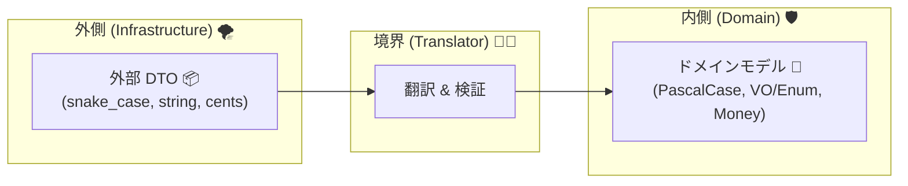
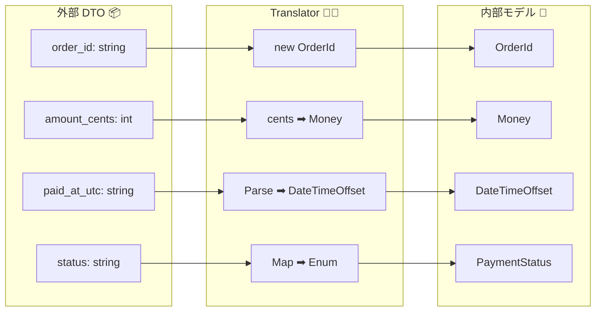

# 第10章：外部DTOと内部モデルを分ける（“DTO直通”禁止🙅‍♀️）📦📦


## この章のゴール🎯✨

* 外部APIの **DTO（受け取り用の箱）** と、内側の **ドメインモデル（意味のある型）** をキレイに分けられるようになる🙆‍♀️
* 「DTOをそのまま内側に流す」と何がヤバいのか、ちゃんと説明できるようになる🗣️💡
* “翻訳（Translator）” を置いて、外部のクセを内側に持ち込まない練習をする🧱🔁

---

## 1) まず「DTO」ってなに？📦🙂

DTOは **Data Transfer Object** の略で、ざっくり言うと **データを運ぶためだけの入れ物** だよ〜📦🚚
たとえば外部APIのJSONを受け取るとき、C#のクラスに変換（Deserialize）して扱いやすくするよね✨
そのときの **“JSONと1対1で対応するクラス”** が外部DTOになりやすいよ🙂
ちなみに .NET 10 だと標準の `System.Text.Json` を使ってJSONをシリアライズ/デシリアライズできるよ📄➡️🧩 ([Microsoft Learn][1])

---

## 2) DTO直通がダメな理由🙅‍♀️💥（ここ超大事！）




「外部DTOを、そのままドメイン（内側）に入れちゃう」…これ、最初はラクなんだけど後で爆発しがち😇💣

### 2-1) 外部の都合が、そのまま内側に侵入する😵‍💫

* `snake_case` で来る
* `null` が混ざる
* 文字列で `status: "paid"` とか来る
* 時刻が `"2025-12-01T10:30:00Z"` みたいな文字列で来る
* 単位が `cents` だったりする💰

これらは **外側の都合**。内側は **自分たちの意味がある型**（MoneyとかPaymentStatusとか）で生きたいのに、外側のクセがドメインに居座って腐り始めるの🥲🧼

### 2-2) 外部仕様変更が「内側の設計」を直撃する⚡

外部APIが **フィールド名変更**・**型変更**・**ネスト変更**・**新フィールド追加** したら、
ドメイン側まで巻き込まれて修正地獄になるよ〜😇🔧🔧🔧

### 2-3) “意味” が曖昧なデータが内側に入る🤷‍♀️

DTOって基本、**意味の保証が弱い**んだよね。
たとえば「金額」が `1299` って数字で来ても、それが **円なの？ドルなの？税抜？税込？** って、内側では大問題💦
だから内側は `Money` みたいに **意味込みの型** にしたいのに、DTO直通だとずっと数字のまま居残る😵‍💫

### 2-4) テストがつらくなる😫🧪

ドメインがDTOに依存すると、ドメインのテストなのに外部フォーマットに引っ張られるの。
結果：テストが読みづらい＋壊れやすい😇

---

## 3) 正しい分け方のルール🧭🧱

ここからは、迷わないための **鉄板ルール** を置いておくね✨

### ルールA：外部DTOは「外側」に閉じ込める🔒📦

* 外部DTOは **Infrastructure側（外側）** に置く
* “外部フォーマットのクセ” を **そのまま** 持っててOK

  * 例：`order_id` とか `amount_cents` とか、見た目がダサくてもいい😇
  * だって **外側の事情** だからね！

### ルールB：内側は「ドメイン型」だけを見る👀✨

* 内側は **VO / Entity / Enum / DateTimeOffset / Money** みたいな
  “意味がある型” を中心にする🧠💕

### ルールC：境界に Translator（翻訳）を置く🧑‍🏫🔁

* 外部DTO → Translator → ドメイン型
  この一本で、腐敗がほぼ止まる🧼🧱✨

---

## 4) 例で体感！「決済APIの受け取り」🌐💳




外部APIがこんなJSONを返すとするね👇

* `order_id`：注文ID（外部の命名）
* `amount_cents`：金額（セント単位）
* `paid_at_utc`：UTC時刻文字列
* `status`：文字列

### 4-1) 🙅‍♀️ダメ例：DTOをドメインに直通させる

* ドメインサービスが `PaymentReceiptDto` を参照してる
* ドメインの中に `JsonPropertyName` とか外部事情が増殖する
* “内側が外側に寄せられて” 腐りやすい😇🧟‍♀️

### 4-2) 🙆‍♀️良い例：外部DTO → 翻訳 → ドメイン

#### 外部DTO（外側に置く）📦

```csharp
using System.Text.Json.Serialization;

public sealed class PaymentReceiptDto
{
    [JsonPropertyName("order_id")]
    public string? OrderId { get; init; }

    [JsonPropertyName("amount_cents")]
    public int? AmountCents { get; init; }

    [JsonPropertyName("currency")]
    public string? Currency { get; init; }

    [JsonPropertyName("paid_at_utc")]
    public string? PaidAtUtc { get; init; }

    [JsonPropertyName("status")]
    public string? Status { get; init; }
}
```

ポイント💡

* DTOは **“外部と同じ形”** を優先してOK📦
* `null` 許容（`?`）にして、あとでTranslatorで責任もって処理するのが安全🧯

#### ドメインモデル（内側）🧱

```csharp
public readonly record struct OrderId(string Value);

public readonly record struct Money(decimal Amount, string Currency);

public enum PaymentStatus
{
    Paid,
    Failed,
    Pending
}

public sealed record PaymentReceipt(
    OrderId OrderId,
    Money Amount,
    PaymentStatus Status,
    DateTimeOffset PaidAtUtc
);
```

ポイント💡

* 内側は **意味がある型** でスッキリ✨
* ここに `JsonPropertyName` みたいな外部注釈は置かない🙅‍♀️

#### Translator（翻訳者）🧑‍🏫🔁

```csharp
using System.Globalization;

public static class PaymentTranslator
{
    public static PaymentReceipt ToDomain(PaymentReceiptDto dto)
    {
        // 1) 必須チェック（まず壊れた状態を作らない）🧯
        if (string.IsNullOrWhiteSpace(dto.OrderId))
            throw new ArgumentException("order_id is required.");

        if (dto.AmountCents is null)
            throw new ArgumentException("amount_cents is required.");

        if (string.IsNullOrWhiteSpace(dto.Currency))
            throw new ArgumentException("currency is required.");

        if (string.IsNullOrWhiteSpace(dto.PaidAtUtc))
            throw new ArgumentException("paid_at_utc is required.");

        if (string.IsNullOrWhiteSpace(dto.Status))
            throw new ArgumentException("status is required.");

        // 2) 形＋意味の変換（この章は“分離”が主役だけど、味見として少し）🍴
        var orderId = new OrderId(dto.OrderId);

        // cents → 通貨の基本単位（ここでは 1299 cents = 12.99）
        var amount = new Money(dto.AmountCents.Value / 100m, dto.Currency);

        var paidAt = DateTimeOffset.Parse(dto.PaidAtUtc, CultureInfo.InvariantCulture);

        var status = dto.Status switch
        {
            "paid" => PaymentStatus.Paid,
            "failed" => PaymentStatus.Failed,
            "pending" => PaymentStatus.Pending,
            _ => throw new ArgumentException($"unknown status: {dto.Status}")
        };

        return new PaymentReceipt(orderId, amount, status, paidAt);
    }
}
```

---

## 5) “DTOフォルダを外側に置いて参照させない”を実現する🧱🚫

いちばん確実なのは、**プロジェクト分割＋参照方向**で物理的に締め出す方法だよ🔒✨

### 5-1) 例：プロジェクト構成（超定番）🧩

* `MyApp.Domain`（内側）
* `MyApp.Application`（ユースケース）
* `MyApp.Infrastructure`（外部I/O：HTTP、DB、外部DTOなど）
* `MyApp.Web`（API/画面）

参照の向きはこう👇（矢印の向きが超大事！）

* Web → Application → Domain
* Web → Infrastructure → Domain
* Application → Domain
* **Domain は誰も参照しない（内側）**
* **Domain は Infrastructure を参照しない（ここが守れると勝ち）** 🏆

---

## 6) 最新の “JSON厳格モード” を境界で使う（外側で気づく）🧯🔎

.NET 10 では `JsonSerializerOptions.Strict` っていう **“ベストプラクティス寄りの厳格プリセット”** が追加されてるよ✨
未知のメンバーを許さない、重複プロパティを許さない、nullable/requiredの扱いを尊重…みたいな設定が入ってるの。 ([Microsoft Learn][2])

Translatorの前段（= 外側）で「契約が変わった！」って早めに気づけるの、めっちゃ強い💪😳
（外部がしれっと仕様変えてきたとき、内側に染み込む前に止められる🧱）

例：StrictでDTOへデシリアライズ📦

```csharp
using System.Text.Json;

public static class PaymentDtoParser
{
    public static PaymentReceiptDto Parse(string json)
    {
        // .NET 10 の Strict プリセット
        var dto = JsonSerializer.Deserialize<PaymentReceiptDto>(
            json,
            JsonSerializerOptions.Strict
        );

        return dto ?? throw new ArgumentException("Invalid JSON.");
    }
}
```

※「外部が新フィールド追加しただけで落ちるの困る〜」って場合は、Strictの使い所を調整する（方針化）といいよ🙂
でも「境界で早期検知したい」場面ではかなり便利🧯✨ ([Microsoft Learn][2])

---

## 7) ハンズオン🛠️✨：DTO直通を禁止して、翻訳を挟もう！

### Step 1：外部DTOを外側へ隔離📦🔒

* `Infrastructure/External/PaymentApi/Dtos/` みたいな場所を作る
* DTOは全部そこへ（外部APIごとにまとめるのがコツ）🗂️✨

### Step 2：ドメイン側に “意味のある型” を用意🧱

* `OrderId`, `Money`, `PaymentStatus`, `PaymentReceipt` を作る
* **DTOのプロパティ名を、ドメインに持ち込まない** 🙅‍♀️

### Step 3：Translatorで変換🧑‍🏫🔁

* 必須チェック
* 単位変換（cents→通貨）
* 文字列→enum
* 文字列→`DateTimeOffset`

### Step 4：ドメインがDTOを参照してないか確認👀✅

* Domainプロジェクト内で `Dto` って単語を検索して、出たら危険信号🚨

---

## 8) ミニ課題📝✨（10分でOK）

### 課題A：DTOに“入れたくないもの”を列挙しよう🙅‍♀️📋

次のうち、**ドメインに直で入れたくない**ものを最低5個書いてみてね👇

* 外部のフィールド名（`order_id` みたいな）
* 外部のenum文字列（`"paid"`）
* 単位が曖昧な数値（`amount_cents`）
* 文字列の日時（`paid_at_utc`）
* 外部エラーの形式（`error_code`, `message` など）
* `null` 前提のデータ
* 外部APIのページング形式やカーソル

### 課題B：対応表（マッピング表）を作ろう🧾🖊️

* `PaymentReceiptDto.AmountCents` → `Money.Amount`
* `PaymentReceiptDto.PaidAtUtc` → `DateTimeOffset`
  みたいに「外→内」を表にするだけで、Translatorが一気に書きやすくなるよ✨

---

## 9) テストのコツ🧪💡（Translatorはめちゃテストしやすい）

Translatorは **純粋関数っぽく**できるから、ユニットテストが超相性いいよ💞

* 正常系：期待どおりに `PaymentReceipt` ができる
* 異常系：必須欠損で例外になる
* 異常系：未知ステータスで例外になる

「外部を叩くテスト」より **圧倒的に軽くて速い** から、ここを厚くするのがコスパ最強💪✨

---

## 10) AI活用🤖💬（時短して、判断は自分！）

### 使いどころ①：DTOのプロパティ生成📦⚡

* 「このJSONからDTOクラス作って」→ 一瞬でできる
* ただし **置き場所は外側**！ここ絶対👮‍♀️✨

### 使いどころ②：マッピング表の叩き台🧾🤖

* 「外部DTO→ドメインの対応表を作って」
* そのあと自分で「意味のズレ」を確認するのが大事👀

### 使いどころ③：Translatorの雛形🧑‍🏫🧩

* switchの列挙、nullチェックの抜け漏れ探しはAIが得意✨
* でも **Unknown時の方針**（落とす？Unknownにする？保留？）は人が決める🧠🔥

---

## まとめチェックリスト✅🎁

* [ ] 外部DTOは外側に隔離できてる？📦🔒
* [ ] ドメインがDTOを参照してない？🙅‍♀️
* [ ] Translatorが “外→内の翻訳” を全部引き受けてる？🧑‍🏫🔁
* [ ] 内側は意味のある型（VO/Enum/DateTimeOffsetなど）で表現できてる？🧱✨
* [ ] 境界で厳格に検知したいなら `JsonSerializerOptions.Strict` を検討した？🧯🔎 ([Microsoft Learn][2])

---

### 参考：2026年時点の前提になってる“最新スタック感”🧩✨

* .NET 10 は 2025-11-11 にリリースされ、Visual Studio 2026 も提供されているよ📦🆕 ([Microsoft for Developers][3])
* C# 14 は .NET 10 でサポートされる最新リリースだよ🧠✨ ([Microsoft Learn][4])

[1]: https://learn.microsoft.com/en-us/dotnet/api/system.text.json?view=net-10.0&utm_source=chatgpt.com "System.Text.Json Namespace"
[2]: https://learn.microsoft.com/en-us/dotnet/core/whats-new/dotnet-10/libraries "What's new in .NET libraries for .NET 10 | Microsoft Learn"
[3]: https://devblogs.microsoft.com/dotnet/announcing-dotnet-10/ "Announcing .NET 10 - .NET Blog"
[4]: https://learn.microsoft.com/en-us/dotnet/csharp/whats-new/csharp-14 "What's new in C# 14 | Microsoft Learn"
