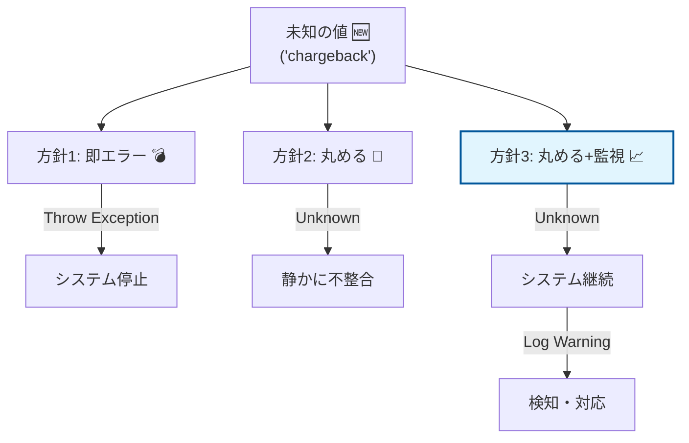
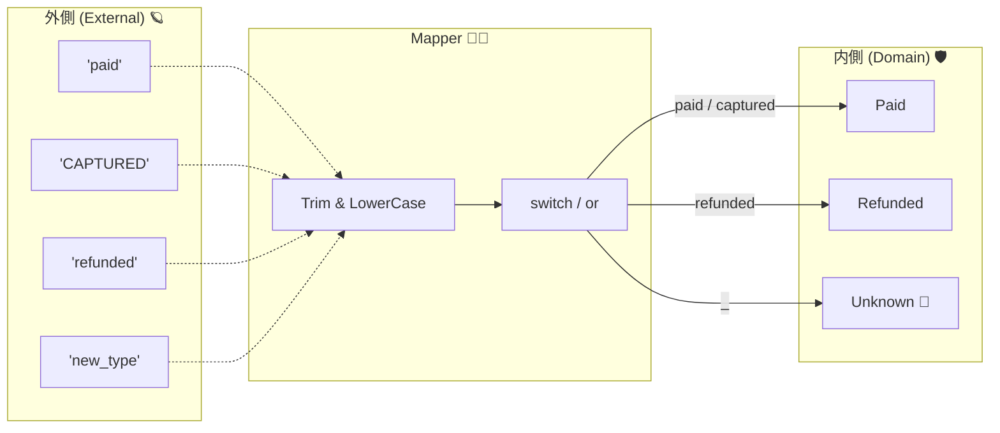

# 第13章：変換③ enum・未知値・仕様の穴（安全第一）🧯🧪


## 13.1 この章でできるようになること 🎯✨

この章を終えると、こんなことができるようになります👇💪

* 外部APIの **enum（状態・種別）** が増えても、アプリが落ちないようにできる 🧱
* 「未知値が来たときの方針」を、コードと運用セットで決められる 📝📣
* **安全なenum変換（Unknown設計）** を C# で実装＆テストできる ✅🧪

---

### 13.2 なぜ enum は事故りやすいの？😇💥

外部APIのenumって、だいたいこうなります👇

* ある日いきなり **値が追加**される（例：`"chargeback"` が増えた）🆕
* 仕様書にない **謎の値**が来る（例：`"UNKNOWN_STATUS"`、`""`、`"N/A"`）🌀
* 文字の大小・空白・表記ゆれ（`"Paid"`, `"paid"`, `" paid "`）🧼
* 数値で来るのに、意味が書かれてない（`status: 7`）🔢

ここで「外部DTOをそのまま内側に流す」と、**内側の設計が外部仕様に引きずられて腐りやすい**んでしたね🧼🧱

---

### 13.3 未知値が来たときの“3つの方針” 🧭🧯




未知値に遭遇したら、方針はだいたいこの3択です👇

1. **即エラー（Fail Fast）** 💣

* メリット：仕様変更にすぐ気づける
* デメリット：外部が1個値を足しただけでサービスが落ちることも😱

2. **Unknown に丸める（Graceful）** 🧸

* メリット：落ちない
* デメリット：知らない状態を「知らないまま」進める危険⚠️

3. **Unknown + 監視（おすすめ）📈** 👀✨

* Unknown に丸めて落とさない
* でも **ログ/メトリクスで確実に検知**して、対応できるようにする

この章では、基本は **3) Unknown + 監視** を軸にやります🧡

---

### 13.4 まずは“Unknown設計”の基本 🧱🧠

**内側（ドメイン側）のenum** には、最初から `Unknown` を用意します👇
（`0` に置くのが定番。理由：`default` で自然に Unknown になるから✨）

```csharp
public enum PaymentStatus
{
    Unknown = 0,
    Pending = 1,
    Paid = 2,
    Refunded = 3,
    Failed = 4,
}
```

ポイント💡

* **外部のenumと同じ名前にしなくてOK**（内側は内側の言葉で）🗣️
* `Unknown` は「変換できなかった」の安全弁🧯

---

### 13.5 “文字列enum”の安全な変換（いちばん多いパターン）🔤🔁




外部APIが JSON で `"status": "paid"` みたいに返してくる想定です📦

#### ✅ 変換ルール（おすすめテンプレ）

* `null / 空文字 / 空白` → `Unknown`
* `Trim()` してから、`ToLowerInvariant()` で統一🧼
* `switch` の最後は必ず `_ => Unknown` で“落ちない”🧱

```csharp
public static class PaymentStatusMapper
{
    public static PaymentStatus FromExternal(string? externalStatus)
    {
        if (string.IsNullOrWhiteSpace(externalStatus))
            return PaymentStatus.Unknown;

        var key = externalStatus.Trim().ToLowerInvariant();

        return key switch
        {
            "pending" => PaymentStatus.Pending,

            // 外部の細かい状態を、内側の意味に寄せる例👇
            "paid" or "captured" or "settled" => PaymentStatus.Paid,

            "refunded" => PaymentStatus.Refunded,
            "failed" or "canceled" => PaymentStatus.Failed,

            _ => PaymentStatus.Unknown,
        };
    }
}
```

---

### 13.6 Unknown を“黙殺”しない！ログで検知しよう📣👀

Unknown は安全だけど、**静かに増えると危ない**です⚠️
だから Translator 側で「未知値を見つけたらログ」します🧯

```csharp
using Microsoft.Extensions.Logging;

public sealed class PaymentTranslator
{
    private readonly ILogger<PaymentTranslator> _logger;

    public PaymentTranslator(ILogger<PaymentTranslator> logger)
    {
        _logger = logger;
    }

    public PaymentStatus ToDomainStatus(string? externalStatus)
    {
        var mapped = PaymentStatusMapper.FromExternal(externalStatus);

        if (mapped == PaymentStatus.Unknown && !string.IsNullOrWhiteSpace(externalStatus))
        {
            _logger.LogWarning("Unknown external payment status: {ExternalStatus}", externalStatus);
        }

        return mapped;
    }
}
```

運用のコツ🍀

* ログが増えたら「外部が仕様追加したかも！」の合図🚨
* 可能ならメトリクス化して、一定数でアラート📈（この発想は第20章で強化！）

---

### 13.7 “数値enum”が来るときの注意点（TryParseの罠）🔢🕳️

外部が `status: 3` みたいに数値で返す場合もあります。

ここでありがちな事故👇

* `Enum.TryParse` は **数値文字列もパースできる**ので、`"123"` が通ってしまうことがある
* だから「定義済みか」を `Enum.IsDefined` でチェックするのが安全寄り✅
  （Microsoftの例でも、`TryParse` と `IsDefined` を組み合わせる流れが出ています。） ([Microsoft Learn][1])

```csharp
public enum ShippingType
{
    Unknown = 0,
    Normal = 1,
    Express = 2,
}

public static class ShippingTypeMapper
{
    public static ShippingType FromExternalCode(int? code)
    {
        if (code is null)
            return ShippingType.Unknown;

        var value = (ShippingType)code.Value;

        return Enum.IsDefined(typeof(ShippingType), value)
            ? value
            : ShippingType.Unknown;
    }
}
```

⚠️補足：`[Flags]` enum の場合は、組み合わせ値が `IsDefined` で false になることがあるので別扱いです（ここでは非Flags前提でOK）🧩

---

### 13.8 System.Text.Json で enum を直接読むのは“外部統合では慎重に” ⚠️📦

`System.Text.Json` の `JsonStringEnumConverter` は、enumを文字列として扱う定番コンバーターです🧰
`allowIntegerValues`（整数値を許すか）も指定できます。 ([Microsoft Learn][2])

でも外部API統合でやりがちな落とし穴👇

* **未知の文字列enum** が来ると、デシリアライズで例外になりがち → そこで落ちる😱
* 「未知値を Unknown にする」みたいな **標準のフォールバック機能が欲しい**という要望は昔から議論されています ([GitHub][3])

✅ なので超おすすめはこれ：
**外部DTOでは enum にせず、いったん `string` / `int?` で受けて、Translatorで安全変換**🧱✨
（ACLの思想にめちゃ合います）

どうしても enum で受けたい場合は、**カスタムコンバーター**で挙動を上書きできます。カスタムコンバーターの書き方は公式ドキュメントにまとまっています。 ([Microsoft Learn][4])

---

### 13.9 ハンズオン：安全なenum変換をテストで固める 🧪✅

変換はバグりやすいので、テストがコスパ最強です💪✨

```csharp
using Xunit;

public class PaymentStatusMapperTests
{
    [Theory]
    [InlineData("paid", PaymentStatus.Paid)]
    [InlineData("CAPTURED", PaymentStatus.Paid)]
    [InlineData(" refunded ", PaymentStatus.Refunded)]
    [InlineData("chargeback", PaymentStatus.Unknown)] // 想定外！
    [InlineData("", PaymentStatus.Unknown)]
    [InlineData("   ", PaymentStatus.Unknown)]
    [InlineData(null, PaymentStatus.Unknown)]
    public void FromExternal_MapsSafely(string? input, PaymentStatus expected)
    {
        var actual = PaymentStatusMapper.FromExternal(input);
        Assert.Equal(expected, actual);
    }
}
```

テスト観点の例🔎

* 大文字小文字 🅰️🅰️
* 前後空白 🧼
* 未知値 🌀
* `null` / 空文字 🚫

---

### 13.10 仕様の穴チェックリスト（これ来たら要注意）🕳️👀

外部仕様の“穴”あるあるリストです👇

* enumの値が増えた 🆕
* ドキュメントにない値が来た 📄❓
* `null` が来た / 欠損してた 🫥
* 空文字 `""` や `"N/A"` が来た 🧻
* 単語が変わった（`"paid"` → `"settled"`）🔁
* 数値の意味が不明（`7`って何…？）😇

この章の実装だと、全部 **Unknown + 検知** に寄せられます🧯📣

---

### 13.11 ミニ課題 📝🎀

1. あなたの題材システムで、外部APIのenumっぽい項目を3つ探す🔎
2. それぞれについて、未知値の方針を文章で決める（例：Unknownにしてログ、処理は保留…など）🧾
3. `Unknown` を含む変換関数を作って、テストを5ケース以上書く🧪✅

---

### 13.12 AI活用（Unknownパターン洗い出し）🤖🧠✨

そのまま使える指示文例👇

* 「この外部APIのstatus一覧に対して、未知値が来るパターン（表記ゆれ/空/別名/将来追加）を列挙して」
* 「`PaymentStatus` へのマッピング案を“安全側”で作って。最後は Unknown にフォールバックして」
* 「xUnitで変換テストを10ケース作って（未知値・空・null・大文字小文字・空白も含めて）」

---

### まとめ 🎁✨

* 外部enumは **増えるし、ブレるし、穴がある** 😇
* **Unknown を内側に持ち、Translatorで安全変換**するのがACLの王道🧱
* Unknown は便利だけど、**ログで検知して運用につなげる**のが“安全第一”🧯📣

（次章は「欠損・null・不正値」の方針決めに進みます🧹📏）

---

**参考（最新仕様）**

* .NET 10 は 2025/11/11 リリースの LTS としてサポートされています。 ([Microsoft][5])
* C# 14 は .NET 10 でサポートされる最新リリースとして整理されています。 ([Microsoft Learn][6])

[1]: https://learn.microsoft.com/en-us/dotnet/api/system.enum.tryparse?view=net-10.0&utm_source=chatgpt.com "Enum.TryParse Method (System)"
[2]: https://learn.microsoft.com/en-us/dotnet/api/system.text.json.serialization.jsonstringenumconverter?view=net-10.0&utm_source=chatgpt.com "JsonStringEnumConverter Class (System.Text.Json. ..."
[3]: https://github.com/dotnet/runtime/issues/57031?utm_source=chatgpt.com "System.Text.Json: customize handling of unknown enum ..."
[4]: https://learn.microsoft.com/en-us/dotnet/standard/serialization/system-text-json/converters-how-to?utm_source=chatgpt.com "How to write custom converters for JSON serialization - .NET"
[5]: https://dotnet.microsoft.com/en-us/platform/support/policy/dotnet-core?utm_source=chatgpt.com "NET and .NET Core official support policy"
[6]: https://learn.microsoft.com/ja-jp/dotnet/csharp/whats-new/csharp-14?utm_source=chatgpt.com "C# 14 の新機能"
