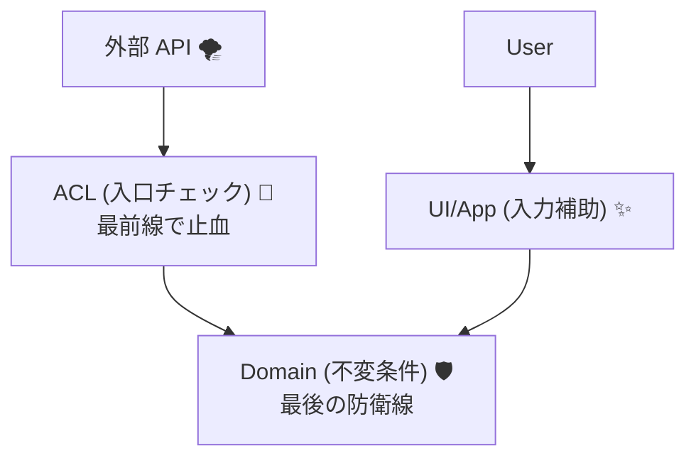
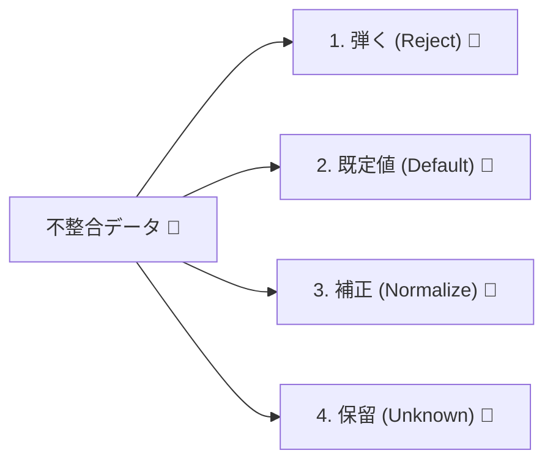
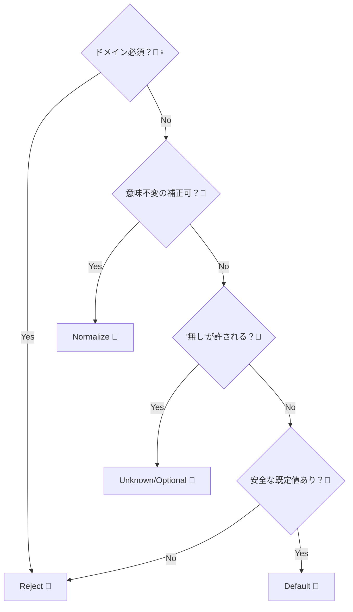

# 第14章：欠損・null・不正値① 方針の決め方（弾く？丸める？）🧹📏


## ねらい 🎯

欠損（missing）・null・不正値が来たときに、毎回「え、どうする…？😵」ってならないように、**判断の軸**と**チームで共有できる方針**を作れるようになる✨

---

## 1) まず「欠損 / null / 不正値」って何が違うの？🤔🧩


外部から来るデータの“困りごと”は、だいたいこの3つに分かれるよ👇

### A. 欠損（missing）📭

* **項目そのものが JSON に存在しない**
* 例：`"email"` が丸ごと無い

### B. null 🕳️

* **項目はあるけど値が null**
* 例：`"email": null`

### C. 不正値（invalid）💥

* 形式が変（パースできない）、範囲外、ルール違反など
* 例：`"amountCents": -100`、`"createdAt": "yesterday"`、`"currency": "YENN"`（スペル違い）

> ✅ 重要：この3つは“同じ扱い”にすると事故ることが多いよ…！
> 欠損＝相手が送ってない / null＝相手が明示的に「無い」と言ってる / 不正＝壊れてる、って意味が違う⚠️

---

## 2) いちばん大事な判断軸：「どこで守る？」🧱🚪




欠損や不正値を見つけたとき、守る場所は大きく3つあるよ👇

### ① ACL（腐敗防止層）で守る 🧼🧱

* 外部のデータを **内側の言葉に翻訳**するときにチェックする
* “外→内”の境界なので、いちばん自然✨
* **おすすめ：まずACLで止血**（最前線）

### ② ドメインで守る 👮‍♀️🔥

* ドメインの不変条件（Invariant）として絶対守る
* ACLで取りこぼしても、ここで最後に防げる🛡️

### ③ UI/アプリ層で守る 🪟🧑‍💻

* ユーザー入力ならここでも守る（入力フォームとか）
* ただし外部APIの“腐敗”はここで吸うと、画面やユースケースが汚れやすい😇

> ⭐ 結論の型：
> **ACL：翻訳＆入口チェック**🧼
> **ドメイン：不変条件で最終防衛**🛡️
> **UI：ユーザー体験のための入力補助**✨

---

## 3) 方針の選択肢はだいたい「4択」💡🗳️




欠損・null・不正値を見つけたら、やることはほぼこの4種類👇

### ① 弾く（Reject）🚫

* 例：必須のIDが無い、金額がマイナス、日時がパース不能
* ✅ 長所：内側が絶対に汚れない
* ⚠️ 短所：外部の小さな揺れで落ちやすい（運用が荒れる）

### ② 既定値を入れる（Default）🎁

* 例：備考が null → 空文字にする、未指定のページサイズ → 20件
* ✅ 長所：使う側がラク
* ⚠️ 短所：**“無い”の意味を消す**可能性あり（地味に危険）

### ③ 補正/正規化する（Normalize）🧽

* 例：前後空白をトリム、全角→半角、通貨コードを大文字化
* ✅ 長所：外部のクセを吸収できる
* ⚠️ 短所：やりすぎると“勝手変換”になって事故る😇

### ④ 保留する（Unknown / Optional）🧊

* 例：ステータスが未知 → `Unknown` として保持
* ✅ 長所：落とさずに処理継続できる
* ⚠️ 短所：Unknownが増えると、内側に分岐が増えてくる⚡

---

## 4) 迷わないための「判断の軸」5本柱 🧭✨


この5つを順に見れば、だいたい決まるよ👇

### 軸①：それってドメインの必須？（不変条件に関係ある？）👮‍♀️

* **Yes → 弾くが基本**🚫（例：注文ID、金額、通貨）
* **No → 次へ**➡️

### 軸②：補正しても意味が変わらない？🧽

* 空白トリム、大小文字統一みたいに“意味が変わらない”なら正規化OK✨
* 単位換算や丸め（切り捨て/切り上げ）は、意味が変わるので慎重😇

### 軸③：失敗したとき、再取得/再試行で直る？🔁

* 一時的エラーなら「弾く＋リトライ」寄り
* 恒久的に壊れてるなら「弾く＋調査」寄り

### 軸④：間違ったまま通すと損害が出る？💸🔥

* 決済金額・在庫・請求関連は、基本“厳しめ”🚫
* 表示だけのニックネーム等は、ゆるめでもOK🙂

### 軸⑤：ログや監視で追える？👀📝

* 補正するなら「補正した事実」を残せると強い💪
  （“あとで原因が追えない補正”は地獄🥹）

---

## 5) 方針フローチャート（これを1枚作ると勝ち）🗺️🏆


紙でもメモでもOK！この順で判断👇

1. その項目が **ドメイン不変条件に必要？**

   * Yes → 欠損/null/不正なら **Reject**🚫
   * No → 2へ
2. **意味が変わらない補正**で救える？（trim/大文字化/形式整形）

   * Yes → **Normalize**🧽
   * No → 3へ
3. “無い”が許される？（Optionalとして扱える？）

   * Yes → **Unknown/Optional**🧊
   * No → 4へ
4. 安全な既定値がある？（意味を壊さない？）

   * Yes → **Default**🎁
   * No → **Reject**🚫



---

## 6) 例で覚える：ミニEC/フリマの「決済API」編 🛒💳


外部決済APIから、こんなのが来るとするね👇

```json
{
  "transaction_id": "tx_123",
  "amount_cents": 1500,
  "currency": "jpy",
  "created_at": "2026-01-28T13:40:00Z",
  "status": "paid",
  "buyer_email": null
}
```

ここで方針を決めてみよう👇

### transaction_id（必須ID）🆔

* 欠損/null/空文字 → **Reject**🚫
* 理由：IDが無い取引は、追跡も照合もできない💥

### amount_cents（金額）💰

* 欠損/null → **Reject**🚫
* マイナス → **Reject**🚫（決済の意味が壊れる）
* 0は許す？ → 業務次第（無料決済があるならOK、ないならReject）

### currency（通貨）💱

* 欠損/null → **Reject**🚫
* `"jpy"` → `"JPY"` に **Normalize**🧽（意味不変）
* 未知（例 `"YENN"`） → 基本 **Reject**🚫（損害直結しやすい）

### created_at（時刻）⏰

* 欠損/null → 「今」？は危険なので、基本は **Unknown/Optional**🧊 にしておくのが無難
* パース不能 → **Reject** か **Unknown** かは用途次第

  * 画面表示だけ→UnknownでもOK
  * 期限計算に使う→Reject寄り

### status（状態enum）🧯

* 未知値 → **Unknown** に落とすのが定番🧊（第13章の続き！）
* ただし、Unknownのまま“出荷”に進むのはダメ、みたいなルールは内側で止める🛡️

### buyer_email（メール）📧

* null は「提供しない」可能性があるなら **Optional**🧊
* ただし「メール必須の業務」なら **Reject**🚫

---

## 7) 「方針シート」を作ろう（最強のチーム共有アイテム）📝✨

表で書くと、迷子が激減するよ👇

| 項目             | 外部で起こりがち | ドメイン必須？ | 方針（Reject/Default/Normalize/Unknown） | メモ           |
| -------------- | -------- | ------: | ------------------------------------ | ------------ |
| transaction_id | 欠損/空文字   |       ✅ | Reject 🚫                            | 追跡不可         |
| currency       | 小文字/誤字   |       ✅ | Normalize 🧽 / 誤字はReject 🚫          | JPY固定なら厳しめ   |
| created_at     | 欠損/null  |       ❌ | Unknown 🧊                           | 表示だけならOK     |
| buyer_email    | null     | ❌（要件次第） | Unknown 🧊                           | 必須業務ならReject |

> 💡 コツ：
> **「ドメイン必須？」の列がYesなら、基本Reject**で考えるとブレない👮‍♀️🛡️

---

## 8) C#側のテク：外部DTOは“怪しい前提”で設計しよう 🧪🧯


外部データは欠損もnullも起きるから、外部DTOはこうしがち👇
（あえて Nullable 多めにする）

```csharp
public sealed class ExternalPaymentDto
{
    public string? TransactionId { get; init; }
    public int? AmountCents { get; init; }
    public string? Currency { get; init; }
    public string? CreatedAt { get; init; }
    public string? Status { get; init; }
    public string? BuyerEmail { get; init; }
}
```

そしてACL（Translator）で、**方針シートどおりに判定**する🧼🧱

---

## 9) さらに強くする：JSON逆シリアル化で「必須」を表現する方法 📦🔒


System.Text.Json では、JSONに必須項目が無いときに **例外（JsonException）で落とす**設定ができるよ。必須の付け方は主に3つ（C#の required / JsonRequiredAttribute / コントラクト調整）と整理されてる。([Microsoft Learn][1])
また、requiredメンバーのサポートが強化されている（少なくとも .NET 8 以降でのサポートが明示されてる）よ。([Microsoft for Developers][2])

ただし注意点⚠️

* **外部が欠損しがち**な世界だと「必須で落としすぎ」になって運用がツラくなることもある🥹
* なので現場では、

  * 「絶対に無いと成立しない」ものだけ必須で落とす
  * それ以外はDTOでは受けて、Translatorで方針判断
    みたいにバランス取るのが多いよ🙂

---

## 10) ハンズオン：フローチャート＆方針シートを作る 🗺️📝✨

### Step1：項目リストアップ 🔎

* 決済API（外部）から来る項目を全部書く
* 「必須っぽい」「任意っぽい」で仮分類

### Step2：方針シートを埋める 📝

* 5本柱の軸で判断
* Reject/Default/Normalize/Unknown を決める

### Step3：フローチャートを1枚にする 🗺️

* この章のフロー（1→4）で描く
* 文章でもOK！（あとで図にできる）

### Step4：Translatorに“方針どおりの分岐”を書く 🧼🧱

例：通貨を正規化して、誤字はReject

```csharp
public static string TranslateCurrencyOrThrow(string? currency)
{
    if (string.IsNullOrWhiteSpace(currency))
        throw new TranslationException("currency is missing");

    var normalized = currency.Trim().ToUpperInvariant();

    return normalized switch
    {
        "JPY" => "JPY",
        "USD" => "USD",
        _ => throw new TranslationException($"currency is invalid: {normalized}")
    };
}

public sealed class TranslationException : Exception
{
    public TranslationException(string message) : base(message) { }
}
```

> ✅ ここでは“例外で弾く”形にしたけど、
> 「Result型で返す」「エラーオブジェクトで返す」でもOKだよ（第16〜17章に繋がる）🧯

---

## 11) AI活用（方針決めをラクにする）🤖✨

### 使いどころ①：方針シートの叩き台

* 「この項目一覧に対して、Reject/Default/Normalize/Unknownの候補を出して」って頼む📝🤖
* そのあと自分で“損害が出るか？”軸で修正💸

### 使いどころ②：フローチャートの文章化

* 手書きフローを、読みやすい文章に直してもらう✨

### 使いどころ③：意地悪データのパターン出し😈

* 次章（第15章）で使うテストデータを増やせる👍

---

## 12) ミニ課題（10分）⏱️🧠

### 課題1：方針シートを5項目ぶん作る 📝

* transaction_id / amount_cents / currency / created_at / buyer_email

### 課題2：「補正してOK」と「それはダメ」を2個ずつ書く 🧽🚫

* OK例：前後空白トリム、通貨を大文字化
* ダメ例：金額の勝手な丸め、通貨の推測変換

### 課題3：Unknownにした項目に「後段の安全策」を1行で書く 🧊🛡️

* 例：statusがUnknownなら出荷処理に進めない、など

---

## まとめ 🎁✅

* 欠損・null・不正値は“意味が違う”から分けて考える🧩
* 方針は4択（Reject/Default/Normalize/Unknown）で整理するとブレない🗳️
* 判断の5本柱で決めると、迷子にならない🧭
* 方針シート＋フローチャートを作ると、実装もチーム共有も超ラクになる📝✨
* JSON必須の仕組み（required/JsonRequiredなど）は強いけど、外部の荒れ具合とバランスを取るのがコツ📦🔒([Microsoft Learn][1])
* C#の最新環境として .NET 10 / C# 14 / Visual Studio 2026 の組み合わせが提供されているよ🧰✨([Microsoft][3])

[1]: https://learn.microsoft.com/en-us/dotnet/standard/serialization/system-text-json/required-properties?utm_source=chatgpt.com "Require properties for deserialization - .NET"
[2]: https://devblogs.microsoft.com/dotnet/system-text-json-in-dotnet-8/?utm_source=chatgpt.com "What's new in System.Text.Json in .NET 8"
[3]: https://dotnet.microsoft.com/en-US/download/dotnet/10.0?utm_source=chatgpt.com "Download .NET 10.0 (Linux, macOS, and Windows) | .NET"
