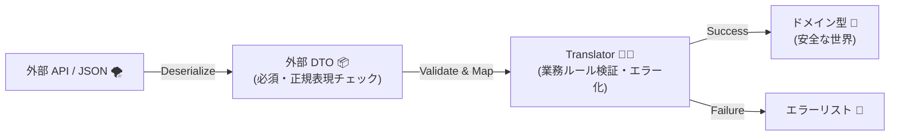
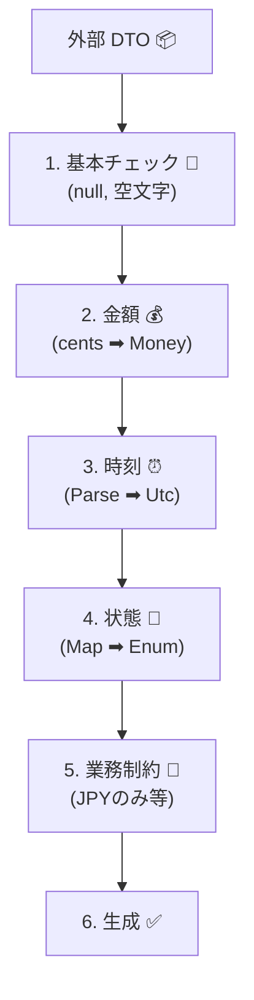

# 第15章：欠損・null・不正値② 実装演習（変換＋検証＋エラー化）🧪🚧


## ねらい 🎯

外部APIから来るデータが **欠けてる / null / おかしい** ときでも、内側（ドメイン）を守りながら、安全に「エラー化」できるようになるよ〜🛡️✨
この章のゴールはこれ👇

* ✅ ACLで **変換しながら検証**できる
* ✅ ダメなら **“内側の言葉” のエラー**に落とせる
* ✅ “意地悪データ” を **テストで再現**できる 😈🧪

---

## 15.1 外部データの「よくある地雷」リスト 💣👀

外部APIって、ほんとにこういうの来る…🥲

* **欠損**：そもそもキーが無い（`payment_id` が無い等）
* **null**：キーはあるけど `null`（`amount_cents: null`）
* **空文字**：`""`（IDが空とか）
* **型違い**：数値のはずが文字列（`"1000"`）
* **フォーマット違い**：時刻がISO-8601じゃない
* **範囲外**：金額がマイナス、ありえない桁数
* **契約ズレ**：知らないプロパティが増える（仕様変更のサイン）🧯

この章ではこれを **ACLで受けて**、ドメインへは **絶対に汚れを持ち込まない** 形にするよ〜🧼🧱

---

## 15.2 実装の全体像（これが“防波堤”🌊🧱）




イメージはこう👇

1. JSON → **外部DTO**（外側の型）📦
2. DTO → **Translator**（検証＆正規化＆エラー化）🔁
3. Translator → **ドメイン型**（VO/Entity）🧱✨

ポイントはここ💡

* JSONを読めた＝正しい、ではない 🙅‍♀️
* **DTOは“受け皿”**、正しさはTranslatorとドメインで保証する ✅
* “仕様が変わった”を早めに検知する仕掛けも入れる 👀

---

## 15.3 まず「欠損」と「知らないプロパティ」を序盤で止める ✋🧯

### ✅ 欠損は `required` で止められる（JSONデシリアライズ時）📦

System.Text.Json は「必須プロパティ」を要求できるよ。必須が無いと **`JsonException`** を投げてくれる ✨
やり方はいくつかあるけど、代表は **`required`** や **`[JsonRequired]`** 系（説明は公式が分かりやすい）だよ〜📘
([Microsoft Learn][1])

### ✅ “知らないプロパティが増えた”も止められる（契約ズレ検知）👀

System.Text.Json には「DTOに無いプロパティが来たら落とす」設定があるよ！
`[JsonUnmappedMemberHandling(JsonUnmappedMemberHandling.Disallow)]` を DTO に付けると、知らないキーが来た時点で **`JsonException`** になる 🧯✨
([Microsoft Learn][2])

> これ、外部がこっそり仕様変更したときに **すぐ気づける** からめちゃ便利〜🧠💡

---

## 15.4 ハンズオン：意地悪データに負けないACLを作る 😈🧪

ここからコードでいくよ〜！💻✨
題材：外部の決済APIが返すJSON（クセあり）を、内側の `PaymentAuthorization` に変換するよ 🛒💳

---

# 15.4.1 外部DTO（外側）を作る 📦🧱

* 外部JSONの形をそのまま受ける
* ただし **必須**と **契約ズレ**は早めに止める

```csharp
using System.Text.Json.Serialization;

namespace Infra.PaymentGateway;

// 「知らないキーが来たら例外」＝契約ズレ検知 👀🧯
[JsonUnmappedMemberHandling(JsonUnmappedMemberHandling.Disallow)]
public sealed class PaymentApiResponseDto
{
    // 欠損したらデシリアライズ失敗にしたい必須項目 🧱
    [JsonPropertyName("payment_id")]
    public required string PaymentId { get; init; }

    [JsonPropertyName("amount_cents")]
    public required long AmountCents { get; init; }

    [JsonPropertyName("currency")]
    public required string Currency { get; init; }

    // 外部はnull返すことある想定（必須じゃない扱い）😇
    [JsonPropertyName("authorized_at_utc")]
    public string? AuthorizedAtUtc { get; init; }

    // 外部enumっぽい文字列（未知値はTranslatorで安全に）🧯
    [JsonPropertyName("status")]
    public required string Status { get; init; }
}
```

ここでの気持ち👇

* `required` ＝「無いならDTOを作らない」🧱
* Disallow ＝「知らんキー増えたら落とす」👀
  どっちも **“仕様ズレを早期に気づく”** のが目的だよ〜✨
  ([Microsoft Learn][1])

---

# 15.4.2 Result型（軽量）を用意する 🧾✨

外部データが変でも、**例外でぐちゃぐちゃ**にしたくないから、まずは “結果を返す箱” を作るよ📦
（第16章でエラー設計はもっと本格化するけど、今章は練習用のミニ版！）

```csharp
namespace App.Shared;

public sealed record AclError(
    string Code,
    string Message,
    string? Field = null,
    string? RawValue = null);

public sealed class Result<T>
{
    private Result(T value)
    {
        IsSuccess = true;
        Value = value;
        Errors = [];
    }

    private Result(List<AclError> errors)
    {
        IsSuccess = false;
        Value = default;
        Errors = errors;
    }

    public bool IsSuccess { get; }
    public T? Value { get; }
    public List<AclError> Errors { get; }

    public static Result<T> Ok(T value) => new(value);
    public static Result<T> Fail(params AclError[] errors) => new(errors.ToList());
    public static Result<T> Fail(List<AclError> errors) => new(errors);
}
```

---

# 15.4.3 ドメイン側の型（例）を用意する 🧱✨

この章の主役はACLだけど、ゴールを作るために “最小限の内側” を置くよ〜😊

## ✅ ValueObject：Money 💰

```csharp
namespace Domain.ValueObjects;

public sealed record Money
{
    private Money(long yen) => Yen = yen;

    public long Yen { get; }

    public static bool TryCreate(long yen, out Money? money)
    {
        if (yen < 0) { money = null; return false; }
        money = new Money(yen);
        return true;
    }
}
```

## ✅ ドメインモデル：PaymentAuthorization 💳

```csharp
using Domain.ValueObjects;

namespace Domain.Payments;

public enum AuthorizationStatus
{
    Authorized,
    Declined,
    Pending,
    Unknown
}

public sealed record PaymentAuthorization(
    string PaymentId,
    Money Amount,
    DateTimeOffset? AuthorizedAt,
    AuthorizationStatus Status);
```

---

# 15.4.4 Translator（ここが本番）🔁🧪🚧




Translatorでは **検証 → 正規化 → エラー化** を全部やるよ🔥
「ここを通らないと内側に入れない」っていう門番ね👮‍♀️🧱

```csharp
using App.Shared;
using Domain.Payments;
using Domain.ValueObjects;
using Infra.PaymentGateway;

namespace Infra.Translators;

public sealed class PaymentTranslator
{
    public Result<PaymentAuthorization> Translate(PaymentApiResponseDto dto)
    {
        var errors = new List<AclError>();

        // 1) 文字列系の基本チェック（null/空/空白）🧼
        if (string.IsNullOrWhiteSpace(dto.PaymentId))
        {
            errors.Add(new("ACL_VALIDATION_EMPTY", "payment_id が空です", "payment_id", dto.PaymentId));
        }

        if (string.IsNullOrWhiteSpace(dto.Currency))
        {
            errors.Add(new("ACL_VALIDATION_EMPTY", "currency が空です", "currency", dto.Currency));
        }

        // 2) 金額：cents -> 円（例として 1 cent = 1円換算にしてる想定）💰
        //    ※本当は通貨ごとにルール違うので、教材では“変換の形”を優先✨
        long yen = dto.AmountCents;
        if (!Money.TryCreate(yen, out var money))
        {
            errors.Add(new("ACL_VALIDATION_RANGE", "amount_cents が不正（負数など）です", "amount_cents", dto.AmountCents.ToString()));
        }

        // 3) 時刻：UTC文字列 -> DateTimeOffset? ⏰
        DateTimeOffset? authorizedAt = null;
        if (dto.AuthorizedAtUtc is not null)
        {
            if (string.IsNullOrWhiteSpace(dto.AuthorizedAtUtc))
            {
                // nullじゃないのに空文字は、わりと地雷😇
                errors.Add(new("ACL_VALIDATION_FORMAT", "authorized_at_utc が空文字です", "authorized_at_utc", dto.AuthorizedAtUtc));
            }
            else if (DateTimeOffset.TryParse(dto.AuthorizedAtUtc, out var parsed))
            {
                // 外部がUTCと言ってるなら、UTCとして扱う“方針”をここに寄せる✨
                authorizedAt = parsed.ToUniversalTime();
            }
            else
            {
                errors.Add(new("ACL_VALIDATION_FORMAT", "authorized_at_utc の形式が不正です", "authorized_at_utc", dto.AuthorizedAtUtc));
            }
        }

        // 4) status：未知値に安全対応（Unknownへ）🧯
        var status = dto.Status.Trim().ToLowerInvariant() switch
        {
            "authorized" => AuthorizationStatus.Authorized,
            "declined"   => AuthorizationStatus.Declined,
            "pending"    => AuthorizationStatus.Pending,
            _            => AuthorizationStatus.Unknown
        };

        // 5) currency：この章では “想定外なら弾く” 方針にしてみる（例）🚫
        //    （丸める/既定値にする/通す…は第14章の方針に従う感じ✨）
        if (!string.IsNullOrWhiteSpace(dto.Currency) && dto.Currency != "JPY")
        {
            errors.Add(new("ACL_VALIDATION_UNSUPPORTED", "currency が未対応です（JPYのみ対応）", "currency", dto.Currency));
        }

        if (errors.Count > 0)
        {
            return Result<PaymentAuthorization>.Fail(errors);
        }

        // ここまで来たら “内側に入れてOK” ✅✨
        var model = new PaymentAuthorization(
            PaymentId: dto.PaymentId.Trim(),
            Amount: money!,                 // errorsが空なら必ず作れてる想定
            AuthorizedAt: authorizedAt,
            Status: status
        );

        return Result<PaymentAuthorization>.Ok(model);
    }
}
```

## このTranslatorの強いところ 💪✨

* 「どの項目が」「何がダメか」を **エラーとして収集**できる 🧾
* ドメインに入る前に **一気に正規化**できる 🧼
* 未知値も落ちずに **安全にUnknown** にできる 🧯

---

## 15.5 JSONデシリアライズ部分（例外→ACLエラーへ）🧯🔁

DTO化の時点で落ちるケース（必須欠損、知らないキー）もあるよね。
System.Text.Json は必須が無い/契約ズレがあると `JsonException` になり得るよ。([Microsoft Learn][1])

だから “外部I/O担当” ではこんな感じで受けるとスッキリするよ〜✨

```csharp
using System.Text.Json;
using App.Shared;
using Infra.PaymentGateway;

namespace Infra.Clients;

public sealed class PaymentApiParser
{
    private static readonly JsonSerializerOptions Options = new(JsonSerializerDefaults.Web)
    {
        // ここで全体設定もできるけど、章ではDTO側の属性で十分 👍
        // UnmappedMemberHandling = JsonUnmappedMemberHandling.Disallow
    };

    public Result<PaymentApiResponseDto> Parse(string json)
    {
        try
        {
            var dto = JsonSerializer.Deserialize<PaymentApiResponseDto>(json, Options);
            if (dto is null)
            {
                return Result<PaymentApiResponseDto>.Fail(
                    new AclError("ACL_DESERIALIZE_NULL", "JSONの解析結果がnullになりました"));
            }
            return Result<PaymentApiResponseDto>.Ok(dto);
        }
        catch (JsonException ex)
        {
            return Result<PaymentApiResponseDto>.Fail(
                new AclError("ACL_DESERIALIZE_FAILED", "JSONの形式が仕様と合いません", rawValue: ex.Message));
        }
    }
}
```

※ `JsonSerializerDefaults.Web` は “Webっぽい既定” を使うためのやつだよ〜🌐
（System.Text.Json側でも Web 用の既定オプションが用意されてる）([Microsoft Learn][3])

---

## 15.6 意地悪データを流して防御できるか確認 😈🧪

### 15.6.1 悪い入力10個セット（例）💥

「ミニ課題」でも作るやつの見本だよ〜📦

1. `payment_id` 欠損
2. `payment_id: ""`
3. `amount_cents: -1`
4. `amount_cents` 欠損
5. `currency: null`（※requiredならここで落ちる）
6. `currency: "USD"`
7. `authorized_at_utc: ""`
8. `authorized_at_utc: "yesterday"`
9. `status: "NEW_UNKNOWN_STATUS"`
10. 余計なキー `{"hacked": true}` が混入（Disallowで落ちる）🧯

---

### 15.6.2 xUnitテストで“自動防波堤チェック”🌊✅

```csharp
using App.Shared;
using Infra.Clients;
using Infra.Translators;
using Xunit;

public sealed class PaymentAclTests
{
    private readonly PaymentApiParser _parser = new();
    private readonly PaymentTranslator _translator = new();

    [Theory]
    [InlineData("""{"payment_id":"p1","amount_cents":-1,"currency":"JPY","authorized_at_utc":"2025-01-01T00:00:00Z","status":"authorized"}""",
        "ACL_VALIDATION_RANGE")]
    [InlineData("""{"amount_cents":100,"currency":"JPY","authorized_at_utc":"2025-01-01T00:00:00Z","status":"authorized"}""",
        "ACL_DESERIALIZE_FAILED")] // payment_id欠損（required想定）
    [InlineData("""{"payment_id":"","amount_cents":100,"currency":"JPY","authorized_at_utc":"2025-01-01T00:00:00Z","status":"authorized"}""",
        "ACL_VALIDATION_EMPTY")]
    [InlineData("""{"payment_id":"p1","amount_cents":100,"currency":"USD","authorized_at_utc":"2025-01-01T00:00:00Z","status":"authorized"}""",
        "ACL_VALIDATION_UNSUPPORTED")]
    [InlineData("""{"payment_id":"p1","amount_cents":100,"currency":"JPY","authorized_at_utc":"yesterday","status":"authorized"}""",
        "ACL_VALIDATION_FORMAT")]
    public void Bad_inputs_should_be_blocked(string json, string expectedCode)
    {
        var dtoResult = _parser.Parse(json);

        if (!dtoResult.IsSuccess)
        {
            Assert.Contains(dtoResult.Errors, e => e.Code == expectedCode);
            return;
        }

        var modelResult = _translator.Translate(dtoResult.Value!);
        Assert.False(modelResult.IsSuccess);
        Assert.Contains(modelResult.Errors, e => e.Code == expectedCode);
    }

    [Fact]
    public void Good_input_should_pass()
    {
        var json = """{"payment_id":"p_ok","amount_cents":1200,"currency":"JPY","authorized_at_utc":"2025-01-01T00:00:00Z","status":"authorized"}""";

        var dtoResult = _parser.Parse(json);
        Assert.True(dtoResult.IsSuccess);

        var modelResult = _translator.Translate(dtoResult.Value!);
        Assert.True(modelResult.IsSuccess);
        Assert.Equal("p_ok", modelResult.Value!.PaymentId);
        Assert.Equal(1200, modelResult.Value.Amount.Yen);
    }
}
```

テストが通るとこうなるよ👇

* ✅ 悪い入力 → **どこが悪いか**コードで分かる
* ✅ 良い入力 → ドメインまで安全に到達 🧱✨

---

## 15.7 ミニ課題 📝✨

### 課題A：悪い入力10個セットを自作 😈📦

* 欠損：2個
* null：2個
* フォーマット不正：2個
* 範囲外：2個
* 余計なキー：2個

### 課題B：エラーを「フィールド付き」で返す 🧾

* どの項目がダメか（`Field`）
* 何が来たか（`RawValue`）

---

## 15.8 AI活用（悪い入力づくりを爆速にする🤖⚡）

Copilot/Codexに投げると便利なお願いテンプレ👇

* 「このDTOに対して、欠損/null/型違い/範囲外のJSONを10個作って」🤖📦
* 「statusに未知値が来たときのテストケースを増やして」🤖🧪
* 「Translateのバリデーション観点をチェックリスト化して」🤖✅

⚠️ ただし、**最終判断（弾く/補正/既定値）は人間が決める**のが超大事だよ🧠✨
（第14章で決めた方針が“法律”ね📘👮‍♀️）

---

## 15.9 この章のチェックリスト ✅🧱

* [ ] 必須欠損を **デシリアライズ時点**で止められる（`required` 等）([Microsoft Learn][1])
* [ ] 仕様変更（知らないキー）を **すぐ検知**できる（UnmappedMemberHandling）([Microsoft Learn][2])
* [ ] Translatorで **検証→正規化→エラー化** ができてる 🔁🧪
* [ ] ドメインに **汚い値が入る経路が無い** 🧼🧱
* [ ] “意地悪データ” が **テストで再現**できる 😈✅

---

ここまでできたら、ACLの防波堤づくりはかなり強いよ〜🌊🧱✨
次の章（第16章）で、このエラーたちを「分類」して、もっと運用しやすく整理していくよ📚😇

[1]: https://learn.microsoft.com/en-us/dotnet/standard/serialization/system-text-json/required-properties?utm_source=chatgpt.com "Require properties for deserialization - .NET"
[2]: https://learn.microsoft.com/en-us/dotnet/standard/serialization/system-text-json/missing-members?utm_source=chatgpt.com "Handle unmapped members during deserialization - .NET"
[3]: https://learn.microsoft.com/ja-jp/dotnet/api/system.text.json.jsonserializeroptions?view=net-10.0&utm_source=chatgpt.com "JsonSerializerOptions Class (System.Text.Json)"
