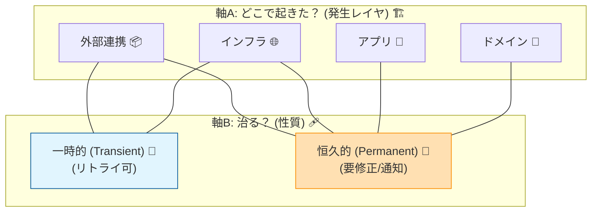

# 第16章：エラー設計① 分類（ドメイン/インフラ/一時的/恒久的）😇📚


## この章でできるようになること 🎯✨

* エラーを見た瞬間に「これはどの種類？」って仕分けできるようになる🧺✅
* 「リトライしていい？」「ユーザーに見せる？」「ログはどれくらい？」が迷わなくなる🧭
* ACLの境界で **外部の失敗を“内側の言葉”に翻訳**する準備が整う🧱🔁

---

## 16-1. まず、エラーが“ぐちゃぐちゃ”になる典型パターン 😵‍💫💥

よくある地獄👇（心当たりあるやつ…！）

* `try { ... } catch(Exception) { return null; }` で全部握りつぶす🤐
* 画面では「エラーが発生しました」だけ（何が起きたかわからない）😇
* “同じ失敗”なのに、場所によって返し方がバラバラ🍱
* リトライすべきタイムアウトを「恒久エラー扱い」して諦める😢
* 逆に、入力ミス（恒久）をリトライして外部APIに迷惑かける🔁💦

👉 なので先に「分類ルール」を作るのが超大事！📚✨

---

## 16-2. エラー分類は “2本の軸” で考えると最強 🧠🪄




この章では **2軸**で分類するよ👇

### 軸A：どこで起きた？（発生レイヤ）🏗️

1. **ドメインエラー**（業務ルール違反）🧼
2. **アプリケーションエラー**（手続き・ユースケース都合）🧩
3. **インフラエラー**（通信・DB・外部I/Oなど）🌐🧯
4. **外部起因エラー**（外部仕様・外部エラー形式そのもの）📦⚠️
   ※ACLでは「外部起因」を受け取るので、まずここが増えがち！

### 軸B：治る？（一時的 or 恒久的）🩹🧱

* **一時的（Transient）**：時間が経てば治る可能性が高い（リトライ候補）🔁⏳
* **恒久的（Permanent）**：時間が経っても治らない（入力/仕様/権限/存在しない等）🧱🚫

> この2軸が決まると、対応（リトライ/通知/ログ/画面表示）が一気に整理できるよ✨

---

## 16-3. 4分類を“やさしく”定義するよ 📘😊


### ① ドメインエラー（業務ルール違反）🧼📛

**例**

* 注文金額が0円はダメ🙅‍♀️
* 支払い状態が「取消済み」なのに「確定」に戻すのはダメ🚫
* メール形式がルール違反📧❌

**特徴**

* だいたい「想定内」
* 例外（Exception）より、**エラー値（Result）**として扱うと読みやすい✨

**基本対応**

* ユーザーに分かる形にして返す（UI向け文言は次章で）💬
* ログは “情報〜注意” 程度が多い（運用方針による）📝

---

### ② アプリケーションエラー（手続き・ユースケース都合）🧩🚦

**例**

* “同時実行禁止”で処理を弾く（二重送信）👆👆
* 依存サービスが無いので処理継続できない（ただし業務ルールではない）⚙️
* “手順”が成立しない（例：ログイン前提なのに未ログイン）🔐

**特徴**

* “ドメインの意味”というより、**アプリの進行上の都合**で止まる

**基本対応**

* ユーザー操作のやり直し誘導、または状態を整える導線へ🧭

---

### ③ インフラエラー（通信/タイムアウト/障害）🌐🧯

**例**

* タイムアウト⏰
* DNS/ネットワーク切断📡💥
* 503/502など外部が落ちてる💤
* DB接続失敗🗄️💥

**特徴**

* “想定はするけど、日常的に起きてほしくない”
* .NETでは例外が発生しやすい領域（HttpClientなど）
* 例外運用の基本指針として「例外は“本当に例外的”なときに」も推奨されるよ📌 ([Microsoft Learn][1])

**基本対応**

* 一時的ならリトライ候補🔁
* ログはしっかり（警告〜エラー）＋相関IDなど👀🧵

---

### ④ 外部起因エラー（外部仕様のクセ/外部エラー形式）📦🌀

**例**

* 外部が `error_code: "E123"` みたいな独自形式で返す
* 外部のステータスが増えて未知値が来た😇
* 外部が「200 OKなのに body の中に error が入ってる」みたいなクセ😵‍💫

**特徴**

* そのまま内側に持ち込むと **腐敗**する🚫🧼
* ACLで **内側のエラー型へ翻訳**するのが本業🧱🔁

**基本対応**

* “外部の生の形”をそのまま内側へ渡さない
* 次章で「外→内のエラー変換」をやるよ！✨

---

## 16-4. 一時的（Transient） vs 恒久的（Permanent）を見分けるコツ 🔁🧱


### 一時的（リトライ候補）になりやすい例 🔁⏳

* タイムアウト⏰
* 一時的なネットワーク不調📡
* 503/502/504 など “落ちてる/混んでる” 系🫠
* レート制限（429）🧯

### 恒久的（リトライしてもムダ）になりやすい例 🧱🚫

* 400（入力がダメ）📝❌
* 401/403（認証・権限）🔐
* 404（存在しない）👻
* “必須項目欠損” など仕様的に成立しない📦❌

---

## 16-5. “分類フローチャート”を頭に入れる 🗺️✨


困ったらこの順番👇

1. **これは業務ルール違反？**（ドメイン）🧼
   　YES → ドメインエラー
   　NO → 次へ

2. **これはアプリの手順・状態の問題？**（ユースケース都合）🧩
   　YES → アプリケーションエラー
   　NO → 次へ

3. **外部I/Oや機械的な失敗？**（通信/DB/ファイル）🌐
   　YES → インフラエラー
   　NO → 次へ

4. **外部の仕様・形式が原因？**（外部独自のエラー形）📦
   　YES → 外部起因エラー（ACLで翻訳対象）
   　NO → 最後に…

5. **それ、バグの匂いしない？**🐛💥

* ありえないnull
* enumに絶対来ないはずの値
* 想定してない分岐
  → これは “設計エラー/バグ” なので、早めに落としてログ＆アラート候補⚠️

---

## 16-6. C#で「エラー型」を作って、分類をコードに固定する 🧱🧰

ここが本章のハンズオンだよ！✍️✨
ポイントはこれ👇

* **外部例外（Exception）をそのまま内側に持ち込まない**
* **内側は “エラー型” を持って分類できるようにする**
* “一時的か？”を **プロパティで持つ**（毎回悩まない）✅

### 16-6-1. エラーの共通インターフェース（または基底record）を作る 🧱


```csharp
namespace Acme.Shop.Errors;

public enum ErrorLayer
{
    Domain,
    Application,
    Infrastructure,
    ExternalContract
}

public abstract record AppError(
    string Code,
    string Message,
    ErrorLayer Layer,
    bool IsTransient
);
```

* `Code`：ログや監視で集計しやすい📊
* `Message`：開発者向け（ユーザー向けは次章で変換）💬
* `Layer`：どこ由来？🏗️
* `IsTransient`：リトライしていい？🔁

---

### 16-6-2. 各カテゴリのエラー型を作る 🧺✨

```csharp
namespace Acme.Shop.Errors;

public sealed record DomainError(string Code, string Message)
    : AppError(Code, Message, ErrorLayer.Domain, IsTransient: false);

public sealed record ApplicationError(string Code, string Message)
    : AppError(Code, Message, ErrorLayer.Application, IsTransient: false);

public sealed record InfrastructureError(string Code, string Message, bool IsTransient)
    : AppError(Code, Message, ErrorLayer.Infrastructure, IsTransient);

public sealed record ExternalContractError(string Code, string Message, bool IsTransient)
    : AppError(Code, Message, ErrorLayer.ExternalContract, IsTransient);
```

* ドメイン/アプリはだいたい恒久（入力・状態の問題）🧱
* インフラ/外部起因は **一時的が混ざる**ので `IsTransient` を引数にしてるよ🔁

---

### 16-6-3. Result型（成功/失敗）を用意する 🎁✅

例外を乱発すると `try/catch` だらけになるので、
**“想定内の失敗” は Result に乗せる**と読みやすいよ✨
（例外のベストプラクティスとして「本当に例外的なら例外で」も参考になるよ）([Microsoft Learn][1])

```csharp
namespace Acme.Shop.Errors;

public readonly record struct Result<T>(T? Value, AppError? Error)
{
    public bool IsSuccess => Error is null;

    public static Result<T> Ok(T value) => new(value, null);
    public static Result<T> Fail(AppError error) => new(default, error);
}
```

---

## 16-7. ハンズオン：HttpClientの失敗を「分類」してエラー型にする 🌐🧱


HttpClientの世界では、タイムアウト等で `TaskCanceledException` が出ることがあるよ⏰
（タイムアウト時の例外の出方は実装やバージョンで差があるので、ここは公式仕様を踏まえて扱うのが安全）([Microsoft Learn][2])

### 16-7-1. “分類して返す” メソッドを作る 🛠️

```csharp
using System.Net;
using System.Net.Http;
using Acme.Shop.Errors;

namespace Acme.Shop.Integration;

public static class HttpFailureMapper
{
    public static AppError Map(Exception ex, CancellationToken ct)
    {
        // ① 呼び出し側がキャンセルした（ユーザー操作など）
        if (ex is OperationCanceledException && ct.IsCancellationRequested)
        {
            return new ApplicationError(
                "APP_CANCELED",
                "Operation was canceled by caller."
            );
        }

        // ② タイムアウト（.NETでは TaskCanceledException になることがある）
        if (ex is TaskCanceledException tce && tce.InnerException is TimeoutException)
        {
            return new InfrastructureError(
                "INF_TIMEOUT",
                "HTTP request timed out.",
                IsTransient: true
            );
        }

        // ③ ネットワーク/通信系
        if (ex is HttpRequestException hre)
        {
            return new InfrastructureError(
                "INF_HTTP_REQUEST_FAILED",
                $"HTTP request failed: {hre.Message}",
                IsTransient: true
            );
        }

        // ④ 想定外（バグ/未知）
        return new InfrastructureError(
            "INF_UNKNOWN",
            $"Unknown infrastructure error: {ex.GetType().Name}",
            IsTransient: false
        );
    }

    public static AppError MapStatusCode(HttpStatusCode statusCode, string? bodySnippet = null)
    {
        var code = (int)statusCode;

        // 一時的になりやすい（混雑/障害）
        if (statusCode is HttpStatusCode.BadGateway
            or HttpStatusCode.ServiceUnavailable
            or HttpStatusCode.GatewayTimeout)
        {
            return new InfrastructureError(
                $"INF_HTTP_{code}",
                $"Upstream error: {(int)statusCode} {statusCode}. {bodySnippet}",
                IsTransient: true
            );
        }

        // レート制限（多くの場合リトライ）
        if ((int)statusCode == 429)
        {
            return new InfrastructureError(
                "INF_RATE_LIMIT",
                "Rate limited by upstream.",
                IsTransient: true
            );
        }

        // 恒久になりやすい（入力/権限）
        return new ExternalContractError(
            $"EXT_HTTP_{code}",
            $"Upstream returned {(int)statusCode} {statusCode}. {bodySnippet}",
            IsTransient: false
        );
    }
}
```

💡ここでやってること

* 例外を **分類**して、内側で扱える `AppError` に変換🧱
* `IsTransient` を決めて、後続が迷わないようにする🔁
* 「呼び出し側キャンセル」と「タイムアウト」を分ける（重要！）✋

---

## 16-8. HttpClientの使い方ミニ注意（分類の精度が上がる）🧠✨

* HttpClientは **使い回し**や **IHttpClientFactory**（DI）推奨だよ。雑に new 連発すると問題が出やすい💥
  公式ガイドもこの方針を推してるよ([Microsoft Learn][3])

* .NETの最新系（今の最新版ライン）では .NET 10 の更新が出てるよ（例：10.0.2 など）([Microsoft][4])
  → 例外の挙動やHTTP周りの改善も積み重なるので、最新版での動作前提が安心🧷

---

## 16-9. エラー分類表（手で作ると強くなる）🧾💪


教材の題材（ミニEC/フリマ）を想像して、こんな表を作ってみよう👇

* 決済APIがタイムアウト → **インフラ** / **一時的** 🔁
* 決済APIが 401 → **外部起因** / **恒久的**（認証設定ミス）🧱
* 金額がマイナス → **ドメイン** / **恒久的** 🧼
* 二重送信 → **アプリケーション** / **恒久的**（設計で防ぐ）🧩
* 外部が未知の `status: "NEW_KIND"` を返す → **外部起因** / 方針次第（多くは恒久寄り）📦😇

---

## 16-10. ミニ課題：分類クイズ（答えつき）🎯🧠

### 問題 💡

次の状況を「レイヤ」と「一時/恒久」で分類してね👇

1. 外部決済APIが 503 を返した
2. 外部決済APIが 400（必須フィールド不足）
3. 注文が「確定済み」なのに「未確定」に戻す処理をした
4. ユーザーが画面を閉じてリクエストがキャンセルされた
5. 外部が `error_code: "E999"` を返すけど、仕様書に載ってない

### 解答 ✅

1. インフラ寄り（上流障害） / 一時的 🔁
2. 外部起因（入力不正） / 恒久的 🧱
3. ドメイン / 恒久的 🧼
4. アプリケーション（呼び出し側都合） / 恒久的 🧩
5. 外部起因（未知仕様） / 基本は恒久的（ただし運用で一時扱いにする設計もあり）📦😇

---

## 16-11. AI活用（Copilot/Codex）🤖✨：分類設計を爆速にする使い方

### 使えるお願い例 🪄

* 「この仕様の失敗ケースを列挙して、Transient/Permanentに分類して」🧾🔁
* 「AppError/DomainError/InfrastructureError のrecord設計案を出して」🧱
* 「HttpClient例外を分類してAppErrorへ変換する関数を提案して」🌐
* 「この分類に対する単体テストケースを20個出して」✅

### でも最後に“人が決めるところ”🧠⚖️

* **何を一時的扱いにするか**（リトライ方針）
* **未知値をどう扱うか**（落とす/Unknown/保留）
* **ログの重さ**（警告？エラー？アラート？）

ここをAIに丸投げすると、運用で事故りやすいので注意だよ⚠️😇

---

## 16-12. この章のまとめ 🎁✨

* エラーは **発生レイヤ（どこ）** と **一時/恒久（治る？）** の2軸で分類すると迷わない🧭
* ACLでは、外部の失敗を **内側のエラー型へ翻訳**して“腐敗”を止める🧱
* `AppError` に `Layer` と `IsTransient` を入れておくと、実装が一気に整う✅
* 次章でいよいよ「外→内のエラー変換（翻訳）」を本格的にやるよ🔁🧱

[1]: https://learn.microsoft.com/en-us/dotnet/standard/exceptions/best-practices-for-exceptions?utm_source=chatgpt.com "Best practices for exceptions - .NET"
[2]: https://learn.microsoft.com/ja-jp/dotnet/api/system.net.http.httpclient.getasync?view=net-8.0&utm_source=chatgpt.com "HttpClient.GetAsync メソッド (System.Net.Http)"
[3]: https://learn.microsoft.com/en-us/dotnet/fundamentals/networking/http/httpclient-guidelines?utm_source=chatgpt.com "Guidelines for using HttpClient"
[4]: https://dotnet.microsoft.com/en-US/download/dotnet/10.0?utm_source=chatgpt.com "Download .NET 10.0 (Linux, macOS, and Windows) | .NET"
