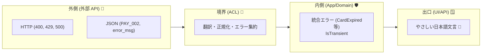

# 第17章：エラー設計② 境界で変換する（外→内の翻訳）🔁🧱

## 17.1 なぜ「境界でエラーを変換」するの？😵‍💫


外部APIって、エラーの出し方がバラバラです。

* 返ってくる **HTTPステータス** が意味不明なことがある（例：本当は入力ミスなのに 500 😇）
* **エラーコード** が急に増える / 名前が変わる（例：`PAY_002` → `P002`）
* **メッセージが英語**・専門用語・内部情報てんこ盛り（UIに出せない…🫠）
* レスポンス形式が突然変わる（DTOが爆発💥）

これをそのまま内側（ドメイン）に持ち込むと、ドメインが外部仕様に支配されて“腐敗”します🧼💦
だから ACL の境界で「外のエラー」を「内側の言葉」に翻訳して、内側を守ります🛡️✨

---

## 17.2 今日のゴール 🎯

この章のゴールはこれ👇

* 外部APIのエラー形式（HTTP + JSON）を **内側のエラー型** に変換できる🧩
* 内側（ドメイン / アプリ層）は **外部のエラーコードやHTTPを知らない** で済む🙅‍♀️
* ログとUI表示を分離して、**ユーザーに安全な言葉** を返せる💬

---

## 17.3 “エラーの通り道” を整理しよう 🛣️




エラーもデータと同じで、通る道を決めるとラクです✨

* **外側（外部API）**：HTTPステータス + エラーDTO（外部独自）
* **ACL**：外部エラーを受け取り、**内側エラーに翻訳**（ここが主役🧱）
* **アプリ層（UseCase）**：内側エラーを見て、処理分岐（リトライする？やめる？）
* **UI/API**：ユーザー向け文言にして返す（内部事情は隠す🤫）

ポイント：
**「外部の形」を ACL から先に持ち込まない**（DTO直通禁止と同じノリ📦🙅‍♀️）

---

## 17.4 内側のエラー型：まずは“最低限”でOK 🙆‍♀️✨


外部エラーって全部細かく表現しようとすると地獄です😇
初心者のうちは、まずこの3つだけで十分強いです💪

1. **何が起きた？（種類）**
2. **一時的？（リトライできる？）**
3. **調査用の手がかり（TraceIdなど）**

それに加えて「サービス名」だけは必ず持つと運用が楽です🧑‍💻📌

---

## 17.5 “外部のエラー” 例（決済API）📡

例えば外部がこう返すとします👇

* 400（入力ミス）
* 401/403（認証/権限）
* 429（レート制限）
* 5xx（外部側の障害）
* タイムアウト（通信が切れる/遅い）

さらに、JSONボディ（外部DTO）はこんな感じかも👇

```json
{
  "error": {
    "code": "PAY_002",
    "message": "card expired",
    "retryAfterSeconds": 60,
    "traceId": "abc-123"
  }
}
```

でも内側には `PAY_002` を持ち込みたくない！🙅‍♀️
内側は「期限切れ」みたいな**意味**だけ知りたいんです🧠✨

---

## 17.6 内側の「統合エラー」型を作る（シンプル版）🧩


ここでは “外部統合に失敗した” ことを表す **IntegrationError** を作ります🧱

```csharp
namespace MyApp.Integration.Errors;

// 外部との通信・統合で起きるエラー（ドメインには持ち込まない想定）
public abstract record IntegrationError(
    string Service,
    bool IsTransient,
    string? TraceId
);

public sealed record IntegrationBadRequest(
    string Service,
    string Reason,
    string? TraceId
) : IntegrationError(Service, IsTransient: false, TraceId);

public sealed record IntegrationUnauthorized(
    string Service,
    string? TraceId
) : IntegrationError(Service, IsTransient: false, TraceId);

public sealed record IntegrationRateLimited(
    string Service,
    int RetryAfterSeconds,
    string? TraceId
) : IntegrationError(Service, IsTransient: true, TraceId);

public sealed record IntegrationUnavailable(
    string Service,
    string Summary,
    string? TraceId
) : IntegrationError(Service, IsTransient: true, TraceId);

public sealed record IntegrationUnexpected(
    string Service,
    string Summary,
    bool IsTransient,
    string? TraceId
) : IntegrationError(Service, IsTransient, TraceId);
```

### ここが大事💡

* **IsTransient** があると、アプリ層で「じゃあリトライする？」が決められる🔁
* **TraceId** はユーザーに見せない。でもログに入れると神👼✨

---

## 17.7 外部エラーDTO → 内側エラーへ翻訳する（Translator）🧑‍🏫


外部のレスポンス（HTTP + 外部DTO）を受け取って、内側エラーに変換します🔁🧱

まず外部DTO（例）：

```csharp
namespace MyApp.Integration.Payment.ExternalDtos;

public sealed class ExternalPaymentErrorResponse
{
    public ExternalPaymentError? Error { get; set; }
}

public sealed class ExternalPaymentError
{
    public string? Code { get; set; }
    public string? Message { get; set; }
    public int? RetryAfterSeconds { get; set; }
    public string? TraceId { get; set; }
}
```

次に Translator（翻訳係）：

```csharp
using System.Net;
using MyApp.Integration.Errors;
using MyApp.Integration.Payment.ExternalDtos;

namespace MyApp.Integration.Payment;

public static class PaymentErrorTranslator
{
    private const string ServiceName = "PaymentApi";

    public static IntegrationError FromHttp(
        HttpStatusCode status,
        ExternalPaymentErrorResponse? body,
        string? traceIdFromHeader = null
    )
    {
        var traceId = body?.Error?.TraceId ?? traceIdFromHeader;

        return status switch
        {
            HttpStatusCode.BadRequest =>
                new IntegrationBadRequest(ServiceName,
                    Reason: NormalizeBadRequestReason(body),
                    TraceId: traceId),

            HttpStatusCode.Unauthorized or HttpStatusCode.Forbidden =>
                new IntegrationUnauthorized(ServiceName, traceId),

            HttpStatusCode.TooManyRequests =>
                new IntegrationRateLimited(ServiceName,
                    RetryAfterSeconds: body?.Error?.RetryAfterSeconds ?? 30,
                    TraceId: traceId),

            // 5xx系は基本「外部が不安定」→ 一時的扱いにすることが多い
            >= HttpStatusCode.InternalServerError =>
                new IntegrationUnavailable(ServiceName,
                    Summary: $"Remote server error (HTTP {(int)status})",
                    TraceId: traceId),

            _ =>
                new IntegrationUnexpected(ServiceName,
                    Summary: $"Unexpected status (HTTP {(int)status})",
                    IsTransient: false,
                    TraceId: traceId),
        };
    }

    private static string NormalizeBadRequestReason(ExternalPaymentErrorResponse? body)
    {
        // 外部の code/message を「内側の言葉」に寄せる（例）
        var code = body?.Error?.Code ?? "";
        return code switch
        {
            "PAY_002" => "CardExpired",
            "PAY_003" => "CardDeclined",
            _ => "InvalidRequest"
        };
    }
}
```

### いい感じポイント✨

* `PAY_002` みたいな外部コードは **Translatorの中で吸収** 🙆‍♀️
* 内側には `CardExpired` みたいな **意味** だけ渡す🧠
* 未知コードは `InvalidRequest` に丸める（安全第一🧯）

---

## 17.8 「通信例外」も外→内に翻訳しよう 📡🧯

外部呼び出しでは、HTTPが返らずに落ちることがあります😵
たとえば…

* DNS/接続失敗 → `HttpRequestException`
* タイムアウト → `TaskCanceledException`（※状況によってはタイムアウト扱いになることが多い）

これも同じく Translator で内側のエラーにまとめます🧱

```csharp
using MyApp.Integration.Errors;

namespace MyApp.Integration.Payment;

public static class PaymentExceptionTranslator
{
    private const string ServiceName = "PaymentApi";

    public static IntegrationError FromException(Exception ex, string? traceId = null)
    {
        return ex switch
        {
            TaskCanceledException =>
                new IntegrationUnavailable(ServiceName, "Timeout", traceId),

            HttpRequestException =>
                new IntegrationUnavailable(ServiceName, "NetworkError", traceId),

            _ =>
                new IntegrationUnexpected(ServiceName, ex.GetType().Name, IsTransient: true, traceId)
        };
    }
}
```

> ちなみに `HttpClient` は「毎回 new して捨てる」とポート枯渇とかの事故が起きやすいので、再利用や `IHttpClientFactory` の利用が推奨されています📌([Microsoft Learn][1])

---

## 17.9 “ログ用” と “ユーザー表示用” を分離する 🧾💬


ここ、超大事です！！！🔥🔥🔥

* **ログ**：調査したい（外部コード・外部文言・レスポンス断片・TraceId）
* **ユーザー表示**：安心できる言葉だけ（内部事情は出さない🤫）

### ユーザー表示文言を作る（例）

```csharp
using MyApp.Integration.Errors;

namespace MyApp.Presentation;

public static class UserMessageMapper
{
    public static string ToUserMessage(IntegrationError err)
    {
        return err switch
        {
            IntegrationRateLimited r =>
                $"アクセスが集中してるみたい🥲 {r.RetryAfterSeconds}秒くらい待って、もう一回やってみてね🙏",

            IntegrationUnauthorized =>
                "認証がうまくいかなかったみたい😵 いったんログインし直してみてね🔑",

            IntegrationBadRequest b when b.Reason is "CardExpired" =>
                "カードの有効期限が切れてるみたい🥺 別のカードを試してみてね💳",

            IntegrationBadRequest =>
                "入力内容を確認してみてね✍️（うまくいかない時は少し変えて試してみて🙏）",

            IntegrationUnavailable =>
                "いま外部サービスが混み合ってるみたい🥲 少し時間をおいて試してみてね⏳",

            _ =>
                "予期しない問題が起きちゃった…🥺 少し時間をおいて再度試してね🙏",
        };
    }
}
```

### ログに入れる（例）

```csharp
using Microsoft.Extensions.Logging;
using MyApp.Integration.Errors;

namespace MyApp.Observability;

public static class IntegrationLogger
{
    public static void Log(ILogger logger, IntegrationError err, object? rawExternal = null)
    {
        logger.LogWarning(
            "Integration error: {Service} {Type} transient={Transient} traceId={TraceId} raw={Raw}",
            err.Service,
            err.GetType().Name,
            err.IsTransient,
            err.TraceId,
            rawExternal
        );
    }
}
```

---

## 17.10 ハンズオン：5つの外部失敗を「内側の言葉」に変換してみよう 🧪✨

HTTP実装は次章でやるので、この章では“入力を作って”練習します🙆‍♀️

```csharp
using System.Net;
using MyApp.Integration.Payment;
using MyApp.Integration.Payment.ExternalDtos;
using MyApp.Presentation;

static ExternalPaymentErrorResponse Body(string code, string msg, int? retry = null, string? traceId = "t-001")
    => new()
    {
        Error = new ExternalPaymentError
        {
            Code = code,
            Message = msg,
            RetryAfterSeconds = retry,
            TraceId = traceId
        }
    };

// 1) 入力ミス（カード期限切れ）
var e1 = PaymentErrorTranslator.FromHttp(HttpStatusCode.BadRequest, Body("PAY_002", "card expired"));
Console.WriteLine(UserMessageMapper.ToUserMessage(e1));

// 2) レート制限
var e2 = PaymentErrorTranslator.FromHttp(HttpStatusCode.TooManyRequests, Body("RATE", "too many", retry: 60));
Console.WriteLine(UserMessageMapper.ToUserMessage(e2));

// 3) 外部障害
var e3 = PaymentErrorTranslator.FromHttp(HttpStatusCode.ServiceUnavailable, null, traceIdFromHeader: "hdr-777");
Console.WriteLine(UserMessageMapper.ToUserMessage(e3));

// 4) タイムアウト（例外）
var e4 = PaymentExceptionTranslator.FromException(new TaskCanceledException("timeout"));
Console.WriteLine(UserMessageMapper.ToUserMessage(e4));

// 5) 未知のエラーコード（でも落ちない！）
var e5 = PaymentErrorTranslator.FromHttp(HttpStatusCode.BadRequest, Body("PAY_999", "unknown"));
Console.WriteLine(UserMessageMapper.ToUserMessage(e5));
```

✅ ここで確認したいこと

* 未知コードでも **例外で落ちない** 😇
* ユーザー文言が **外部の英語メッセージを出してない** 🤫
* TraceId など調査情報は **ログ側** に寄せる🧾

---

## 17.11 ミニ課題 📝🎀

### 課題1：エラーを3つ追加して翻訳してみよう🧩

次のケースを追加して、`IntegrationError` に翻訳してみてね👇

* 404：契約違反っぽい（エンドポイント変わった？）
* 409：二重請求防止っぽい（すでに処理済み）
* 502：ゲートウェイエラー

💡ヒント：
“アプリ側がリトライして良さそうか？” を `IsTransient` で決めるよ🔁

### 課題2：ユーザー文言を「やさしい日本語」に整える💬

* 難しい単語（認証、レート制限、タイムアウト）を、もっと日常語に言い換えてみよう😊

---

## 17.12 よくある失敗あるある 😇💥

* 外部の `code` をそのまま UI に出す（ユーザーは意味わからん！）
* 外部の `message` をそのまま UI に出す（英語＆内部情報👻）
* 内側の分岐が `if (status == 429)` だらけ（HTTPが侵食してくる🫠）
* 未知コードが来たら `throw`（本番で死ぬ💀）
  → **Unknown/InvalidRequest に丸める** のが安全🧯

---

## 17.13 AI活用（Copilot / Codex）🤖✨


### 使いどころ（時短できるやつ）⚡

* 外部エラーDTOのプロパティ作成（単純作業📦）
* `switch` のたたき台生成（分岐の骨組み🦴）
* ユーザー向け文言の案を大量に出す（言い換え💬）

### コピペで使えるプロンプト例 🪄

* 「この外部エラーDTOを元に、C#で安全なエラー変換 Translator を switch で作って。未知コードでも落ちないようにして」
* 「IntegrationError の派生型を増やす案を10個。IsTransient の判断も添えて」
* 「ユーザー向け文言を、やさしい日本語で3案ずつ。責めない言い方で🙏」

---

## 17.14 まとめ ✅🎁

* 外部のエラー形式（HTTP/外部コード/外部文言）は **境界（ACL）で吸収** 🧱
* 内側は「意味が通じるエラー型」だけを見る🧠✨
* **ログ用**（調査情報）と **ユーザー表示用**（安全な言葉）を分ける🧾💬
* `HttpClient` は使い方を間違えると事故りやすいので、再利用や `IHttpClientFactory` を意識すると安心📌([Microsoft Learn][1])
* 回復性（リトライ等）は次の章で育てるけど、公式に `Microsoft.Extensions.Http.Resilience` を使ったパターンも整理されてるよ🛟([Microsoft Learn][2])

（補足：C# 14 が最新で、.NET 10 上でサポートされています。([Microsoft Learn][3])）

[1]: https://learn.microsoft.com/en-us/dotnet/fundamentals/networking/http/httpclient-guidelines?utm_source=chatgpt.com "Guidelines for using HttpClient"
[2]: https://learn.microsoft.com/ja-jp/dotnet/core/resilience/http-resilience?utm_source=chatgpt.com "回復性がある HTTP アプリを構築する: 主要な開発パターン"
[3]: https://learn.microsoft.com/en-us/dotnet/csharp/whats-new/csharp-14?utm_source=chatgpt.com "What's new in C# 14"
