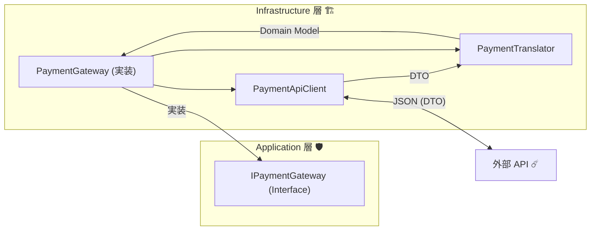
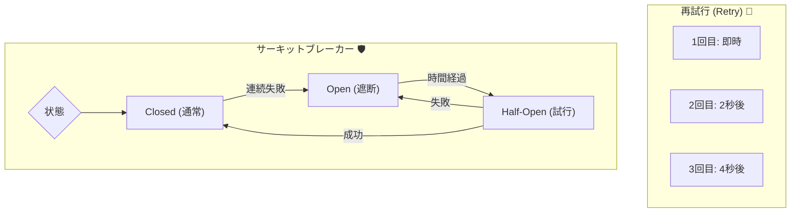

# 第18章：実装ハンズオン① 外部API統合（HttpClient + デバッグ）🌐🪲


## この章でできるようになること 🎯✨

* 外部APIを **安全に呼ぶ**（成功/失敗/タイムアウトに強くする）💪
* `HttpClient` を **正しい置き場所**（DI＋Factory）で使えるようになる 🔌
* 失敗時に **どこを見れば原因にたどり着けるか** がわかる 👀🧭
* 「外部のクセ」を内側へ持ち込まない（ACLの“境界感覚”）が身につく 🧱✨

---

### まず大事な前提：`HttpClient` の“正しい持ち方” 🧠💡

`HttpClient` を **毎回 `new` して捨てる**のは、地味に事故りやすいです（接続枯渇やDNS更新の問題など）😵‍💫
定番は次のどちらか👇

* ✅ **`IHttpClientFactory` を使う（おすすめ）**：DI・ログ・設定がきれいにまとまる ([Microsoft Learn][1])
* ✅ **Singleton `HttpClient` ＋ `PooledConnectionLifetime` 調整**：ガイドラインで推奨されるやり方もある ([Microsoft Learn][2])

この章では **`IHttpClientFactory`（Typed client）**で進めるよ〜！🫶 ([Microsoft Learn][1])

---

## 18-1. 今日の題材：クセあり決済API（モック）💳🧪

外部APIって、だいたいこういう“クセ”あるよね…って要素を入れるよ😇

* `snake_case` で返ってくる 🐍
* 金額が **cents**（1/100通貨）で来る 💰
* たまに遅い（タイムアウトさせたい）🐢
* エラーが独自フォーマットで返る 🧯

---

## 18-2. ハンズオン：モック外部APIを作る（最小の別プロジェクト）🛠️🌐

### ① プロジェクトを1つ追加する ➕

* ソリューションに `PaymentApiMock`（ASP.NET Core Minimal API）を追加
* 1つだけエンドポイントを生やす：`POST /payments`

### ② 最小モックAPI（成功/失敗/タイムアウトを切り替え）🧪

```csharp
// PaymentApiMock/Program.cs
using System.Text.Json.Serialization;

var builder = WebApplication.CreateBuilder(args);
var app = builder.Build();

app.MapPost("/payments", async (CreatePaymentRequest req, string? mode) =>
{
    // mode=timeout でわざと遅延（タイムアウト用）
    if (string.Equals(mode, "timeout", StringComparison.OrdinalIgnoreCase))
    {
        await Task.Delay(TimeSpan.FromSeconds(10));
    }

    // mode=fail でわざと失敗（400）
    if (string.Equals(mode, "fail", StringComparison.OrdinalIgnoreCase))
    {
        return Results.BadRequest(new ApiErrorResponse
        {
            error_code = "CARD_DECLINED",
            message = "カードが拒否されました",
        });
    }

    // 通常は成功（200）
    return Results.Ok(new PaymentResponse
    {
        payment_id = Guid.NewGuid().ToString("N"),
        status = "captured",
        amount_cents = req.amount_cents,
        currency = req.currency,
        processed_at_utc = DateTimeOffset.UtcNow.ToString("O"),
    });
});

app.Run();

public sealed class CreatePaymentRequest
{
    public int amount_cents { get; init; }
    public string currency { get; init; } = "JPY";
    public string token { get; init; } = ""; // 本物のカード番号は禁止だよ🧯
}

public sealed class PaymentResponse
{
    public string payment_id { get; init; } = "";
    public string status { get; init; } = "";
    public int amount_cents { get; init; }
    public string currency { get; init; } = "";
    public string processed_at_utc { get; init; } = "";
}

public sealed class ApiErrorResponse
{
    public string error_code { get; init; } = "";
    public string message { get; init; } = "";
}
```

> ここでは `snake_case` のままにして「外部DTOは外側に隔離する」練習にするよ📦✨

---

## 18-3. クライアント側：外部DTO（外側）＋ Translator（翻訳）＋ Gateway（窓口）🧱🔁



ここからがACLっぽい動き！
「外部APIを叩く役」と「内側の型へ変換する役」を分けるよ😊

### ① 外部DTO（Infrastructure側）📦

```csharp
// Infrastructure/Payments/ExternalDtos.cs
public sealed class PaymentApiCreateRequestDto
{
    public int amount_cents { get; init; }
    public string currency { get; init; } = "JPY";
    public string token { get; init; } = "";
}

public sealed class PaymentApiSuccessResponseDto
{
    public string payment_id { get; init; } = "";
    public string status { get; init; } = "";
    public int amount_cents { get; init; }
    public string currency { get; init; } = "";
    public string processed_at_utc { get; init; } = "";
}

public sealed class PaymentApiErrorResponseDto
{
    public string error_code { get; init; } = "";
    public string message { get; init; } = "";
}
```

### ② Typed client（HTTP呼び出し担当）📞🌐

ポイント👇

* `HttpClient` は DI から受け取る（`IHttpClientFactory` 経由） ([Microsoft Learn][1])
* JSONは `System.Net.Http.Json` の拡張メソッドが便利 🧁 ([Microsoft Learn][3])
* “1回だけ短いタイムアウト” を個別に設定したいときは `CancellationTokenSource` を使える ⏳ ([Microsoft Learn][4])

```csharp
// Infrastructure/Payments/PaymentApiClient.cs
using System.Net;
using System.Net.Http.Json;

public sealed class PaymentApiClient
{
    private readonly HttpClient _http;

    public PaymentApiClient(HttpClient http)
    {
        _http = http;
    }

    public async Task<PaymentApiCallResult> CreatePaymentAsync(
        PaymentApiCreateRequestDto dto,
        string? mode,
        CancellationToken ct)
    {
        // リクエスト単位で “短いタイムアウト” を掛けたい例（3秒）
        using var cts = CancellationTokenSource.CreateLinkedTokenSource(ct);
        cts.CancelAfter(TimeSpan.FromSeconds(3));

        var url = "/payments" + (mode is null ? "" : $"?mode={mode}");

        HttpResponseMessage res;
        try
        {
            res = await _http.PostAsJsonAsync(url, dto, cts.Token);
        }
        catch (TaskCanceledException) when (!ct.IsCancellationRequested)
        {
            // だいたい「タイムアウト」扱い（ユーザーキャンセルとは分ける）⏳🧯
            return PaymentApiCallResult.Timeout();
        }
        catch (HttpRequestException ex)
        {
            return PaymentApiCallResult.NetworkError(ex.Message);
        }

        if (res.IsSuccessStatusCode)
        {
            var ok = await res.Content.ReadFromJsonAsync<PaymentApiSuccessResponseDto>(cancellationToken: ct);
            return PaymentApiCallResult.Success(ok!);
        }

        if (res.StatusCode == HttpStatusCode.BadRequest)
        {
            var err = await res.Content.ReadFromJsonAsync<PaymentApiErrorResponseDto>(cancellationToken: ct);
            return PaymentApiCallResult.Failure((int)res.StatusCode, err);
        }

        // それ以外（500など）
        return PaymentApiCallResult.Failure((int)res.StatusCode, null);
    }
}

public sealed record PaymentApiCallResult(
    bool IsSuccess,
    bool IsTimeout,
    bool IsNetworkError,
    int? StatusCode,
    PaymentApiSuccessResponseDto? SuccessBody,
    PaymentApiErrorResponseDto? ErrorBody,
    string? NetworkErrorMessage)
{
    public static PaymentApiCallResult Success(PaymentApiSuccessResponseDto body)
        => new(true, false, false, 200, body, null, null);

    public static PaymentApiCallResult Failure(int statusCode, PaymentApiErrorResponseDto? body)
        => new(false, false, false, statusCode, null, body, null);

    public static PaymentApiCallResult Timeout()
        => new(false, true, false, null, null, null, null);

    public static PaymentApiCallResult NetworkError(string message)
        => new(false, false, true, null, null, null, message);
}
```

### ③ Translator（外部→内側の翻訳）🔁🧱

ここで「cents→円」「status→内側enum」みたいな“意味変換”を入れるよ💡

```csharp
// Infrastructure/Payments/PaymentTranslator.cs
public static class PaymentTranslator
{
    public static PaymentResult TranslateSuccess(PaymentApiSuccessResponseDto dto)
    {
        // cents → 円（この章は例として “1円=100cents” の世界にするね）
        var amountYen = dto.amount_cents / 100;

        return PaymentResult.Success(
            paymentId: dto.payment_id,
            amountYen: amountYen,
            status: dto.status,
            processedAtUtc: dto.processed_at_utc);
    }

    public static PaymentError TranslateError(PaymentApiErrorResponseDto? err, int? statusCode)
    {
        // 外部の error_code を “内側のエラー” に寄せる（第16〜17章の続き）
        if (err is null)
            return new PaymentError("EXTERNAL_UNKNOWN", $"外部エラー（HTTP {statusCode}）");

        return err.error_code switch
        {
            "CARD_DECLINED" => new PaymentError("PAYMENT_DENIED", err.message),
            _ => new PaymentError("EXTERNAL_UNKNOWN", err.message),
        };
    }
}

public sealed record PaymentResult(bool Ok, string? PaymentId, int? AmountYen, string? Status, string? ProcessedAtUtc, PaymentError? Error)
{
    public static PaymentResult Success(string paymentId, int amountYen, string status, string processedAtUtc)
        => new(true, paymentId, amountYen, status, processedAtUtc, null);

    public static PaymentResult Fail(PaymentError error)
        => new(false, null, null, null, null, error);
}

public sealed record PaymentError(string Code, string Message);
```

---

## 18-4. DI登録：`AddHttpClient` で設定をまとめる 🔧🧩

### ① BaseAddress と基本タイムアウト ⏱️

```csharp
// App/Program.cs など
builder.Services.AddHttpClient<PaymentApiClient>(http =>
{
    http.BaseAddress = new Uri("https://localhost:5001"); // PaymentApiMock のURLに合わせる
    http.Timeout = TimeSpan.FromSeconds(15); // 全体の上限（個別の方が短ければそっちが勝つ）
});
```

`HttpClient.Timeout` は「クライアント全体のタイムアウト」で、リクエスト単位の `CancellationTokenSource` と併用すると **短い方が適用**されるよ⏳ ([Microsoft Learn][4])

### ② DNS更新などのために Handler の寿命を整える（豆知識）🫘

ガイドライン的には `PooledConnectionLifetime` を意識すると良い場面があるよ〜🧠 ([Microsoft Learn][2])
（ただ、まずは Factory でOK！慣れてきたらで大丈夫😊）

---

## 18-5. 失敗に強くする：標準レジリエンス（リトライ等）🛡️🔁




「たまに落ちる」「たまに遅い」は日常茶飯事〜😇
.NET には **標準レジリエンス（Resilience）**のガイドがあって、`AddStandardResilienceHandler` が用意されてるよ✨ ([Microsoft Learn][5])

```csharp
// 追加で NuGet: Microsoft.Extensions.Http.Resilience
builder.Services.AddHttpClient<PaymentApiClient>(http =>
{
    http.BaseAddress = new Uri("https://localhost:5001");
})
.AddStandardResilienceHandler(); // まずは標準でOK！
```

> リトライは「二重決済」みたいな事故につながることもあるから、決済系は特に慎重にね💳🧯
> （この教材ではモックだから安心！）

---

## 18-6. ログを出す：HttpClientFactoryの“標準ログ”が強い 🪵👀

`IHttpClientFactory` で作ったクライアントは、**HTTPのログカテゴリが分かれていて見やすい**よ✨
例：`System.Net.Http.HttpClient.MyNamedClient.LogicalHandler` みたいなカテゴリで出る 📚 ([Microsoft Learn][6])

### appsettings.json（例）🧾

```json
{
  "Logging": {
    "LogLevel": {
      "Default": "Information",
      "System.Net.Http.HttpClient": "Information",
      "System.Net.Http.HttpClient.PaymentApiClient.LogicalHandler": "Information",
      "System.Net.Http.HttpClient.PaymentApiClient.ClientHandler": "Information"
    }
  }
}
```

> ヘッダーまで出すと便利だけど、機密（token等）を出さないよう注意ね🧯🔒

---

## 18-7. Visual Studio デバッグ：ここを見ると一気に楽になる 🔍🪲

### ブレークポイントおすすめ位置 📍

* `PaymentApiClient.CreatePaymentAsync` の `PostAsJsonAsync` の直前
* `res.IsSuccessStatusCode` の分岐
* `PaymentTranslator.TranslateSuccess / TranslateError`

### ウォッチおすすめ 👀

* `url`
* `res.StatusCode`
* `await res.Content.ReadAsStringAsync()`（※デバッグ中だけでOK）
* `cts.IsCancellationRequested`（タイムアウト判定の確認）⏳

### 例外で止めたい（超大事）🧨

Visual Studio の **Exception Settings** で

* `HttpRequestException`
* `TaskCanceledException`
  にチェックを入れると、「投げられた瞬間」に止まって追いやすいよ〜😌✨

---

## 18-8. 3パターン実験：成功/失敗/タイムアウトを“目で見る” 👀✅⏳

### ① 成功（200）🎉

* `mode` なしで呼ぶ
* 期待：`PaymentResult.Success(...)`

### ② 失敗（400）🧯

* `mode=fail` で呼ぶ
* 期待：外部 `CARD_DECLINED` → 内側 `PAYMENT_DENIED` に翻訳される

### ③ タイムアウト（TaskCanceled）🐢⏳

* `mode=timeout` で呼ぶ
* 期待：`PaymentApiCallResult.Timeout()` に入る
* さらに：ログとブレークで「どこで止まったか」確認！

---

## 18-9. ミニ課題（提出物）📝✨

### 課題A：デバッグスクショ3枚 📸

1. 成功時の `StatusCode=200`
2. 失敗時の `StatusCode=400` と `error_code`
3. タイムアウト時に `TaskCanceledException` が起きた瞬間

### 課題B：Translatorの改善（1つでOK）🔁

次のどれかをやってみてね👇

* `status` を内側の enum に変換する
* `processed_at_utc` を `DateTimeOffset` に変換する
* 未知の `error_code` を `EXTERNAL_UNKNOWN` に寄せる（ログも残す）

---

## 18-10. AI活用（時短だけど、判断は人間🧠✨）🤖💨

### 使いどころおすすめ

* サンプルJSONから DTO クラスを作る 📦
* `AddHttpClient` の登録コードの雛形を作る 🔧
* 「成功/失敗/タイムアウト」のテストケース案を出す ✅

### AIに投げると便利な指示（例）💬

* 「このJSONからC# DTOを `snake_case` のまま生成して」
* 「HttpClientFactoryのTyped clientの雛形を作って。例外/タイムアウトも分けたい」
* 「`CARD_DECLINED` を内側の `PAYMENT_DENIED` に翻訳する設計案を3つ」

---

## 18-11. 章末チェックリスト ✅🧼

* [ ] `HttpClient` を `new` 連打してない（DIで受け取ってる） ([Microsoft Learn][1])
* [ ] 成功/失敗/タイムアウトで分岐できた
* [ ] 外部DTOの形（snake_case）が内側に漏れてない
* [ ] エラーを“内側の言葉”に翻訳できた（第16〜17章の続き）
* [ ] HttpClientのログカテゴリを見て原因追跡できた ([Microsoft Learn][6])

---

### おまけ：今日の「最新」メモ 🆕📌

.NET 9 は **2026年1月13日**時点で最新の更新が提供されているよ（servicing update）🧰 ([support.microsoft.com][7])

[1]: https://learn.microsoft.com/en-us/dotnet/core/extensions/httpclient-factory?utm_source=chatgpt.com "Use the IHttpClientFactory - .NET"
[2]: https://learn.microsoft.com/en-us/dotnet/fundamentals/networking/http/httpclient-guidelines?utm_source=chatgpt.com "Guidelines for using HttpClient"
[3]: https://learn.microsoft.com/ja-jp/dotnet/api/system.net.http.json.httpclientjsonextensions.getfromjsonasync?view=net-8.0&utm_source=chatgpt.com "HttpClientJsonExtensions.GetFromJsonAsync メソッド"
[4]: https://learn.microsoft.com/en-us/dotnet/api/system.net.http.httpclient.timeout?view=net-10.0&utm_source=chatgpt.com "HttpClient.Timeout Property (System.Net.Http)"
[5]: https://learn.microsoft.com/en-us/dotnet/core/resilience/http-resilience?utm_source=chatgpt.com "Build resilient HTTP apps: Key development patterns - .NET"
[6]: https://learn.microsoft.com/ja-jp/aspnet/core/fundamentals/http-requests?view=aspnetcore-10.0&utm_source=chatgpt.com "ASP.NET Core で IHttpClientFactory を使用して HTTP 要求 ..."
[7]: https://support.microsoft.com/ja-jp/topic/-net-9-0-update-2026-%E5%B9%B4-1-%E6%9C%88-13-%E6%97%A5-3b5fc6c1-f08e-4550-930c-fe1c6eea3c19?utm_source=chatgpt.com ".NET 9.0 Update - 2026 年 1 月 13 日 - Microsoft サポート"
