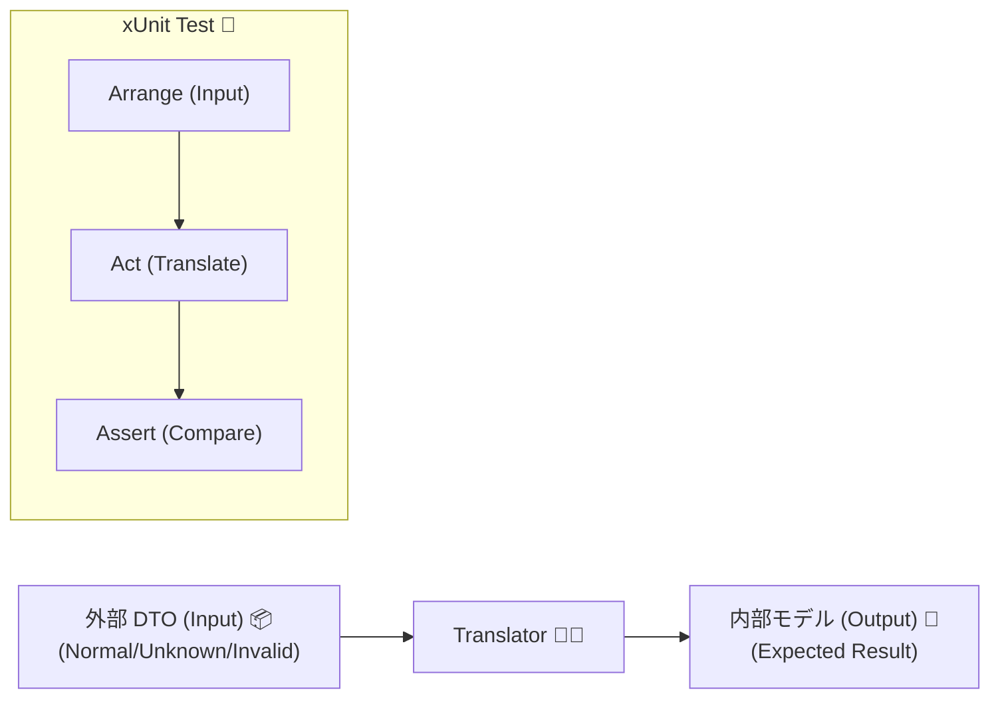
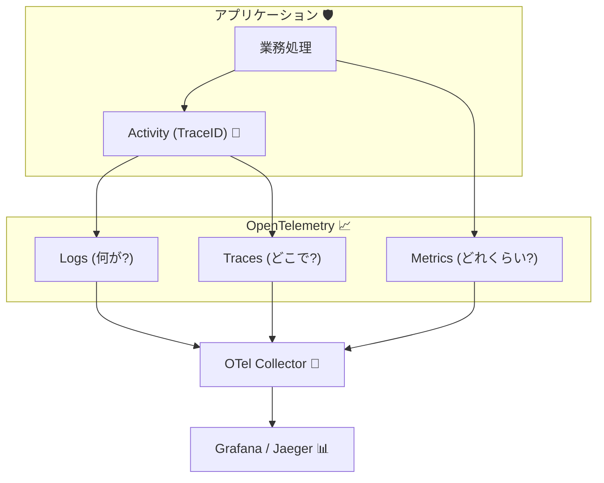

# 第20章：テスト＆運用まとめ（変換テスト・契約テスト・観測）＋最終チェックリスト🎁✅📈


## この章のゴール🎯

ACL（腐敗防止層）を **「作って終わり」じゃなく「壊れない仕組み」** にするよ〜！✨
特に、次の3つを “最小コストで” 揃えます💪😊

* **変換テスト**（Translatorの単体テスト）✅
* **契約テスト**（外部変更を早めに検知）🤝
* **観測**（ログ・相関ID・トレースで追える）👀📌

※本日時点の .NET は **.NET 10.0.2（2026/1/13）** が最新更新で、Visual Studio 2026 側の対応も明記されています。([Microsoft][1])

---

## 20-1. まず「テストの地図」🗺️✅

ACLで現場がラクになるテストは、だいたいこの4つ🌸

1. **Translator単体テスト（最重要🔥）**

   * 外部DTO → 内部ドメイン型
   * “変換ルール” を守れてるかを超高速チェック⚡

2. **ACLクライアントの統合寄りテスト（必要な分だけ）**

   * HttpClientの呼び出し・タイムアウト・リトライ設定など🌐

3. **契約テスト（Contract Test）🤝**

   * 外部の **仕様変更を「早期に」検知** したいとき
   * “重いE2E” を減らすための手段✨([Pact Docs][2])

4. **観測（Observability）👀📈**

   * ログ / メトリクス / 分散トレース（監視の3本柱）
   * 障害対応が「見える化」される！([Microsoft Learn][3])

---

## 20-2. Translator単体テストが「コスパ最強」な理由💰🔥

Translatorは、基本的にこう👇

* 入力：外部DTO（信用しない😇）
* 出力：ドメイン型（信用できる😤✨）
* 副作用：できるだけ無し（＝テストが超ラク）

だから **ここを固めると、ACLの強さが一気に上がる** よ！🧱✨

---

## 20-3. ハンズオン①：Translatorの単体テストを作る🧪✅




### (1) テストプロジェクトを用意する🧰

* xUnit でも MSTest でもOK！ここでは xUnit 例でいきます😊
* 参照関係はこんな感じが安全👇

  * `MyApp.Infrastructure`（ACL実装がいる）
  * `MyApp.Domain`（ドメイン型がいる）

### (2) テスト対象（例）：レガシー会員API → Memberドメイン🧓📼➡️🙂

ここからは例として、こんな “ありがちレガシー” を想定するよ〜😇

* `member_id` が文字列（前ゼロ・変な文字も来る）
* `status` が `"A"`, `"S"` みたいな謎コード
* `joined_at` が UTC文字列だったり、空だったり

---

### (3) Translatorの例（テストしやすい形）🧩✨

> Translatorは “なるべく純粋関数っぽく” が勝ち！🏆
> 返し方は **例外派** と **Result派** どっちでもOKにしておくね😊

#### ✅ 例A：例外派（シンプル）

```csharp
public sealed class AclTranslationException : Exception
{
    public AclTranslationException(string message) : base(message) { }
}

public sealed record LegacyMemberDto(string member_id, string? email, string? status, string? joined_at);

public enum MemberStatus { Active, Suspended, Unknown }

public sealed record Member(string Id, string Email, MemberStatus Status, DateTimeOffset JoinedAt);

public sealed class LegacyMemberTranslator
{
    public Member Translate(LegacyMemberDto dto)
    {
        if (string.IsNullOrWhiteSpace(dto.member_id))
            throw new AclTranslationException("member_id is required.");

        if (string.IsNullOrWhiteSpace(dto.email))
            throw new AclTranslationException("email is required.");

        var status = dto.status switch
        {
            "A" => MemberStatus.Active,
            "S" => MemberStatus.Suspended,
            null or "" => MemberStatus.Unknown,
            _ => MemberStatus.Unknown, // 未知値はUnknownに寄せる方針🧯
        };

        if (!DateTimeOffset.TryParse(dto.joined_at, out var joined))
            throw new AclTranslationException("joined_at is invalid.");

        return new Member(
            Id: dto.member_id.Trim(),
            Email: dto.email.Trim(),
            Status: status,
            JoinedAt: joined
        );
    }
}
```

---

### (4) テストを書く（3A：Arrange/Act/Assert）🧪✅

#### ✅ 正常系：全部マップできる？

```csharp
using Xunit;

public class LegacyMemberTranslatorTests
{
    [Fact]
    public void Translate_NormalCase_MapsAllFields()
    {
        // Arrange
        var dto = new LegacyMemberDto(
            member_id: "000123",
            email: "test@example.com",
            status: "A",
            joined_at: "2026-01-01T00:00:00+00:00"
        );
        var translator = new LegacyMemberTranslator();

        // Act
        var member = translator.Translate(dto);

        // Assert
        Assert.Equal("000123", member.Id);
        Assert.Equal("test@example.com", member.Email);
        Assert.Equal(MemberStatus.Active, member.Status);
        Assert.Equal(DateTimeOffset.Parse("2026-01-01T00:00:00+00:00"), member.JoinedAt);
    }
}
```

#### ✅ enum変換：コード→意味が合ってる？🔁

```csharp
using Xunit;

public class LegacyMemberTranslatorStatusTests
{
    [Theory]
    [InlineData("A", MemberStatus.Active)]
    [InlineData("S", MemberStatus.Suspended)]
    [InlineData("???", MemberStatus.Unknown)]
    [InlineData(null, MemberStatus.Unknown)]
    public void Translate_StatusCode_IsMappedSafely(string? code, MemberStatus expected)
    {
        var dto = new LegacyMemberDto(
            member_id: "1",
            email: "a@b.com",
            status: code,
            joined_at: "2026-01-01T00:00:00+00:00"
        );
        var translator = new LegacyMemberTranslator();

        var member = translator.Translate(dto);

        Assert.Equal(expected, member.Status);
    }
}
```

#### ✅ 欠損：弾くルールになってる？🚫

```csharp
using Xunit;

public class LegacyMemberTranslatorInvalidTests
{
    [Theory]
    [InlineData(null)]
    [InlineData("")]
    [InlineData("   ")]
    public void Translate_MissingEmail_Throws(string? email)
    {
        var dto = new LegacyMemberDto(
            member_id: "1",
            email: email,
            status: "A",
            joined_at: "2026-01-01T00:00:00+00:00"
        );
        var translator = new LegacyMemberTranslator();

        Assert.Throws<AclTranslationException>(() => translator.Translate(dto));
    }
}
```

---

## 20-4. ハンズオン②：超ライト契約テスト（まずは “サンプルJSON固定” ）📦🔒

「Pactはまだ怖い…🥺」ってときは、まずこれが超おすすめ！

### やること💡

* “実際に来る外部JSONの例” を **テストプロジェクトに同梱**
* `Deserialize → Translate` が通るかを毎回チェック✅

#### 例：`TestData/legacy_member_ok.json` を読む

```csharp
using System.Text.Json;
using Xunit;

public class LegacyMemberContractLiteTests
{
    [Fact]
    public void ContractLite_LegacySampleJson_CanTranslate()
    {
        // Arrange
        var json = File.ReadAllText("TestData/legacy_member_ok.json");
        var dto = JsonSerializer.Deserialize<LegacyMemberDto>(json)
                  ?? throw new Exception("DTO deserialization failed");

        var translator = new LegacyMemberTranslator();

        // Act
        var member = translator.Translate(dto);

        // Assert（最低限でOK✨）
        Assert.False(string.IsNullOrWhiteSpace(member.Id));
        Assert.Contains("@", member.Email);
    }
}
```

これでも **外部JSONが変わって壊れた** のを、かなり早く検知できます✅✨
（※ただし “変更を外部に伝える仕組み” まではないので、次でPact紹介するよ〜🤝）

---

## 20-5. 契約テスト入門（Pact）🤝🧪

Pactは **契約テストの定番ツール** で、ざっくり言うと👇

* **Consumer（こっち）** が「こういうリクエストするよ」「こう返してほしい」をテストで書く📝
* それが **契約（pactファイル）** になって
* **Provider（相手）** が「その契約を守れてるよ」を検証できる✅

この説明と、HTTPのサンプルコード（xUnit）も公式に載ってます。([Pact Docs][4])

### (1) Consumer側：HTTP契約を作る（公式サンプルほぼそのまま）🧩

```csharp
using PactNet;
using PactNet.Infrastructure.Outputters;
using PactNet.Verifier;
using System.Net;
using System.Net.Http;
using Xunit;

public class LegacyMemberApiConsumerPactTests
{
    private readonly IPactBuilderV4 _pactBuilder;

    public LegacyMemberApiConsumerPactTests()
    {
        var pact = Pact.V4("EC Consumer", "Legacy Member API", new PactConfig());
        _pactBuilder = pact.WithHttpInteractions();
    }

    [Fact]
    public async Task GetMember_WhenExists_ReturnsMember()
    {
        _pactBuilder
            .UponReceiving("A GET request to retrieve a member")
                .Given("There is a member with id '000123'")
                .WithRequest(HttpMethod.Get, "/members/000123")
                .WithHeader("Accept", "application/json")
            .WillRespond()
                .WithStatus(HttpStatusCode.OK)
                .WithHeader("Content-Type", "application/json; charset=utf-8")
                .WithJsonBody(new
                {
                    member_id = "000123",
                    email = "test@example.com",
                    status = "A",
                    joined_at = "2026-01-01T00:00:00+00:00"
                });

        await _pactBuilder.VerifyAsync(async ctx =>
        {
            // ここは「HTTPを叩くクライアント」だけをテスト対象にするのがコツ✨
            var client = new HttpClient { BaseAddress = ctx.MockServerUri };

            var res = await client.GetAsync("/members/000123");
            var body = await res.Content.ReadAsStringAsync();

            Assert.Equal(HttpStatusCode.OK, res.StatusCode);
            Assert.Contains("member_id", body);
        });
    }
}
```

> ポイント💡：Pactは **「構造の契約」** を見るもの！
> ビジネスロジックは別テストでOKだよ😊（公式もこの考え方を推してるよ）([Pact Docs][5])

### (2) Provider側：契約を守れてるか検証✅

Provider検証の公式サンプルもあります。([Pact Docs][4])
**超重要注意⚠️**：Provider検証では **in-memory の TestServer / WebApplicationFactory が使えない** ことがあります（内部でネイティブが実HTTPアクセスするため）。公式にも注意書きがあります。([Pact Docs][4])

---

## 20-6. 観測（ログ・相関ID・トレース）を最低限入れる👀🧵📈




.NETの観測は、ざっくりこの3本柱✨

* **ログ**（何が起きた？）
* **メトリクス**（どれくらい？）
* **分散トレース**（どこで時間使った？）

OpenTelemetry（OTel）は、そのための標準です。([Microsoft Learn][3])

### (1) 相関ID（Correlation ID）を “通す” 🧵✨

**ACLが絡むと**「外部API失敗」が “どの注文/どの処理のもの？” って追跡が大変😵‍💫
だから **ログに相関IDを必ず混ぜる** のが超大事！

#### 例：ILogger の Scopeでまとめて付ける📌

```csharp
using Microsoft.Extensions.Logging;
using System.Diagnostics;

public sealed class LegacyMemberAcl
{
    private readonly ILogger<LegacyMemberAcl> _logger;

    public LegacyMemberAcl(ILogger<LegacyMemberAcl> logger)
    {
        _logger = logger;
    }

    public void Example(string memberId)
    {
        var traceId = Activity.Current?.TraceId.ToString() ?? Guid.NewGuid().ToString("N");

        using (_logger.BeginScope(new Dictionary<string, object>
        {
            ["correlationId"] = traceId,
            ["memberId"] = memberId
        }))
        {
            _logger.LogInformation("Calling Legacy Member API...");
            // 外部呼び出し…
        }
    }
}
```

### (2) トレース：ActivitySource をちょい足し🧭✨

OTelの .NET 実装は **ILogger / Meter / ActivitySource** を使うよ、って公式に書かれてます。([Microsoft Learn][3])
ACLの外部呼び出しを Activity にすると、あとで追いやすい〜！👀

---

## 20-7. 運用で詰まらないための「回復性」も最低限🛟🌊

外部APIは **落ちる・遅い・混む** が普通😇
.NET には `Microsoft.Extensions.Http.Resilience` があって、HttpClient向けに回復性（リトライ/タイムアウト等）を入れられます。([Microsoft Learn][6])

### 例：標準ハンドラーを付ける（超ラク）⚡

```csharp
using Microsoft.Extensions.DependencyInjection;

builder.Services
    .AddHttpClient("LegacyMemberApi", client =>
    {
        client.BaseAddress = new Uri("https://example.com");
    })
    .AddStandardResilienceHandler(); // リトライ等が標準セットで入る✨
```

> 注意⚠️：POSTみたいな “安全じゃないメソッド” にリトライをかけると二重登録事故が起きがち。
> そのため「特定メソッドのリトライ無効」も公式で案内されてます。([Microsoft Learn][6])

---

## 20-8. ミニ課題🎓📝（自己採点つき💯）

### 課題A：Translatorテストを “3種類” 揃える✅

* ✅ 正常系（1本）
* ✅ enum/未知値（Theoryで3〜5本）
* ✅ 欠損/不正（2〜3本）

**自己採点💯**：

* 0点：正常系だけ
* 50点：未知値か欠損どちらかが弱い
* 100点：未知値も欠損も方針通りに固めた✨

### 課題B：相関IDをログに出す🧵

* ログに `correlationId` が毎回入るようにする✅
* “外部呼び出し開始/成功/失敗” の3点が分かるようにする👀

---

## 20-9. AI活用（テストはAIで増やしてOK、判断は人間🧠✨）🤖✅

使いどころはこんな感じが最強💪

* 🤖 **テストケース案を大量に出させる**（境界値・未知値・欠損パターン）
* 🤖 **xUnitのTheory/InlineDataを整形させる**
* 🤖 **ログメッセージの案を複数出させる**
* 🧠 でも **「Unknownにする？エラーにする？」みたいな仕様の最終判断は人間**（ここがACLの魂🔥）

---

## 20-10. 最終チェックリスト（ACL導入チェック✅🧼🧱）

### 🧱 変換（Translator）

* [ ] 外部DTOを内側に漏らしてない（DTO直通禁止🙅‍♀️）
* [ ] 形の変換（命名/構造）と意味の変換（単位/時刻）が分離されてる
* [ ] 未知値（enum/コード）が来ても落ちない（Unknown方針がある）🧯
* [ ] null/欠損/不正値の方針が決まってる（弾く/補正/既定）✅

### 🧪 テスト

* [ ] Translator単体テストが厚い（正常/未知/欠損）🔥
* [ ] サンプルJSON固定テスト（超ライト契約）を1本は持ってる📦
* [ ] 可能ならPactなど契約テストを導入して “変更検知” を早めてる🤝([Pact Docs][4])

### 👀 観測

* [ ] ログに相関IDが入って追跡できる🧵
* [ ] 外部呼び出しの成功/失敗がログで分かる
* [ ] （できれば）トレース/メトリクスも視野（OTel）([Microsoft Learn][3])

### 🛟 回復性（運用）

* [ ] タイムアウト・リトライ・サーキットブレーカー等の方針がある
* [ ] HttpClientに回復性を入れてる（必要最低限でOK）([Microsoft Learn][6])

---

[1]: https://dotnet.microsoft.com/en-US/download/dotnet/10.0 "Download .NET 10.0 (Linux, macOS, and Windows) | .NET"
[2]: https://docs.pact.io/?utm_source=chatgpt.com "Pact Docs: Introduction"
[3]: https://learn.microsoft.com/ja-jp/dotnet/core/diagnostics/observability-with-otel "OpenTelemetry を使用した .NET の監視 - .NET | Microsoft Learn"
[4]: https://docs.pact.io/implementation_guides/net/readme "README | Pact Docs"
[5]: https://docs.pact.io/consumer?utm_source=chatgpt.com "Writing Consumer tests"
[6]: https://learn.microsoft.com/ja-jp/dotnet/core/resilience/http-resilience "回復性がある HTTP アプリを構築する: 主要な開発パターン - .NET | Microsoft Learn"
