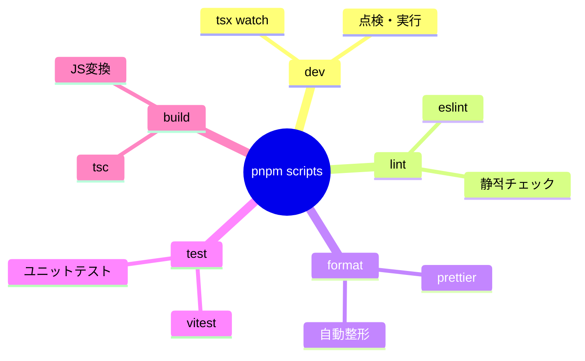
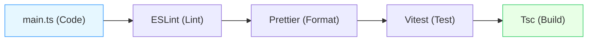
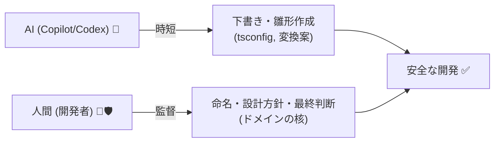

# 第03章：Windows＋VS Code＋TypeScript(2026)の最小セットアップ 🧰🪟

## この章のゴール 🎯✨

この章を終えると、次の状態になります👇

* TypeScriptプロジェクトが作れる ✅
* `lint / format / test` がコマンド一発で回る ✅🧪
* VS Codeで「保存したら整形」までできる ✅💅
* Copilot（やCodexなどのエージェント）を“安全に”使うためのルールが入る ✅🤖🛡️

---

# 1) まずはターミナルを整える（あると快適）⌨️✨

Windows Terminalがあると、PowerShellもGitも見やすくなって楽ちんです🫶
（すでにあるなら飛ばしてOK！）

PowerShellで👇

```powershell
winget install -e --id Microsoft.WindowsTerminal
```

`winget` の使い方（`--id` と `-e` で正確指定すると安心）も公式で案内されています📌 ([Microsoft Learn][1])

---

# 2) Node.js（LTS）を入れる 🟩

TypeScriptや各種ツールはNode.js上で動きます💡
2026-01-29時点では **Node.js v24 がActive LTS** で、LTSの最新は **v24.13.0** が案内されています。 ([Node.js][2])

インストールは `winget` がラクです👇（管理者権限が必要なこともあります）

```powershell
winget install -e --id OpenJS.NodeJS.LTS
```

入ったかチェック✅

```powershell
node -v
npm -v
```

---

# 3) パッケージマネージャ（pnpm）を使えるようにする 📦✨

Node.js には **Corepack** が付いていて、pnpm/yarn を安全に使えます👍
（Node 25 からはCorepackが同梱されない流れもあるので、LTSで進めるのが安定です） ([Node.js][3])

まず有効化👇

```powershell
corepack enable
pnpm -v
```

---

# 4) VS Code を入れる（入ってたらスキップOK）🧩💙

VS Code の安定版は 2026-01-08 リリースの **1.108** が案内されています。 ([Visual Studio Code][4])

```powershell
winget install -e --id Microsoft.VisualStudioCode
```

---

# 5) 最小プロジェクトを作る 🏗️✨

フォルダ作って入る👇

```powershell
mkdir acl-ts-starter
cd acl-ts-starter
```

`package.json` を作る👇

```powershell
npm init -y
```

TypeScriptの最新安定版は npm で **5.9.3** が案内されています。 ([npmjs.com][5])
必要ツールを入れる👇（開発用）

```powershell
pnpm add -D typescript tsx @types/node
```

> `tsx` は TypeScript を「すぐ実行」できて便利だよ〜💨（ビルド無しで動かせる）

---

# 6) tsconfig を用意する ⚙️🧠

TypeScript 5.9 では Node向けに `--module node20` が用意されていて、**Node 20の挙動に合わせた“安定モード”**として紹介されています。 ([Microsoft for Developers][6])
（`nodenext` は“最新Node仕様に追従”なので、最初は node20 がわかりやすい✨）

初期生成👇

```powershell
pnpm exec tsc --init --rootDir src --outDir dist --module node20 --moduleResolution nodenext --strict
```

補足：`--module node20` を選ぶと `target` が `es2023` になる、という説明もあります📝 ([typescriptlang.org][7])

`src` フォルダと、動作確認ファイルを作る👇

```powershell
mkdir src
notepad src\main.ts
```

中身👇（とりあえず動けばOK✨）

```ts
export const hello = (name: string) => `Hello, ${name}!`;

console.log(hello("ACL"));
```

実行してみよ〜🚀

```powershell
pnpm exec tsx src/main.ts
```

---

# 7) ESLint（TypeScript対応）を入れる 🧹✨

TypeScript向けESLintの最短セットは公式の Quickstart が超わかりやすいです📘 ([typescript-eslint.io][8])

インストール👇

```powershell
pnpm add -D eslint @eslint/js typescript-eslint
```

設定ファイル `eslint.config.mjs` を作成👇（ルート直下）

```js
// @ts-check

import eslint from "@eslint/js";
import { defineConfig } from "eslint/config";
import tseslint from "typescript-eslint";

export default defineConfig(
  eslint.configs.recommended,
  tseslint.configs.recommended,
);
```

これで `pnpm exec eslint .` が動くようになります✅ ([typescript-eslint.io][8])

---

# 8) Prettier（自動整形）を入れる 💅✨

Prettierは「コード整形担当」🫧
ESLintと一緒に使うときは、整形系の衝突を避けるための構成が推奨されています。 ([Prettier][9])

インストール👇

```powershell
pnpm add -D prettier eslint-config-prettier
```

`eslint.config.mjs` に **最後に** 追加👇（“衝突をOFFにする”役）

```js
import eslintConfigPrettier from "eslint-config-prettier";

// ...上の defineConfig(...) の最後に追加
export default defineConfig(
  eslint.configs.recommended,
  tseslint.configs.recommended,
  eslintConfigPrettier,
);
```

`.prettierrc.json`（好みでOKだけど、最初はこれくらいが無難）✨

```json
{
  "semi": true,
  "singleQuote": false,
  "printWidth": 100
}
```

---

# 9) テスト（Vitest）を入れる 🧪🔥

ユニットテストはACLの“変換ロジック”を守る最強の武器になります🛡️
VitestのGetting Startedも公式がまとまってます。 ([Vitest][10])

```powershell
pnpm add -D vitest
```

`src/main.test.ts` を作って👇

```ts
import { describe, it, expect } from "vitest";
import { hello } from "./main";

describe("hello", () => {
  it("名前を入れると挨拶になる", () => {
    expect(hello("ACL")).toBe("Hello, ACL!");
  });
});
```

実行👇

```powershell
pnpm exec vitest
```

---

# 10) package.json に “よく使うコマンド” を登録する 🧾✨

毎回 `pnpm exec ...` って打つの面倒なので、スクリプト化します💡
`package.json` の `"scripts"` をこうしてね👇

```json
{
  "scripts": {
    "dev": "tsx watch src/main.ts",
    "lint": "eslint .",
    "format": "prettier . --write",
    "test": "vitest",
    "build": "tsc -p .",
    "start": "node dist/main.js"
  }
}
```

これで👇が使える🎉

* `pnpm dev`（監視で実行）👀
* `pnpm lint`（静的チェック）🧹
* `pnpm format`（整形）💅
* `pnpm test`（テスト）🧪
* `pnpm build`（distへ出力）📦



---

# 11) VS Code のおすすめ拡張 🧩💖

最低限これがあると強いよ〜✨


* ESLint ✅（警告がその場で出る）
* Prettier ✅（保存で整形）
* Vitest（任意）🧪（テストが見やすい）
* GitHub Copilot ✅🤖（コード補完＆チャット） ([Visual Studio Code][11])



## 保存で自動整形（おすすめ）💾✨

VS Code設定で👇をONにすると気持ちいいです🫶

* Format On Save
* ESLint: Fix All On Save（可能なら）

---

# 12) Copilot / Codex など“AI導入済み”前提の進め方 🤖🧠✨



AIは便利だけど、**そのまま採用すると事故る**ことがあるので、ここだけルール化しておくよ〜🚦

## ✅ AIにやってもらってOKなこと（時短！）

* tsconfig / eslint / prettier のひな形作成🧩
* テストケースの候補出し🧪
* 変換ロジックの「パターン提案」🔁

## ⚠️ 人間が必ずチェックすること（超大事）

* “ドメインの言葉”の命名（ここがACLの核）📘
* エラー方針（落とす？代替？隔離？）🔥
* 外部仕様の読み違い（AIはそれっぽく嘘つく時ある😇）

## AIの使い方（コピペして使ってOK）📝✨

* 「Node 24 LTS / TypeScript 5.9.x 前提で、ESMの最小構成を作って。tsconfig / eslint / prettier / vitest を揃えて、必要ファイルを全部出して」
* 「この `external DTO` を `domain model` に変換する関数を作りたい。null/欠損/未知コードの扱い方針を3案出して」
* 「この変換のユニットテスト観点を列挙して。正常系3、異常系5で」

## ちょい上級：VS Codeの“Plan”やエージェント機能 🧠🗺️

VS Code には「計画→実装」みたいに進められる **Plan（プラン）** 系の機能も案内されています。 ([Visual Studio Code][12])
また、**OpenAI Codex** を VS Code のエージェントとして使う案内もあり、Copilot Pro+ と VS Code Insiders で使える形が説明されています。 ([The GitHub Blog][13])

---

# 13) よくある詰まりポイント集 😵‍💫➡️😄

* **`pnpm: command not found`**
  → `corepack enable` をもう一回✅ ([Node.js][3])
* **ESM/CJSが混ざってエラー**
  → 最初は “ESM寄せ（.mjs / node20 + nodenext）” に統一すると迷いが減る🧠 ([typescriptlang.org][14])
* **ESLintが設定を読まない**
  → ファイル名が `eslint.config.mjs` になってるか確認✅ ([typescript-eslint.io][8])

---

# 14) できたかチェックリスト ✅🎉

* `node -v` が表示される 🟩 ([Node.js][2])
* `pnpm -v` が表示される 📦 ([Node.js][3])
* `pnpm dev` で `Hello, ACL!` が出る 🚀
* `pnpm lint` が動く 🧹 ([typescript-eslint.io][8])
* `pnpm format` で整形される 💅 ([Prettier][9])
* `pnpm test` が通る 🧪 ([Vitest][10])

---

[1]: https://learn.microsoft.com/ja-jp/windows/package-manager/winget/install?utm_source=chatgpt.com "install コマンド (winget)"
[2]: https://nodejs.org/en/about/previous-releases?utm_source=chatgpt.com "Node.js Releases"
[3]: https://nodejs.org/api/corepack.html?utm_source=chatgpt.com "nodejs/corepack: Package manager version ..."
[4]: https://code.visualstudio.com/updates?utm_source=chatgpt.com "December 2025 (version 1.108)"
[5]: https://www.npmjs.com/package/typescript?activeTab=versions&utm_source=chatgpt.com "typescript"
[6]: https://devblogs.microsoft.com/typescript/announcing-typescript-5-9/?utm_source=chatgpt.com "Announcing TypeScript 5.9"
[7]: https://www.typescriptlang.org/docs/handbook/compiler-options.html?utm_source=chatgpt.com "Documentation - tsc CLI Options"
[8]: https://typescript-eslint.io/getting-started/ "Getting Started | typescript-eslint"
[9]: https://prettier.io/docs/integrating-with-linters?utm_source=chatgpt.com "Integrating with Linters"
[10]: https://vitest.dev/guide/?utm_source=chatgpt.com "Getting Started | Guide"
[11]: https://code.visualstudio.com/docs/copilot/overview?utm_source=chatgpt.com "GitHub Copilot in VS Code"
[12]: https://code.visualstudio.com/docs/copilot/chat/chat-planning?utm_source=chatgpt.com "Planning in VS Code chat"
[13]: https://github.blog/news-insights/company-news/welcome-home-agents/?utm_source=chatgpt.com "Introducing Agent HQ: Any agent, any way you work"
[14]: https://www.typescriptlang.org/docs/handbook/modules/reference.html?utm_source=chatgpt.com "Documentation - Modules - Reference"
