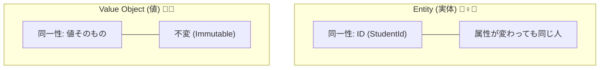
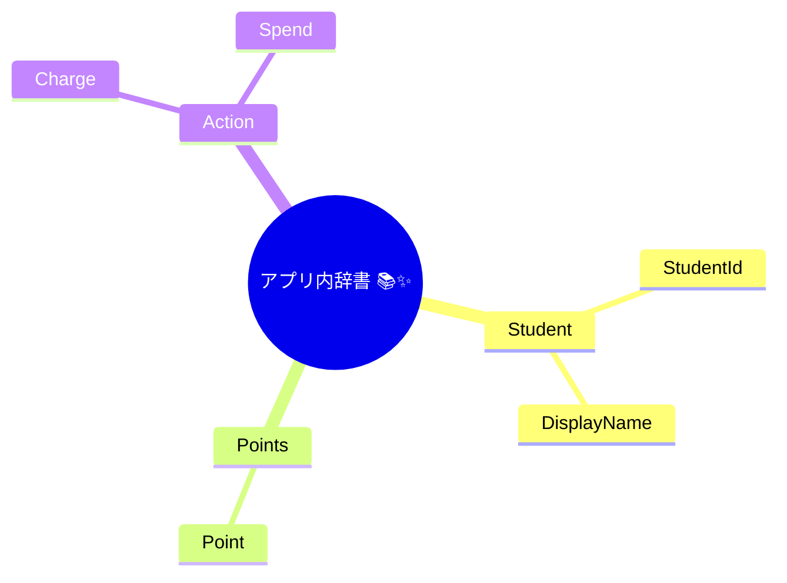
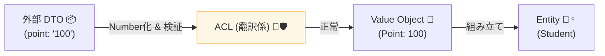

# 第07章：最低限のドメインモデリング（Entity/ValueObject超入門）🧩📌

## この章のゴール 🎯✨

* **Entity（実体）** と **Value Object（値）** の違いを、例で説明できるようになる🙆‍♀️
* 「ドメインに入っていい言葉（＝内側の辞書📚）」を決められるようになる📝
* 外部データが来ても、**内側の型が崩れない**“最小の土台”を作れるようになる🧱✨

---

## まず最初に：ドメインってなに？🧠💭

ここで言う「ドメイン」は、アプリが扱う**自分たちの世界のルール**のことだよ〜🌍✨
例：学食ポイントなら…

* ポイントは **0以上** じゃないと変だよね？😵‍💫
* 学生IDは **形式が決まってる** よね？🪪
* “残高不足”って、ただのエラーじゃなくて **意味のある失敗** だよね？💡

こういう **当たり前のルール** を、コードでも守れるようにしていくよ✅

---

# 7-1. Entity と Value Object の違い（ここ超大事！）🧠💥




## Entity（エンティティ）🧍‍♀️🪪

* **IDで同一性が決まる存在**
* 中の値（名前とか残高）が変わっても、**同じIDなら同じ人**って扱う

例：Student（学生）

* StudentId が同じなら「同じ学生」✅
* 名前が変わっても、同じ学生だよね（改姓とか）📝

## Value Object（値オブジェクト）💎✨

* **値そのものが同一性**
* だいたい **不変（immutable）** にして、作ったら変えないのが基本🙅‍♀️

例：Money / Point / StudentId

* `Point(100)` は `Point(100)` と同じ意味✅
* `StudentId("S12345")` は、それ自体が“意味のある値”🪪✨

---

# 7-2. 「内側に入っていい言葉」を決めよう（ドメイン辞書📚）📝✨

外部APIって、こういう“クセ”があるよね…😇

* `stu_kbn` とか謎の略語👻
* `"1"` / `"2"` の謎コード🔤
* `point: "100"` みたいに型が文字列😭

でも内側（ドメイン）では、こうしたい👇✨

* `studentType`
* `StudentType.Undergrad`
* `Point(100)`

この章では、まず **内側の単語** を決めるよ📚💖

**例：学食ポイント（内側の辞書）**


* Student（学生）🎓
* StudentId（学生ID）🪪
* Point（ポイント）🍱
* Money（金額）💴
* Charge（チャージ）➕
* Spend（消費）➖



この辞書にない単語（例：`stu_kbn`）は、**内側に入れない**が合格💯✨
それはACLが“翻訳”してから入れる役目になるよ🧱🛡️

---

# 7-3. TypeScriptで Value Object を作る（最小の型安全）🧩✨

## “作るときに守る”が基本ルール 🔒✅


Value Objectは、作る瞬間にルールチェックしておくと強いよ💪
（あとで `if` 地獄になりにくい🌀）

ここでは「失敗するかも」を安全に返すために、超シンプルな `Result` を使うよ📦✨

```ts
// src/domain/shared/Result.ts
export type Result<T, E> =
  | { ok: true; value: T }
  | { ok: false; error: E };

export const ok = <T>(value: T): Result<T, never> => ({ ok: true, value });
export const err = <E>(error: E): Result<never, E> => ({ ok: false, error });
```

---

## ① StudentId（学生ID）🪪✨

例：`S` + 数字5桁（S12345 みたいな感じ）にしてみるよ〜🎓
（ルールは題材に合わせて自由に変えてOK！）

```ts
// src/domain/valueObjects/StudentId.ts
import { Result, ok, err } from "../shared/Result";

export type StudentIdError =
  | { kind: "Empty" }
  | { kind: "InvalidFormat"; value: string };

export class StudentId {
  private constructor(private readonly value: string) {}

  static parse(raw: string): Result<StudentId, StudentIdError> {
    const v = raw.trim();
    if (v.length === 0) return err({ kind: "Empty" });

    // 例: S + 5桁
    if (!/^S\d{5}$/.test(v)) return err({ kind: "InvalidFormat", value: v });

    return ok(new StudentId(v));
  }

  toString(): string {
    return this.value;
  }

  equals(other: StudentId): boolean {
    return this.value === other.value;
  }
}
```

✅ ポイント：`constructor` を `private` にして、**必ず parse を通させる**
これだけで「変なIDが内側に入る事故」が激減するよ🛡️✨

---

## ② Point（ポイント）🍱✨

ポイントは **0以上の整数** だけ許す！

```ts
// src/domain/valueObjects/Point.ts
import { Result, ok, err } from "../shared/Result";

export type PointError =
  | { kind: "NotInteger"; value: number }
  | { kind: "Negative"; value: number };

export class Point {
  private constructor(private readonly value: number) {}

  static of(raw: number): Result<Point, PointError> {
    if (!Number.isInteger(raw)) return err({ kind: "NotInteger", value: raw });
    if (raw < 0) return err({ kind: "Negative", value: raw });
    return ok(new Point(raw));
  }

  toNumber(): number {
    return this.value;
  }

  add(other: Point): Point {
    // value objectは“新しい値”を返す（作り直す）✨
    return new Point(this.value + other.value);
  }

  subtract(other: Point): Result<Point, { kind: "Insufficient"; current: number; needed: number }> {
    const next = this.value - other.value;
    if (next < 0) return err({ kind: "Insufficient", current: this.value, needed: other.value });
    return ok(new Point(next));
  }

  equals(other: Point): boolean {
    return this.value === other.value;
  }
}
```

🍀 ここで大事なのは「**減らしたらマイナスになる**」を **Point自身が拒否できる**こと！
これが“ドメインの強さ”だよ💪✨

---

# 7-4. Entity を作る（IDで同一性）🧍‍♀️🪪✨

## Student（学生）🎓


Studentは「IDで同一」だからEntityだよ〜📌

```ts
// src/domain/entities/Student.ts
import { StudentId } from "../valueObjects/StudentId";
import { Point } from "../valueObjects/Point";
import { Result, err, ok } from "../shared/Result";

export type SpendPointError =
  | { kind: "InsufficientPoint"; current: number; needed: number };

export class Student {
  private constructor(
    public readonly id: StudentId,
    public readonly displayName: string,
    private readonly point: Point
  ) {}

  static create(params: {
    id: StudentId;
    displayName: string;
    point: Point;
  }): Student {
    // ここでは名前の厳密バリデーションは省略（必要なら追加OK）
    return new Student(params.id, params.displayName, params.point);
  }

  getPoint(): Point {
    return this.point;
  }

  chargePoint(add: Point): Student {
    // Entityは状態が変わる存在だけど、ここでは“新しいStudentを返す”にしてもOK✨
    // （イミュータブル寄りの書き方）
    return new Student(this.id, this.displayName, this.point.add(add));
  }

  spendPoint(need: Point): Result<Student, SpendPointError> {
    const next = this.point.subtract(need);
    if (!next.ok) {
      return err({
        kind: "InsufficientPoint",
        current: next.error.current,
        needed: next.error.needed,
      });
    }
    return ok(new Student(this.id, this.displayName, next.value));
  }

  sameIdentityAs(other: Student): boolean {
    return this.id.equals(other.id);
  }
}
```

✅ ここまでで、内側の世界はこうなるよ✨

* 学生IDは `StudentId`
* ポイントは `Point`
* 変な値は作れない（or 作れたとしても Result で止まる）🛑

---

# 7-5. これがACLで効く理由（“入口で翻訳→内側は型で守る”）🧱🛡️✨


外部が例えばこう返してきたとするね👇😇

```ts
// 外部DTO（例）
type ExternalStudentDto = {
  student_id: string;    // "S12345"
  name: string;          // "Komiya"
  point: string;         // "100" ←文字列！
};
```

内側はこうしたい👇✨

* `student_id` は `StudentId` に
* `point` は number に直して `Point` に
* 失敗したら **内側に入れない** ✅

（マッピング詳細は後の章でガッツリやるけど、イメージだけ先に！）

```ts
import { StudentId } from "../domain/valueObjects/StudentId";
import { Point } from "../domain/valueObjects/Point";
import { Student } from "../domain/entities/Student";
import { Result, err, ok } from "../domain/shared/Result";

type MapError = { kind: "InvalidDto"; reason: string };

export function mapStudent(dto: ExternalStudentDto): Result<Student, MapError> {
  const id = StudentId.parse(dto.student_id);
  if (!id.ok) return err({ kind: "InvalidDto", reason: "student_id is invalid" });

  const pNum = Number(dto.point);
  if (!Number.isFinite(pNum)) return err({ kind: "InvalidDto", reason: "point is not a number" });

  const p = Point.of(pNum);
  if (!p.ok) return err({ kind: "InvalidDto", reason: "point is invalid (negative or not int)" });

  return ok(
    Student.create({
      id: id.value,
      displayName: dto.name.trim(),
      point: p.value,
    })
  );
}
```

これができると、ACLで翻訳した後の世界は **ずっとキレイ**🥹✨
外部のクセ（`point: "100"` とか）を内側に持ち込まないで済むよ🧼🛡️



---

# 7-6. よくあるつまずきポイント（あるある😇）🌀

## ① なんでも `string` / `number` のままにしちゃう（プリミティブ地獄）🫠


* `studentId: string` とか `point: number` のままだと
  外部の変な値が **いつでも侵入できちゃう**😵‍💫
  → 「意味のある値」は Value Object にしよう💎✨

## ② Value Object を “あとで修正できる” 形にする🙅‍♀️

* `point.value = -1` みたいにできたら終わり😭
  → `private readonly` で閉じ込める🔒✨

## ③ equals（同値判定）を忘れる🤝

* VOは「値が同じなら同じ」だから `equals()` を用意しておくと混乱しにくいよ🧠✨

---

# 7-7. ミニ演習（手を動かすよ〜！）🧪🔥

## 演習A：StudentId のルールを変更してみよう🪪🛠️

* 今は `S\d{5}`
* これを `STU-\d{6}`（例：STU-000123）に変えてみてね✨

チェック✅

* 空文字は弾ける？
* 形式が違うと `ok: false` になる？

---

## 演習B：Point に “上限” を足してみよう🍱🔒

例：ポイントは **最大 9999** まで、にしたい！

* `Point.of(10000)` は失敗にしてみよう😇

---

## 演習C：Student に “表示名変更” を足してみよう📝✨

`rename(newName: string)` を追加して、空文字は弾く！
（空文字のときは `Result` で失敗返しにしてみてね📦）

---

## 演習D：DTO→ドメイン変換で “何が原因か” をもっと分かりやすくしてみよう🔍✨

`reason` を固定文字列じゃなくて、もう少し詳しくしてみる（例：`student_id invalid format`）🛠️

---

# 7-8. AI拡張での進め方（ラクしてOK、でも監督は人間！）🤖🛡️✨

## 使える指示（コピペOK）📋💖


* 「学食ポイントドメインでValue Object候補を10個出して。型と不変条件（0以上など）も添えて」
* 「StudentIdのparse関数を、失敗理由が分かるResult型で作って」
* 「Pointのテスト観点を列挙して（正常系/異常系/境界値）」

✅ コツ：AIが出したコードは、**“内側の辞書”に合ってるか**だけ最初にチェックしてね📚✨
（ここズレると、内側が外部語で汚れがち😇）

---

# 7-9. まとめ 🧼✨

* **Entity**：IDで同一性（Student）🪪
* **Value Object**：値で同一性（StudentId / Point）💎
* **作るときに守る**（parse/ofで弾く）🔒
* これができると、ACLで翻訳したあと **内側がずっと型安全**になる🧱🛡️✨

---

## ちょい最新メモ（TypeScriptまわり）🧠🆕

* TypeScript の最新安定版は **5.9.3** として公開されているよ（npmのLatest表記）。([npmjs.com][1])
* Node.js は **v24 がActive LTS**、v22がMaintenance LTS という位置づけで整理されているよ（公式のリリース表）。([nodejs.org][2])
* TypeScript は近年、怪しい条件式をコンパイル時に検出するなど、型チェックの強化が継続しているよ（例：5.6の変更点）。([typescriptlang.org][3])

[1]: https://www.npmjs.com/package/typescript?utm_source=chatgpt.com "TypeScript"
[2]: https://nodejs.org/en/about/previous-releases?utm_source=chatgpt.com "Node.js Releases"
[3]: https://www.typescriptlang.org/docs/handbook/release-notes/typescript-5-6.html?utm_source=chatgpt.com "Documentation - TypeScript 5.6"
