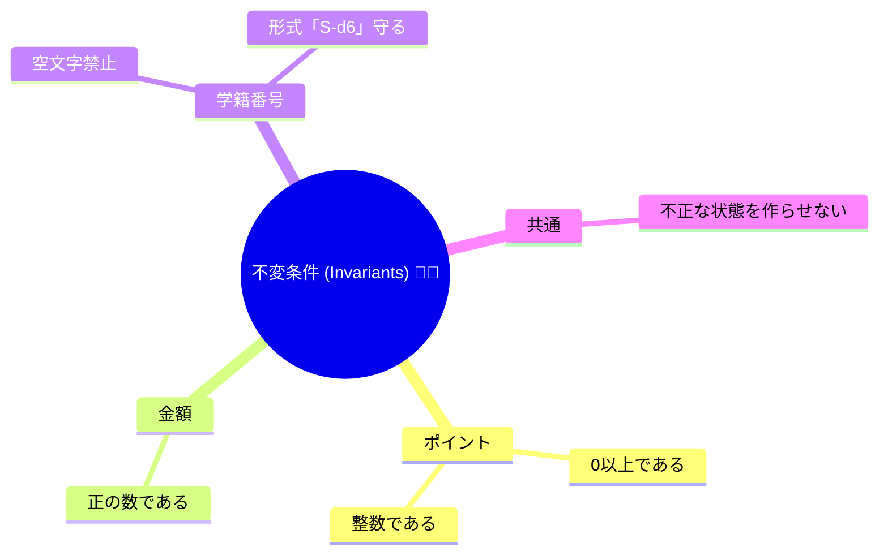
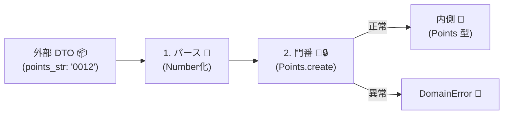

# 第08章：不変条件（Invariants）を“入口で守る”ってどういうこと？🚫🔒

## この章でできるようになること 🎯✨

* 「不変条件（Invariant）」が何かを、ちゃんと説明できる 🗣️📘
* ルール（例：ポイントは0以上💳）を **コードの“入口”で保証する** 書き方がわかる 🚪✅
* 「ifだらけ地獄🌀」を卒業して、変更に強い形にできる 🧱💪
* ACL（翻訳＋防波堤🛡️）で **外から来たデータを“内側のルール”に合わせて通す** 感覚がつかめる 🔁✨

---

# 1) 不変条件ってなに？🤔💡

不変条件（Invariant）っていうのは、ざっくり言うと…

> **その世界（ドメイン）のルールとして、いつでも守られててほしい条件** 📌✨
 




たとえば「学食ポイント」みたいな題材なら👇

* ポイントは **0以上** 🪙（マイナスはダメ🙅‍♀️）
* 金額は **正の数** 💴（0円支払いは変🙃）
* 学籍番号は **形式が決まってる** 🎓（空文字はダメ🙅‍♀️）

ここで大事なのは、**“どこでも守る”じゃなくて、“入口で守る”** って考え方！🚪🔒
いったん中に入ったら「もう正しい前提で書ける」状態を作るのがコツだよ〜✨😊

---

# 2) ルールが散るとどうなる？（ifだらけ地獄🌀😵）


ありがちな失敗👇

* いろんな場所で `if (points < 0) ...` が出てくる
* 直したいルールが出たとき、修正箇所が探しきれない 🔍💦
* “たまたま通っちゃう” バグが増える 🐛💥
* テストも増えすぎてつらい 🧪😭

つまり…
**「守るべきルールが、コードのあちこちに散らばってる」のが問題** なんだよね🧹🧯

---

# 3) “入口で守る”ってどこ？🚪✨


「入口」って、具体的にはここ👇

## (A) 値が生まれる場所（生成）✨

* DTO → ドメイン型に変換するとき（ACLの中が多い）🛡️
* 画面入力 → ドメイン型にするとき 🖊️
* DBの値 → ドメイン型に復元するとき 💾

## (B) 値が変わる場所（更新）🔁

* Entityのメソッド（例：ポイントを使う）
* ユースケース（例：決済処理）

ここで守れたら、**内側はスッキリ**するよ〜🌸✨

---

# 4) まず結論：不変条件は「型（Value Object）に閉じ込める」🧩🔒

## ✨おすすめ形：Value Object を作って “不正な状態を作れなくする”

ポイントをただの `number` で持つと、-999も入っちゃう😇
だから **`Points` 型を作って**、そこで必ずチェックする✅

---

# 5) 実装例：Result型で「成功/失敗」を返す（例外地獄回避🧯✨）

## 5-1) Result型（ミニ）📦


```ts
// Result 型（超ミニ）🌱
export type Ok<T> = { ok: true; value: T };
export type Err<E> = { ok: false; error: E };
export type Result<T, E> = Ok<T> | Err<E>;

export const ok = <T>(value: T): Ok<T> => ({ ok: true, value });
export const err = <E>(error: E): Err<E> => ({ ok: false, error });
```

## 5-2) ドメインエラー（例）🔥🧊

```ts
export type DomainError =
  | { type: "InvalidPoints"; message: string }
  | { type: "InvalidMoney"; message: string }
  | { type: "InvalidStudentId"; message: string };
```

## 5-3) Points（不変条件：0以上）🪙✅

```ts
import { Result, ok, err } from "./result";
import type { DomainError } from "./errors";

export class Points {
  private constructor(private readonly _value: number) {}

  get value(): number {
    return this._value;
  }

  static create(raw: number): Result<Points, DomainError> {
    // 外部から来た値は信用しない！🧼
    if (!Number.isFinite(raw)) {
      return err({ type: "InvalidPoints", message: "ポイントが数値じゃないよ🥺" });
    }
    if (!Number.isInteger(raw)) {
      return err({ type: "InvalidPoints", message: "ポイントは整数だけだよ🥺" });
    }
    if (raw < 0) {
      return err({ type: "InvalidPoints", message: "ポイントは0以上だよ🥺" });
    }
    return ok(new Points(raw));
  }

  add(delta: Points): Points {
    // ここに来る delta は Points だから “すでに正しい前提” ✨
    return new Points(this._value + delta._value);
  }

  subtract(delta: Points): Result<Points, DomainError> {
    const next = this._value - delta._value;
    if (next < 0) {
      return err({ type: "InvalidPoints", message: "ポイントが足りないよ🥺" });
    }
    return ok(new Points(next));
  }
}
```

ポイント👇✨

* **作るとき（create）で必ずチェック** ✅
* いったん `Points` になったら、基本「信じていい」状態になる🌸
* “減らす”みたいにルールが絡む更新は、メソッド側で守る🔒

---

# 6) ACLとのつなぎ：DTO → ドメイン型を作る場所が“最強の入口”🛡️🚪

外部APIのDTO（例：`points_str: "0012"` とか😇）は、そのまま内側に入れない！🙅‍♀️
ACLでやることはシンプル👇




1. 文字列なら数値にする（パース）🧽
2. `Points.create()` でルールチェック（バリデーション＋不変条件）✅
3. 失敗したら「外の失敗」を「内の失敗」に翻訳する🗣️🔁

```ts
type StudentDto = {
  id: string;
  points_str: string; // 外の都合👻
};

type Student = {
  id: StudentId;
  points: Points;
};

class StudentId {
  private constructor(private readonly _value: string) {}
  get value() { return this._value; }

  static create(raw: string): Result<StudentId, DomainError> {
    const v = raw.trim();
    if (v.length === 0) return err({ type: "InvalidStudentId", message: "学籍番号が空だよ🥺" });
    // 例：S-123456 形式にしたい等（ここで守る）🎓
    if (!/^S-\d{6}$/.test(v)) return err({ type: "InvalidStudentId", message: "学籍番号の形式が違うよ🥺" });
    return ok(new StudentId(v));
  }
}

export function mapStudent(dto: StudentDto): Result<Student, DomainError> {
  const idR = StudentId.create(dto.id);

  const num = Number(dto.points_str); // まずパース🧽
  const pointsR = Points.create(num); // 次に不変条件チェック🔒

  if (!idR.ok) return idR;
  if (!pointsR.ok) return pointsR;

  return ok({
    id: idR.value,
    points: pointsR.value,
  });
}
```

こうすると内側は…

* `Student.points` は必ず 0以上の整数🪙✅
* `Student.id` は必ず形式OK🎓✅

って前提で書ける！気持ちいい〜〜😆✨

---

# 7) “例外（throw）”はどうする？⚠️💥


入門では **Result型で返す** のが分かりやすいことが多いよ😊
でもプロジェクトによっては
「ドメイン生成で例外投げる」派もいる（その代わり境界で必ずcatchする）🧯

どっちでも大事なのは同じ👇

* **入口で止める** 🚪
* **内側に壊れた値を入れない** 🛡️

---

# 8) テスト：不変条件は“テスト効率が最高”🧪🔥


不変条件って、ユニットテストがめちゃ気持ちいいところ！✨
理由は簡単👇

* 小さい
* 入力と出力が決まってる
* 外部に依存しない

## テストランナーはどっちでもOK🥳

* Nodeの標準テスト `node:test` は **Stable（安定）** 扱いだよ📌 ([nodejs.org][1])
* フロント寄りなら Vitest も人気で、**Vitest 4.0** が出てるよ⚡ ([vitest.dev][2])

（どれを採用するかより、**不変条件にテストを当てる習慣**が大事💪✨）

## Vitestでの例🧪

```ts
import { describe, it, expect } from "vitest";
import { Points } from "./points";

describe("Points.create", () => {
  it("0以上の整数ならOK🪙", () => {
    const r = Points.create(0);
    expect(r.ok).toBe(true);
  });

  it("マイナスはNG🙅‍♀️", () => {
    const r = Points.create(-1);
    expect(r.ok).toBe(false);
    if (!r.ok) expect(r.error.type).toBe("InvalidPoints");
  });

  it("小数はNG🙅‍♀️", () => {
    const r = Points.create(1.5);
    expect(r.ok).toBe(false);
  });
});
```

---

# 9) よくある落とし穴あるある😇⚠️

## (1) 「とりあえずnumberで持つ」→ 後で地獄🌀

不変条件が散っていく典型パターン💦
**Points/Money/StudentIdみたいな“意味ある型”を作る**のが救い✨

## (2) ACLで“直しすぎる”問題🧽😵

例：謎データを勝手に丸める、欠損を勝手に0にする…
これは要注意⚠️

* 直してOKなもの（表記ゆれ、空白、全角半角）✅
* 直しちゃダメなもの（意味が変わる値）🙅‍♀️
  は分けようね🧠✨

## (3) 「不明コードはとりあえずUNKNOWN」連発👻

UNKNOWNを許すなら、その後のロジックでも必ず扱える設計にする必要あり⚠️
扱えないなら **入口で落とす** のが安全🚪🔒

## (4) エラー文言がバラバラ🗯️

`DomainError` を型で揃えると、画面表示・ログ・監視が楽になるよ📦✨

---

# 10) ミニ演習（この章のゴール確認）🏃‍♀️💨🎓

## 演習A：Money（正の数＆小数OK/NGを決める）💴

* `Money.create(raw: number)` を作る
* ルール例：

  * `raw > 0`
  * 小数を許すなら桁数（例：小数2桁まで）も決める

## 演習B：Pointsの更新ルール追加🪙

* `use(delta: Points)` を作って

  * 足りないときはエラー
  * 足りるときは減る

## 演習C：DTO → Domain 変換を1本増やす🛡️

* `mapStudent(dto)` に “変な値” のケースを増やしてテストを書く🧪🔥

---

# 付録：2026年1月時点の「周辺の最新メモ」🗓️✨

* TypeScriptは **5.9系** のリリースノートが公開されてるよ📘 ([TypeScript][3])
* Node.jsは **v24がActive LTS**、v25がCurrent という並びになってるよ🟢 ([nodejs.org][4])
* Nodeの標準テスト `node:test` は **Stable** 扱い（=安心して使える）だよ🧪✅ ([nodejs.org][1])

---

この章のキモはこれだけ！📌💖
**「不変条件は“入口”で守って、内側を楽にする」** 🚪🔒✨

[1]: https://nodejs.org/api/test.html?utm_source=chatgpt.com "Test runner | Node.js v25.5.0 Documentation"
[2]: https://vitest.dev/blog/vitest-4?utm_source=chatgpt.com "Vitest 4.0 is out!"
[3]: https://www.typescriptlang.org/docs/handbook/release-notes/typescript-5-9.html?utm_source=chatgpt.com "Documentation - TypeScript 5.9"
[4]: https://nodejs.org/en/about/previous-releases?utm_source=chatgpt.com "Node.js Releases"
