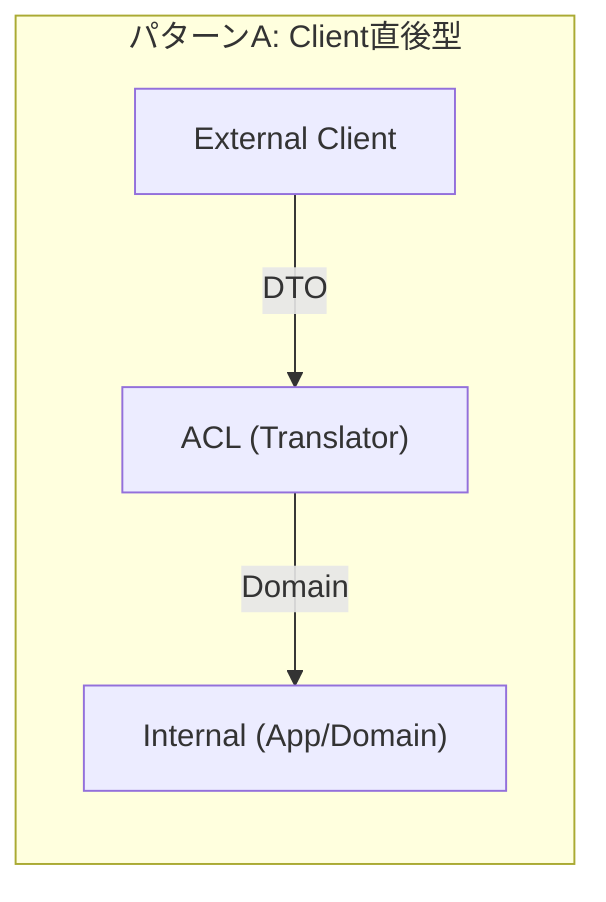
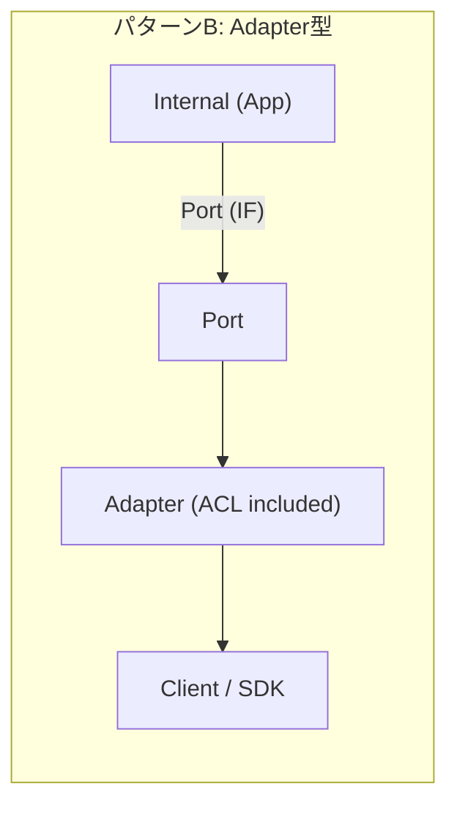
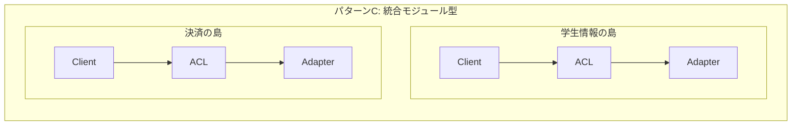
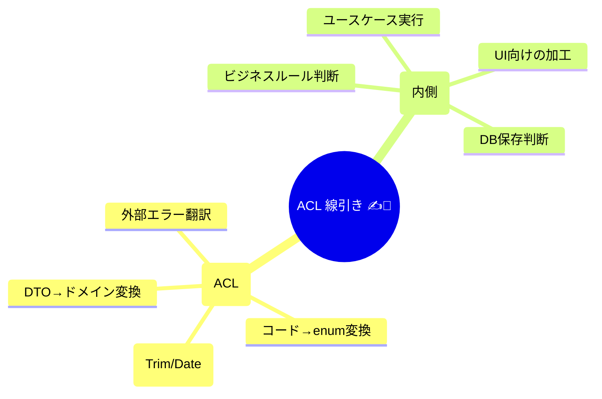
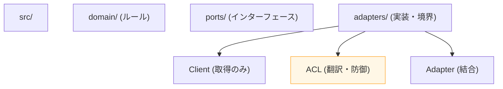

# 第09章：ACLをどこに置く？配置パターンと責任範囲 🧱🛡️

## この章のゴール 🎯✨

* ACL（Anti-Corruption Layer）を「どの層・どのフォルダ」に置くのが自然か、3つの定番パターンで説明できるようになる 🙌
* 「ACLに入れるもの／入れないもの」を迷わず線引きできるようになる ✍️🧠
* 小さく始める実装例で、明日から置ける状態になる 🧩🚀

---

# 1) まずは超整理：ACLの仕事は2つだけ 🧼✨

ACLの仕事は、基本この2つにギュッと圧縮できるよ👇

## ✅ 仕事① 翻訳（Translation）🗣️➡️📘


外部APIの「クセつよDTO」を、内側で使いやすい言葉（ドメインの型）に変換する。

* 変な命名 → まともな命名へ
* コード値 `"1"` → 意味のある enum へ
* 文字列の数値 `"100"` → number へ
* 変な日付 `"2026/1/29 9:00"` → Date/ISO へ

## ✅ 仕事② 防御（Defense）🛡️🚧

「変なデータ・変な失敗」が内側へ侵入しないようにする。

* 欠損、未知コード、桁あふれ、形式不正を入口で止める 🚫
* 外部エラー（HTTP/Timeout等）を内側の“意味ある失敗”に翻訳する 🧊🔥

> つまりACLは「通訳＋防波堤」🌊🛡️

---

# 2) 置き場所を決める前に：境界ってどこ？🚪📦


この教材の世界観だと、ざっくりこんな箱のイメージだよ👇

```text
[UI] ──> [アプリ(ユースケース)] ──> [ドメイン(ルール/型)]
                              │
                              └──(外へ出る)──> [外部API] / [DB] / [外部サービス]
```

ACLは「外へ出るところ（境界）」に置くのが基本 🧱✨
内側（ドメイン）が外側（相手都合）に染まらないための“境界装置”だよ 😌🔌

---

# 3) 定番の配置パターン3つ 🧱🧩🧰


````carousel

<!-- slide -->

<!-- slide -->

````

## パターンA：外部Clientの“直後”に置く（Client直後型）📞➡️🧱

**外部Clientは“取得だけ”**、ACLは**“変換だけ”**にする分業スタイル。

```text
ExternalApiClient (HTTPでDTO取得)
        │
        ▼
ACL (DTO→ドメイン変換/検証/エラー翻訳)
        │
        ▼
内側(アプリ/ドメイン)
```

**向いてる状況** ✅

* OpenAPI等で自動生成したClientを使う（DTOが機械的でクセが強い）🤖
* 外部DTOが巨大/頻繁に変わる 😇
* 変換ロジックをテストでガチガチに固めたい 🧪🔥

**メリット** 💖

* 変換が純粋関数になりやすく、ユニットテスト最強 👑
* “外の都合”がClient内に閉じて、内側がキレイ ✨

**注意** ⚠️

* ファイル数が増える（でも設計が育つとむしろ嬉しいやつ）📁

---

## パターンB：Adapter層にまとめる（Ports & Adapters型）🔌🧱

# 次章（第10章）でやるPorts & Adapters（ヘキサゴナルっぽい）に寄せる置き方。

```text
内側は Port(Interface) を呼ぶ
        │
        ▼
Adapter(外部と話す + ACL変換)
        │
        ▼
ExternalApiClient / SDK
```

**向いてる状況** ✅

* 「外部サービスごとに1アダプタ」って整理したい 🗂️
* Adapterが“入口”として分かりやすいほうが安心 💡

**メリット** 💖

* アプリ層から見たとき、依存先がスッキリ（Portだけ）✨
* 外部ごとに責務がまとまる（チーム分担もしやすい）👥

**注意** ⚠️

* Adapterが太りやすい（HTTP処理・リトライ・変換・ログ…全部入りがち）🍔
  → 「変換はACL関数に逃がす」だけで健康になるよ 🥗✨

---

## パターンC：Integrationモジュールとして“外部ごと”に閉じる（統合モジュール型）📦🔗


「外部Aは外部Aの島」みたいに、フォルダで完全に分ける。

```text
adapters/
  studentDirectory/
    client.ts
    acl.ts
    adapter.ts
  payment/
    client.ts
    acl.ts
    adapter.ts
```

**向いてる状況** ✅

* 外部APIが2つ以上あって、今後も増えそう 🌱
* 外部ごとに仕様書・担当・更新頻度が違う 🧾🔄

**メリット** 💖

* “その外部の事情”が全部そこにある（探しやすい）🔍
* 外部ごとのテスト素材（レスポンス例）も置きやすい 📦

**注意** ⚠️

* 共通化しすぎると逆に迷子になることも 🙃
  → まずは外部ごとに閉じてOK！

---

## 4) いちばん大事：ACLに「含める／含めない」線引き ✍️🧠🧱


### ✅ ACLに含めていいもの（翻訳＆防御）🧼🛡️

* DTO → ドメイン型の変換（命名・構造・型）🔁
* コード値 → enum/判別可能な型 への変換 🔤✨
* パース（文字列→number/date、trim、正規化）🧽
* “外部の不正”を検出するバリデーション（必須/形式/範囲）✅
* 外部エラー（HTTP/Timeout等）→ 内側向けエラーへの翻訳 🌩️➡️📘
* 外部仕様に依存したワークアラウンド（例：nullが来るなら補正方針）🩹

### ❌ ACLに入れちゃダメ寄りなもの（内側のルール）🚫📘

* ドメインの意思決定（ビジネスルール）
  例：「学食ポイントが何点なら割引」🍱💰 ← これは内側！
* ユースケースの流れ（いつ課金するか、いつ通知するか等）🔁
* UI都合の整形（表示文言の生成、画面用の加工）🖥️
* DB保存の判断（保存する/しない、更新戦略）💾

> 超ざっくりルール：
> 「その外部の都合で必要ならACL」✅
> 「自分たちのルールなら内側」✅



---

## 5) “責務の境界線”を一発で決める質問集 🧠💡

迷ったら、これを自分に質問するのが強いよ👇

1. それ、外部APIの仕様が変わったら一緒に変わる？ → 変わるならACL寄り 🧱
2. それ、外部がなくても成立するルール？ → 成立するなら内側 📘
3. それ、テストで“外部レスポンス例”を使って守りたい？ → 守りたいならACL寄り 🧪
4. それ、ユーザー体験（表示）に関わる？ → だいたいUI/アプリ側 🖥️

---

## 6) ミニ実装：フォルダ構成と最小コード 🧩✨

### 📁 フォルダ例（統合モジュール型 + Ports寄せ）


```text
src/
  domain/
    student/
      Student.ts
      StudentId.ts
      StudentType.ts
  ports/
    StudentDirectoryPort.ts
  adapters/
    studentDirectory/
      StudentDirectoryClient.ts   # 外部からDTO取得だけ
      StudentDirectoryAcl.ts      # DTO→ドメイン変換＆防御
      StudentDirectoryAdapter.ts  # Port実装（client+aclを組み合わせ）
```



### DTO→ドメイン変換（ACLの中心）🔁🧱

```typescript
// src/adapters/studentDirectory/StudentDirectoryAcl.ts

import { Student } from "@/domain/student/Student";
import { StudentId } from "@/domain/student/StudentId";
import { StudentType } from "@/domain/student/StudentType";

// 外部DTO（外の都合）
export type StudentDto = {
  stu_id: string;      // "00123" とか来る
  stu_kbn: "1" | "2";  // 1=学部, 2=院 (みたいな謎コード)
  name: string;
};

// 外部の謎コード → 内側の意味あるenumへ
function mapStudentType(code: StudentDto["stu_kbn"]): StudentType {
  switch (code) {
    case "1": return StudentType.UNDERGRAD;
    case "2": return StudentType.GRAD;
    default: {
      // ここに来たら「外部が仕様追加した」サイン 🚨
      throw new Error(`Unknown student type code: ${code}`);
    }
  }
}

// ACL：翻訳＋防御（できるだけ純粋関数にするのがコツ🧪）
export function toStudent(dto: StudentDto): Student {
  const idRaw = dto.stu_id?.trim();
  const nameRaw = dto.name?.trim();

  if (!idRaw) throw new Error("Invalid student id");
  if (!nameRaw) throw new Error("Invalid student name");

  return new Student(
    new StudentId(idRaw),
    mapStudentType(dto.stu_kbn),
    nameRaw
  );
}
```

### “どこに置いたか”が見える：Adapterで組み合わせる 🔌✨

```typescript
// src/adapters/studentDirectory/StudentDirectoryAdapter.ts

import { StudentDirectoryPort } from "@/ports/StudentDirectoryPort";
import { StudentDirectoryClient } from "./StudentDirectoryClient";
import { toStudent } from "./StudentDirectoryAcl";

export class StudentDirectoryAdapter implements StudentDirectoryPort {
  constructor(private readonly client: StudentDirectoryClient) {}

  async findById(id: string) {
    const dto = await this.client.fetchStudent(id); // ここはDTO
    return toStudent(dto);                          // ここで内側へ渡す
  }
}
```

この形にすると、**「DTOが内側に漏れない」**が自然に守れるよ 🧼✨
そして ACL（`toStudent`）は**単体テストが超やりやすい**のが最高ポイント 🧪💖

---

## 7) よくある事故例（この章で止める！）🧨😇

### 事故① DTOをそのまま返しちゃう 📦➡️🏚️

* Adapterが `StudentDto` をアプリ層に返す
  → 次の日から内側が `stu_kbn` とか言い出して崩壊 💥

### 事故② ACLに“ビジネス判断”を入れちゃう 🧱🍔

* 例：「院生ならポイント2倍」みたいな判断をACLに書く
  → 外部仕様変更と内側ルールが絡まって地獄 🕳️

### 事故③ Adapterが全部盛りになって太る 🍱🍰🍜


* HTTP、リトライ、ログ、変換、判定…が1ファイルに
  → “変換だけACLへ分離”でスッキリするよ ✨

---

## 8) 練習問題（線引き筋トレ💪🧠）

次の処理は「ACLに入れる？内側に入れる？」どっち？🤔✨

1. `stu_id` の前後の空白を trim する 🧽
2. `"1"|"2"` を `StudentType` に変換する 🔤
3. “学食ポイントは0以上”を保証する（不変条件）🔒
4. 外部APIが `429` を返したら “混雑中” として扱う 🌩️
5. “学食ポイントが100以上なら割引”を計算する 🍱💰

**答えの目安** ✅

* 1,2,4 → ACL寄り 🧱🛡️
* 3,5 → 内側（ドメイン/アプリ）寄り 📘✨
  （3は第8章でやった“不変条件”の本丸！）

---

## 9) この章のチェックリスト ✅🧱

* [ ] 外部DTO型は `adapters/**/client` 付近に閉じ込めた 📦
* [ ] ACLは「変換＆防御」だけを担当している 🧼🛡️
* [ ] “ドメインの判断”がACLに混ざってない 📘🚫
* [ ] 変換ロジックは純粋関数に寄せて、単体テストしやすい 🧪✨
* [ ] エラーは外部の形のまま内側に漏れてない 🌩️➡️📘

---

## 10) 最新メモ（2026年1月）📌🆕

* Node.js は、2026年1月時点で **v24 が Active LTS**、**v25 が Current**として扱われているよ（リリース一覧・スケジュールに掲載）📈🟢。 ([nodejs.org][1])
* TypeScript は、安定版として **5.9 系**が公開されていて、さらに **TypeScript Native（Goによる高速化）**のプレビュー情報も出ているよ ⚡️🧠。 ([GitHub][2])
* VS Code は月次で更新されていて、2026年1月のInsiders情報も公開されてる（最新の変化を追いやすい）🧩✨。 ([code.visualstudio.com][3])

[1]: https://nodejs.org/en/about/previous-releases?utm_source=chatgpt.com "Node.js Releases"
[2]: https://github.com/microsoft/typescript/releases?utm_source=chatgpt.com "Releases · microsoft/TypeScript"
[3]: https://code.visualstudio.com/updates/v1_109?utm_source=chatgpt.com "January 2026 Insiders (version 1.109)"
