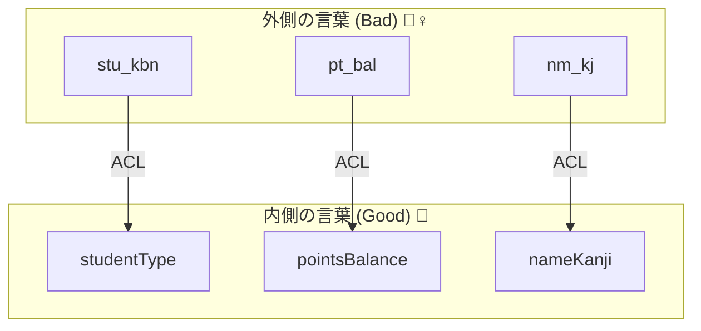
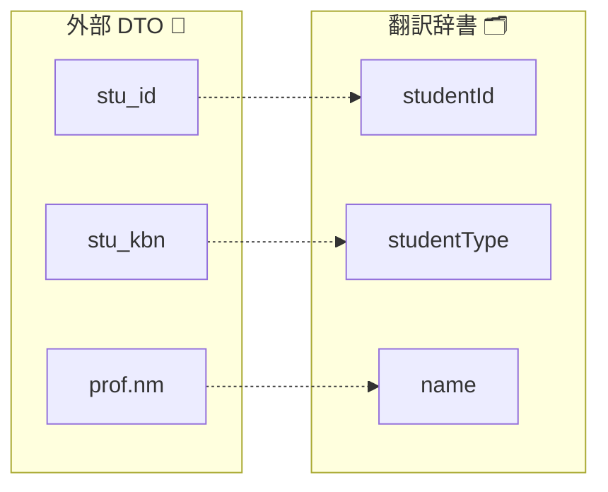
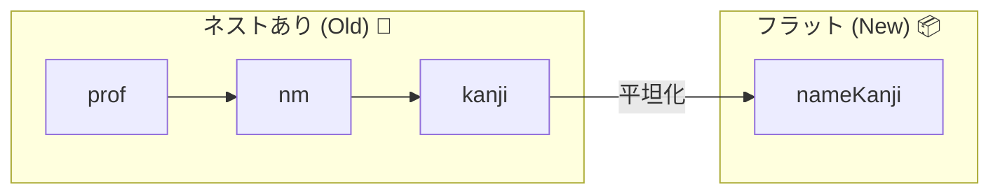

# 第12章：ACLの核② 命名変換・構造変換（読みやすさ爆上げ）🧾➡️📘

## この章のゴール🎯✨

* 外部APIの **変な名前**（例：`stu_kbn`）を、内側の **わかる名前**（例：`studentType`）に翻訳できるようになる🗣️📘
* 外部DTOの **深いネスト** を、内側の **扱いやすい形** に組み替えできるようになる🧱➡️📦
* 変換が壊れても **テストが先に教えてくれる** 状態を作る🧪🚨

---

# 12-1. 「内側の言葉」を守ると、設計が一気にラクになる🛡️✨

ACLで一番おいしいのはここ🍰💕
**内側のコード（ドメイン・アプリ側）から、外側の言葉を消す** ことです🧼🫧

## 外側の言葉が入るとどうなる？😵‍💫


* コードが読めない（`stu_kbn`って何…？）👻
* 仕様変更で内側まで巻き添え💥
* 新しい人が参加すると詰む🧩💦

## 内側の言葉の「いい感じルール」📚✨

* 名詞は意味が伝わるもの：`studentType`, `department`, `points` など🎓
* 省略しない（内側では）：`kbn` → `type`、`nm` → `name` 🙅‍♀️
* 単位や意味を名前で表す：`amountYen`, `birthDateIso` など💴📅
* 真偽値は `is/has/can`：`isActive`, `hasDebt` ✅



---

# 12-2. 命名変換は「翻訳辞書」を作るのが最強🗂️📝✨


命名変換って、気合でやるとブレます😇
そこで **翻訳辞書（マッピング表）** を作ります📘➡️📗

例：外部API（学生情報）がこんな感じだったとします👇

```ts
// 外側（DTO）: 例としての形
export type StudentDirectoryDto = {
  stu_id: string;           // 学籍番号
  stu_kbn: "1" | "2";       // 区分コード
  prof: {
    nm: { kanji: string; kana?: string | null };
    birth: { ymd: string }; // "2004-01-02"
  };
  enroll: {
    dept_cd: string;
    dept_nm: string;
  };
};
```

内側（ドメイン側）はこうしたい👇✨

```ts
// 内側（ドメイン寄り）: まずは素直に“意味がある名前”に
export type StudentProfile = {
  studentId: string;
  studentType: "Undergrad" | "Grad";
  nameKanji: string;
  nameKana?: string;
  birthDate: string; // ここではいったんISO文字列のままでもOK👍
  department: {
    departmentCode: string;
    departmentName: string;
  };
};
```

そして「翻訳辞書」🗂️✨（命名の対応表）



```ts
type StudentDtoUsedKeys = "stu_id" | "stu_kbn" | "prof" | "enroll";

export const studentFieldDictionary = {
  stu_id: "studentId",
  stu_kbn: "studentType",
  prof: "profile",
  enroll: "department",
} as const satisfies Record<StudentDtoUsedKeys, string>;
```

ポイント💡

* 辞書があると「この外部の言葉を、内側ではこう呼ぶ」が固定されます🔒✨
* 後から見返すと “翻訳仕様書” になるので超便利📄💕

> ちなみにTypeScriptは現時点で npm の最新が 5.9.3 です。 ([npmjs.com][1])

---

# 12-3. 構造変換①：深いネストを平らにする🧱➡️📦✨

外部DTOは「送る側の都合」でネストが深くなりがち😵‍💫
内側は **使いやすさ最優先** にしてOKです👌💕




## 変換関数（ACLの中）を作ろう🔁✨

```ts
import type { StudentDirectoryDto } from "./StudentDirectoryDto";

const toStudentType = (kbn: StudentDirectoryDto["stu_kbn"]): "Undergrad" | "Grad" => {
  // ※コード値変換の本格編は次章（第13章）でガッツリやるよ！🔤✨
  if (kbn === "1") return "Undergrad";
  return "Grad";
};

export const translateStudentProfile = (dto: StudentDirectoryDto) => {
  const nameKanji = dto.prof.nm.kanji.trim();
  const nameKana = dto.prof.nm.kana?.trim() || undefined;

  return {
    studentId: dto.stu_id,
    studentType: toStudentType(dto.stu_kbn),
    nameKanji,
    nameKana,
    birthDate: dto.prof.birth.ymd, // ここではまだ“パース前”でもOK👍
    department: {
      departmentCode: dto.enroll.dept_cd,
      departmentName: dto.enroll.dept_nm,
    },
  };
};
```

ここでの大事ポイント🫶✨

* **外側の `prof.nm.kanji` を、内側の `nameKanji` に変換**してる🧼
* `trim()` みたいな軽い整形も “境界でやる” と内側がキレイ✨
* `?.` と `|| undefined` で「null地獄」を内側に持ち込まない🧯

---

# 12-4. 構造変換②：配列を “扱いやすい辞書” にする📚➡️🗃️✨


外部が配列で返してきても、内側は **検索しやすい形** にしてOKです🔎💕

例：外側がこう👇

```ts
export type DepartmentListDto = {
  depts: Array<{ dept_cd: string; dept_nm: string }>;
};
```

内側はこうしたい👇（コードで即引ける🗃️✨）

```ts
export type DepartmentMap = Record<string, { code: string; name: string }>;
```

変換（ACL）👇

```ts
import type { DepartmentListDto } from "./DepartmentListDto";

export const translateDepartmentMap = (dto: DepartmentListDto) => {
  const map: Record<string, { code: string; name: string }> = {};

  for (const d of dto.depts) {
    const code = d.dept_cd;
    map[code] = { code, name: d.dept_nm };
  }

  return map;
};
```

メリット💖

* `map["A12"]` で一発アクセス🎯
* 内側のロジックが読みやすくなる📘✨

---

# 12-5. 構造変換③：“分かれている/くっついている” を整える🧩➡️🧼✨


外部APIあるある😇

* `first_name` と `last_name` が別れてる
* 逆に `full_name` で一発
* 住所が `addr1/addr2/addr3` で謎分割

内側は「アプリで使いやすい形」に合わせてOK👌✨
ただし注意⚠️：**意味が壊れる結合/分割はしない**（例：表記ゆれ、文化差、順序）🌏💦

安全な例だけ👇（表示用 `displayName` を作る）

```ts
export const makeDisplayName = (kanji: string, kana?: string) => {
  if (!kana) return kanji;
  return `${kanji}（${kana}）`;
};
```

---

# 12-6. 「どこまで変換する？」の線引きルール✍️🧠


## やっていい変換✅✨（この章のメイン）

* 命名の翻訳（`stu_kbn` → `studentType`）🗣️
* ネストの調整（深い→平ら）🧱➡️📦
* 形の変換（配列→辞書、キーの付け替え）🗃️
* “軽い整形”（trim、null→undefined など）🧼

## まだ踏み込まない変換⚠️（次の章でやると安全）

* コード値の厳密変換（未知コードの扱い方針）🔤🧹
* 日時・数値の本格パース（失敗時の扱いが絡む）📅🔍
* バリデーションで落とす/救う判断✅🧪

---

# 12-7. 置き場所（フォルダ）を固定して迷子を防ぐ🧭📁✨

おすすめの形（例）👇

```ts
src/
  domain/
    student/
      StudentProfile.ts
  application/
    ...
  infrastructure/
    external/
      studentDirectory/
        StudentDirectoryDto.ts
        translateStudentProfile.ts  // ← ACL（翻訳）
      department/
        DepartmentListDto.ts
        translateDepartmentMap.ts   // ← ACL（翻訳）
```

ルールはシンプル💡

* `Dto` は外側📦
* `translateXxx` はACL（翻訳）🗣️🧱
* ドメインは “意味がある型” だけ📘✨

---

# 12-8. テストで「翻訳が壊れた」を秒速で検知する🧪🚨✨


命名・構造変換は **テストがめちゃ効きます**🔥
（外部が勝手に仕様変えても、ここで止まる🛑）

Vitest は 4.0 が出ています。 ([vitest.dev][2])
（バックエンド/フロントでも扱いやすくて人気🧪✨）

## 例：変換テスト（DTO→内側）

```ts
import { describe, it, expect } from "vitest";
import { translateStudentProfile } from "./translateStudentProfile";

describe("translateStudentProfile", () => {
  it("外部DTOの命名・構造を内側の形に翻訳できる", () => {
    const dto = {
      stu_id: "S-001",
      stu_kbn: "1",
      prof: {
        nm: { kanji: "  山田太郎  ", kana: " ヤマダタロウ " },
        birth: { ymd: "2004-01-02" },
      },
      enroll: { dept_cd: "D10", dept_nm: "情報学部" },
    } as const;

    const result = translateStudentProfile(dto);

    expect(result).toEqual({
      studentId: "S-001",
      studentType: "Undergrad",
      nameKanji: "山田太郎",
      nameKana: "ヤマダタロウ",
      birthDate: "2004-01-02",
      department: { departmentCode: "D10", departmentName: "情報学部" },
    });
  });
});
```

このテストがあるだけで👇

* 外部が `dept_nm` を `dept_name` に変えた瞬間、落ちる💥
* 「翻訳のどこが壊れたか」が一目でわかる👀✨

---

# 12-9. AI拡張で爆速にするコツ🤖⚡（でも主導権はこっち🛡️）


AIに投げるときは「外側→内側の変換仕様」を具体的に渡すと強いです💪✨

## プロンプト例📝🤖

* 「このDTOをこのドメイン型に変換する `translateXxx` を作って。命名はこの辞書に従って。nullはundefinedに寄せて。trimも入れて。」
* 「上の変換に対するVitestテストを3ケース：基本、kanaなし、空白多めで作って。」

AIが作ったコードは最後に必ずチェック✅

* “内側の言葉” が混ざってない？（`stu_kbn` が残ってたらアウト🙅‍♀️）
* 変換の意図が読める？（魔法っぽい処理は避ける🪄🚫）

---

# 12-10. まとめチェックリスト✅🧼✨

* [ ] 外側の変な名前が、内側に1個も漏れてない？🧼
* [ ] 命名変換は「翻訳辞書」で固定した？🗂️
* [ ] 深いネストを、内側の使いやすい形に整えた？🧱➡️📦
* [ ] 配列→辞書など、内側の都合の構造変換をした？🗃️
* [ ] 変換のテストがある？（外部変更検知できる？）🧪🚨

---

## 参考：この教材で前提にしている “最新どころ” の根拠メモ📌

* TypeScript の npm 最新は 5.9.3。 ([npmjs.com][1])
* Node.js は v24 が Active LTS、v22 は Maintenance LTS（2026年1月時点）。 ([Node.js][3])
* Zod 4 は安定版としてリリースノートが公開されています（パース/検証は後章で活躍🧪✨）。 ([zod.dev][4])

[1]: https://www.npmjs.com/package/typescript?utm_source=chatgpt.com "TypeScript"
[2]: https://vitest.dev/blog/vitest-4?utm_source=chatgpt.com "Vitest 4.0 is out!"
[3]: https://nodejs.org/en/about/previous-releases?utm_source=chatgpt.com "Node.js Releases"
[4]: https://zod.dev/v4?utm_source=chatgpt.com "Release notes"
