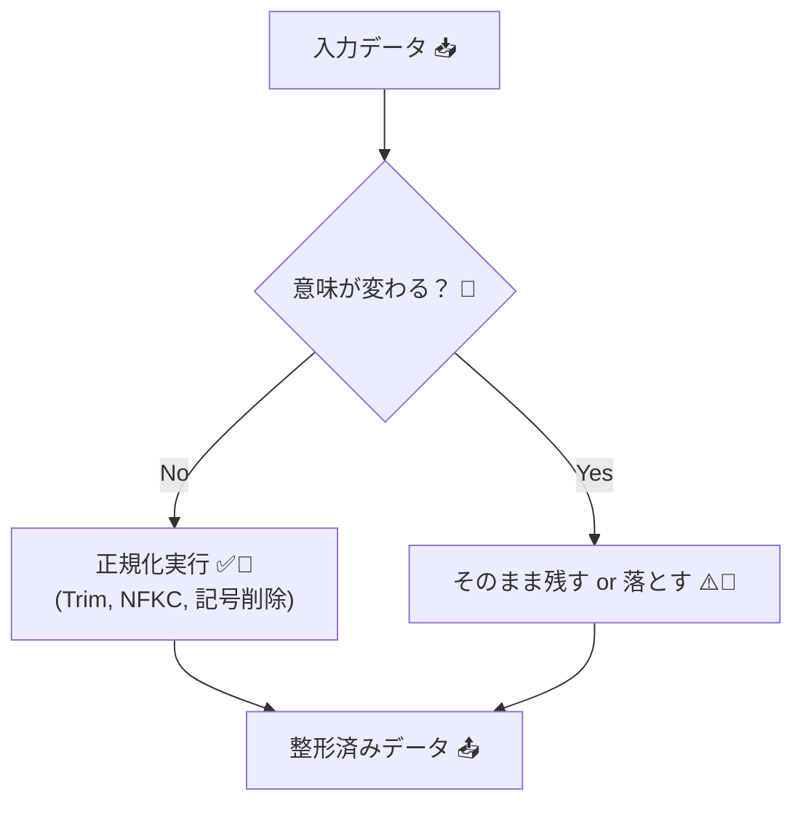
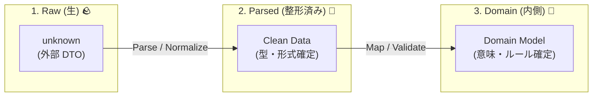
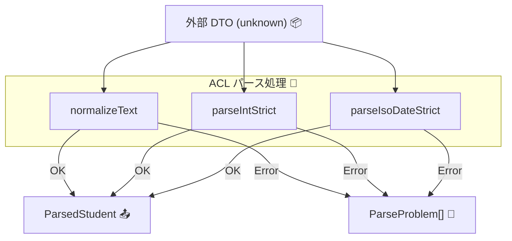

# 第14章：外部データを信用しない① パース（整形）の設計 🧽🔍

## この章でできるようになること 🎯✨

* 外部データを「そのまま使わない」理由を、事故例つきで説明できる 😱
* ACL内に「パース（整形）担当」を置いて、内側をキレイに保てる 🧼🛡️
* TypeScriptで **安全な整形関数** を作って、DTO→ドメイン変換の前段を固められる 🔧📦

---

# 14.1 「パース（整形）」ってなに？バリデーションと何が違うの？🤔🧩


外部から来る値って、だいたいこんな感じで“汚れて”ます👇💦

* `"  １２３  "`（空白＋全角）
* `"1,200"`（カンマ入り数値）
* `"2026/01/29 10:30"`（形式バラバラ日時）
* `"　山田　太郎　"`（全角スペース混入）
* `null` や `""` が突然来る（仕様がブレる）

ここで大事なのが **役割分担** 💡

* **パース（整形）🧽**：まず“扱える形”に整える（トリム、正規化、文字→数値、など）
* **バリデーション（検証）✅**：整えた後に「ルール的にOK？」を判定する（必須、範囲、形式、長さ…）

つまりこの章は、**「まず整える係」** をACLに作る話だよ〜！🧼✨

---

# 14.2 なんで「整形」はACLに置くの？（内側を汚さないため）🧱🌊


外部のクセ（全角、謎フォーマット、null地獄…）を、内側（ドメイン）に持ち込むと…

* ドメイン側が `if (x === "" || x == null)` だらけ 🌀😵
* いろんな場所で同じ整形をして、バグが増える 🐛💥
* 外部仕様が少し変わっただけで内側が連鎖崩壊 😇🧨

だから、**境界＝ACLでまとめて整える**のが正解！🛡️✨
さらに、文字列の Unicode 正規化（NFKCなど）は JavaScript標準の `normalize()` でできるので、まずここを押さえると強いよ 💪🧠 ([MDN Web Docs][1])

---

# 14.3 “直しすぎ問題”に注意！⚠️（安全に直せる範囲を決める）

整形って便利なんだけど、やりすぎると危険 😵‍💫
**勝手に解釈して“別の意味”にしてしまう**から。

## 安全にやってOK寄り ✅🧼

* `trim()`（前後の空白削除）
* Unicode 正規化（`normalize("NFKC")`）で全角→半角などを揃える 🅰️🔁 ([MDN Web Docs][1])
* `1,200` → `1200`（数値の区切り文字削除）
* 連続スペースを1つにまとめる（表示名など）

## 危険なので“勝手に直さない”寄り 🚫🧨

* `"01/02/03"` を日付と決め打ち（国や仕様で意味が変わる）
* `"O"` と `"0"` を同一視する（別物！）
* `"無料"` を `0` 円にする（意味が変わる！）

**ルール：整形は“確実に同じ意味”の範囲だけ**✨
それ以外は次章（バリデーション）で落とす or 例外扱いにするのがキレイ 🧯✅




---

# 14.4 パース設計のおすすめ型：3段ロケット 🚀🚀🚀


外部入力を受け取ったら、ACLでこう流すのがめちゃ安定するよ👇

1. **Raw（生）**：外部から来たまま（`unknown`）🪨
2. **Parsed（整形済み）**：型とフォーマットを“扱える形”へ 🧽
3. **Domain（内側）**：ドメイン型へ変換（意味づけ）📘✨

この章は **2) Parsed** を作るところ！💪



---

# 14.5 実例でいこう：外部DTOが“クセ強”な学生データ 🎓👻

外部APIがこんなDTOを返すとするね（ありがち…）👇

* `student_id`: `" ００１２３ "`（空白＋全角）
* `points`: `"1,200"`（カンマ）
* `updated_at`: `"2026-01-29T10:30:00+09:00"`（ISOっぽい）
* `name`: `"　山田　太郎　"`（全角スペース）

ここで目標はこれ👇✨
**「ドメイン側には、整った値しか渡さない」**🛡️

---

# 14.6 TypeScriptで「整形専用関数セット」を作る 🧰🧼

## 14.6.1 まずはResult型（失敗を安全に返す）📦


「throwしまくり」でもいいけど、初心者ほど追いにくいので、まずは **Result** でやると迷子になりにくいよ 🧭✨

```ts
export type Ok<T> = { ok: true; value: T };
export type Err<E> = { ok: false; error: E };
export type Result<T, E> = Ok<T> | Err<E>;

export const ok = <T>(value: T): Ok<T> => ({ ok: true, value });
export const err = <E>(error: E): Err<E> => ({ ok: false, error });
```

---

## 14.6.2 整形ヘルパー（安全な変換だけ）🧽✨

ポイントはこれ👇

* 文字列は **trim + NFKC** を“基本セット”にする
* 数値は **「ちゃんと数値だけか」** を確認してから変換
* 日付は **曖昧フォーマット禁止**（ISOなど仕様が確定のものだけ）

```ts
// 文字列を「扱いやすい形」に揃える（意味を変えない範囲）
export function normalizeText(input: string): string {
  // NFKC: 全角英数や互換文字を揃えやすい（ただし“意味が変わりうる”ケースもあるので用途は限定！）
  // ここでは「ID・コード・名前」などでよく使う前提
  const nfkc = input.normalize("NFKC");
  // 前後の空白（半角/全角っぽいもの）を削る
  return nfkc.trim().replace(/\s+/g, " ");
}

// "1,200" -> 1200 のように「安全に」整数へ
export function parseIntStrict(input: string): Result<number, string> {
  const s = normalizeText(input).replace(/,/g, "");
  if (!/^[+-]?\d+$/.test(s)) return err(`整数として読めない: "${input}"`);
  const n = Number(s);
  if (!Number.isSafeInteger(n)) return err(`整数が大きすぎる: "${input}"`);
  return ok(n);
}

// ISO 8601 形式っぽいものだけ許可（曖昧フォーマット禁止）
export function parseIsoDateStrict(input: string): Result<Date, string> {
  const s = normalizeText(input);
  // ざっくりガード：ISOの形かどうか（必要ならもっと厳密にしてOK）
  if (!/^\d{4}-\d{2}-\d{2}T/.test(s)) return err(`ISO日時じゃない: "${input}"`);

  const d = new Date(s);
  if (Number.isNaN(d.getTime())) return err(`日時として解釈できない: "${input}"`);
  return ok(d);
}
```

`normalize("NFKC")` は JavaScript標準で、Unicode正規化形式を指定できるよ（NFC/NFD/NFKC/NFKD）🧠✨ ([MDN Web Docs][1])

---

# 14.7 「DTO → Parsed DTO」：ACL内に“整形済みモデル”を作る 📦🧼


外部DTOは信用しないので、入力は `unknown` から始めるのが安全 ✅
（外部クライアントの戻り型があっても、実体が崩れることは普通にある😇）

```ts
export type ExternalStudentDto = {
  student_id?: unknown;
  name?: unknown;
  points?: unknown;
  updated_at?: unknown;
};

export type ParsedStudent = {
  studentId: string;   // 整形済み
  name: string;        // 整形済み
  points: number;      // 整形済み
  updatedAt: Date;     // 整形済み
};

type ParseProblem = { field: string; message: string; raw: unknown };

const asRecord = (x: unknown): x is Record<string, unknown> =>
  typeof x === "object" && x !== null;

const asString = (x: unknown): x is string => typeof x === "string";

export function parseStudent(dto: unknown): Result<ParsedStudent, ParseProblem[]> {
  if (!asRecord(dto)) {
    return err([{ field: "$", message: "オブジェクトじゃない", raw: dto }]);
  }

  const problems: ParseProblem[] = [];

  const rawId = dto["student_id"];
  const rawName = dto["name"];
  const rawPoints = dto["points"];
  const rawUpdatedAt = dto["updated_at"];

  // student_id
  let studentId = "";
  if (!asString(rawId)) {
    problems.push({ field: "student_id", message: "文字列じゃない", raw: rawId });
  } else {
    studentId = normalizeText(rawId);
    if (studentId.length === 0) {
      problems.push({ field: "student_id", message: "空はダメ", raw: rawId });
    }
  }

  // name
  let name = "";
  if (!asString(rawName)) {
    problems.push({ field: "name", message: "文字列じゃない", raw: rawName });
  } else {
    name = normalizeText(rawName);
    if (name.length === 0) {
      problems.push({ field: "name", message: "空はダメ", raw: rawName });
    }
  }

  // points
  let points = 0;
  if (!asString(rawPoints)) {
    problems.push({ field: "points", message: "文字列（数値表現）じゃない", raw: rawPoints });
  } else {
    const r = parseIntStrict(rawPoints);
    if (!r.ok) problems.push({ field: "points", message: r.error, raw: rawPoints });
    else points = r.value;
  }

  // updated_at
  let updatedAt = new Date(0);
  if (!asString(rawUpdatedAt)) {
    problems.push({ field: "updated_at", message: "文字列じゃない", raw: rawUpdatedAt });
  } else {
    const r = parseIsoDateStrict(rawUpdatedAt);
    if (!r.ok) problems.push({ field: "updated_at", message: r.error, raw: rawUpdatedAt });
    else updatedAt = r.value;
  }

  if (problems.length > 0) return err(problems);

  return ok({ studentId, name, points, updatedAt });
}
```



ここでのポイントは超大事👇💡

* **ParsedStudent は“整った値だけ”**を持つ
* 失敗したら「どのフィールドが」「何でダメか」を **問題リストで返す** 🧾🚨
* ドメイン層に `unknown` を1ミリも入れない 🛡️✨

---

# 14.8 もう一段ラクする：Zodで「整形＋型チェック」をまとめる（選択肢）🧩✨


「手書きパース、ちょい長い〜🥺」ってなるよね。
そこで有名なのが **Zod**。スキーマで型チェックして、前処理（preprocess）や変換もできるよ 🧪🛠️ ([GitHub][2])

# > ここでは“雰囲気”だけ掴めればOK！（深掘りは第15章・第18章で効いてくる✨）

```ts
import { z } from "zod";

// preprocess: 入力を受け取って、整形してからスキーマ検証へ回せる
const studentSchema = z.object({
  student_id: z.preprocess(
    (v) => (typeof v === "string" ? normalizeText(v) : v),
    z.string().min(1)
  ),
  name: z.preprocess(
    (v) => (typeof v === "string" ? normalizeText(v) : v),
    z.string().min(1)
  ),
  points: z.preprocess(
    (v) => (typeof v === "string" ? normalizeText(v) : v),
    z.string()
  ),
  updated_at: z.string().min(1),
});

export type ParsedByZod = {
  studentId: string;
  name: string;
  points: number;
  updatedAt: Date;
};

export function parseStudentByZod(dto: unknown): Result<ParsedByZod, string> {
  const r = studentSchema.safeParse(dto);
  if (!r.success) return err(r.error.issues.map(i => i.message).join(" / "));

  const pointsR = parseIntStrict(r.data.points);
  if (!pointsR.ok) return err(pointsR.error);

  const dateR = parseIsoDateStrict(r.data.updated_at);
  if (!dateR.ok) return err(dateR.error);

  return ok({
    studentId: r.data.student_id,
    name: r.data.name,
    points: pointsR.value,
    updatedAt: dateR.value,
  });
}
```

---

## 14.9 日時はとくに注意：Dateの“曖昧解釈”を避ける ⏰😵‍💫


* `"2026/01/29"` と `"01/02/2026"` とか、地域で意味が変わるよね 🌍💥
* だからACLでは **「仕様で確定した形式だけOK」** にしよ！✅

ちなみに次世代日時APIの **Temporal** は、2026年1月時点で TC39 の Stage 3（実装推奨段階）として進んでるよ 📈🕰️ ([tc39.es][3])
（現場では polyfill 利用も多いので、採用するなら「使う場所をACLに閉じ込める」のが相性◎🧱✨）

---

## 14.10 AI拡張（Copilot/Codex）を使うときのコツ 🤖💡

整形はパターン化しやすいからAI相性いいよ〜！✨
ただし **“直しすぎ問題”だけは人間が監督**してね🫡🛡️

AIに頼むと良いもの👇

* `parseIntStrict`, `parseIsoDateStrict` みたいな **小さい関数の雛形**生成 🧩
* 「こういう汚い入力を想定してテストケース出して」🧪📦
* 失敗時のエラーメッセージ案 ✍️

AIに任せないほうがいいもの👇

* 「このフォーマットはたぶんこう！」みたいな **推測変換** 😇
* 日時のローカル解釈（事故りやすい）💣

---

## 14.11 チェックリスト（この章のゴール達成✅）🧾✨

* [ ] 外部入力を `unknown` として扱う（信用しない）🪨
* [ ] ACLに「整形」関数を集約した（散らさない）🧱
* [ ] 整形は“意味を変えない範囲”に限定した ⚠️
* [ ] 失敗時に「どの項目がダメか」を返せるようにした 🚨
* [ ] Parsed（整形済み）を作ってからドメインへ渡す流れになった 📦➡️📘

---

## 14.12 ミニ課題（5〜15分）🎓⏳

1. `normalizeText()` に「全角スペースもトリムできる？」を確認して、必要なら調整してみよう 🧽
2. `parseIntStrict("００１,２００")` が `1200` になることを確認してみよう 🔢✨
3. `parseIsoDateStrict("2026/01/29")` が **落ちる**ことを確認しよう（曖昧フォーマット禁止！）🚫⏰

---

### 参考：実行環境メモ（最新寄り）🧠📌

Node.js は v24 が Active LTS として更新されているので、安定寄りならこの系統を選ぶのが無難だよ〜🟢 ([Node.js][4])
TypeScript は 2025年8月に 5.9 が安定版として案内されていて、2026年初頭に向けた次期メジャー（6/7系）の話も進んでるよ 📣 ([Microsoft for Developers][5])

[1]: https://developer.mozilla.org/ja/docs/Web/JavaScript/Reference/Global_Objects/String/normalize?utm_source=chatgpt.com "String.prototype.normalize() - JavaScript - MDN Web Docs"
[2]: https://v3.zod.dev/?utm_source=chatgpt.com "Zod | Documentation"
[3]: https://tc39.es/proposal-temporal/?utm_source=chatgpt.com "Temporal"
[4]: https://nodejs.org/en/about/previous-releases?utm_source=chatgpt.com "Node.js Releases"
[5]: https://devblogs.microsoft.com/typescript/announcing-typescript-5-9/?utm_source=chatgpt.com "Announcing TypeScript 5.9"
