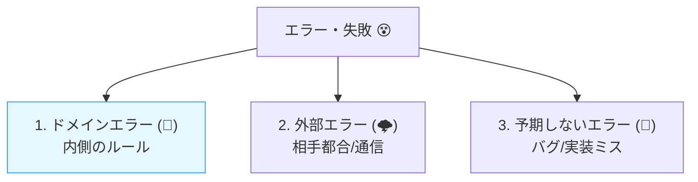
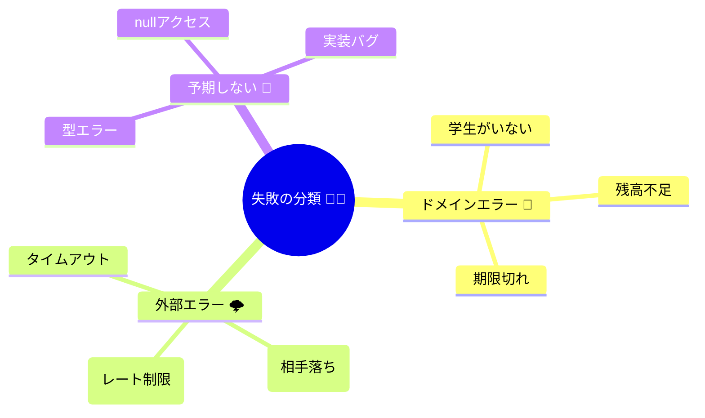
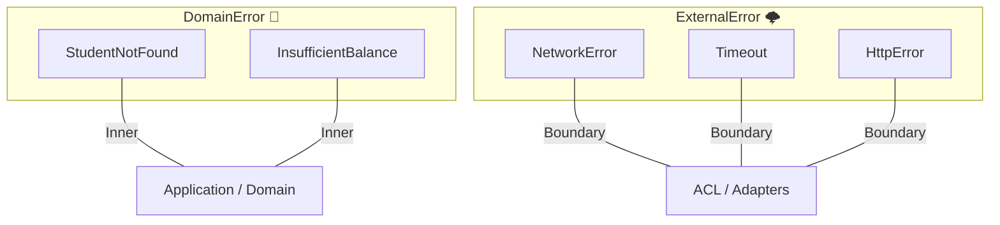

# 第16章：エラーモデリング① 外部エラーとドメインエラーの分離 🧊🔥

## この章でできるようになること 🎯✨

* 「失敗😵」を **外部エラー** と **ドメインエラー** に分けて説明できる
* それぞれを **TypeScriptの型** で表現できる（あとで翻訳しやすくなる🧠）
* “同じ失敗っぽいのに意味が違う”を、実例で見抜けるようになる🔍

---

## 0) 2026年1月の“いま”メモ（超短く）🗓️

* TypeScriptの安定版は **5.9.3**（npm / GitHub上の最新版表示）([npm][6])
* Node.jsは **v24系がActive LTS**、最新LTSとして **v24.13.0** が案内されてるよ🟢([nodejs.org][7])
* TypeScriptは 6.0→7.0（ネイティブ系）へ向かってる途中🚄([Microsoft for Developers][8])

---

# 1) まず結論：失敗は「3種類」に分けると迷わない🧠✨

アプリで起きる「うまくいかない😵」は、だいたいこの3つに整理できるよ👇

1. **ドメインエラー（内側のルールの失敗）📘**

   * 例：学生が存在しない、残高不足、期限切れ…
   * これは **仕様どおりに失敗** してる（バグじゃないことが多い）😌

2. **外部エラー（通信・相手都合の失敗）🌩️**

   * 例：タイムアウト、レート制限、外部が500、ネットワーク不安定…
   * これは **相手 or ネット** が原因。アプリの業務ルールとは別物🌍

3. **予期しないエラー（バグっぽい）🧨**

   * 例：想定してないnull、変換ミス、コードの例外、型の取り違え…
   * これは **直す対象**（ログ・監視の話は後半の章で🔥）

この章は **①と②を“分離”** するのが主役だよ🧊🔥




---

# 2) なぜ分けるの？（分けないと起きる事故😇）

「全部 throw Error でいいじゃん😗」ってやると、後でこうなる👇

* 画面側が「残高不足」も「タイムアウト」も同じ扱いになって、メッセージが雑になる😵
* 「リトライしていい失敗」と「絶対ダメな失敗」が混ざって、二重課金の危険💳💥
* テストが「どの失敗を期待してるの？」ってなって地獄🧪🌀
* 外部APIの仕様変更が、そのまま内側まで漏れて設計が腐る🧼➡️🤢

だから **“意味が違う失敗”は、型で分ける** のが正解✅✨

---

# 3) ざっくり分類表（まずはこれだけ覚える）🧾✨

| 起きたこと      | これは何？     | 内側に持ち込む？        | 典型対応      |
| ---------- | --------- | --------------- | --------- |
| 残高不足       | ドメインエラー📘 | ✅持ち込む（言葉として）    | ユーザーに案内   |
| 学生が存在しない   | ドメインエラー📘 | ✅               | 入力/状態の見直し |
| タイムアウト     | 外部エラー🌩️  | ✅ただし“外部エラー型”として | リトライ候補    |
| 429（レート制限） | 外部エラー🌩️  | ✅（分類して）         | 待って再試行候補  |
| 500（相手落ち）  | 外部エラー🌩️  | ✅               | リトライ/障害表示 |
| 想定外の例外     | 予期しない🧨   | ✅（監視/ログへ）       | バグ修正      |

ポイントはこれ👇
**ドメインエラー＝「業務の言葉」**
**外部エラー＝「通信/相手の言葉」**
同じ“失敗”でも、アプリが取るべき行動が違うんだよね🧠✨



---

# 4) TypeScriptで「分離」を作る（discriminated union）🧩✨

ここからは **型でガードする** よ💪😺
コツは、全部に `kind` を付けること！（判定が超ラクになる🪄）



## 4-1) ドメインエラー（内側）📘

```ts
// src/domain/errors.ts
export type DomainError =
  | { kind: "StudentNotFound"; studentId: string }
  | { kind: "InsufficientBalance"; studentId: string; requiredYen: number; currentYen: number }
  | { kind: "PaymentExpired"; paymentId: string; expiredAt: string };
```

* `kind` が **ドメインの言葉** になってるのがポイント✨
* “外部のHTTP”とか“ステータスコード”は **ここに絶対入れない** 🙅‍♀️

---

## 4-2) 外部エラー（境界の外）🌩️

```ts
// src/acl/errors.ts
export type ExternalError =
  | { kind: "NetworkError"; message: string }
  | { kind: "Timeout"; timeoutMs: number }
  | { kind: "RateLimited"; retryAfterSeconds?: number }
  | { kind: "HttpError"; status: number; bodySnippet?: string }
  | { kind: "BadResponseShape"; message: string }; // JSONの形がおかしい等
```

* こっちは **通信やHTTPの言葉** を使ってOK👌
* でもこれも **ドメインの型とは別** にするのが大事🧊🔥

---

# 5) 「結果の型」をそろえる（Result型）📦✨

throw でもいいけど、初心者には **Result型** が超わかりやすいよ😺
（成功/失敗が型で見える👀）

```ts
// src/shared/result.ts
export type Ok<T> = { ok: true; value: T };
export type Err<E> = { ok: false; error: E };
export type Result<T, E> = Ok<T> | Err<E>;

export const ok = <T>(value: T): Ok<T> => ({ ok: true, value });
export const err = <E>(error: E): Err<E> => ({ ok: false, error });
```

---

# 6) 実例：外部APIクライアントは「外部エラー」だけ返す🌩️➡️📦

例として「学生情報API」を叩くクライアントを作るよ📡

```ts
// src/acl/studentDirectoryClient.ts
import { Result, ok, err } from "../shared/result";
import { ExternalError } from "./errors";

export type StudentDto = {
  id: string;
  name: string;
  balance_yen: number;
};

export async function fetchStudentDto(studentId: string): Promise<Result<StudentDto, ExternalError>> {
  const controller = new AbortController();
  const timeoutMs = 8_000;
  const t = setTimeout(() => controller.abort(), timeoutMs);

  try {
    const res = await fetch(`https://example.com/students/${studentId}`, {
      signal: controller.signal,
    });

    if (res.status === 429) {
      const retryAfter = res.headers.get("retry-after");
      const retryAfterSeconds = retryAfter ? Number(retryAfter) : undefined;
      return err({ kind: "RateLimited", retryAfterSeconds });
    }

    if (!res.ok) {
      const body = await res.text().catch(() => "");
      return err({ kind: "HttpError", status: res.status, bodySnippet: body.slice(0, 200) });
    }

    const data = (await res.json()) as unknown;

    // “形がおかしい”は外部エラー扱い（内側に入れない🧼）
    if (typeof data !== "object" || data === null) {
      return err({ kind: "BadResponseShape", message: "response is not an object" });
    }

    // ここではDTOのまま返す（ドメイン型は作らない：第11〜15章の役割）
    return ok(data as StudentDto);
  } catch (e) {
    if (e instanceof DOMException && e.name === "AbortError") {
      return err({ kind: "Timeout", timeoutMs });
    }
    return err({ kind: "NetworkError", message: "network failure" });
  } finally {
    clearTimeout(t);
  }
}
```

ここでの大事ポイント💡

* **この層は“外の都合”を扱う場所**だから、失敗も `ExternalError` でOK🌩️
* 逆に、ここで `InsufficientBalance` とか作り始めると混ざる😵（分離が崩れる）

---

# 7) ドメイン側は「ドメインエラー」だけを返す📘✨

ドメインの処理（例：決済できるか判定）は、外部の事情を知らないのが理想🧼🛡️

```ts
// src/domain/paymentRules.ts
import { Result, ok, err } from "../shared/result";
import { DomainError } from "./errors";

export function ensureEnoughBalance(
  studentId: string,
  currentYen: number,
  requiredYen: number
): Result<true, DomainError> {
  if (currentYen < requiredYen) {
    return err({
      kind: "InsufficientBalance",
      studentId,
      requiredYen,
      currentYen,
    });
  }
  return ok(true);
}
```

* “残高不足”は **業務ルールの失敗** だからドメインエラー📘
* “タイムアウト”は業務ルールじゃないから **ここに出てこない** 🙅‍♀️

---

# 8) “同じ失敗っぽい”クイズ（分類トレーニング）🧠📝

次の「失敗」はどっち？👇（ドメイン📘 / 外部🌩️ / 予期しない🧨）

1. 学生IDが存在しなかった
2. 決済APIが 429 を返した
3. 決済額がマイナスで送られてきた
4. レスポンスJSONに `balance_yen` が無かった
5. 残高が足りない
6. fetch がネットワークエラーになった
7. `Number("１２３")` が想定外の結果になってバグった

## 答え ✅🎉

1. ドメイン📘（“学生がいない”は業務的な意味）
2. 外部🌩️（レート制限は相手都合）
3. 予期しない🧨（入力バリデーション漏れ or 実装ミスの可能性）
4. 外部🌩️（相手のレスポンス形が変わった）
5. ドメイン📘
6. 外部🌩️
7. 予期しない🧨（実装/変換の問題）

---

# 9) AI（Copilot/Codex）でやると速いところ🤖⚡

## 9-1) エラー洗い出しプロンプト例 🧠

* 「学食ポイントアプリで、学生情報APIと決済APIを使う。起きうる失敗を“外部エラー/ドメインエラー/予期しない”で30個列挙して、`kind` 名も提案して」

## 9-2) 使い方のコツ🍀

* AIが出した分類は **そのまま採用しない** 🙅‍♀️
* 「それは業務の言葉？通信の言葉？」って問い直すと精度が上がる✨
* `kind` 名は **短く・具体的に・名詞っぽく**（例：`Timeout` / `StudentNotFound`）🧾

---

# 10) この章のチェックリスト ✅🧼

* [ ] ドメインエラーと外部エラーを言葉で説明できる📘🌩️
* [ ] `kind` 付きの union 型で両者を分けられる🧩
* [ ] 外部クライアントは `ExternalError`、ドメイン処理は `DomainError` を返す構造になってる🧱
* [ ] “同じ失敗っぽいのに意味が違う”を分類できる🧠✨

[1]: https://chatgpt.com/c/697a054a-70e4-8321-89ac-f5060d5270e3 "ACL教育コンテンツ作成"
# [2]: https://chatgpt.com/c/697a2a2c-8878-83a3-b374-07337c33a030 "ACL教育コンテンツ第1章"
[3]: https://chatgpt.com/c/69706403-28c8-8326-bb13-1fa9cdd0cfad "モジュラーモノリス第30章"
[4]: https://chatgpt.com/c/697a33a1-5fa4-83a6-a2a2-684c5991bf0d "外部DTOの問題点"
[5]: https://chatgpt.com/c/69779bfa-5c34-8323-a208-52f23b0a36b0 "ドメインイベントの統合"
[6]: https://www.npmjs.com/package/typescript?utm_source=chatgpt.com "TypeScript"
[7]: https://nodejs.org/en/about/previous-releases?utm_source=chatgpt.com "Node.js Releases"
[8]: https://devblogs.microsoft.com/typescript/progress-on-typescript-7-december-2025/ "Progress on TypeScript 7 - December 2025 - TypeScript"
