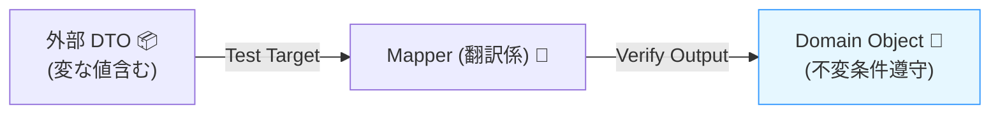
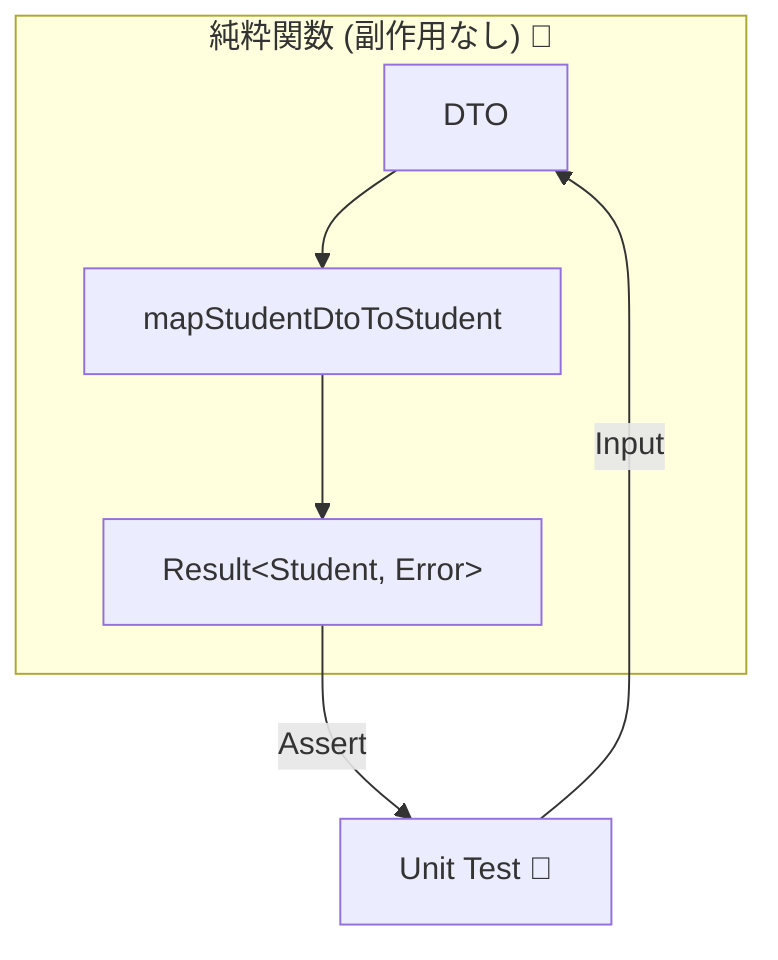
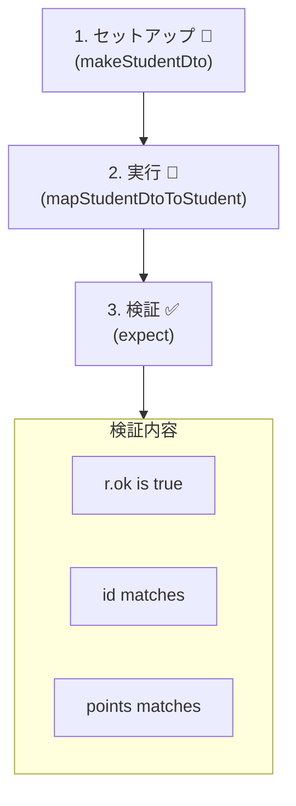

# 第18章：テスト① マッピングのユニットテスト（最強に効く）🧪🔥

## この章のゴール 🎯✨

* DTO→ドメイン変換（＝ACLの翻訳）を**ユニットテストでガチガチに守れる**ようになる💪🛡️
* 「正常系は少数でOK」「異常系は境界で落とす」を**テストで証明**できるようになる✅
* 変換が壊れたときに、**“どこが壊れたか一瞬で分かる”**テストを書けるようになる🔍⚡

---

# 1) なんで「マッピングのユニットテスト」が最強なの？🤔💥


ACLの仕事って、ざっくり言うとこれ👇

* 外の言葉（DTO）を、内側の言葉（ドメイン）に翻訳する🗣️➡️📘
* 外部の「変な値」「欠損」「謎コード」を**内側に入れない**🚫🧼

ここが壊れると…

* 内側が汚染される😇
* 不変条件が崩れる😱
* そして、バグが奥に潜って発見が遅れる🕳️🐛

だから、**境界の翻訳**はユニットテストで固めるのが超効くよ🧱✨
ユニットテストなら速いし、毎回同じ結果が出るし、改修の安心感が爆上がりする🔥🏃‍♀️💨




---

# 2) 2026のテスト環境：なにを使うのがラク？🧰✨

この章のサンプルは **Vitest** で進めるよ🧪⚡
Vitest は Jest 互換APIが多くて移行もしやすく、開発体験（特にwatch）がかなり強い設計になってるよ✨ ([Vitest][1])
一方、Jestは設定によってはESM周りで面倒が出やすく、公式ドキュメントでもESMサポートが注意書きされてるよ⚠️ ([Jest][2])
TypeScript側もNode向けモジュール設定が整理され続けてるので、モダン構成ほど「素直に動く」道を選ぶのが大事だよ🧠✨ ([typescriptlang.org][3])

---

# 3) マッピングで「何をテストする？」観点リスト📝✅

DTO→ドメインの変換は、だいたいこの観点を押さえると強いよ💪✨

## 正常系（少数精鋭でOK）🌈

* 代表的なDTOが、正しいドメインオブジェクトになる✅
* 命名変換・構造変換が意図通り✅
* 文字→数値、文字→日時などのパースが成功✅

## 不変条件（ドメインの門番）🔒

* 0未満はダメ、空文字はダメ、範囲外はダメ…を入口で落とす🚫
* つまり「おかしなDTOが来ても、内側は壊れない」🛡️✨

## コード値変換（謎コード撲滅）🔤🧹

* `"1"` → `UNDERGRAD` みたいに意味あるenumへ🎓
* 未知コードが来たらどうする？（エラー？Unknown？）をテストで固定📌

## 欠損・null・変な型（外部あるある）😇

* 必須が無い、null、空文字、桁がおかしい、想定外フォーマット💣
* ここは次章（異常系）で増やすけど、章18でも「入口で落ちる」最低限は触れるよ🧯

---

# 4) ハンズオン：DTO→ドメイン変換を「純粋関数」にしてテストする🧪✨


ここから、**小さくて強い形**を作るよ🎮🧱
ポイントはこれ👇

* 変換はできるだけ「副作用なし（純粋）」にする🧼
* 外部通信は一切しない（DTOを渡して結果を見るだけ）📦➡️📘
* 失敗は例外で雑に投げず、**結果の型**で返すとテストが安定しやすい📦✨



---

# 5) サンプル題材：学生情報DTOをドメインに翻訳する🎓🧾➡️📘

## 外部DTO（例）📦

* `stu_id`：学生ID（文字列）
* `grade_cd`：学年コード（"1","2","3"...）
* `point_balance`：ポイント（文字列で来ることがある）
* `updated_at`：日時（文字列）

## ドメイン側（例）📘✨

* `StudentId`：形式を保証する🪪🔒
* `StudentType`：enumで意味を持たせる🔤✨
* `Points`：0以上の整数を保証💰✅
* `updatedAt`：Dateにパース🕒

---

# 6) 実装：最小のResult型＆ValueObject（超シンプル版）🧩✨


## Result型（成功/失敗を型で表す）📦

```ts
export type Result<T, E> =
  | { ok: true; value: T }
  | { ok: false; error: E };

export const ok = <T>(value: T): Result<T, never> => ({ ok: true, value });
export const err = <E>(error: E): Result<never, E> => ({ ok: false, error });
```

## ドメイン（ValueObject）🔒

```ts
import { Result, ok, err } from "../shared/result";

export class StudentId {
  private constructor(public readonly value: string) {}

  static create(raw: string): Result<StudentId, "InvalidStudentId"> {
    // 例: A1234567 みたいな形式だけ許す（適宜ルールは変えてOK）
    if (!/^[A-Z]\d{7}$/.test(raw)) return err("InvalidStudentId");
    return ok(new StudentId(raw));
  }
}

export class Points {
  private constructor(public readonly value: number) {}

  static create(raw: number): Result<Points, "InvalidPoints"> {
    if (!Number.isInteger(raw)) return err("InvalidPoints");
    if (raw < 0) return err("InvalidPoints");
    return ok(new Points(raw));
  }
}

export enum StudentType {
  UNDERGRAD = "UNDERGRAD",
  GRAD = "GRAD",
}
```

---

# 7) ACL側：DTO→ドメインのマッピング関数（テスト対象）🔁🧱

```ts
import { Result, ok, err } from "../shared/result";
import { StudentId, Points, StudentType } from "../domain/student";

export type StudentDto = {
  stu_id: string;
  grade_cd: string;
  point_balance: string; // 外は文字列で来る想定
  updated_at: string;
};

export type Student = {
  id: StudentId;
  type: StudentType;
  points: Points;
  updatedAt: Date;
};

export type MappingError =
  | "InvalidStudentId"
  | "UnknownGradeCode"
  | "InvalidPoints"
  | "InvalidUpdatedAt";

const toStudentType = (gradeCd: string): Result<StudentType, "UnknownGradeCode"> => {
  // 例：外部都合のコード → ドメインの意味へ翻訳
  if (gradeCd === "1") return ok(StudentType.UNDERGRAD);
  if (gradeCd === "2") return ok(StudentType.GRAD);
  return err("UnknownGradeCode");
};

export const mapStudentDtoToStudent = (dto: StudentDto): Result<Student, MappingError> => {
  const idR = StudentId.create(dto.stu_id);
  if (!idR.ok) return err(idR.error);

  const typeR = toStudentType(dto.grade_cd);
  if (!typeR.ok) return err(typeR.error);

  const pointsNum = Number(dto.point_balance);
  if (!Number.isFinite(pointsNum)) return err("InvalidPoints");

  const pointsR = Points.create(pointsNum);
  if (!pointsR.ok) return err(pointsR.error);

  const d = new Date(dto.updated_at);
  if (Number.isNaN(d.getTime())) return err("InvalidUpdatedAt");

  return ok({
    id: idR.value,
    type: typeR.value,
    points: pointsR.value,
    updatedAt: d,
  });
};
```

---

# 8) テスト：Vitestで「変換が壊れてない」ことを証明する🧪🔥

## (A) テストデータビルダー（超おすすめ）🧁✨


「毎回DTOを手書き」すると、テストが読みにくくなるよ😵‍💫
なので、**正しいDTOを1個作る関数**を用意して、必要なところだけ上書きするのがラク👍💕

```ts
import type { StudentDto } from "./studentMapper";

export const makeStudentDto = (overrides: Partial<StudentDto> = {}): StudentDto => ({
  stu_id: "A1234567",
  grade_cd: "1",
  point_balance: "1200",
  updated_at: "2026-01-28T12:34:56+09:00",
  ...overrides,
});
```



## (B) 正常系：代表ケースを1〜2個で押さえる✅✨

```ts
import { describe, test, expect } from "vitest";
import { mapStudentDtoToStudent } from "./studentMapper";
import { makeStudentDto } from "./studentMapper.fixture";
import { StudentType } from "../domain/student";

describe("mapStudentDtoToStudent", () => {
  test("正常：DTOがドメインに翻訳される 🎉", () => {
    const dto = makeStudentDto({
      grade_cd: "1",
      point_balance: "1200",
    });

    const r = mapStudentDtoToStudent(dto);

    expect(r.ok).toBe(true);
    if (!r.ok) return;

    expect(r.value.id.value).toBe("A1234567");
    expect(r.value.type).toBe(StudentType.UNDERGRAD);
    expect(r.value.points.value).toBe(1200);
    expect(r.value.updatedAt instanceof Date).toBe(true);
  });
});
```

💡ポイント

* `r.ok` をまず見て、その後に中身を検証すると読みやすい📖✨
* `StudentType.UNDERGRAD` みたいに「意味」でassertするのがコツ🎓✅

---

# 9) 「内側の不変条件」が守られるかチェックする🔒🧪

## (A) 不変条件：ポイントがマイナスなら失敗する🚫💥

```ts
import { describe, test, expect } from "vitest";
import { mapStudentDtoToStudent } from "./studentMapper";
import { makeStudentDto } from "./studentMapper.fixture";

describe("mapStudentDtoToStudent - invariants", () => {
  test("異常：ポイントが負数ならInvalidPoints 🧯", () => {
    const dto = makeStudentDto({ point_balance: "-1" });

    const r = mapStudentDtoToStudent(dto);

    expect(r.ok).toBe(false);
    if (r.ok) return;

    expect(r.error).toBe("InvalidPoints");
  });
});
```

## (B) 謎コード：未知の学年コードなら落とす🔤🧹

```ts
import { describe, test, expect } from "vitest";
import { mapStudentDtoToStudent } from "./studentMapper";
import { makeStudentDto } from "./studentMapper.fixture";

describe("mapStudentDtoToStudent - code mapping", () => {
  test("異常：未知コードはUnknownGradeCode 🚨", () => {
    const dto = makeStudentDto({ grade_cd: "999" });

    const r = mapStudentDtoToStudent(dto);

    expect(r.ok).toBe(false);
    if (r.ok) return;

    expect(r.error).toBe("UnknownGradeCode");
  });
});
```

---

# 10) 「パラメータ化テスト」でスッキリ書く✨🧪


似たテストを増やすときは `test.each` が便利だよ📚💕

```ts
import { describe, test, expect } from "vitest";
import { mapStudentDtoToStudent } from "./studentMapper";
import { makeStudentDto } from "./studentMapper.fixture";

describe("mapStudentDtoToStudent - invalid updated_at", () => {
  test.each([
    ["空文字", ""],
    ["変な文字", "not-a-date"],
    ["日付っぽいけど壊れてる", "2026-99-99"],
  ])("異常：updated_atが%sならInvalidUpdatedAt 🕒💥", (_label, updated_at) => {
    const dto = makeStudentDto({ updated_at });

    const r = mapStudentDtoToStudent(dto);

    expect(r.ok).toBe(false);
    if (r.ok) return;

    expect(r.error).toBe("InvalidUpdatedAt");
  });
});
```

---

# 11) テストが弱くなる「やりがち」集😵‍💫⚠️


* DTOのフィールドを全部assertして、変更に弱い💥
  → **意味ある変換だけ**を押さえる（代表値）✅
* 例外投げっぱなしで、失敗理由が曖昧😇
  → `Result` みたいに **失敗が型で見える**とテストが気持ちいい✨
* テストデータを毎回手書きして読めない😵
  → `makeStudentDto()` 方式で解決🧁

---

# 12) 生成AIの使い方（この章で効くやつ）🤖✨


## 使いどころ①：観点の洗い出し📝💡

* 「このDTO→ドメイン変換で、テスト観点を20個出して」
* 「未知コード／欠損／型違い／範囲外／日時パースの観点で」

## 使いどころ②：`test.each` の量産🧪⚡

* 「InvalidPointsになる入力パターンを10個、`test.each` で」
* 「updated_atの壊れ方パターンを10個」

## 使いどころ③：フィクスチャ作成の補助📦✨

* 「現実っぽいDTOサンプルを3種類作って（正常/欠損/変な型）」

💡注意
AIが作ったテストは、たまに「仕様にないassert」を混ぜることがあるよ😂
最後は **“ドメインの意図”** に合ってるか目でチェックしよ👀🛡️

---

# 13) 練習問題（手を動かすゾーン）✍️🎓✨

## 問題1：トリム＆正規化を追加してテストしよう🧼✂️

* `stu_id` の前後に空白が来ることがある想定にして、

  * マッピングで `trim()`
  * `StudentId.create()` はtrim後の値で判定
* テスト： `"  A1234567  "` でも成功すること✅

## 問題2：ポイントが `"001200"` でもOKにする🎯

* `"001200"` → 1200 にパースされることをテスト✅

## 問題3：grade_cdを追加してみよう🔤✨

* `"3"` を `UNDERGRAD` 扱いにしたい、などルールを増やして

  * 変換関数 `toStudentType`
  * テスト追加🧪

---

# 14) 章末チェックリスト✅🎉

* DTO→ドメイン変換を「副作用なし」でテストできた🧼
* 正常系は代表ケースで押さえた✅
* 不変条件（例：ポイント0以上）をテストで守れた🔒
* コード値変換（未知コード）をテストで固定できた🔤
* `makeStudentDto()` でテストが読みやすくなった📚✨
* `test.each` で量産がラクになった🧪⚡

---

## ミニまとめ🌟

ACLのマッピングは、**境界で内側を守る“最後の砦”**🛡️✨
だからこそユニットテストで固めると、設計も開発も一気にラクになるよ🧪💖
次の章では、この基礎の上に「異常系・境界値・外部変更検知」をさらに盛って、壊れない構造にしていくよ🚨🧱

[1]: https://vitest.dev/guide/comparisons?utm_source=chatgpt.com "Comparisons with Other Test Runners | Guide"
[2]: https://jestjs.io/docs/configuration?utm_source=chatgpt.com "Configuring Jest"
[3]: https://www.typescriptlang.org/docs/handbook/release-notes/typescript-5-8.html?utm_source=chatgpt.com "Documentation - TypeScript 5.8"
