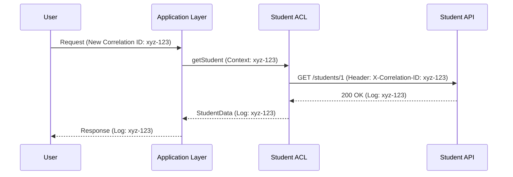
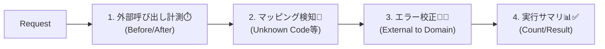
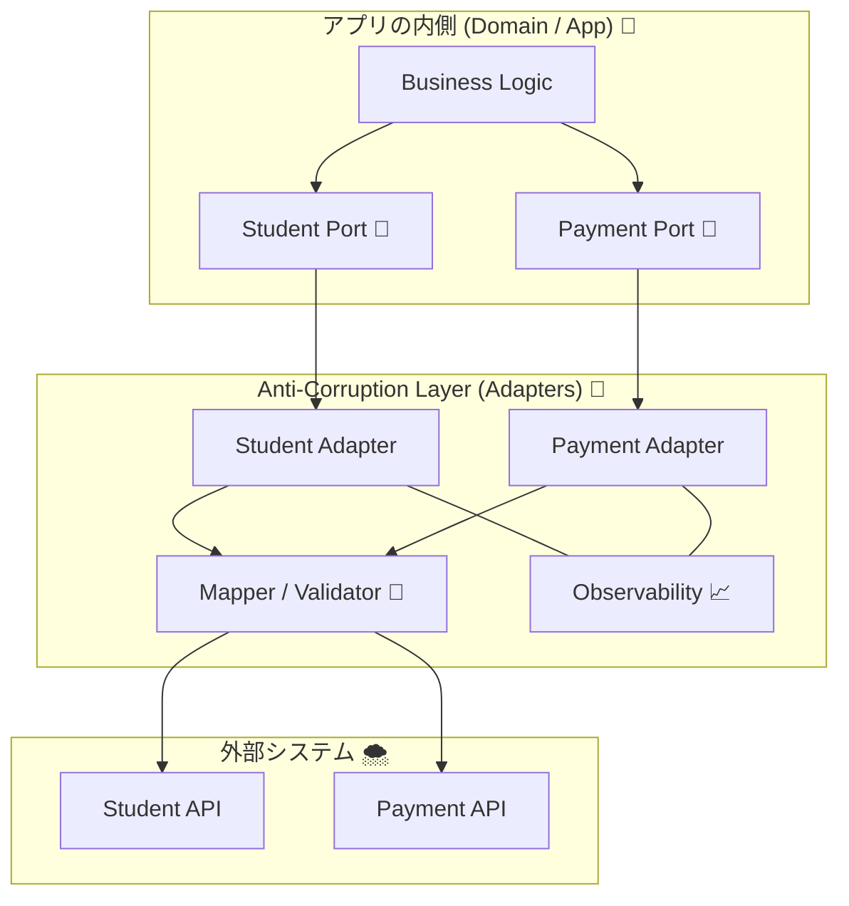

# 第20章：仕上げ：観測＋AI活用＋ミニプロジェクトで完成 🎓🏁📈🤖

## この章のゴール 🎯✨

* ACLに「観測（Observability）」を入れて、**壊れたときに原因が秒速で追える**状態にする📈🔍
* 生成AIで「変換関数」「テスト」「ログ設計」を加速しつつ、**ドメインの正しさは人間が守る**運用を身につける🤖🛡️
* 外部API 2つをACLで包んだミニプロジェクトを完成させて、**“外部DTOが内側に漏れない”卒業品質**にする✅🎉


---

## 20.1 観測ってなに？ACLに入れると何が嬉しいの？📈🧱


ACLは「外部のクセ」を吸収する場所だから、トラブルも集まりやすいです😇
だからこそ **“境界で見える化”** が超効きます✨

### ACLでよく起きる「見えない地獄」👻🕳️

* 外部APIが遅いのに、どの呼び出しが遅いか分からない🐢💦
* 変換（マッピング）で落ちてるのに、どのフィールドが原因か分からない🧩❓
* 外部の仕様変更に気づけず、現場で爆発する💥😱

### 観測を入れるとこうなる😍✨

* 「どの外部」「どのエンドポイント」「どれくらい遅い」「何回リトライ」が一発で分かる📊⚡
* 失敗が起きたリクエストを **相関ID（Correlation ID）** で追跡できる🔗🪪
* トレース（分散トレーシング）で **“1回のリクエストの旅”** が見える🗺️🚶‍♀️

---

## 20.2 まずは“ログの設計図”を作ろう 🧾🧠✨

ログは「文章」じゃなくて **データ（JSON）** にすると強いです💪📦
探せる・集計できる・機械が扱えるので、あとから泣きません😭➡️😊

### ACLログに入れると強い項目（おすすめセット）🧰✨

* `event`：何が起きた？（例：`acl.external_call` / `acl.mapping_failed`）🏷️
* `requestId`：相関ID（この章のあとで実装）🪪🔗
* `externalSystem`：どの外部？（例：`studentDirectory` / `payment`）🌍
* `operation`：何の操作？（例：`getStudent` / `charge`）🎛️
* `durationMs`：何msかかった？⏱️
* `httpStatus`：ステータス（例：200/429/500）🌩️
* `retryCount`：何回リトライした？🔁
* `errorKind`：分類（例：`timeout` / `rate_limit` / `invalid_payload`）🧊🔥

### ログに入れないほうがいいもの（危険）🚫🧨

* 個人情報（氏名・メール・住所など）🙅‍♀️
* 決済情報（カード番号など）💳❌
* そのままの外部レスポンス全文（肥大＆漏洩リスク）📦💥

---

## 20.3 相関ID（Correlation ID）で“1件のリクエスト”を追跡する🔗🪪


**相関ID = 「このリクエストの背番号」** です🏃‍♀️✨
これがあるだけで、ログの追跡が神になります🙏🌈

### さらに強い：`traceparent`（標準のトレース連携）🧬🌍

分散トレーシングの世界では、`traceparent` ヘッダーが定番です📩✨
`traceparent` は W3C の仕様で、`trace-id` などを運びます📦🧭。 ([W3C][1])



---

## 20.4 実装：AsyncLocalStorageで“どこからでもrequestIdを参照”🧵✨


Nodeでは **AsyncLocalStorage を使うのが推奨** されています（高速で安全に最適化されてるよ、という立ち位置です）🧠⚡。 ([nodejs.org][2])

### ① requestContext.ts（requestIdを保持）🪪🧵

```ts
// src/observability/requestContext.ts
import { AsyncLocalStorage } from "node:async_hooks";
import { randomUUID } from "node:crypto";

export type RequestContext = {
  requestId: string;
};

const storage = new AsyncLocalStorage<RequestContext>();

export function runWithNewRequestContext<T>(fn: () => T): T {
  const ctx: RequestContext = { requestId: randomUUID() };
  return storage.run(ctx, fn);
}

export function getRequestContext(): RequestContext | undefined {
  return storage.getStore();
}
```

### ② logger.ts（常にrequestId入りでログ出し）🧾✨

ここでは例として pino を使います（構造化ログで強い）🪵⚡

```ts
// src/observability/logger.ts
import pino from "pino";
import { getRequestContext } from "./requestContext";

const baseLogger = pino({
  level: process.env.LOG_LEVEL ?? "info",
});

export const logger = {
  info(obj: Record<string, unknown>, msg?: string) {
    const ctx = getRequestContext();
    baseLogger.info({ requestId: ctx?.requestId, ...obj }, msg);
  },
  warn(obj: Record<string, unknown>, msg?: string) {
    const ctx = getRequestContext();
    baseLogger.warn({ requestId: ctx?.requestId, ...obj }, msg);
  },
  error(obj: Record<string, unknown>, msg?: string) {
    const ctx = getRequestContext();
    baseLogger.error({ requestId: ctx?.requestId, ...obj }, msg);
  },
};
```

---

## 20.5 実装：ACLの外部呼び出しを“計測＆分類”する⏱️🔁🧊🔥

Nodeの `fetch` は公式ドキュメントでも案内されています🌐🧰。 ([nodejs.org][3])

### httpClient.ts（時間・ステータス・失敗種別をログ）📡🧾

```ts
// src/acl/http/httpClient.ts
import { logger } from "../../observability/logger";

export type HttpErrorKind = "timeout" | "rate_limit" | "http_error" | "network" | "invalid_json";

export class HttpClientError extends Error {
  constructor(
    message: string,
    public readonly kind: HttpErrorKind,
    public readonly httpStatus?: number,
  ) {
    super(message);
  }
}

export async function getJson<T>(params: {
  url: string;
  externalSystem: string;
  operation: string;
  timeoutMs?: number;
  headers?: Record<string, string>;
}): Promise<T> {
  const { url, externalSystem, operation } = params;
  const timeoutMs = params.timeoutMs ?? 8000;

  const started = performance.now();
  const ac = new AbortController();
  const timer = setTimeout(() => ac.abort(), timeoutMs);

  try {
    const res = await fetch(url, {
      method: "GET",
      headers: params.headers,
      signal: ac.signal,
    });

    const durationMs = Math.round(performance.now() - started);

    if (!res.ok) {
      const kind: HttpErrorKind = res.status === 429 ? "rate_limit" : "http_error";
      logger.warn(
        { event: "acl.external_call_failed", externalSystem, operation, url, httpStatus: res.status, durationMs, errorKind: kind },
        "External call failed",
      );
      throw new HttpClientError(`External call failed: ${res.status}`, kind, res.status);
    }

    logger.info(
      { event: "acl.external_call_succeeded", externalSystem, operation, url, httpStatus: res.status, durationMs },
      "External call succeeded",
    );

    try {
      return (await res.json()) as T;
    } catch {
      throw new HttpClientError("Invalid JSON", "invalid_json", res.status);
    }
  } catch (e: any) {
    const durationMs = Math.round(performance.now() - started);

    const kind: HttpErrorKind =
      e?.name === "AbortError" ? "timeout" : "network";

    logger.error(
      { event: "acl.external_call_exception", externalSystem, operation, url, durationMs, errorKind: kind },
      "External call exception",
    );

    throw new HttpClientError("External call exception", kind);
  } finally {
    clearTimeout(timer);
  }
}
```

---

## 20.6 OpenTelemetryで「トレース＆メトリクス」も入れる🧬📊

OpenTelemetry JavaScriptは **Traces と Metrics は Stable**、**Logs は Development** という状況です🧠✨。 ([OpenTelemetry][4])
なのでこの章では👇の順でいくのが安全です✅

1. まず構造化ログ（必須）🧾
2. 次にトレース（強い）🧬
3. メトリクス（運用の味方）📊
4. ログのOTel統合は“できる範囲で”🧪

### 最小の“トレース開始”コード（Consoleへ出す）🧬🖥️

```ts
// src/observability/otel.ts
import { NodeSDK } from "@opentelemetry/sdk-node";
import { getNodeAutoInstrumentations } from "@opentelemetry/auto-instrumentations-node";
import { ConsoleSpanExporter, SimpleSpanProcessor } from "@opentelemetry/sdk-trace-base";

const sdk = new NodeSDK({
  spanProcessor: new SimpleSpanProcessor(new ConsoleSpanExporter()),
  instrumentations: [getNodeAutoInstrumentations()],
});

export async function startOtel() {
  await sdk.start();
}
```

> “本番の観測”にするなら、Console ではなく OTLP Exporter などで集約先へ送ります📮📈（ここは最終課題で拡張ポイント✨）

---

## 20.7 ACLに“観測ポイント”をどこへ入れる？📍🧱


### 入れる場所はここ！おすすめ5点セット🖐️✨

5. **結果の要約**：成功/失敗、扱った件数など📊✅



---

## 20.8 AI活用：ACL開発で“速くなるところ”だけ使う🤖⚡

VS CodeのGitHub Copilotは、コード補完だけじゃなく説明や生成も支援できます🧠🧩。 ([Visual Studio Code][5])

### AIに任せると速いもの（やってOK）✅🤖

* 変換関数の“たたき台”（DTO→ドメイン）🔁
* enum変換テーブルの雛形（コード値→意味）🔤
* テストケース案の大量生成（境界値・異常系）🧪📦
* ログイベント名の候補、ログのフィールド案🧾🏷️
* リファクタ案（重複削除、関数分割）🧹✨

### AIに任せないほうがいいもの（人間が決める）🛡️🙅‍♀️

* ドメインのルール（不変条件・意味の確定）📘🔒
* 「未知コード来たらどうする？」の方針（捨てる/隔離/エラー）🚦
* セキュリティ（何をログに残すか、秘匿情報の扱い）🔐

### 使えるプロンプト例（コピペOK）📋✨

* 変換関数：

  * 「このDTO型をこのドメイン型に変換する関数を作って。未知コードは `Unknown` にしてログイベント `acl.mapping_failed` を出す。例外は投げず Result型で返して」🔁🧯
* テスト：

  * 「この変換に対して、正常系3つ＋異常系10個（欠損/未知コード/桁あふれ/空文字/不正日付）でテスト案を出して」🧪💣
* ログ設計：

  * 「ACLのログイベントを10個に整理して、必須フィールドと例をJSONで」🧾📦

---

## 20.9 ミニプロジェクト：外部API 2つをACLで包んで完成させる🎓🏁


題材はこの教材の流れに合わせて、例として「学生情報API」と「決済API」を統合する想定で進めます🎓🏦✨
ゴールはこれ👇

* 内側（ドメイン/アプリ層）は **ドメイン型だけ** で完結する📘✅
* 外部DTOは **ACLから1ミリも漏れない** 🧱🛡️



### ステップ1：Ports（内側のインターフェース）を用意🔌✨

```ts
// src/application/ports/studentDirectoryPort.ts
import { StudentId } from "../../domain/student";
import { Student } from "../../domain/student";

export interface StudentDirectoryPort {
  getStudent(id: StudentId): Promise<Student>;
}
```

```ts
// src/application/ports/paymentPort.ts
import { Money } from "../../domain/money";

export interface PaymentPort {
  charge(params: { memberId: string; amount: Money }): Promise<{ paymentId: string }>;
}
```

### ステップ2：ACL Adapter（外部API + 変換 + 観測）を実装🧱📡🧾

* `getJson()` で外部呼び出し計測⏱️
* DTO→ドメイン変換で未知コード検知🚨
* `requestId` が必ずログに入る🪪✨

（例：Student側）

```ts
// src/acl/studentDirectory/studentDirectoryAclAdapter.ts
import { StudentDirectoryPort } from "../../application/ports/studentDirectoryPort";
import { getJson } from "../http/httpClient";
import { Student, StudentId, StudentType } from "../../domain/student";
import { logger } from "../../observability/logger";

type ExternalStudentDto = {
  stu_id: string;
  stu_kbn: string; // "1" | "2" みたいな謎コード想定
  point_balance: number;
};

function mapStudentType(code: string): StudentType {
  switch (code) {
    case "1":
      return "UNDERGRAD";
    case "2":
      return "GRAD";
    default:
      logger.warn({ event: "acl.mapping_failed", externalSystem: "studentDirectory", operation: "mapStudentType", badCode: code }, "Unknown student type");
      return "UNKNOWN";
  }
}

export class StudentDirectoryAclAdapter implements StudentDirectoryPort {
  async getStudent(id: StudentId): Promise<Student> {
    const dto = await getJson<ExternalStudentDto>({
      url: `https://example.com/students/${id.value}`,
      externalSystem: "studentDirectory",
      operation: "getStudent",
    });

    return {
      id,
      type: mapStudentType(dto.stu_kbn),
      points: dto.point_balance,
    };
  }
}
```

### ステップ3：テストで「外部変更に先に気づく」🧪🚨

* DTOサンプル（fixture）を残す📦
* 未知コード・欠損・型違いで落ち方が安定してるか確認✅
* “外部が変わったらテストが鳴る”状態を作る🚨✨

### ステップ4：観測の仕上げ（チェック項目）📈✅

* 外部呼び出し成功ログ：`durationMs` が入ってる⏱️
* 失敗ログ：`errorKind` が分類されてる🧊🔥
* マッピング失敗ログ：`acl.mapping_failed` が出る🚨
* 1つのリクエストのログが `requestId` で束ねられる🔗🪪

---

## 20.10 卒業チェックリスト（これ全部YESなら勝ち🏆✨）✅🎉


* [ ] 内側（ドメイン/アプリ層）に外部DTO型が出てこない🧱
* [ ] 変換は「整形→検証→ドメイン生成」の形が守れてる🧼✅
* [ ] 未知コード/欠損/不正値の方針が決まっていて、挙動が一貫してる🚦
* [ ] 外部エラーとドメインエラーが分離され、翻訳されている🧊🔥
* [ ] ACLの外部呼び出しに `durationMs` と `errorKind` が必ず記録される⏱️
* [ ] `requestId` で1リクエストが追跡できる🔗
* [ ] テストが「外部変更検知」になっている（fixture + 異常系）🧪🚨
* [ ] AIが書いたコードはレビューされ、ドメインルールは人間が保証した🤖➡️🛡️

---

## 20.11 “よくある詰まりポイント”と即回復ワザ🩹✨

* 「ログが多すぎて読めない」😵

  * `event` を10種類くらいに絞って、フィールドは固定にする🏷️📦
* 「相関IDが途中で消える」🫥

  * リクエストの“最初”で AsyncLocalStorage を開始する🧵✨（AsyncLocalStorage推奨） ([nodejs.org][2])
* 「トレースは入れたけど活用できない」😇

  * まずは “外部呼び出しのSpan” だけでもOK。ログと同じ `externalSystem/operation` を付ける🧬📍
* 「TypeScriptの最新ってどれ？」🤔

  * npm上の最新は TypeScript 5.9.3 として掲載されています📌。 ([npm][6])
* 「Nodeの安定版どれ？」🧠

  * Node.js v24 が Active LTS として案内されています（更新日も表示あり）🟢。 ([nodejs.org][7])

[1]: https://www.w3.org/TR/trace-context-2/?utm_source=chatgpt.com "Trace Context Level 2"
[2]: https://nodejs.org/api/async_context.html?utm_source=chatgpt.com "Asynchronous context tracking | Node.js v25.4.0 ..."
[3]: https://nodejs.org/en/learn/getting-started/fetch?utm_source=chatgpt.com "Node.js Fetch"
[4]: https://opentelemetry.io/docs/languages/js/?utm_source=chatgpt.com "JavaScript - OpenTelemetry"
[5]: https://code.visualstudio.com/docs/copilot/overview?utm_source=chatgpt.com "GitHub Copilot in VS Code"
[6]: https://www.npmjs.com/package/typescript?utm_source=chatgpt.com "TypeScript"
[7]: https://nodejs.org/en/about/previous-releases?utm_source=chatgpt.com "Node.js Releases"
