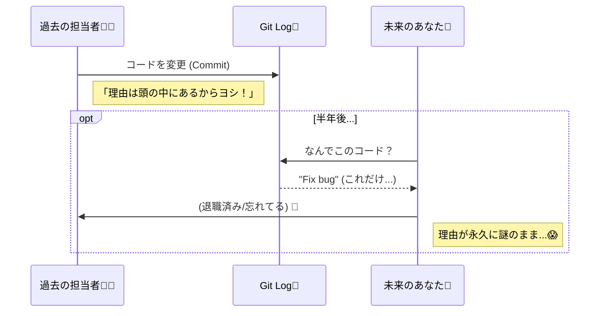
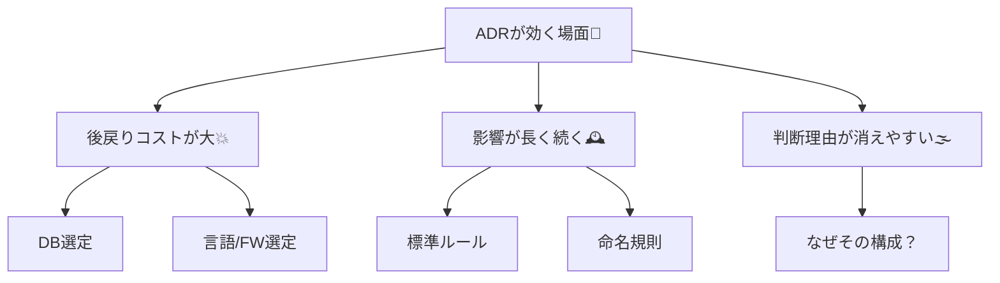
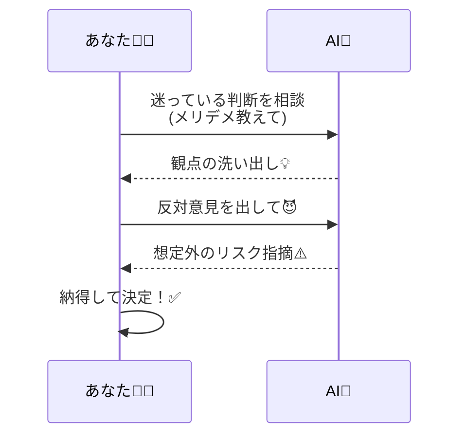

# 第01章：ADRってなに？未来の自分を助ける「設計メモ」じゃないよ😊📌

## 0) この章のゴール🎯✨

* ADRが「何を」「なぜ」残すものか、言葉で説明できるようになる😊
* 「ADRを書くと得する場面」をイメージできるようになる🧠💡
* まずは“3行ADR”を書いてみる✍️✨

（※内容は **2026/01/13 時点**で公開されている情報をベースにしてるよ🔎📚）

---

## 1) まず結論：ADRは「大事な判断の理由」を残す短い記録📝✨

ADR（Architecture Decision Record）は、**重要な設計判断**を、**その背景（Context）と、決めたこと（Decision）と、結果（Consequences）**つきで残す短いドキュメントだよ📌
“設計メモ”というより、**設計判断の履歴書**みたいな感じ😊
「何を決めたか」だけじゃなくて、**なぜそれを選んだのか**が主役✨ ([GitHub][1])

---

## 2) ありがちな事故：「なんでこうしたっけ？」😵‍💫💥

### 2-1) こんなこと起きない？🌀

* 半年前のコードを見て「え、なんでこの作り…？」ってなる😇
* 似た問題がまた出て、同じ議論を最初からやり直す😂
* 「A案を採用した理由」を説明できる人がいない（or 退職😭）

**Gitのコミットログだけ**だと「何を変えた」は追えても、
「なぜそう決めた」「他の選択肢は何だった」まで残りにくいんだよね💭

### 2-2) ADRはこの事故を減らす🧯✨

Microsoftのガイダンスでも、ADRは **“判断の文脈・正当化・影響”**を残して、**却下した選択肢やトレードオフ**も含めて記録しよう、って言ってるよ📒⚖️ ([Microsoft Learn][2])

---

## 3) ADRが効く場面（C#開発だとこういうやつ）🧩✨

「後から効いてくる」「やり直しコストが高い」判断ほど、ADRの出番だよ💪🔥 たとえば…

### 技術選定系🧰

* DBアクセス：EF Core / Dapper / 生SQLどれ？🗄️
* JSON：System.Text.Json の使い方方針（命名・Null・互換）📦
* ログ：構造化ログどうする？（Serilog系？）🪵

### 方針・ルール系📏

* 例外：どこで握りつぶす？どこで変換する？⚠️
* 非同期：`async/await`の扱い、キャンセルの規約🧵
* “層”や“境界”：UI/Domain/Infraの分け方どうする？🧱

### 運用・品質系🛡️

### 運用・品質系🛡️

* テスト方針（Unit中心？Integration中心？）🧪
* パフォーマンス優先ポイント（どこを最適化対象にする？）🚀

---

## 4) ADRは「設計書」じゃないよ🙅‍♀️📌（ここ超大事！）

ADRは **すべてを書く場所じゃない**よ〜😊

### ADRが向いてないもの🙈

* 変数名や命名の細かい悩み（すぐ変わる）
* UIの微調整（後戻りコスト小）
* 一時的な試作のメモ（すぐ捨てる）

### ADRが得意なもの😍

* しばらく効き続ける判断（半年〜数年）🕰️
* チームや将来の自分が「理由」を必要とする判断👥
* “却下した案”も含めて残す価値がある判断⚖️ ([Microsoft Learn][2])

---

## 5) 「ADRって、どんな形で残すの？」📁✨

多くのチームでは、ADRを **リポジトリ内に Markdown で置く**のが定番だよ📄
adr-tools みたいなツールだと、`adr init` で置き場所を作って、番号付きで増やしていく運用ができるよ🔢 ([GitHub][3])
（.NET向けの “dotnet-adr” みたいなツールも紹介されてるよ🧰） ([Architectural Decision Records][4])

> でも第1章では、まず「ADRの中身と価値」を体感できればOK😊✨
> 運用テクは後の章でガッツリやろう💪

---

## 6) まず書いてみよう：3行ADRミニ演習✍️😊

### ルール（かんたん版）📌

最近あなたが迷った「ちょい大事な判断」を1つ思い出して、**3行**で書くよ✨
（完璧じゃなくてOK！“未来の自分に伝わる”が合格🎉）

#### 3行テンプレ🧾

* Decision：私は **◯◯** にする
* Reason：なぜなら **◯◯** だから
* Consequence：その代わり **◯◯** は困る／注意する

#### 例（C#っぽい例）💡

* Decision：APIの入力チェックは **FluentValidation** で統一する
* Reason：ルールをテストしやすく、Controllerが読みやすくなるから
* Consequence：学習コストが少し増えるので、テンプレと例を用意する

✅ 書けたら、その3行は「第2章」でテンプレに当てはめて強化していくよ〜📒✨

---

## 7) AI活用（この章の使い方）🤖💬✨

ここは“AI導入済み”前提で、超ラクするやついくね😆🪄

### 7-1) 視点を増やす（メリデメ出し）⚖️

AIにこう聞くのがおすすめ👇

* 「このDecisionのメリット・デメリットを、保守性/性能/学習コスト/運用/テストの観点で出して」
* 「却下した方がよさそうな案（代替案）を2つ出して」
* 「将来この判断を見直すトリガー条件って何がありえる？」

Microsoftも「却下した選択肢やトレードオフを記録しよう」って言ってるから、AIに“反対意見役😈”をやらせるの相性いいよ✨ ([Microsoft Learn][2])

### 7-2) 3行ADR → ちゃんとした文章へ（次章への橋渡し）🌉

* 「この3行を Context / Decision / Consequences の形に整形して」
* 「読み手が未来の自分（半年後）だとして、前提が不足してる点を質問して」

---

## 8) 今日のまとめ🎁✨（ここだけ覚えればOK）

* ADRは **重要な判断＋理由＋結果**を残す短い記録📝 ([GitHub][1])
* 「なんでこうしたっけ？」事故を減らして、議論のやり直しを防ぐ🧯
* **却下した案・トレードオフ**まで残すと強い⚖️ ([Microsoft Learn][2])
* まずは **3行ADR**でOK！完璧主義は捨てていいよ😂✨

---

## 9) 宿題（5分）⏱️📌

1. 3行ADRを1本書く✍️
2. AIに「メリット/デメリット」「代替案2つ」を聞く🤖💬
3. その結果を、3行に1行だけ追記（例：注意点を1つ足す）✨

---

次の第2章では、いよいよ **テンプレ（Context / Decision / Consequences）**に当てはめて、ADRっぽい形にしていくよ📒🧩
よければ、あなたの「3行ADR」ここに貼って〜！一緒に“ADR化”して整えるよ😊✨

[1]: https://github.com/joelparkerhenderson/architecture-decision-record?utm_source=chatgpt.com "Architecture decision record (ADR) examples for software ..."
[2]: https://learn.microsoft.com/en-us/azure/well-architected/architect-role/architecture-decision-record?utm_source=chatgpt.com "Maintain an architecture decision record (ADR)"
[3]: https://github.com/npryce/adr-tools?utm_source=chatgpt.com "npryce/adr-tools: Command-line tools for working ..."
[4]: https://adr.github.io/adr-tooling/?utm_source=chatgpt.com "Decision Capturing Tools"
