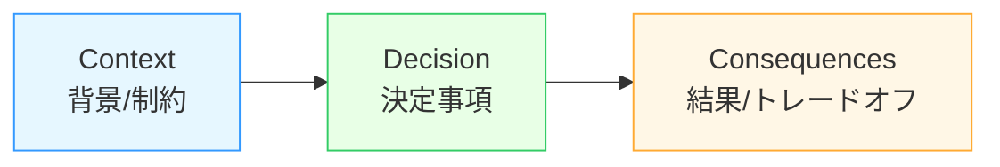
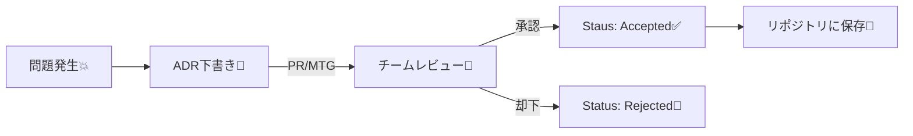
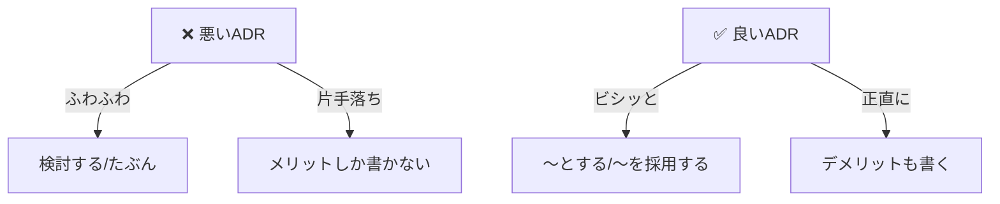

# 第02章：ADRの基本テンプレを覚えよう（型があると最強）🧩📄

## この章のゴール🎯

ADRを「迷わず書ける」ようにするために、まずは **定番テンプレ（型）** を体に入れます💪✨
型さえ覚えれば、内容が多少ざっくりでも **“後から読めるADR”** になります📚💕

---

## 1) ADRの最小セットはこれ！🧠✅


ADRは基本的に **1つの判断** を、だいたい次の要素で記録します👇
**Title / Status / Context / Decision / Consequences** が定番です🧾✨ ([Architectural Decision Records][1])

### ✅ 最小の3点セット（まずはここから！）

* **Context（背景）**：なぜ今それを決める必要があるの？どんな痛み？制約は？😣📌
* **Decision（決定）**：結論は何？「〜する」と言い切る✅✍️
* **Consequences（結果）**：良いこと・困ること（トレードオフ）⚖️💦

> この3つが書けたら、もうADRとして成立してます🙆‍♀️✨ ([Architectural Decision Records][1])



---

## 2) 追加でよく入れる項目（超おすすめ）➕🧩


「読む人が迷子にならない」ために、次もセットで覚えると強いよ〜💪😊

### 🟡 Status（状態）…これ超大事！

よくある例👇

* **Proposed**（提案中）💭
* **Accepted**（採用）✅
* **Superseded**（置き換え済み）🔁
* **Deprecated**（非推奨）🧯

※ “あとで新ADRで置き換える”運用が基本なので、**Superseded** は頻出です🔁 ([architectviewmaster.com][2])

### 🟡 Date（いつ決めた？）📅

「当時の前提」を思い出す助けになります🕰️
（例：2026-01-13 みたいにISOでOK）

### 🟡 Links（関連リンク）🔗

* 関連Issue / PR
* 設計メモ
* 置き換え先ADR（Superseded by: 0007-...）など

---

## 3) “運用ルール”の基本：1判断＝1ファイル 📄✅


ADRは **1つの判断を、1ファイルに分ける** のが基本です📌
判断が2つ混ざると、あとで読むときに「結局どれの話？」ってなりがち😵‍💫

### 🔢 命名の型（定番）

* `0001-logging-strategy.md`
* `0002-exception-handling.md`

連番＋短いタイトルだと検索もしやすいです🔍✨ ([A nice guy's view on life][3])

### ✨ 「短く」ルールの目安

* まずは **1ページ（だいたい300〜600字＋箇条書き）** を目標でOK👌😊
* 長くなるなら **“判断が複数”** のサインかも✂️



---

## 4) すぐ使えるテンプレ（コピペOK）🪄📄

まずはこのテンプレで固定しちゃうのが一番ラクです😊
（ADRの定番構造に沿ってます✨） ([Architectural Decision Records][1])

```md
# ADR 0001: （短いタイトル）

## Status
Proposed

## Context
- （なにが問題？どんな痛み？）
- （制約は？期限・既存資産・チーム都合など）
- （現状はどうなってる？）

## Decision
- （結論：〜を採用する / 〜しない）
- （理由：なぜそれが今いちばん良い？）

## Consequences
### Good 👍
- （良くなること）

### Bad / Trade-offs 😵
- （困ること・失うもの）
- （運用で注意すること）

## Links
- Issue: #
- PR: #
- Related: （URLやファイルパス）
```

---

## 5) サンプルADRを読んで「3要素に色分け」してみよう🖍️😊


題材はC#だとイメージしやすいように、**ログ方針**にしてみるね🪵✨
（.NET 10 / C# 14 が最新ラインです📌） ([Microsoft for Developers][4])

```md
# ADR 0001: Logging strategy for small services

## Status
Accepted

## Context
- 現状は Console.WriteLine が混在していて、ログ形式がバラバラ。
- 障害調査で「いつ・どの処理・どのユーザー」が追いづらい。
- まずは小規模サービス向けに、導入が軽い方針がほしい。

## Decision
- Microsoft.Extensions.Logging をベースに統一する。
- 追加の出力先（ファイル/外部）や構造化ログは必要になった時点で拡張する。

## Consequences
### Good 👍
- ログAPIが統一され、最低限の整形ができる。
- 依存が標準寄りで、導入が軽い。

### Bad / Trade-offs 😵
- すぐに高度な検索・集約までは手に入らない。
- 構造化ログや外部基盤は将来追加の判断が必要。

## Links
- Issue: #123
- PR: #130
```

### 🧪 ミニ演習（3分）⏱️

1. 上のサンプルから **Context / Decision / Consequences** をそれぞれ探す🔎
2. それぞれの行の先頭に、絵文字タグを付けて「色分け」してみてね👇

   * 🧩 Context
   * ✅ Decision
   * ⚖️ Consequences

例：

* 🧩 現状は Console.WriteLine が混在していて…

---

## 6) “文章をテンプレに当てはめる”練習（変換ゲーム）🎮✨

### お題（ぐちゃっとメモ）🌀

> ログは今 Console.WriteLine と ILogger が混ざってる。
> とりあえず統一したい。
> でも外部のログ基盤はまだ早い気がする。
> 学習コストも上げたくない。

### ✍️ あなたの作業

このメモを、テンプレの **Context / Decision / Consequences** に分解して、箇条書きにしてみよう🧾✨
（正解は1つじゃないよ🙆‍♀️）

---

## 7) AI活用コーナー：テンプレ変換をAIに丸投げしてOK🪄🤖💕


“自分でゼロから書く”より、**AIに下書きを作らせて直す** ほうが速いです⚡

### ✅ プロンプト例（そのまま使える）💬

```text
以下の文章をADRテンプレに変換して。
出力は Markdown で、見出しは Status / Context / Decision / Consequences / Links。
Decision は言い切りで1〜2文。
Consequences は Good と Bad/Trade-offs を必ず両方出して。

--- 対象文章 ---
（ここにメモを貼る）
```

### ✅ 追加でもう一発（品質が上がるやつ）🌟

```text
上のADRについて、読み手が迷うポイント（前提不足・曖昧な表現）を3つ指摘して、
それぞれを短く直した改善案も出して。
```

---

## 8) よくある失敗あるある（先に潰す）😂🧯

* ❌ Decisionが「検討する」「〜の予定」みたいに曖昧
  → ✅ 「〜を採用する」「〜しない」と言い切る💪
* ❌ Consequencesがメリットだけ
  → ✅ デメリットも書く（未来の自分を助ける）🥹✨ ([architectviewmaster.com][2])
  → ✅ “誰が読んでも同じ状況”になるように、痛み・制約を箇条書き📌



---

## 9) この章のまとめ🎁✨

* ADRはまず **Context / Decision / Consequences** の3点セットでOK🧩✅⚖️
* そこに **Status / Date / Links** を足すと、運用で強い📌🔗
* **1判断＝1ファイル**、そして短く！📄✨ ([Architectural Decision Records][1])
* AIは **テンプレ変換係** にすると最強🤖🪄

---

次は第3章で「**いつADRを書くべき？（書きどき判定）**」に進むと、さらに迷いが減ってスイスイになりますよ〜🔍✅😊

[1]: https://adr.github.io/adr-templates/?utm_source=chatgpt.com "ADR Templates | Architectural Decision Records"
[2]: https://www.architectviewmaster.com/blog/building-an-architecture-decision-record-adr-library/?utm_source=chatgpt.com "Building an Architecture Decision Record (ADR) Library"
[3]: https://jon.sprig.gs/blog/post/2339?utm_source=chatgpt.com "Cross Platform Decision Records/Architectural Decision ... - Jon"
[4]: https://devblogs.microsoft.com/dotnet/announcing-dotnet-10/?utm_source=chatgpt.com "Announcing .NET 10"
