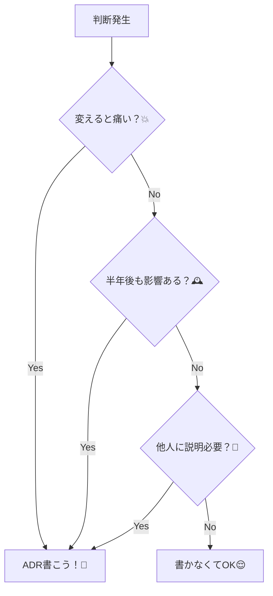
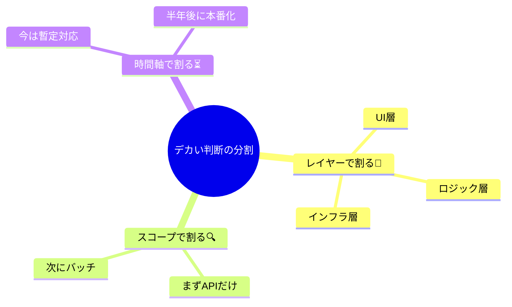

# 第03章：いつADRを書く？「書きどき判定」スキル🔍✅

## 0. この章でできるようになること🎯✨

この章のゴールはこれだよ〜！😊💡

* 「これはADRに残すべき？」を迷わず判断できるようになる✅
* **ADRにしなくていい判断**も見分けて、ムダを減らす🧹✨
* 「判断がデカすぎる😵‍💫」ときに、いい感じに**分割**できる✂️🧩
* AI（Copilot / Codex系）に手伝わせて、**最短でそれっぽいADR**を書ける🤖🪄

ちなみに、C# 14 は .NET 10 で使える最新バージョンだよ📌（Visual Studio 2026 で試せる）([Microsoft Learn][1])
Visual Studio 2026 は AI 統合が強めになってる、って公式にも書かれてるよ🤖✨([Microsoft Learn][2])

---

## 1) そもそもADRって「何を書くの？」📝

超ざっくり言うと、ADRはこういうもの👇

* **1つのADR = 1つの“重要な意思決定”**✅
* しかもその決定は、**プロジェクトの進み方に影響するレベル**のやつ💥
* ADRの「結果（Consequences）」が、次のADRの「背景（Context）」になることも多いよ🔁✨([Cognitect.com][3])

---

## 2) ADRを書いた方がいい判断の特徴👑✅（まずはコレだけ覚えて！）


「ADR向き」かどうかは、だいたいこの3つで当たるよ🎯

### A. 後戻りコストがデカい💥

* 変えたら「移行が地獄」「互換性が崩れる」「直すの大変」みたいなやつ😱
* APIの破壊的変更みたいに、利用者に影響するのも強ADR案件📣([Spotify Engineering][4])

### B. 長く効く🕰️

* 半年後も効いてる（＝忘れた頃に効いてくる）
* 継続運用・保守に響くやつ🌿

### C. 他人に影響する👥

* チームメンバーが増える／引き継ぎが発生する
* 別モジュール・別サービスにも波及する🌊

---

## 3) 逆に、ADRを書かなくていい判断🙅‍♀️🌱

ADRは「便利」だけど、何でもかんでも書くと疲れちゃう😂💦

### ADR不要になりがち👇

* 変数名・メソッド名などの細かい命名🧩
* UIの細部（色、余白、微調整）🎨
* すぐ捨てる試作（PoC）で、判断が残らない前提のもの🧪
* 1日以内に気軽に直せる範囲の調整🔧

ポイントはこれ👇
**「また変える前提」「軽く直せる」ならADRいらないことが多い**😊

---

## 4) 迷ったらコレ！「書きどき5チェック」✅✅✅✅✅

YESが多いほど、ADRを書こう！📝✨

1. その判断、あとで変えると痛い？（移行コスト・互換性・作り直し）💥
2. 半年以上先まで影響しそう？🕰️
3. 他の人（未来の自分含む）が見ても理由が必要？👀
4. 選択肢が2つ以上あって迷ってる？🤔
5. “非機能”に関わる？（性能/運用/セキュリティ/可用性/テスト容易性）🧪🔒🚀

「非機能」は、あとから効いてきて泣きがちだから要注意だよ〜🥹💦



---

## 5) さらに実戦的！「ADR向き度スコア」📊✨


チェックを点数化すると、判断がブレにくいよ😊

* 各項目 0〜2 点で採点するよ👇

  * 0: 軽い
  * 1: まぁ影響ある
  * 2: デカい

### スコア項目（合計10点満点）🧮

* 後戻りコスト💥（0〜2）
* 影響期間🕰️（0〜2）
* 影響範囲👥（0〜2）
* 選択肢の多さ🤔（0〜2）
* 非機能への影響🧪🔒🚀（0〜2）

### 判定ルール✨

* **0〜3点**：ADRいらない寄り🙆‍♀️
* **4〜6点**：グレー（後述の“15分ADR”でOK）🟨
* **7〜10点**：ADR書こ！ほぼ確定✅📝

Spotify の記事でも「大きい変更が終わったらADRで決定を残す」「小さい変更でも判断があるならADRにする」みたいな判断モデルが紹介されてるよ([Spotify Engineering][4])

---

## 6) 例で覚えよ！ADR必要/不要/グレー仕分け🗂️✨

### ✅ ADR必要（強い）

* 例外方針：例外を握りつぶす？戻り値？例外を上位に投げる？⚠️
* DBアクセス方針：EF Core中心？Dapper？生SQL？🗄️
* ログ方針：構造化ログにする？どこまで残す？PIIどうする？🪵🔒
* APIの破壊的変更（移行が必要）📣💥([Spotify Engineering][4])
* 監視・運用の方針（アラート設計、SLOなど）📈

### 🙅‍♀️ ADR不要（軽い）

* 命名の好み（例：Serviceを付ける/付けない）🧩
* UIのボタン色を変える🎨
* 小さなリファクタ（すぐ戻せる）🔧

### 🟨 グレー（ここが腕の見せどころ！）

* ライブラリを1つ追加する（でも今後の標準になるならADR寄り）📦
* テスト方針をちょっと変える（CI/文化に影響するならADR）🧪
* モジュール分け（規模によるけど、境界はだいたいADR向き）🧱

---

## 7) 「判断がデカすぎる😵‍💫」を分割するコツ✂️🧩

初心者が一番ハマるやつ！ここ大事！📌✨

### 分割の基本ルール👇

* **1ADR = 1つの結論**にする（盛りすぎない）([Cognitect.com][3])
* デカい判断は、こう割るとラクだよ😊

#### パターンA：レイヤーで割る🧱

* 例：

  1. 「例外方針」
  2. 「ログ方針」
  3. 「DBアクセス方針」
     みたいに、関心ごとで分ける🎛️

#### パターンB：スコープで割る🔍

* 例：まず「API層だけ」→次に「バッチ処理」→次に「共通基盤」みたいに段階で分ける🐾

#### パターンC：今決めること / 後で決めること を分ける⏳

* “今は決めない”も立派な判断だよ😊
* 「今はAで行く、条件Bになったら見直す」みたいに書く🧷✨



---

## 8) 迷ったときの救済策✨「15分ADR」📝⏱️

グレーな判断は、まずこれでOK！
Microsoft も「ADRは追記型（append-only）で維持する」って考え方を紹介してるよ📌([Microsoft Learn][5])

```text
# タイトル：◯◯の方針をどうする？

## Context（背景）
- いま困っていること：
- 制約：
- 影響が出そうな範囲：

## Decision（結論）
- 私たちは「◯◯」を採用する

## Consequences（結果）
- 良いこと：
- 困ること：
- 見直し条件：
```

これだけでも「未来の自分」が超助かるよ〜😭✨

---

## 9) AI活用コーナー🤖🪄（採点・漏れチェック・反対意見）

### 9-1. 「ADR向き度」をAIに採点してもらう📊

```text
あなたはソフトウェア設計のレビュアーです。
次の判断テーマについて、ADR向き度を0〜10点で採点し、
理由を「後戻りコスト/影響期間/影響範囲/選択肢/非機能」の5観点で短く説明してください。

判断テーマ：
（ここに貼る）
```

### 9-2. 比較軸の漏れチェック🔎

```text
次の選択肢と比較軸に漏れがないかチェックして。
追加すべき比較軸があれば、理由付きで提案して。

選択肢：
- A
- B
- C

比較軸：
- 開発速度
- 保守性
- 学習コスト
- 運用
- 性能
- テスト容易性
```

### 9-3. 悪魔の代弁者😈（これ超効く）

```text
このDecisionに反対する立場として、強い反論を3つ出して。
その反論への回答案も添えて。
```

---

## 10) ミニ演習🧪✍️：「10個仕分け」やってみよう（答え付き）✅

### お題（ADR必要？不要？グレー？）🗂️

1. 例外は例外で投げるか、Result型にするか
2. Controllerの命名規則（〜Controllerを付ける/付けない）
3. 監視で、エラー率アラートをどの閾値にするか
4. DIコンテナの使い方を統一する（どのライフサイクルで登録する？）
5. UIのテーマカラーを青→緑にする
6. DBはEF中心で行くか、Dapper中心で行くか
7. “ログに個人情報を出さない”ルールを決める
8. ある画面のボタン位置を右→左へ
9. API v1を廃止してv2へ移行する（破壊的変更）
10. 1クラスを2クラスにリファクタ（戻せる範囲）

### 模範仕分け（例）💡

* ADR必要：1 / 3 / 4 / 6 / 7 / 9
* ADR不要：2 / 5 / 8 / 10（※10は規模が小さい前提ね！）

「判断が“標準化”や“運用”に触れた瞬間、ADR寄り」になりやすいよ😊✨

---

## まとめ🎀：「ADRを書くか迷ったら」この一言でOK💬✨

* **“未来の自分が理由を知りたくなるならADR”**🕰️💖
* **“変えると痛い・長く効く・他人に効く”はADR**✅
* グレーはまず **15分ADR** で小さく残す📝⏱️

次章（第4章）で「選択肢の出し方」と「比較軸の作り方」をやると、ADRが一気に書きやすくなるよ〜🎛️🧠✨

[1]: https://learn.microsoft.com/en-us/dotnet/csharp/whats-new/csharp-14 "What's new in C# 14 | Microsoft Learn"
[2]: https://learn.microsoft.com/en-us/visualstudio/releases/2026/release-notes "Visual Studio 2026 Release Notes | Microsoft Learn"
[3]: https://www.cognitect.com/blog/2011/11/15/documenting-architecture-decisions "
    
    Documenting Architecture Decisions
    
  "
[4]: https://engineering.atspotify.com/2020/04/when-should-i-write-an-architecture-decision-record "When Should I Write an Architecture Decision Record | Spotify Engineering"
[5]: https://learn.microsoft.com/en-us/azure/well-architected/architect-role/architecture-decision-record "Maintain an architecture decision record (ADR) - Microsoft Azure Well-Architected Framework | Microsoft Learn"
