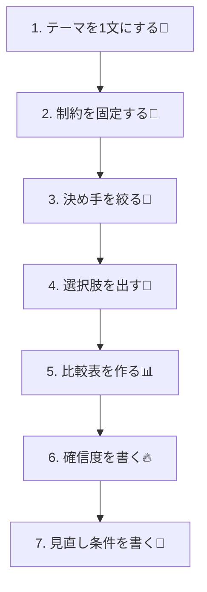

# 第04章：設計判断の作り方（比較軸と選択肢を作る）🎛️🧠

## この章のゴール 🎯

「なんとなく」で決めずに、**選択肢（Options）**と**比較軸（Criteria）**をちゃんと作って、迷いを減らしながらスパッと決められるようになるよ〜！😊💪
ADRは「結論」だけじゃなくて、**どうやってその結論にたどり着いたか**が価値なんだ📒✨ ([Microsoft Learn][1])

---

## 4-1. まず知っておくとラク：ADRで大事なのは「比較の土台」🧱💡

ADRって、よくある基本形だと **Context / Decision / Consequences**（＋Statusや日付）みたいな構造が定番だよね📝 ([Architectural Decision Records][2])
そして「ちゃんと比較した？」を支えるのが、今回のテーマ👇

* ✅ **Options considered（検討した選択肢）**
* ✅ **Decision drivers / Criteria（比較軸・判断の決め手）**
* ✅ **Trade-offs（トレードオフ：良い点だけじゃなく痛い点も）**
* ✅ **Confidence（どれくらい確信ある？）** ←これも後で効く！ ([Microsoft Learn][1])

---

## 4-2. 迷いを減らす「7ステップ決め方レシピ」🍳✨

### Step 1：テーマを1文にする（迷子防止）🧭

まずはこれだけでOK！

* 「何を決めたいの？」を1文で👀
  例：

  * 「ログの取り方を決める」🪵
  * 「DBアクセス方法を決める」🗄️
  * 「例外（Exception）方針を決める」⚠️

**コツ：動詞で終わらせる**とブレにくいよ😊✍️




---

### Step 2：制約を先に固定する（ここが超重要）📌⛓️


比較軸より先に、**動かせないもの**を決めちゃうと一気にラク！

制約の例👇

* ⏳ 締切（いつまでに決める？）
* 🧩 既存資産（すでに使ってるライブラリ、運用の仕組み）
* 🧑‍🤝‍🧑 チーム/自分のスキル（学習コストの許容）
* 🔐 セキュリティ要件
* 🛠️ 運用要件（監視したい、調査しやすい、障害対応しやすい）
* 💰 コスト（有料SaaSあり？なし？）

ここがふわっとしてると、比較が永遠に終わらないよ〜😂🌀

---

### Step 3：判断の「決め手」を3〜5個に絞る（Decision Drivers）🎯✨

比較軸は無限に作れちゃうから、**大事なものだけ**に絞るのがコツ！

よく使う「決め手」セット👇（迷ったらここから✨）

* ⚡ 開発速度（作るの早い？）
* 🧹 保守性（未来の自分がつらくない？）
* 🧪 テストしやすさ（自動テスト組みやすい？）
* 🧰 運用しやすさ（ログ・監視・障害調査が楽？）
* 🚀 パフォーマンス（必要十分？）
* 📚 学習コスト（今の自分で扱える？）
* 🔒 安全性（セキュリティ/ミスりにくさ）


---

### Step 4：選択肢を最低2〜3個出す（Options）🌱🌱🌱

「Aにする！」って最初から決めちゃうと、ADRがただの作文になりがち😵‍💫
最低でもこれ👇を意識してね！

* ✅ **現状維持（Do nothing / Keep current）** を“必ず”入れる
* ✅ 「理想だけど重い案」も1個入れる
* ✅ 「軽いけど制約あり案」も1個入れる

> MicrosoftのADRガイドでも「Options considered」を入れるのが推奨だよ📝 ([Microsoft Learn][1])


---

### Step 5：比較軸（Criteria）で並べてみる（ここが本番）📊👀


#### いちばん簡単：◎○△× でOK！😊

* ◎：めちゃ良い
* ○：良い
* △：まあ…
* ×：厳しい

#### もうちょいだけ本格：点数 1〜5 ＋重み（Weight）🎚️

「運用が命！」みたいなときは、重みをつけると納得感が増えるよ✨
（でもやりすぎると疲れるので、**重みは最大でも3段階**くらいがちょうどいい😂）

---

### Step 6：Confidence（確信度）も書く 🔥➡️🧊


ADRには「この判断、確信どれくらい？」も残すと未来で助かる！
Microsoftのガイドでも **confidence level** を記録する話が出てるよ📌 ([Microsoft Learn][1])

例：

* ✅ High：実績もあるし、運用イメージもはっきり
* 🟡 Medium：たぶんいけるけど、初めて要素あり
* 🔴 Low：賭け。検証して見直す前提！

---

### Step 7：「見直し条件」もセットで決める 🔁🧷

未来の自分が困らない魔法の一文✨

* 「トラフィックが◯倍になったら再検討」📈
* 「障害対応で辛かったら別案に切り替え検討」🚑
* 「半年後に棚卸し」🕰️


---

## 4-3. すぐ使える！比較表テンプレ（コピペ用）📄✨

```text
# テーマ：
（例：ログ方針を決める）

## 制約：
- 期限：
- 既存資産：
- 運用要件：
- セキュリティ要件：
- 学習コスト許容：

## Decision Drivers（大事な比較軸 3〜5個）：
1.
2.
3.
4.
5.

## Options（選択肢：最低2〜3）
- Option A：
- Option B：
- Option C：（任意）

## 比較（◎○△× or 1〜5）
| Criteria \ Option | A | B | C |
|---|---:|---:|---:|
| （例）開発速度 |  |  |  |
| （例）運用しやすさ |  |  |  |
| （例）学習コスト |  |  |  |
| （例）テスト容易性 |  |  |  |
| （例）将来の拡張 |  |  |  |

## Decision（一言で）
（例：Option Bを採用する）

## Consequences（良い点/困る点）
- 👍 良い点：
- 💦 困る点：

## Confidence：
High / Medium / Low

## 見直し条件：
- （例）半年後に棚卸し
```

---

## 4-4. 具体例①：ログ方針を決める🪵🔎✨（ミニADRの材料）

### テーマ

「アプリのログの取り方を決める」🪵

### Options（例）

* **A：最低限（標準のログ＋コンソール中心）**
* **B：構造化ログ中心（ログ検索しやすい設計）**
* **C：観測性強め（ログ＋トレース/メトリクスも意識）**

※ここはプロジェクト次第で変えてOKだよ😊

### Criteria（例）

* ⚡ 開発速度
* 🧰 運用しやすさ（障害調査が楽？）
* 📚 学習コスト
* 🚀 パフォーマンス
* 🔁 拡張性

### ◎○△×でざっくり比較（例）

| Criteria \ Option |  A |  B |  C |
| ----------------- | -: | -: | -: |
| 開発速度⚡             |  ◎ |  ○ |  △ |
| 運用しやすさ🧰          |  △ |  ○ |  ◎ |
| 学習コスト📚           |  ◎ |  ○ |  △ |
| パフォーマンス🚀         |  ○ |  ○ |  ○ |
| 拡張性🔁             |  △ |  ○ |  ◎ |

ここでの大事ポイントは「正解表」を作ることじゃなくて、**チーム/自分の状況に合わせた納得の形**を作ることだよ😊💕

---

## 4-5. 具体例②：DBアクセスを決める🗄️✨（C#だと超あるある！）

2026年1月時点だと、最新の大きい流れは **.NET 10（LTS）**＆ **C# 14** だよ📌✨ ([Microsoft for Developers][3])
DBまわりも **EF Core 10** が .NET 10 と同じくLTSとして出てる🗄️✨ ([Microsoft Learn][4])

### Options（例）

* **A：EF Core中心（生産性・保守性寄り）**
* **B：Dapperなど軽量ORM中心（速度・明示性寄り）**
* **C：ADO.NET中心（コントロール最強だけど手間）**

### 比較軸（例）

* ⚡ 開発速度
* 🧹 保守性
* 🧪 テストしやすさ
* 🚀 パフォーマンス
* 🧠 チーム理解しやすさ（属人化しない？）

このへんも表にしていくと、「なぜそれにしたか」が超クリアになるよ😊✨
（そしてそれがADRの価値になる！）

---

## 4-6. よくある落とし穴（ここハマりがち）🕳️😂

* ❌ **選択肢が1つしかない**（それ比較じゃない〜！）
* ❌ **比較軸が“好き嫌い”だけ**（未来の自分が納得できない）
* ❌ **軸が多すぎて疲れる**（3〜5個で十分！）
* ❌ **全部を一気に決めようとする**（判断を小さく切る✂️）
* ❌ **デメリットを書かない**（後から爆発しやすい💥）


---

## 4-7. AI活用：この章で一番効く使い方🤖✨（そのままコピペOK）

### ① 選択肢を増やす🌱

```text
「テーマ：〇〇を決めたい。
制約：〇〇。
現状：〇〇。
選択肢を“現状維持も含めて”3〜5個出して。
それぞれのメリット/デメリットも短く。」
```

### ② 比較軸の漏れチェック🔎

```text
「この比較軸で意思決定する予定：A, B, C, D。
抜けている比較軸がないか、運用・セキュリティ・チームスキル観点で指摘して。」
```

### ③ 悪魔の代弁者（反対意見）😈

```text
「Option Bを採用したい。
反対派の立場で、強めの反論を5つ。
その反論への返し（現実的な対策）もセットで。」
```

### ④ ADRの文章に整形🪄

```text
「以下のメモをADRの形にして：
Context / Options considered / Decision / Consequences / Confidence / Revisit conditions
（ここにメモ貼る）」
```

ADRって「書くのがしんどい」になりがちだけど、**比較表まで作ってあるとAI整形が超強い**よ〜！😊💨 ([Architectural Decision Records][5])


---

## 4-8. ミニ演習（この章のゴール確認）✅💖

次のどれか1つでいいからやってみてね👇（小さくでOK！）

1. テーマを1文で書く📝
2. 制約を3つ書く📌
3. 選択肢を3つ出す🌱
4. 比較軸を5つ選ぶ🎯
5. ◎○△×で表を埋める📊
6. Decisionを1文で言い切る✅
7. Confidenceと見直し条件を書く🔁

ここまでできたら、次の章（Contextの書き方）に行く準備バッチリだよ〜！🎀😊

[1]: https://learn.microsoft.com/en-us/azure/well-architected/architect-role/architecture-decision-record?utm_source=chatgpt.com "Maintain an architecture decision record (ADR)"
[2]: https://adr.github.io/adr-templates/?utm_source=chatgpt.com "ADR Templates | Architectural Decision Records"
[3]: https://devblogs.microsoft.com/dotnet/announcing-dotnet-10/?utm_source=chatgpt.com "Announcing .NET 10"
[4]: https://learn.microsoft.com/en-us/ef/core/what-is-new/ef-core-10.0/whatsnew?utm_source=chatgpt.com "What's New in EF Core 10"
[5]: https://adr.github.io/madr/?utm_source=chatgpt.com "About MADR"
