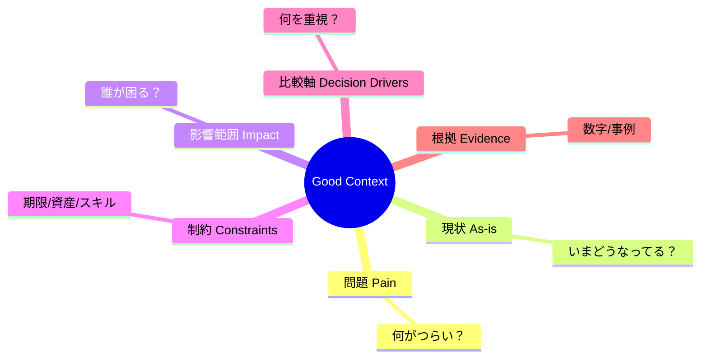

# 第05章：ADRの書き方① Context（背景）が弱いと読まれない🥺➡️😊

この章は「**Context＝背景説明パート**」だけを、めっちゃ上手に書けるようになる回だよ〜📒✨
Contextが強いADRは、あとから読んだ人が「なるほど、そういう状況ならその判断になるね😌」って納得してくれるの👏

※ちなみに今どきC#は **C# 14 / .NET 10** が最新ラインだよ〜（2025年11月に .NET 10 LTS、C# 14が .NET 10 対応として出てる）🚀✨ ([Microsoft][1])
ADRの基本形は「Context / Decision / Consequences」って考え方がよく使われるよ🧩 ([Cognitect.com][2])

---

## 1) Contextってなに？（超ざっくり）🗺️✨


Contextは一言でいうと、

**「その判断が必要になった状況を、読者の頭の中に再現する文章」** だよ🧠🎬

読む人が変わっても、未来の自分でも、
**同じ前提・同じ痛み・同じ制約** をちゃんと想像できるのが理想😊💡

---

## 2) Contextが弱いと起きる事故あるある😵‍💫💥

* 「なんでこのライブラリ選んだの？」→ **理由が分からない** 🌀
* 「当時の制約って何？」→ **いまの常識で誤解される** 😭
* 「どういう問題があったの？」→ **Decisionだけ読んでも納得できない** 🙅‍♀️

だからContextは、ADRの“説得力の土台”だよ🏗️✨

---

## 3) 良いContextに必ず入ってる6点セット✅🧩


### ✅ ① 問題（Pain）：「何がつらいの？」😣

* 例：障害対応が遅い、調査が面倒、変更が怖い…など

### ✅ ② 現状（As-is）：「いまどうなってるの？」⚙️

* 例：ログはConsoleだけ、例外は握りつぶし、DBアクセスが直書き…など

### ✅ ③ 影響範囲：「誰が困るの？」👥

* 開発者、運用、ユーザー、CS、将来のあなた…！

### ✅ ④ 制約（Constraints）：「変えられない条件は？」📌

* 例：納期、既存資産、チームの習熟度、運用ルール、コスト…💰

### ✅ ⑤ 成功条件／比較軸（Decision drivers）：「何を大事にする？」🎛️

* 例：保守性🧹、運用性🔧、性能🚀、学習コスト📚、テスト容易性🧪

### ✅ ⑥ 根拠（Evidence）：「ふんわりじゃなく事実ある？」🔎

* 例：障害件数、調査時間、ログ不足で詰んだ事例、計測結果…📊

> ✨ポイント：Contextは“お気持ち”じゃなくて「状況説明＋判断の材料」だよ😊



---

## 4) Contextに“書かないほうがいい”もの🙅‍♀️🧯

* ❌ Decisionを先に書いちゃう（結論ありきに見える）
* ❌ 解決策の細かい実装（それは別の設計メモやPR説明でOK）
* ❌ ふわふわポエム（例：「品質を大事にしたいと思います」）☁️

Contextは「読む人が迷子にならない地図」🗺️✨
地図に“お気持ちの詩”が書いてあっても、道は分からないよね…😂

---

## 5) Contextの“強い書き方”テンプレ（そのまま使ってOK）🧩📝

そのまま貼って書き換える用だよ〜✨

```md
## Context
- 背景 / 問題:
  - （いま困っていること。できれば具体例や数字も）

- 現状 (As-is):
  - （現状の仕組み・運用・どこがボトルネックか）

- 影響範囲:
  - （誰が・どの場面で困るか。将来の保守も含めて）

- 制約:
  - （変えられない条件。期限・既存資産・運用ルール等）

- 重視すること（成功条件 / 比較軸）:
  - （何を優先する判断なのか）

- 補足情報 / 根拠:
  - （事例リンク、障害チケット、計測、参考資料など）
```

> ADRの定番テンプレとして「Title / Status / Context / Decision / Consequences」型もよく使われるよ〜📄✨ ([Architectural Decision Records][3])

---

## 6) 例：ログ方針ADRの“悪いContext”→“良いContext”🪵✨


### ❌ 悪いContext（ふわっと）☁️

> ログが大事なのでちゃんとしたログ基盤を入れたい。将来のために改善する。

これだと、読者はこうなる👇
「いま何が起きてて、誰が困ってて、何を優先したいの？」😵‍💫

---

### ✅ 良いContext（短いけど強い）💪✨

```md
## Context
- 背景 / 問題:
  - 障害調査のたびに「いつ・どのユーザーが・どの操作で失敗したか」が追えず、原因特定に時間がかかっている。
- 現状 (As-is):
  - ログはConsole中心で、相関ID（リクエスト単位のID）や例外の構造化情報が不足している。
- 影響範囲:
  - 開発者の調査工数が増え、障害復旧が遅れる。運用手順も属人化している。
- 制約:
  - 既存コードは `ILogger` を前提に書かれているため、大量の書き換えは避けたい。
- 重視すること:
  - 調査しやすさ（構造化ログ/検索性）、導入コスト、既存コードとの親和性。
- 根拠:
  - 直近の障害2件で「ログ不足により再現に2〜3時間」を要した。
```

📌このContext、何がいいかというと…

* 「痛み」が具体的😣
* 「現状」が想像できる⚙️
* 「制約」と「優先順位」が分かる🎛️
* “だから判断が必要”が自然に伝わる😊✨

---

## 7) Contextを“短く強く”するコツ5つ✂️✨

1. **最初の2行で状況が見える**（問題＋現状）👀
2. **名詞を具体化する**（「品質」→「障害調査時間」「変更差分の影響範囲」）📌
3. **制約は先に釘を刺す**（後出ししない）🔒
4. **比較軸は3〜5個に絞る**（多すぎるとブレる）🎛️
5. **数字が1つあるだけで強くなる**（件数、時間、頻度…なんでもOK）📊✨

---

## 8) ミニ演習：Context改善ゲーム🎮🖍️

### お題：このContextを“読めるContext”に直してね✍️

```md
## Context
例外処理の方針を決めたい。今のままだと良くない気がする。
```

### ✅ 改善のヒント（どれか入ればOK）✨

* どういう例外が、どこで、どう困ってる？😣
* 現状どうしてる？（握りつぶし？ログだけ？再throw？）⚙️
* 影響範囲は？（ユーザーに500が出る、運用が詰む等）👥
* 制約ある？（既存API仕様、既存クライアント等）📌
* 優先順位は？（安全性、原因特定、互換性…）🎛️

---

### 例の解答（1つの正解例だよ）✅✨

```md
## Context
- 背景 / 問題:
  - APIで例外が起きたときに、ユーザーには一律500が返り、原因が追えないケースがある。
- 現状 (As-is):
  - 例外をcatchしてログだけ出し、結果として失敗理由が呼び出し側に伝わらない箇所が混在している。
- 影響範囲:
  - ユーザーからの問い合わせ時に再現が必要になり、調査時間が増える。運用も「まず再現」が前提になっている。
- 制約:
  - 既存クライアントがエラーフォーマットに依存しているため、レスポンス形式は段階的に変更したい。
- 重視すること:
  - 呼び出し側が対処できるエラー設計、ログで原因が追えること、互換性。
```

---

## 9) AI活用：Contextの“漏れ”を一瞬で炙り出す🤖🔎✨

### ✅ 使い方（超おすすめ）

あなたのContextを貼って、こう聞く👇

```text
このADRのContextをレビューして！
1) 読者が状況を再現するのに足りない情報
2) 曖昧な表現（具体化できるところ）
3) 制約・影響範囲・比較軸の漏れ
を箇条書きで指摘して。口調はやさしめで🙏
```

さらに意地悪チェックも強い😈✨

```text
あなたは反対派のレビュアーです。
このContextだと「まだ決める必要ない」と言える点を3つ挙げて。
```

---

## 10) 章末チェックリスト✅🧾✨（これ通ればContext合格！）

* [ ] 問題が1〜2行で言える😣
* [ ] 現状がイメージできる⚙️
* [ ] 誰が困るか書いた👥
* [ ] 制約が先に書いてある📌
* [ ] 比較軸が3〜5個に絞れてる🎛️
* [ ] 事実（数字/事例/リンク）が1個以上ある🔎

---

次の第6章では、いよいよ **Decisionをビシッと言い切って✅、Consequencesでトレードオフ（困る点も！）を書く⚖️** をやるよ〜😊✨

[1]: https://dotnet.microsoft.com/en-us/platform/support/policy?utm_source=chatgpt.com "The official .NET support policy"
[2]: https://www.cognitect.com/blog/2011/11/15/documenting-architecture-decisions?utm_source=chatgpt.com "Documenting Architecture Decisions - Cognitect.com"
[3]: https://adr.github.io/adr-templates/?utm_source=chatgpt.com "ADR Templates | Architectural Decision Records"
