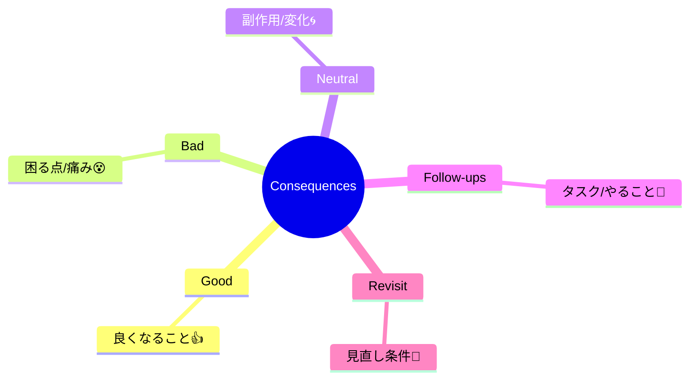

# 第06章：ADRの書き方② Decision＆Consequences（結論と言い切り＋トレードオフ）⚖️✨

この章は **「結論をビシッと一文で言い切る」** ＋ **「その代償（痛み）までちゃんと書く」** がテーマだよ〜😊🫶
ここができると、ADRが“ただの作文”じゃなくて **未来の自分とチームを救う設計判断ログ**になるの✨

（2026年1月時点：C# 14 が最新で、.NET 10 と Visual Studio 2026 で使えるよ〜🧑‍💻✨） ([Microsoft Learn][1])

---

## 6.0 この章のゴール 🎯✨

* ✅ Decision を **曖昧ゼロ**で書ける（「やる / やらない」が伝わる）
* ✅ Consequences に **良い点だけじゃなく悪い点も**書ける（ここ超大事💦）
* ✅ 「いつ見直す？」まで置ける（未来の地雷💣を減らす）

---

## 6.1 Decision の正体：ここは“結論”だけで勝負！✅💎


### Decision って何を書くの？🤔

見出しの通り **「決めたこと」** を書く場所だよ😊
なので基本は **短く・強く・言い切り** が正義✨

### 👍 強い Decision の型（まずはこれでOK）🧩

* **一文で言い切る**
* **スコープ（どこまで）** を入れる
* **採用技術/方式** を明確にする
* できれば **いつから**（適用開始）も入れる

例：

* 「アプリ内ログは “ILogger を入口” とし、出力先は Serilog を採用する」
* 「DBアクセスは EF Core を基本とし、性能が厳しい箇所のみ Dapper を許可する」
* 「例外は境界（API/外部I/O）で握り、内部は例外を投げてよい」


### 👎 よくある“弱い Decision”あるある ☁️😵‍💫

* 「〜した方がよさそう」
* 「とりあえず〜」
* 「ケースバイケース」
* 「基本はAだけどBもCも…（結局何？）」

こういうの、読んだ人が **“で、結局どうするの？”** ってなるの😭


---

## 6.2 Consequences：ここが ADR の本体だよ⚖️💥✨


Decision が「決めた！」だとしたら、Consequences は
**「その決断で起きる良いこと・困ること・やること全部」** を置く場所だよ😊

### ✅ Consequences に入れるべき5点セット（これだけで強い）🧰✨

1. **Good（良い結果）** 🌸
2. **Bad（悪い結果）** 🌧️（←ここ書ける人は強い！）
3. **Neutral / Side effects（副作用）** 🌀
4. **Follow-ups（やること）** 📝（タスク化できる形が最高）
5. **Revisit conditions（見直し条件）** 🔁（いつ・何が起きたら再検討？）




---

## 6.3 「Bad（困る点）」を書くコツ：痛みを“具体”で言語化する💦🧠

### 💡 困る点が書けない時の質問リスト（自分に聞く用）🔍

* これ、**運用**で誰が困る？（夜中の自分とか😂）
* **障害**が起きた時、切り分け難しくなる？
* **学習コスト**増える？（新人さんが泣く？🥺）
* **テスト**しづらくなる？（モック地獄🔥）
* 将来の変更で **乗り換えコスト**爆上がりする？💸

### ✨ “悪い点”の書き方テンプレ（便利）🧷

* 「○○が増える / 難しくなる」
* 「○○のために、△△が必要になる」
* 「××が発生した場合、□□に時間がかかる可能性」
* 「（ただし）代替案として〜で緩和する」


---

## 6.4 例で学ぶ：Decision & Consequences の “弱い→強い” 改造🛠️✨

### 例1：弱い Decision 😵‍💫

```md
## Decision
ログは良い感じのライブラリを入れる。
```

✅ 改造（強い！）💪✨

```md
## Decision
アプリ内ログは ILogger を入口に統一し、実装は Serilog を採用する（JSON形式で出力）。
```


---

### 例2：Consequences が “良い点だけ” 😇

```md
## Consequences
- ログが見やすくなる
- 開発が早くなる
```

✅ 改造（Good/Bad/Follow-ups/見直し条件まで！）⚖️✨

```md
## Consequences
### Good ✅
- ログ出力の入口が統一され、ライブラリ変更の影響が小さくなる
- JSONログにより、運用時の検索/集計がしやすくなる

### Bad 💦
- 設定（出力先、フォーマット、レベル設計）が増え、初期学習コストが上がる
- ログ項目設計が雑だと「見れるけど役に立たないログ」になりやすい

### Follow-ups 📝
- ログレベル運用ルール（Debug/Info/Warn/Error）のADR/ガイドを別途用意する
- “必ず入れる項目” を決める（例：requestId, userId, elapsedMs など）
- 本番環境のログ保持期間とマスキング方針を決める

### Revisit 🔁
- ログ量が想定の2倍を超えてコスト増になったら、出力内容/保持期間を再検討する
```

---

## 6.5 すぐ使える「第6章テンプレ」🧩📄✨

Decision と Consequences だけ抜き出したミニテンプレだよ😊（まずこれで十分！）

```md
## Decision
（1文で言い切り）We will ...
- 適用範囲：
- 適用開始：

## Consequences
### Good ✅
- 
- 

### Bad 💦
- 
- 

### Follow-ups 📝
- 
- 

### Revisit 🔁
- （いつ / 何が起きたら見直す？）
```

---

## 6.6 ミニ演習：同じ Decision で「良い/悪い」を3つずつ✍️😊

### お題（例）🎲

「DBアクセスは EF Core を基本採用する」

* ✅ Good を3つ
* 💦 Bad を3つ
* 📝 Follow-ups を2つ（“やること”として書く）
* 🔁 Revisit を1つ（見直し条件）

ポイントは「Bad をちゃんと書く」だよ〜！ここが書けたら勝ち🏆✨


---

## 6.7 AI活用（Copilot / Codex など）🤖💬✨

Visual Studio 側も AI 機能がどんどん統合されてるので、「文章づくり補助」と相性いいよ😊
（Copilot の Visual Studio 向け改善も継続中だよ） ([The GitHub Blog][2])

### 使えるプロンプト例（そのままコピペOK）📎✨

* 🤖「この Decision の Consequences を Good/Bad/Follow-ups/Revisit で箇条書きにして」
* 🤖「“Bad” を具体化したい。運用・テスト・学習コスト・将来変更の観点で追加して」
* 🤖「この Decision を“一文で言い切り”に直して。曖昧語（たぶん/とりあえず）禁止で」
* 🤖「見直し条件（Revisit）を3案出して。計測できる条件にして」


### ⚠️ AIの注意（超カンタンに）🫶

* **事実（バージョン・仕様・料金・ライセンス）系は必ず確認**
* **“困る点”の洗い出し**はAIが得意なのでどんどん使ってOK😊✨

---

## 6.8 自己採点チェックリスト（5つだけ）✅🧾

* [ ] Decision が **一文で言い切れてる**
* [ ] 「範囲（どこまで）」が書いてある
* [ ] Consequences に **Bad がある**（最低2つ）
* [ ] Follow-ups が **タスク化できる粒度**
* [ ] Revisit が **条件として測れる**（例：ログ量/障害頻度/コスト/パフォーマンス）

---

次の第7章では、このADRを **迷子にならない置き方（フォルダ・命名・テンプレ化）** にして、運用に乗せていくよ〜📁🧭✨

[1]: https://learn.microsoft.com/en-us/dotnet/csharp/whats-new/csharp-14?utm_source=chatgpt.com "What's new in C# 14"
[2]: https://github.blog/changelog/2025-12-03-github-copilot-in-visual-studio-november-update/?utm_source=chatgpt.com "GitHub Copilot in Visual Studio — November update"
