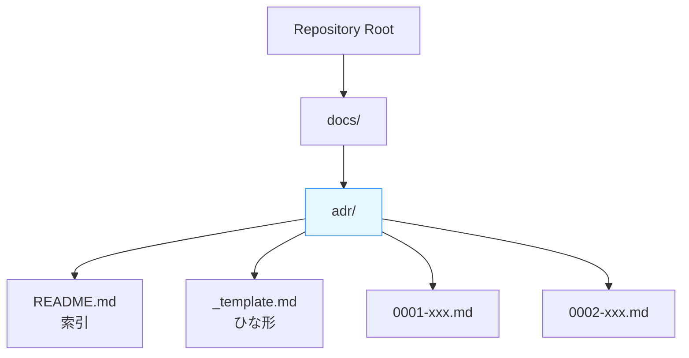

# 第07章：リポジトリにADRを置く（迷子にならない仕組み）📁🧭

この章では、「ADRを**書く前**にやっておくと一生ラク」な、**置き方（フォルダ構成・命名・テンプレ・索引）**を作ります😊
ADRは“いい文章”より先に、**「探せる・増やせる・腐らない」置き場**が命です💪📚

---

## 7-1. なんで「リポジトリ内」に置くの？🤔🧷

ADRは、だいたい **Markdownのテキスト1枚**でOKな軽いドキュメントです📝
しかも「コードと一緒に」置くと、こういう“最強セット”になります✨

* 🔎 **検索できる**：GitHub検索・VS検索で一瞬で見つかる
* 🧭 **変更履歴が残る**：いつ、誰が、どんな理由で決めたか追える
* 👀 **レビューに乗る**：PRでADRも一緒に確認できる（第8章でやるよ）
* 🧠 **未来の自分を助ける**：「なんでこうしたっけ…😵‍💫」を消せる

ADRの定番フォーマット（Context / Decision / Consequences）は昔から広く使われていて、テンプレも整っています📄✨ ([Cognitect.com][1])


---

## 7-2. まずは結論：おすすめの置き方（迷子にならないやつ）✅📁

迷ったらこれでOKです👇（超定番）

* `docs/adr/` にまとめる📁
* **1判断＝1ファイル**（Markdown）📝
* **連番＋短いタイトル**（例：`0001-record-architecture-decisions.md`）🔢
* `docs/adr/README.md` を作って **索引（目次）** にする🧭

こういう命名（連番＋ダッシュ区切り）は、MADR（Markdown ADR）や adr-tools の流れでもよく使われる“王道”です👍 ([Architectural Decision Records][2])

---

## 7-3. フォルダとファイルの完成形イメージ🌳✨


こうなってたら勝ちです🎉

```text
<repo-root>/
  docs/
    adr/
      README.md
      _template.md
      0001-record-architecture-decisions.md
      0002-logging-strategy.md
      0003-exception-handling.md
```

ポイント👇

* `README.md`：**一覧（索引）**
* `_template.md`：新規ADRを作るときの**型（コピペ元）**
* `_template.md`：新規ADRを作るときの**型（コピペ元）**
* `0001-....md`：実際のADRたち



---

## 7-4. 命名ルール：迷わないための “3つの固定” 🔒🔢🧠


### ① 連番（NNNN）を付ける🔢

* `0001`, `0002`…みたいに増やす
* 参照しやすい（「ADR-0007見て〜」が通じる）
* スキャンしやすい（古い順に並ぶ）

「ID（番号）＋人間が読める名前」を併用するのが推奨されがちです😊 ([Embedded Artistry][3])

### ② タイトルは短く、**名詞＋目的**に寄せる🪄

例：

* `logging-strategy`（ログ方針）
* `db-access-layer`（DBアクセス方針）
* `use-serilog`（Serilog採用）

### ③ スペースは使わず、ダッシュで区切る `use-dashes` 🏷️

コマンドラインでも扱いやすいし、ツールとも相性良いです👍 ([Architectural Decision Records][2])

---

## 7-5. テンプレは “勝手に書ける” ようにしておく🧩✨

ADRテンプレにはいろいろあるけど、初心者は **MADR系**が書きやすいです😊
MADRは「構造がスッキリしたテンプレ」で、意思決定を取り回しやすくしてくれます📄✨ ([Architectural Decision Records][4])

### ✅ `_template.md` のおすすめ（まずはこれでOK）

```markdown
# ADR-0000: タイトル（短く！）📝

- Status: Proposed / Accepted / Deprecated / Superseded 🧷
- Date: YYYY-MM-DD 📅

## Context（背景）🗺️
- いま何が困ってる？😣
- 制約は？（期限・既存資産・運用など）📌
- どこで問題が起きてる？⚙️

## Decision（決定）✅
- 私たちは **何を採用する**（または **やめる**）と決めた？

## Consequences（結果）⚖️
### 👍 良くなること
- 

### 😵 困ること（デメリット）
- 

### 🔜 もし見直すなら（条件）
- 
```

> Status に「Proposed/Accepted/Deprecated/Superseded」みたいな区分を入れるのは、テンプレ側でもよく整理されてます📌 ([GitHub][5])


---

## 7-6. 索引（README）がないと、ADRは100%迷子になる🧭💥


`docs/adr/README.md` を “目次” にします📚✨
ここがあるだけで、ADRが「育つドキュメント」になります🌱

### ✅ READMEの例（コピペでOK）

```markdown
# ADR Index 🧭📒

## 🟢 Accepted
- [ADR-0001: Record architecture decisions](0001-record-architecture-decisions.md)
- [ADR-0002: Logging strategy](0002-logging-strategy.md)

## 🟡 Proposed
- [ADR-0003: Exception handling policy](0003-exception-handling.md)

## 🔁 Superseded
- (none)

## 🔴 Deprecated
- (none)
```

これで「何が決まってて」「何が検討中で」「何が置き換えられたか」が一目でわかります👀✨

---

## 7-7. 実戦：最初の1本（ADR-0001）を作ろう🎮📝✨

最初のADRは、よくある “自己参照ネタ” でOKです😂
例：**「このプロジェクトではADRをMarkdownで管理する」**

adr-toolsでも最初に似たADR（`0001-record-architecture-decisions`）を作る流れが紹介されています📌 ([A nice guy's view on life][6])

### ✅ `0001-record-architecture-decisions.md` サンプル

```markdown
# ADR-0001: Record architecture decisions 📒

- Status: Accepted 🟢
- Date: 2026-01-14 📅

## Context（背景）🗺️
設計の重要判断（ログ方針、例外方針、DBアクセス方針など）が増えてきた。
あとから「なんでこうした？」が頻発すると、変更が怖くなる。

## Decision（決定）✅
このリポジトリでは、重要な設計判断を ADR として Markdown で記録し、
`docs/adr/` に集約する。

## Consequences（結果）⚖️
### 👍 良くなること
- 決定理由が残り、後から読み返せる
- PRレビューで判断も共有できる
- 新メンバーが理解しやすい

### 😵 困ること（デメリット）
- 書く手間が少し増える（ただしテンプレで軽減する）

### 🔜 もし見直すなら（条件）
- ADRが増えすぎて探しづらくなったら、索引ルールや分類を追加する
```


---

## 7-8. Visual Studioで「フォルダ作成→コミット」まで（超実務）🧑‍💻✅

やることはこの順番だけ👇

1. `docs/adr/` を作る📁
2. `README.md` と `_template.md` と `0001-...md` を作る📝
3. **Git Changes** でコミットする✅

Visual StudioのGit操作（コミット）は公式ドキュメントでも案内されています📌 ([Microsoft Learn][7])


---

## 7-9. VS Code派：ターミナルでサクッと作る（Windows）⚡🪟

PowerShell でもOKです👌

```powershell
mkdir docs\adr
ni docs\adr\README.md
ni docs\adr\_template.md
ni docs\adr\0001-record-architecture-decisions.md
git add docs/adr
git commit -m "Add ADR directory and first ADR"
```

---

## 7-10. AI活用：第7章は “自動化” と相性バツグン🤖🪄✨

### 🪄 1) ファイル名（slug）を作ってもらう

* 「タイトル：『ログ方針の決定』を、ファイル名向けに英語短縮して」

### 🪄 2) README索引を自動更新してもらう

* 「`docs/adr/` のファイル一覧からREADMEのIndexを生成して」

### 🪄 3) テンプレに流し込む

* 「この判断を、Context/Decision/Consequencesに分けて短くまとめて」


---

## 7-11. ミニ演習（15〜30分）⏱️🎯✨

### 🧪 演習A：置き場を完成させる📁

* `docs/adr/` を作る
* `_template.md` を置く
* `README.md` を索引にする

### 🧪 演習B：ADR-0001を作ってコミットする📝✅

* `0001-record-architecture-decisions.md` を作る
* Status を **Accepted** にする
* READMEにリンクを追加する

---

## 7-12. ありがち事故と対策（ここで防げる！）🚧😂

* 😵 **ADRが増えたのにREADMEが更新されない**
  → ✅ “ADR追加＝README更新” をセットにする（第8章でPRルール化）

* 😵 **ファイル名がバラバラ**（日付だったり日本語だったり）
  → ✅ `NNNN-kebab-case.md` に統一（検索もリンクも楽） ([Architectural Decision Records][2])

* 😵 **Statusが書かれてない**
  → ✅ Proposed/Accepted/Deprecated/Superseded をテンプレ固定にする ([GitHub][5])


---

## まとめ：第7章のゴール達成チェック✅🎉

* [ ] `docs/adr/` がある📁
* [ ] `_template.md` がある🧩
* [ ] `README.md` が索引になってる🧭
* [ ] `0001-...md` が1本ある📝
* [ ] それらがコミットされてる✅ ([Microsoft Learn][7])

---

次の第8章では、このADR置き場を **PRレビューに組み込んで “後回し撲滅”** していきます🔁✅💬✨

[1]: https://www.cognitect.com/blog/2011/11/15/documenting-architecture-decisions?utm_source=chatgpt.com "Documenting Architecture Decisions - Cognitect.com"
[2]: https://adr.github.io/madr/decisions/0005-use-dashes-in-filenames.html?utm_source=chatgpt.com "Use Dashes in Filenames | MADR"
[3]: https://embeddedartistry.com/fieldmanual-terms/architecture-decision-record/?utm_source=chatgpt.com "Architecture Decision Record"
[4]: https://adr.github.io/madr/?utm_source=chatgpt.com "About MADR"
[5]: https://github.com/YotpoLtd/cADR/blob/master/docs/MADR_TEMPLATE.md?utm_source=chatgpt.com "MADR_TEMPLATE.md - YotpoLtd/cADR"
[6]: https://jon.sprig.gs/blog/post/2101?utm_source=chatgpt.com "Using Architectural Decision Records (ADR) with adr-tools - Jon"
[7]: https://learn.microsoft.com/en-us/visualstudio/version-control/git-make-commit?view=visualstudio&utm_source=chatgpt.com "Make a Git commit in Visual Studio"
