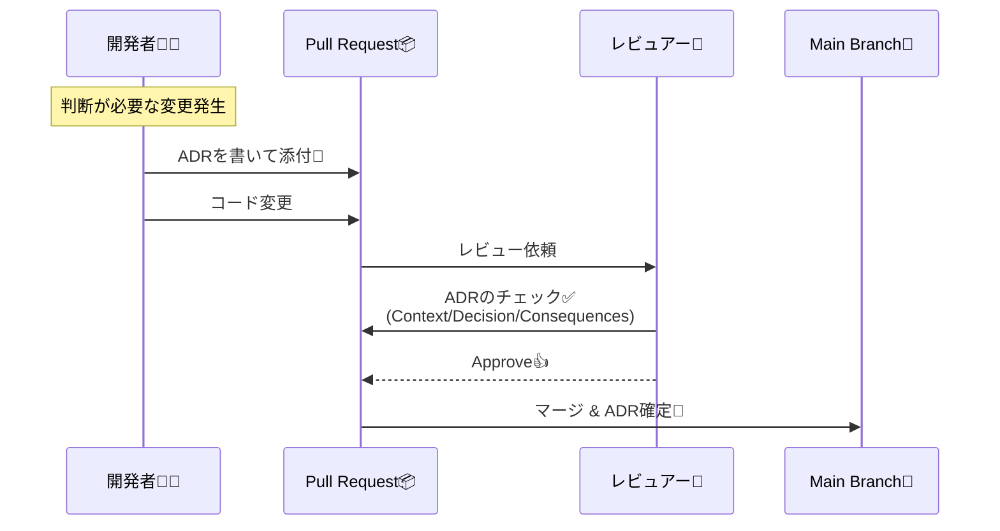
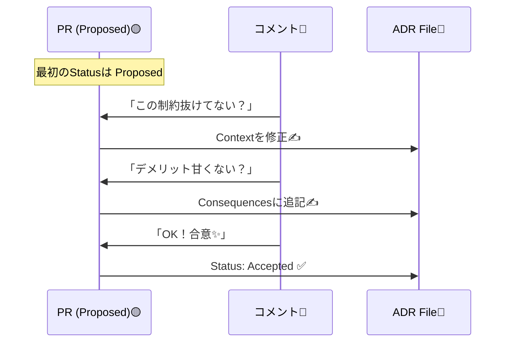

# 第08章：開発フローに組み込む（PRとレビューで“後回し”を防ぐ）🔁✅

### この章のゴール 🎯

ADRを「書けたらえらい」じゃなくて、**ふつうにPRの部品**にして、自然に回る状態を作ります😊🧩
（＝大事な判断が、いつの間にか“どこにも残ってない問題”を消す！🔥）

---

## 8-1. なんでPRに組み込むと続くの？🧠💡


ADRが続かない最大の理由って、だいたいこれ👇

* 「忙しいからあとで書く」→ **あとで永遠に来ない**😇💦
* 変更はマージされるのに、判断の理由が残らない → 未来の自分が泣く😭

なので結論はシンプル！

> **判断が入る変更は、PRにADRを“同梱”する**📦✨
> PRレビューのタイミングで、Context/Decision/Consequencesを点検する👀✅



---

## 8-2. まずは“最小ルールセット”を決めよう（軽くね！）🪶✅

チームでも個人でも効く、軽量ルール例だよ👇（おすすめ）

### ルール案A：いちばん簡単（まずこれ）🧸

* **重要な判断があるPRは、ADRのリンクをPR本文に貼る**🔗
* ADRは `Proposed → Accepted` を **PRの中で進める**🗳️✨

### ルール案B：もう一歩（迷子防止）🧭

* PR本文に **チェック項目**を置く（テンプレ化）🧾
* レビューは **ADRチェックリスト**で見る👀✅

### ルール案C：仕組みで守る（強い💪）

* **mainブランチは保護**して、レビュー必須＋CI必須にする🔒✅
  （GitHubのブランチ保護で「承認レビュー必須」「ステータスチェック必須」などが設定できるよ）([GitHub Docs][1])


---

## 8-3. PRテンプレで「ADR添付」を習慣にする📎📝✨


PR作成時に、説明欄が自動で埋まるテンプレを置くと最強！
GitHubはリポジトリに **pull request template** を置けます([GitHub Docs][2])

### 置き場所の定番 📁

* `.github/pull_request_template.md`（よく使う）([GitHub Docs][3])
* ほかにも root / docs 配下などもOK（GitHub公式に記載あり）([GitHub Docs][3])

### 複数テンプレもできるよ（超便利！）🧩

`PULL_REQUEST_TEMPLATE/` ディレクトリで複数持てます。テンプレは `template` クエリで指定もできます([GitHub Docs][2])

---

### PRテンプレ例（ADRを自然に“同梱”させる）📄✨

```markdown
## 概要 🧁
- 何を変えた？（1〜3行でOK）

## 背景 / 目的 🎯
- 何が困ってた？（痛み😣）
- 制約は？（期限・互換性・運用など📌）

## ADR 📒（重要な判断がある場合は必須）
- ADR: docs/adr/000x-xxxx.md（リンク or パス）
- Status: Proposed / Accepted / Superseded（どれ？）

## 判断の要点（超短く）✅
- Decision（1文で言い切り）
- 代替案（2〜3個）
- 採用理由（比較軸を2〜5個）

## 影響範囲 🧨
- 影響する機能：
- 互換性：
- 運用（ログ、監視、アラートなど）：

## テスト 🧪
- [ ] ローカルで動作確認した
- [ ] 重要ケースを追加した（または不要な理由を書いた）

## レビューしてほしい観点 👀
- （例）例外方針が一貫してるか、運用の困りごとがないか
```

（このテンプレがあるだけで、ADRが“後回し”になりにくいよ😊📎）

---

## 8-4. レビュー観点を“チェックリスト化”しよう👀✅✨

レビューって、気合いでやるとムラが出るの🥺
だから **見るポイントを固定**する！

### ADRレビューのチェックリスト（そのまま使ってOK）🧾✨

* Contextは「状況が再現できる」くらい具体？🗺️
* Decisionは**一文で言い切ってる？**（曖昧ワード少ない？）✅
* Consequencesに**デメリット**も書いてる？💦
* 代替案（Options）が最低2つある？🌱🌱
* 比較軸が妥当？（速度/保守/運用/性能/テスト…）⚖️
* “いつ見直す？”の条件がある？（期限・状況変化など）🕰️


---

## 8-5. GitHub側で「レビュー必須」を作る🔒✅

ここは“仕組みで守る”パート💪

### main（またはrelease）ブランチを保護する 🌳🔐

GitHubはブランチ保護ルールで、例えば👇を要求できます：

* **承認レビュー必須**（PRなしで直接pushできないように）([GitHub Docs][1])
* **ステータスチェック必須**（CIが通るまでマージ不可）([GitHub Docs][4])

さらに最近は **Rulesets（ルールセット）**でも、ブランチ/タグに対して「ステータスチェック必須」などのルールを適用できます([GitHub Docs][5])


---

## 8-6. “責任の所在”を自然に作る：CODEOWNERS 👩‍⚖️👨‍⚖️


「この領域はこの人が詳しい」ってあるよね？
GitHubの **CODEOWNERS** を使うと、ファイルパスごとにレビュワー（オーナー）を指定できます📌
そしてブランチ保護で「Code Ownersのレビュー必須」も可能です([GitHub Docs][6])

### ざっくりイメージ 🧠

* `src/Auth/` を触ったら → 認証に詳しい人が自動でレビュー対象になる
* ルールで必須にすると → すり抜けにくい✅

---

## 8-7. “ADR忘れ”を減らす小ワザ（軽い自動化）🤖🧷

### まずは軽量でOK（おすすめ順）🥇🥈🥉

🥇 **PRテンプレでリンク必須化**（運用コストほぼゼロ）
🥈 **ラベル運用**：「decision-needed」「needs-adr」みたいなラベルを使う🏷️
🥉 **チェック（CI）で弾く**：大きい判断がある変更にADRが無ければ失敗にする💥


---

## 8-8. “合意の取り方”ミニ型（コメント→修正→Accepted）🗳️✨

ADRをPRで回すときの、いちばん平和な流れはこれ😊🌸

1. PRにADRを添付（Status: **Proposed**）📎
2. レビューでコメントが付く💬
3. ADRを直す（必要ならDecisionも直す）✍️
4. まとまったら ADRを **Accepted** にする✅
5. マージして完了🎉

💡ポイント：

* 「会議しないと決まらない」じゃなくて、**PR上で合意が進む**のが強いよ✨




---

## 8-9. AI活用（“優しめレビュー”を作るのが超得意）🤖💬💕

### PR本文づくりをラクにする（GitHub Copilot）🪄

GitHub上で、Copilotが **PRの要約（summary）** を生成できます📝
「概要（文章）＋変更点（箇条書き）」みたいな形で出してくれます([GitHub Docs][7])

### さらに：PR作成そのものをAIに頼む（Copilot）🧑‍💻➡️🤖

Copilotに「PR作って」って依頼できる導線も用意されています([GitHub Docs][8])

### PRテンプレとも相性UP（最近の変更点）🧩✨

Copilotの coding agent が **PRテンプレをサポート**した、という更新も出ています([The GitHub Blog][9])
（テンプレ運用してるほど、AIが“型に沿って”手伝いやすい👍）

### OpenAI Codex（VS Code拡張）での使い方イメージ🧠🛠️

CodexのVS Code拡張は「IDEで並走」or「タスク委任」みたいな使い方ができます([OpenAI Developers][10])
たとえば👇が得意：

* ADRの文章をテンプレに当てはめる📄
* デメリット（Consequencesの痛み）を洗い出す💦
* レビューコメント案を“やわらかい言い方”にする💬🌷


---

## 8-10. ミニ演習：ADR付きPRを1本回してみよう🎮📦✨

### お題（例）🎯

「例外方針を統一する（例：ドメイン例外/インフラ例外の扱い）」⚠️

### 手順（やること）🧭

1. `docs/adr/0001-exception-policy.md` を作る📒
2. Statusは `Proposed` にする🟡
3. コード変更を入れる（方針に沿って1〜2箇所だけ直す）🧑‍💻
4. PR作成 → テンプレを埋める📝
5. 自分でチェックリストレビュー👀✅
6. ADRを `Accepted` にしてマージ🎉

### 提出物（この章の成果物）🏁✨

* ADR 1本（Proposed→Acceptedまで）📒✅
* PR本文にADRリンクあり📎
* レビュー観点チェック済み🧾✅

---

## 8-11. よくある失敗と回避ワザ（先に潰す🧯）😂

* **Decisionが長文**：→ まず1文に圧縮して、その下に補足を置く✂️
* **Consequencesが良いことしか書いてない**：→ “運用で困ること”を1個は書く💦
* **選択肢が1個しかない**：→ 「採用しない」案でもいいから2案にする🌱
* **結局ADRが増えない**：→ PRテンプレに「ADR欄」を置く（最強）📎✨

---

必要なら、この章用に **あなたのリポジトリ構成（`docs/adr/` の運用ルール）に合わせたPRテンプレ**と、**ADRレビュー用の短い定型コメント集（優しめ口調💬🌷）**も作るよ😊✨

[1]: https://docs.github.com/en/repositories/configuring-branches-and-merges-in-your-repository/managing-protected-branches/managing-a-branch-protection-rule?utm_source=chatgpt.com "Managing a branch protection rule"
[2]: https://docs.github.com/en/communities/using-templates-to-encourage-useful-issues-and-pull-requests/creating-a-pull-request-template-for-your-repository?utm_source=chatgpt.com "Creating a pull request template for your repository"
[3]: https://docs.github.com/ja/enterprise-cloud%40latest/communities/using-templates-to-encourage-useful-issues-and-pull-requests/creating-a-pull-request-template-for-your-repository?utm_source=chatgpt.com "リポジトリ用のプルリクエストテンプレートの作成"
[4]: https://docs.github.com/repositories/configuring-branches-and-merges-in-your-repository/managing-protected-branches/about-protected-branches?utm_source=chatgpt.com "About protected branches"
[5]: https://docs.github.com/en/repositories/configuring-branches-and-merges-in-your-repository/managing-rulesets/available-rules-for-rulesets?utm_source=chatgpt.com "Available rules for rulesets"
[6]: https://docs.github.com/articles/about-code-owners?utm_source=chatgpt.com "About code owners"
[7]: https://docs.github.com/copilot/using-github-copilot/creating-a-pull-request-summary-with-github-copilot?utm_source=chatgpt.com "Creating a pull request summary with GitHub Copilot"
[8]: https://docs.github.com/copilot/using-github-copilot/coding-agent/asking-copilot-to-create-a-pull-request?utm_source=chatgpt.com "Asking GitHub Copilot to create a pull request"
[9]: https://github.blog/changelog/2025-11-05-copilot-coding-agent-now-supports-pull-request-templates/?utm_source=chatgpt.com "Copilot coding agent now supports pull request templates"
[10]: https://developers.openai.com/codex/ide/?utm_source=chatgpt.com "Codex IDE extension"
