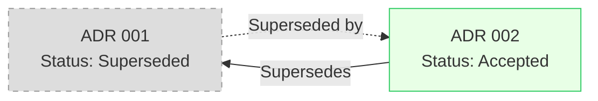
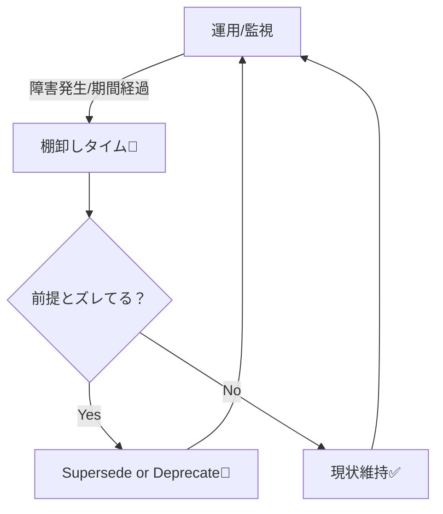

# 第09章：ADRを腐らせない（Supersededと棚卸し）🌿🛠️

ADRって「書いたら終わり」じゃなくて、**時間が経っても“読めて役に立つ”状態に保つ**のが大事なんだよね😊
この章では、**古くなった判断をキレイに“置き換える”方法（Superseded）**と、**定期的にズレを見つける棚卸し**を、ゆるっと身につけよう〜！💪💕

---

## 1) ADRが「腐る」って、どういうこと？🥺➡️😇

ADRが腐るのは、だいたいこのパターン👇

* いまの実装と合ってないのに、**まだ有効っぽく見える**😵‍💫
* 「当時の前提（コスト/性能/制約）」が変わってるのに、**それが書かれてない**🕰️
* 読んでも「で、今はどれが採用なの？」がわからない😢

なのでADR運用は、**“書き換え”より“置き換え（Supersede）”**が基本になるよ✨
ADRは「当時の判断の証拠」だから、雑に上書きすると履歴が消えちゃうの🥲（代わりに、新しいADRを作って古いのをSupersededにする） ([GitHub][1])

---

## 2) Status（状態）をちゃんと使うと、一気に迷子が減る🧭📌

ADRには**状態（Status）**を付けるのが定番！
よくある例はこんな感じ👇（チームで呼び名が多少違ってもOK）

* **Proposed**：提案中（まだ決定じゃない）📝
* **Accepted**：採用✅
* **Deprecated**：非推奨（まだ残ってるけど、今後やめたい）⚠️
* **Superseded**：置き換え済み（新しいADRがある）🔁

この「Superseded」が第9章の主役だよ〜！✨
状態をはっきり書くのが大事、っていうのは各所で同じこと言われてるよ📚 ([テックターゲット][2])

---

## 3) “Superseded” と “Deprecated” の違い、ここで決まる！⚖️


### ✅ Superseded（置き換え）

* **新しい判断で“前の判断を上書き”した**状態
* 例：ログ基盤をA→Bへ移行、DBアクセス方針を刷新、など
* **必ず「どのADRが置き換えたか」リンクする**🔗

### ⚠️ Deprecated（非推奨）

* 「もう推してないけど、まだ残ってる」状態
* 例：旧APIは残しつつ新APIへ誘導、移行期間中の方針、など
* Supersededほど“完全に置換完了”ではないイメージ

### 📝 Amend（追記）っていう手もある

「判断そのものは変わってないけど、補足したい」なら、本文の末尾に**追記（追記日付き）**を入れるのもアリ（ただし結論を変えるならSuperseded！） ([GitHub][1])

---

## 4) Supersededの正しいやり方（最短ルート）🔁✨


### 置き換えの鉄板ルールはこれ👇

1. **新しいADR（例：0002）を作る**🆕
2. 新ADRに「**Supersedes: 0001**」みたいに、置き換え元を明記🔗
3. 旧ADR（0001）のStatusを「**Superseded by 0002**」にする🔁
4. お互いにリンクして、迷子ゼロへ🧭✨

これ、`adr-tools` みたいなツールを使うと自動でやってくれたりするよ〜！
`-s` オプションで「◯番を置き換える新ADR」を作れて、**古い方のStatusも更新**してくれるのが便利👏 ([GitHub][3])



---

## 5) 具体例：ADR 0001 → ADR 0002 に置き換えてみよ🧪📝

ここ、いちばん大事なので “そのまま真似できる形” を置くね😊
（中身は例なので、あなたのプロジェクト用に変えてOK！）

### 旧ADR（0001）の更新イメージ

```md
# 0001 - ログはNLogで統一する

Status: Superseded by [0002 - ログはOpenTelemetry + Serilogで統一する](0002-logging-with-otel-serilog.md)

## Context
（当時の背景）

## Decision
NLogを採用する

## Consequences
（当時のメリデメ）
```

### 新ADR（0002）のイメージ

```md
# 0002 - ログはOpenTelemetry + Serilogで統一する

Status: Accepted  
Supersedes: [0001 - ログはNLogで統一する](0001-use-nlog.md)

## Context
- 分散トレーシングや相関IDが必要になった
- 運用側から「可観測性（Observability）を上げたい」要望が増えた

## Decision
OpenTelemetry を標準とし、アプリ側のロギングは Serilog を採用する

## Consequences
👍 良いこと
- 監視・分析基盤との接続がしやすい
- トレースとログの相関が取りやすい

💦 困ること/注意
- 学習コストが増える
- 移行期間は二重運用（旧と新）が発生しやすい

## When to review
- 運用コストが想定を超えたら再検討
- 主要な連携先が変わったら再検討
```

「Statusで今どれが現役か一発で分かる」状態ができると超つよい💪✨

---

## 6) 置き方の流派：Status派 vs フォルダ分離派📁🧠

チームによっては、**Supersededは別フォルダへ移動**する運用もあるよ〜！

* 例：`/adr` が現役、`/adr/_superseded` が置き換え済み、みたいな感じ
* 「今有効なADRだけ見たい！」が簡単になる✨ ([developer.shopware.com][4])

どっちでもOKだけど、初心者さんにおすすめは👇

* **まずはStatusだけで運用**（移動ルールが増えると破綻しやすい😂）
* 慣れてきたら「現役だけ見たい」圧が出たらフォルダ分離を検討📁

---

## 7) 棚卸し（ADR Inventory）でズレを早めに発見しよ🔎🧺✨


ADR棚卸しって、要するにこれ👇

> **「このADR、いまも正しい？」を定期的に点検する日**🧼

AWSのガイドでも、ADRは状態を持ってライフサイクルがあるよ、って整理されてるよ📘 ([AWS ドキュメント][5])

### 棚卸しのおすすめタイミング🕰️

* 半年に1回（カレンダーに入れる）📅
* 障害が起きた後🔥
* 技術刷新（例：基盤・ライブラリ・クラウド方針が変わった）🔧
* 運用で「これ困る…」が出たとき😢

（アウトラインにもあった“半年/障害後/刷新/困ったとき”がまさに王道だよね👌）



### 15分でできる棚卸し手順（ゆるい版）⏱️💕

1. `docs/adr/` を開く📂
2. **AcceptedのADRだけ**ざっと眺める👀
3. 各ADRに対して、この3問だけ答える✅

   * いまもこの判断、守れてる？
   * 前提（コスト/性能/制約/依存）が変わってない？
   * 困りごとが増えてない？（運用・テスト・変更しづらさ）
4. NGなら、次のどれかに分類🗂️

   * 追記（補足でOK）📝
   * Deprecated（移行中）⚠️
   * Superseded（置き換え確定）🔁

---

## 8) Decision Log（一覧表）を作ると棚卸しが超ラク📋✨

「ADRが増えると見えなくなる問題」を助けるのが **Decision Log**（要するに“目次＋要約表”）だよ〜！
MicrosoftのEngineering Playbookにも、**ADRの要約をまとめるログ（Markdownの表）**って考え方があるよ📌 ([microsoft.github.io][6])

### 最小のDecision Log（例）

* ID / タイトル / Status / 日付 / 関連リンク
  だけでも、棚卸しスピードが段違いになるよ⚡

---

## 9) AI活用：棚卸し＆Supersedeの“雑さ”を減らす🤖✨

AIに頼むとめちゃラクなやつ👇

### ✅ 「ズレてない？」チェック

* 「このADRの前提が古くなってそうな点ある？」🔎
* 「今の一般的なやり方と比べて、リスクある？」⚠️

### ✅ Supersede用の下書き

* 「このADRを置き換える新ADRのContext/Decision/Consequencesを叩き台にして」✍️
* 「旧ADRの“当時のメリット”と、今置き換える理由を整理して」🧠

### ✅ 悪魔の代弁者😈（超おすすめ）

* 「このDecisionに反対する人の意見を3つ出して」
* 「運用で詰まりそうなポイントを予測して」

---

## 10) ミニ演習：0001を置き換える0002を作ろう🔁🧪

### やること（30〜45分くらいの想定）💪✨

1. 既存のADR 0001 を1つ選ぶ（なければ例題でOK）📝
2. 「いまならこうする」を理由付きで決める🧠
3. ADR 0002 を作る（Supersedesリンク）🔗
4. ADR 0001 を Superseded by 0002 にする🔁
5. Decision Log があるなら、2行追記📋✨

### セルフ採点（YESが多いほど勝ち🏆）

* 新旧が相互リンクしてる？🔗
* 旧ADRを読んだ人が「今はどれが現役か」迷わない？🧭
* Consequencesに“困る点”も書けた？💦
* 見直し条件（When to review）がある？🕰️

---

## おまけ：C#の“バージョン前提が腐る”例（あるある）🍞💥

たとえば「言語機能を使う/使わない」みたいな判断は、数年で前提が変わりがち。
いまは **C# 14 が最新で .NET 10 をサポート**していて、開発環境として **Visual Studio 2026 に .NET 10 SDK が含まれる**って整理になってるよ📌 ([Microsoft Learn][7])
だから「古い制約で縛ってたADR」があると、棚卸しでSupersede候補になりやすいんだ〜！🔁✨

---

次は、もしよければ「あなたのADRの置き換え候補っぽいテーマ」を私が3つくらい例示して、**Superseded用の0002ドラフト**を一緒に作れるよ😊💖

[1]: https://github.com/joelparkerhenderson/architecture-decision-record?utm_source=chatgpt.com "Architecture decision record (ADR) examples for software ..."
[2]: https://www.techtarget.com/searchapparchitecture/tip/4-best-practices-for-creating-architecture-decision-records?utm_source=chatgpt.com "8 best practices for creating architecture decision records"
[3]: https://github.com/npryce/adr-tools?utm_source=chatgpt.com "npryce/adr-tools: Command-line tools for working ..."
[4]: https://developer.shopware.com/docs/resources/references/adr/2020-06-25-implement-architecture-decision-records.html?utm_source=chatgpt.com "Implement architecture decision records"
[5]: https://docs.aws.amazon.com/prescriptive-guidance/latest/architectural-decision-records/adr-process.html?utm_source=chatgpt.com "ADR process - AWS Prescriptive Guidance"
[6]: https://microsoft.github.io/code-with-engineering-playbook/design/design-reviews/decision-log/?utm_source=chatgpt.com "Design Decision Log - Engineering Fundamentals Playbook"
[7]: https://learn.microsoft.com/en-us/dotnet/csharp/whats-new/csharp-14?utm_source=chatgpt.com "What's new in C# 14"
