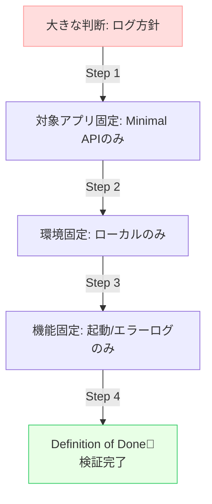

# 第10章：ミニプロジェクト① 題材選び＆スコープ決め（1本に絞る！）🎯🍀

この章はね、**「ADRを書けるようになる前の、いちばん大事な準備」**だよ〜！😊✨
ミニプロジェクトの題材を**1つだけ**選んで、**やる範囲をちっちゃく**決めます✂️🧸

（参考：今の最新は .NET 10（LTS）で、2025/11/11 リリース、サポートは 2028/11/14 までだよ📅✨） ([Microsoft][1])
（Visual Studio 2026 も “.NET 10 向け” を強めに意識した流れになってるよ🤖🧑‍💻） ([Visual Studio][2])

---

## 10.0 この章のゴール ✅🌸

この章のゴールは「ADRを書く」じゃなくて、**ADRで扱う“判断の種”を作る**ことだよ🌱

最終成果物はこれ👇

* ✅ **判断テーマ**（1つに絞る）
* ✅ **選択肢**（2〜3個）
* ✅ **比較軸**（5個くらい）
* ✅ **制約**（現実の縛り）
* ✅ **スコープ**（やる/やらない）
* ✅ **検証ミニプラン**（軽くでOK）

これを **「1枚メモ」🧾✨** にまとめれば勝ち〜！🎉


---

## 10.1 ミニプロジェクトの“勝ちルール”🏆🧸

ここで失敗しがちなパターンは「題材がデカすぎる」😵‍💫
だからルールで守るよ〜！

### ルール①：判断は “1本だけ” 🎯

* ❌「ログ＋例外＋DB」全部決める
* ✅「ログ方針だけ決める」

### ルール②：比較は “2〜3案まで” 🍡

* 選択肢を出しすぎると、比較表で溺れるよ〜😂🌊

### ルール③：コードは “検証できる最小” 🧪

目的はアプリ完成じゃなくて、**判断の理由を残す練習**だからね😊


---

## 10.2 題材候補（どれか1つ！）🎲✨


この章は、次のどれかから **1つだけ**選んでね🍀
（迷ったら後半に「選び方チャート」あるよ🧭）

---

### A案：ログ方針どうする？🪵📒

#### ざっくり言うと😊

「**何が起きたか**を、後から追えるように残すルール」だよ🔍✨
.NET のログは **ILogger** を中心に、プロバイダを差し替える仕組みが定番だよ〜🧩 ([Microsoft Learn][3])

#### 選択肢例（ミニプロジェクト向け🍓）

* **Option 1：標準ILogger + Console（まずはこれ）** 🪵
* **Option 2：ILogger + 構造化ログ（例：Serilog）** 🧱✨（構造化イベントが強み） ([serilog.net][4])
* **Option 3：クラウド前提（App Insights等）** ☁️（※ミニでは“やらない”にしやすい）

#### 比較軸（例）⚖️

* 🔎 追跡のしやすさ（検索しやすい？）
* 🧩 構造化ログしやすい？（key-valueで残せる？）
* 🧰 設定のしやすさ（appsettingsでいける？）
* 🚀 パフォーマンス/コスト感
* 🔁 将来の差し替えやすさ

---

### B案：例外・エラーハンドリング方針どうする？⚠️🩹

#### ざっくり言うと😊

「失敗した時に、**どう返すか／どう残すか／どこで握るか**」を決めるやつだよ〜！
.NET には例外のベストプラクティスがまとまってて、「回復できないのにcatchしない」みたいな指針があるよ📌 ([Microsoft Learn][5])

さらに Web API だと、**例外処理ミドルウェア**＋**ProblemDetails**（エラー形式の統一）が超王道✨
今どきは `AddProblemDetails()` を使って整える方向が強いよ〜🧁 ([Microsoft Learn][6])

#### 選択肢例🍓

* **Option 1：例外は上位でまとめて処理 + ProblemDetailsで統一** ✅ ([Microsoft Learn][6])
* **Option 2：ドメインの失敗は Result 型（成功/失敗）で返し、例外は“想定外のみ”** 🎛️
* **Option 3：全部 try/catch で頑張る**（←だいたいツラい😂）

#### 比較軸（例）⚖️

* 🧾 エラー応答が統一される？
* 🔐 セキュリティ（内部情報が漏れない？）
* 🧑‍💻 実装が面倒すぎない？
* 🧪 テストしやすい？
* 🔍 調査しやすい？（ログとの相性）

---

### C案：DBアクセス方針どうする？🗄️🧠

#### ざっくり言うと😊

「DBと話す担当を、どの流儀で作る？」って判断だよ〜！

今の最新ラインだと EF Core 10 が .NET 10 前提の LTS として整理されてるよ📚 ([Microsoft Learn][7])

#### 選択肢例🍓

* **Option 1：EF Core（追跡・移行・LINQが嬉しい）** 🧁 ([Microsoft Learn][7])
* **Option 2：Dapper（SQL主導で軽い）** 🪶 ([Devart Blog][8])
* **Option 3：ADO.NET直（最小だが手作業多め）** 🧰

#### 比較軸（例）⚖️

* ⚡ 実装速度
* 🧹 保守性（変更に強い？）
* 🔥 性能（どこが重くなりやすい？）
* 🧪 テスト容易性
* 🧠 チームの学習コスト

---

## 10.3 迷った時の選び方チャート🧭✨

* 「まずは楽に成功したい」👉 **ログ方針** 🪵（最小で試せる）
* 「Web API をよく作る」👉 **例外/エラー方針** ⚠️（ProblemDetailsまで繋がる） ([Microsoft Learn][6])
* 「DB触るの多い」👉 **DBアクセス方針** 🗄️（EF/Dapper比較が気持ちいい）


---

## 10.4 スコープを小さくする “5つの切り方” ✂️🧸


題材を決めたら、次は「どこまでやるか」を小さくするよ〜！



### ① 対象アプリを固定する 📌

* 例：**Minimal API だけ**（Controllerは今回なし！）

  * `dotnet new webapi` は、標準で Minimal API 側になる流れがあるよ🧁 ([Microsoft Learn][9])

### ② 対象環境を固定する 🧊

* 例：**ローカル実行だけ**（本番運用はスコープ外）

### ③ 対象機能を固定する 🧷

* 例（ログなら）：**「起動ログ」「1エンドポイントのアクセスログ」「例外時ログ」だけ**

### ④ “やらないこと”を明文化する 🙅‍♀️

* 例（ログなら）：分散トレーシング、OpenTelemetry、クラウド監視は**やらない**

### ⑤ “終わり条件（Definition of Done）”を決める 🏁

* 「こうなったらChapter10は完了！」を決めるだけで、急にラクになるよ🥹✨

---

## 10.5 成果物：「1枚メモ」テンプレ 🧾✨（コピペOK）


これを埋めるだけで、次章の ADR 作成がスムーズになるよ〜😊

```markdown
# ミニプロジェクト① 1枚メモ

## 1. 判断テーマ（1行）
例：Web API のログ方針を決める（開発〜検証〜本番の最小ルール）

## 2. 背景（Context を短く）
- 何に困ってる？（痛み）
- 何が起きてる？（現状）
- 何が制約？（時間/人/環境）

## 3. 今回のスコープ（やる）
- 対象アプリ：
- 対象範囲：
- 触る場所（例：API の入口/DB層など）：

## 4. 今回のスコープ外（やらない）
- 例：分散トレーシング、クラウド監視、運用設計、など

## 5. 選択肢（2〜3個）
- Option A：
- Option B：
- Option C：（任意）

## 6. 比較軸（5個くらい）
- 軸1：
- 軸2：
- 軸3：
- 軸4：
- 軸5：

## 7. 制約（ここ大事）
- 例：導入は半日以内、学習コスト低め、ローカル検証優先…など

## 8. 軽い検証プラン（ミニ実験）
- 何を作って確かめる？
- どう比較する？（ログの見やすさ/実装量/テストなど）

## 9. この判断の“賞味期限”
- いつ見直す？（例：運用開始後/半年後/障害後）
```

---

## 10.6 記入例（ログ方針🪵）📌✨

```markdown
# ミニプロジェクト① 1枚メモ（ログ方針）

## 1. 判断テーマ
Minimal API のログ方針（調査できる最小ルール）を決める

## 2. 背景
- いま：Console.WriteLine が混ざって追跡しづらい
- 困り：エラー時に「いつ/どのAPI/何が起きた」が追えない
- 制約：学習コスト低め、まずはローカル中心

## 3. スコープ（やる）
- 対象：Minimal API
- 範囲：起動・リクエスト・例外の最低限ログ
- 触る場所：API入口、例外処理ミドルウェア（入れるなら）

## 4. スコープ外（やらない）
- 分散トレーシング、OpenTelemetry、クラウド監視連携

## 5. 選択肢
- A：標準ILogger + Console Provider
- B：ILogger + Serilog（構造化ログ）
- C：今回は見送り（※将来判断）

## 6. 比較軸
- ログの検索しやすさ
- 例外時の情報量（必要十分？）
- 設定のしやすさ
- 将来の差し替えやすさ
- 実装の手間

## 7. 制約
- 追加パッケージは最小
- 30分で動く検証まで到達
- “チームが読める”ログを優先

## 8. 検証プラン
- 1エンドポイント＋わざと例外を投げる
- ログ出力の見やすさ、実装量、設定量を比較

## 9. 賞味期限
- 運用に入ったら再検討（監視基盤が決まったタイミング）
```


---

## 10.7 “土台プロジェクト”はこれが最短🏗️✨（ミニ検証用）

### Minimal API を超ミニで用意する🍓

Minimal API の基礎は公式チュートリアルが今の流れだよ📚 ([Microsoft Learn][10])

VS Code 派なら CLI でサクッと作れるよ（webapiテンプレはMinimal寄りになる流れ）🧁 ([Microsoft Learn][9])

```bash
dotnet new webapi -n AdrMini
cd AdrMini
dotnet run
```

> これで「ログ・例外・DB」どの題材でも、最低限の検証ができる土台になるよ😊


---

## 10.8 AI活用（この章で使うプロンプト集🤖💡）

AIは「決める」より **“比較の材料を増やす”** のが得意だよ〜✨
（出てきた内容は、最後は自分の制約に照らして選ぼうね🧠）

### ① 選択肢を2〜3に絞る

* 「ログ方針の選択肢を3つ出して。初心者が運用しやすい順に並べて。各案の落とし穴も1つずつ」

### ② 比較軸の漏れチェック

* 「この比較軸で足りない観点ある？（運用/保守/セキュリティ/テスト）」

### ③ 悪魔の代弁者😈

* 「Option A を採用した時、将来困りそうなことを3つ」

### ④ スコープ削り

* 「いまのスコープを半分に削って。削った理由も書いて」

### ⑤ 1枚メモの清書

* 「この箇条書きを 1枚メモのテンプレに当てはめて整形して」

### ⑥ 次章ADRの下書き準備

* 「この1枚メモから ADR の Context/Decision/Consequences の“下書き”を作って（まだ決めないで、候補として）」


---

## 10.9 この章のチェックリスト✅💕（提出前セルフレビュー）

* ✅ テーマは1個だけ？
* ✅ 選択肢は2〜3個？
* ✅ “やらないこと”が書けてる？
* ✅ 比較軸が5個くらいで、偏ってない？
* ✅ 制約が現実的？（時間・学習コスト・運用など）
* ✅ ミニ検証で確かめられる形になってる？

---

## 10.10 次章へのつながり🔁✨

この章の「1枚メモ🧾」ができたら、次章でついに **ADR 0001** を書くよ〜！🎉📒

* 1枚メモ → **Context** の元ネタ
* 比較軸＆制約 → **Decision** の根拠
* 予測した困りごと → **Consequences** の材料

ここまでできたら、もう勝ちが見えてるよ☺️🌸💕

---

必要なら、**あなたの第10章の題材を「ログ/例外/DB」どれにしても**、そのまま使える「1枚メモ」を一緒に完成形にして、次章の ADR 0001 の叩き台まで一気に作れるよ🪄✨

[1]: https://dotnet.microsoft.com/en-us/platform/support/policy/dotnet-core ".NET and .NET Core official support policy | .NET"
[2]: https://visualstudio.microsoft.com/insiders/?utm_source=chatgpt.com "Visual Studio 2026 Insiders - Faster, smarter IDE - Microsoft"
[3]: https://learn.microsoft.com/en-us/dotnet/core/extensions/logging?utm_source=chatgpt.com "Logging in C# - .NET"
[4]: https://serilog.net/?utm_source=chatgpt.com "Serilog — simple .NET logging with fully-structured events"
[5]: https://learn.microsoft.com/en-us/dotnet/standard/exceptions/best-practices-for-exceptions?utm_source=chatgpt.com "Best practices for exceptions - .NET"
[6]: https://learn.microsoft.com/en-us/aspnet/core/fundamentals/error-handling-api?view=aspnetcore-10.0&utm_source=chatgpt.com "Handle errors in ASP.NET Core APIs"
[7]: https://learn.microsoft.com/en-us/ef/core/what-is-new/ef-core-10.0/whatsnew?utm_source=chatgpt.com "What's New in EF Core 10"
[8]: https://blog.devart.com/dapper-vs-entity-framework-core.html?utm_source=chatgpt.com "Dapper vs. Entity Framework Core: Performance & Use ..."
[9]: https://learn.microsoft.com/en-us/dotnet/core/tools/dotnet-new-sdk-templates?utm_source=chatgpt.com "NET default templates for 'dotnet new' - .NET CLI"
[10]: https://learn.microsoft.com/en-us/aspnet/core/tutorials/min-web-api?view=aspnetcore-10.0&utm_source=chatgpt.com "Tutorial: Create a Minimal API with ASP.NET Core"
