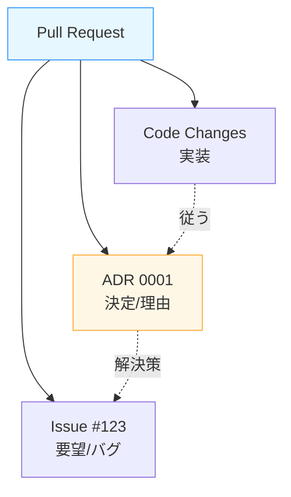

# 第11章：ミニプロジェクト② ADRを書いてPRに乗せる（実戦！）🧑‍💻📦

この章は「**ADRを1本“完成形”にして、PRでレビューできる形にする**」の回だよ〜！💪💕
（ADRって、Michael Nygard さんの “小さく・判断を残す” という考え方から広まったやつだよ📝）([Cognitect.com][1])

---

# 1. 今日のゴール（成果物）🎯✨

最終的にこうなってたら勝ち！🏆💖

* ✅ `docs/adr/0001-xxx.md` が **Context / Decision / Consequences** でちゃんと書けてる📝
* ✅ GitHub に **PR** を作って、ADR が **レビューできる状態** になってる🔁👀
* ✅ PR本文に、関連 Issue / メモ / ADR へのリンクが貼れてる🔗
* ✅（できれば）PRテンプレや CODEOWNERS で “運用しやすく” してる🧩✨([GitHub Docs][2])

---

# 2. まず作戦を決めよう（題材は1つに絞る）🎯🍀

第10章で決めた題材を使うよ！
まだ迷うなら、初心者さんがやりやすいのはこのへん👇✨

* 🪵 ログ方針（Console だけ？構造化ログ？JSON？）
* ⚠️ 例外方針（例外投げる？Result型？）
* 🗄️ DBアクセス方針（EF Core？Dapper？）

この章では、例として「ログ方針」でADRを書いてみるね😊🪵

---

# 3. ブランチを切って、ADR 0001 を作る🌿🔧

## 3.1 ブランチ名（例）🌱

* `adr/0001-logging-policy` みたいに
  **「adr/連番-テーマ」** にすると探しやすいよ〜！🔍✨

## 3.2 フォルダとファイル（例）📁

* `docs/adr/0001-logging-policy.md`

---

# 4. ADR 0001 の“完成形テンプレ”（そのまま使ってOK）📝✨

ここからは **コピペして埋めれば完成** な形にするね！
（Markdownそのまま使えるよ〜💗）

```md
# ADR 0001: ログ方針（構造化ログ + ILogger 基盤）

- Status: Proposed
- Date: 2026-01-14
- Deciders: （あなたの名前 / チーム名）
- Tags: logging, observability

## Context（背景）🗺️
### いま困ってること 😵‍💫
- 不具合が起きたとき、ログが「文字列だけ」だと検索しにくい
- どの画面/機能で起きたのか追跡が難しい
- 例外や相関ID（CorrelationId）が揃っていない

### 制約 📌
- できるだけ実装コストは小さくしたい
- 開発中（ローカル）と本番で同じ方針で運用したい
- 将来、ログ基盤（収集先）が変わっても作り直し地獄にしたくない

### 目標 🎯
- 「検索できる」「集計できる」ログにする（後で困らない）
- ログの書き方を統一し、レビューしやすくする

## Decision（結論）✅
- ログのインターフェースは `Microsoft.Extensions.Logging`（ILogger）を基盤にする
- ログは “構造化” を基本とし、イベント名/相関ID/重要フィールドを揃える
- 例外は `logger.LogError(ex, "...")` の形式で必ず紐づける
- ローカルは見やすさ優先、本番は収集しやすさ優先（JSON等）を想定する

## Options（検討した選択肢）🧩
1) Console.WriteLine だけで頑張る
2) 独自Loggerを作る
3) `ILogger` を基盤にして構造化ログにする（採用）
4) 特定の外部ログ製品SDKに強く依存する

## Consequences（結果・トレードオフ）⚖️
### 良いこと 😊✨
- ログの出し方が統一され、レビューで指摘しやすい
- フィールド（例: userId, orderId, correlationId）で検索・集計しやすい
- 収集先が変わっても `ILogger` 基盤なら差し替えやすい

### 困ること / コスト 😵‍💦
- 最初に「ログ項目の設計」が必要（何を出す？）
- “なんでもログ” をやるとノイズだらけになる（運用コスト増）
- 構造化を意識しないと、結局ただの文字列ログになる

### リスクと対策 🧯
- リスク: 個人情報や機密情報をログに出してしまう
  - 対策: 「ログに出していい情報リスト」を作る / マスク関数を用意する

## Links（関連リンク）🔗
- Issue: #（番号）
- PR: #（番号）
- 設計メモ: （URL）
```

ポイントはこれ👇💡

* **Decisionは言い切る**（ふわふわ禁止🙅‍♀️）
* **Consequencesは良いこと＆困ること** 両方書く（ここ超大事！）⚖️✨

---

# 5. PR に “ADR を乗せる” 手順（ここが実戦）🔁📎




## 5.1 PR本文に書くべきもの🧾✨

PRの説明はこれだけ入ってれば強いよ💪💕

* 🔗 Issueリンク
* 📄 ADRリンク（ファイルパスでもOK）
* ✅ 何を決めたか（1〜3行で要約）
* ⚖️ トレードオフ（困る点も書いたよ、って一言）

例（PR本文）👇

```md
## 目的
ログ方針を ADR 0001 として決定し、今後の実装・レビュー基準にする

## 関連
- Issue: #123
- ADR: docs/adr/0001-logging-policy.md

## 要約
- ILogger 基盤 + 構造化ログを採用
- 相関IDや主要フィールドを揃える
- 例外は必ず LogError(ex, ...) で紐づける

## レビューしてほしいところ 👀
- Context の前提、足りない制約がないか
- Options（選択肢）が偏ってないか
- Consequences の「困ること」が現実的か
```

---

# 6. PRテンプレを入れると、毎回ラクになる🧩💖

GitHubは PRテンプレを置けるよ！
置き場所は `.github/pull_request_template.md` とか `docs/pull_request_template.md` などがOKって公式にも書いてあるよ〜📌([GitHub Docs][2])

おすすめテンプレ（ADR用）👇

```md
## 目的
（なにを決める？なにを揃える？）

## 関連リンク 🔗
- Issue:
- ADR:
- その他（設計メモ/資料）:

## Decision（結論）✅
（1〜2行で言い切り）

## Consequences（トレードオフ）⚖️
### 良いこと 😊
- 
### 困ること 😵‍💦
- 

## レビュー観点 👀
- [ ] Context が具体的（制約・痛みが書けてる）
- [ ] Options が2〜3以上ある
- [ ] Decision が曖昧じゃない
- [ ] 困ること（デメリット）も書けてる
- [ ] Links が貼れてる
```

---

# 7. “レビューが自動で飛ぶ仕組み” を作る（できたら強い）📌👀✨

## 7.1 CODEOWNERS で `docs/adr/` をレビュー対象にする🧑‍💻

`CODEOWNERS` を置くと、対象ファイルが変わったときに **自動でレビュー依頼** が飛ばせるよ📣
GitHub公式の説明もここにあるよ〜🔗([GitHub Docs][3])

例👇

```txt
# docs/adr 配下の変更は、指定の人/チームにレビュー依頼
/docs/adr/ @your-team
```

## 7.2 mainブランチを保護して「PR経由」を強制する🛡️

ブランチ保護で「レビュー必須」「ステータスチェック必須」などを設定できるよ✅
（これも公式ドキュメントにあるやつ！）([GitHub Docs][4])

最小おすすめセット👇

* ✅ PRレビュー必須
* ✅ Conversation resolution（会話解決）必須（あると平和🥰）
* ✅ 必要ならステータスチェック必須（CIがあるなら）

---

# 8. AI活用（この章はここが超おいしい🍰🤖✨）

## 8.1 ADRレビューをAIにやらせる（優秀な後輩ムーブ）🤝🤖

使い方はカンタン！ADR全文を貼って👇みたいに頼むだけ💕


* 「**Contextの不足を指摘して**」🔍
* 「**Optionsが偏ってないか**」⚖️
* 「**困ること（デメリット）を追加して**」😵‍💦➡️✨

プロンプト例👇

> このADRをレビューして、
>
> 1. Contextの不足点
> 2. Optionsの追加候補
> 3. Consequencesの“困ること”の追加
>    を箇条書きで提案して。口調はやさしめで🙏💕

## 8.2 PRサマリー（GitHub Copilot側の機能）も使えるよ🧠✨

Copilotには **PRの変更点サマリー** を作る機能があるよ（レビュー時の要点整理に便利）🧾👀
GitHub公式にも “Copilot pull request summaries” って機能として載ってるよ〜([GitHub Docs][5])

---

# 9. ミニ演習（この章のチェックポイント）✅🎮

次の3つをやれば卒業〜！🎓🌸

1. `docs/adr/0001-*.md` を完成させる📝✨
2. PRを作って、本文に Issue/ADRリンクを書く🔗
3. 自分でこのチェック✅

   * [ ] Decisionが言い切れてる？
   * [ ] 困ること書いた？（1個以上！）
   * [ ] “いつ見直す？” の条件がうっすらでも書けてる？

---

# 10. よくあるミス集（先に潰しとこ😂🧨）

* ❌ Contextが「気持ち」だけ
  ✅ “いま困ってること”“制約”“目標” を3点セットで書く🗺️

* ❌ Decisionが「検討する」
  ✅ “採用する/しない” で言い切る✅

* ❌ Consequencesが「良いことしかない」
  ✅ 困ること1〜3個書く（未来の自分が助かる😭✨）

* ❌ Linksが空で孤立
  ✅ Issue/PR/メモ どれか1つでもリンク🔗

---

## おまけ：C#まわりの“いま”の基準（2026年1月時点）📌✨

今回の章の前提になる “最新の軸” はこのへんだよ〜🧁

* .NET は **.NET 10（LTS）** が出てるよ([Microsoft for Developers][6])
* C# は **C# 14** の “What’s new” が公開されてるよ([Microsoft Learn][7])
* Visual Studio は **Visual Studio 2026** のリリースノートがあるよ([Microsoft Learn][8])

---

次の第12章は、このPRに入ったレビューを反映して、**“自分のADR運用の型”** を作って卒業だよ〜！🎓💖
（この章で作った ADR 0001、次で“磨き上げ”しよっ✨）

[1]: https://www.cognitect.com/blog/2011/11/15/documenting-architecture-decisions?utm_source=chatgpt.com "Documenting Architecture Decisions - Cognitect.com"
[2]: https://docs.github.com/en/communities/using-templates-to-encourage-useful-issues-and-pull-requests/creating-a-pull-request-template-for-your-repository?utm_source=chatgpt.com "Creating a pull request template for your repository"
[3]: https://docs.github.com/articles/about-code-owners?utm_source=chatgpt.com "About code owners"
[4]: https://docs.github.com/repositories/configuring-branches-and-merges-in-your-repository/managing-protected-branches/about-protected-branches?utm_source=chatgpt.com "About protected branches"
[5]: https://docs.github.com/en/copilot/get-started/features?utm_source=chatgpt.com "GitHub Copilot features"
[6]: https://devblogs.microsoft.com/dotnet/announcing-dotnet-10/?utm_source=chatgpt.com "Announcing .NET 10"
[7]: https://learn.microsoft.com/en-us/dotnet/csharp/whats-new/csharp-14?utm_source=chatgpt.com "What's new in C# 14"
[8]: https://learn.microsoft.com/en-us/visualstudio/releases/2026/release-notes?utm_source=chatgpt.com "Visual Studio 2026 Release Notes"
