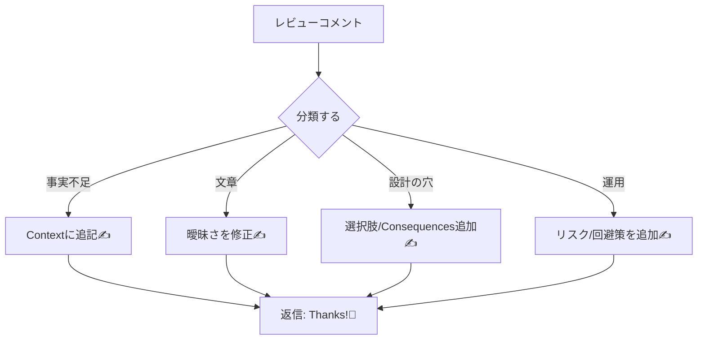

# 第12章：ミニプロジェクト③ レビュー反映＆“自分の型”を作って卒業🎓🌸

（ADRを「書ける」→「続けられる」に変える最終章だよ〜！🫶✨）

---

## この章でできるようになること🎯✨

* レビューコメントを**サクッと吸収してADRを磨ける**ようになる💎
* 「置き換え（Superseded）」を**一回わざとやって**流れを体に入れる🔁
* 次から迷わないための**自分専用ADRチェックリスト**を作る🧾💕
* PRテンプレ＆Issueフォームで、**“書き忘れ”を仕組みで防ぐ**✅

---

## 12-1. まずは「レビュー反映」をラクにするコツ🧠🪄

### レビューでよく来るコメント Top5📌

1. **Context足りない**：「前提がわからん😇」
2. **Decisionが曖昧**：「結局なにするの？」
3. **選択肢が少ない**：「比較した形跡ある？」
4. **Consequencesが良いことしか書いてない**：「デメリットは？💦」
5. **リンク不足**：「議論・Issue・PR・調査先どこ？」

> Consequencesは“良いことだけ”じゃなくて、良い/悪い/中立を全部書くのが大事だよ〜⚖️
> ([Cognitect.com][1])

---

## 12-2. レビュー反映の“最短ルート”手順🏃‍♀️💨

### 手順A：コメントを「分類」する🗂️✨（まず脳の負担を減らす）

* 🧩 **事実不足**（Context/Links）
* ✍️ **文章修正**（曖昧・長い・主語なし）
* ⚖️ **設計の穴**（選択肢・比較軸・トレードオフ不足）
* 🚧 **運用の穴**（監視・障害時・移行・ロールバック不足）

### 手順B：修正は「小分けコミット」がおすすめ🍬

例：

* `docs(adr): add constraints and links`
* `docs(adr): clarify decision in one sentence`
* `docs(adr): add negative consequences and risks`

あとで見返したとき、**何を直したかが一瞬でわかる**よ🥰

### 手順C：返信テンプレ（感じよく＆短く）💬💕

* 「指摘ありがとう！🫶 たしかに前提が抜けてたので Context に追記したよ✅」
* 「デメリット薄かったので Consequences にリスクと回避策を追加したよ⚠️」
* 「比較軸を追加して、選択肢2→3に増やしたよ🎛️」




---

## 12-3. ADRを“ピカピカ”にする最終磨きチェック💎✨

ここは**自分レビュー（セルフレビュー）**でやるよ👀✅

### ✅ Context（背景）

* 誰が困ってる？何が痛い？😣
* 制約（期限/既存資産/運用条件）書いた？📌
* 「今の仕組み」を短く説明した？⚙️

### ✅ Decision（結論）

* **一文で言い切れてる？**（迷いゼロの文）✅
* 「採用するもの」と「採用しないもの」分かれてる？🙅‍♀️

### ✅ Consequences（結果）

* 良い/悪い/中立が揃ってる？⚖️ ([Cognitect.com][1])
* 将来の見直し条件（いつ/何が起きたら）書けてる？🕰️
* 運用の困りごと（監視/障害/移行/ロールバック）触れた？🚒

---

## 12-4. 「Supersededごっこ」：わざと置き換えを体験する🔁🎮

### 目的🎯

ADRは基本「書き換え」より「置き換え」✨
だから、**一回わざと置き換えて**怖さを消すよ😆


実際に “Superseded” を扱う流れはこういう感じで運用されることが多いよ👇
([source-docs.thunderbird.net][2])

---

### ステップ1：新ADR（0002）を作る📄✨

例：`docs/adr/0002-change-logging-approach.md`

```md
# 0002: Change logging approach

- Status: Accepted
- Date: 2026-01-14
- Supersedes: 0001
- Links: PR #123, Issue #456

## Context
0001の方式で運用してみたが、ログの検索性と相関ID運用に課題が出た😵‍💫
（例：障害調査に時間がかかる／ログ粒度がバラバラ）

## Decision
ログ出力方針を「構造化ログ＋相関ID必須」に変更し、出力フォーマットと最低項目を標準化する✅

## Consequences
### Positive 👍
- 障害調査のスピードUP（検索＆集計が楽）🚀
- 相関IDで追跡できるので、分散っぽい構成でも追いやすい🔍

### Negative 👎
- ログ設計ルールの学習コストが増える📚
- 既存ログの移行や互換対応が必要💦

### Neutral 😌
- ログ量が増える可能性があるので、保持期間とコストは別途調整💰
```

---

### ステップ2：旧ADR（0001）を“最小変更”でSupersededにする🧷

ポイント：**歴史は消さない**！でも**今の状態がわかる**ようにする✨

```md
# 0001: （元のタイトル）

- Status: Superseded by 0002
- Date: 2026-01-xx
- Links: ...（必要なら追加）
```

> 「Superseded＝別ADRに置き換えられた」なので、新しいADRへのリンクが大事だよ🔗
> ([source-docs.thunderbird.net][2])

---

## 12-5. 自分専用「ADRチェックリスト」を作る🧾💖（この章の主役！）


### ✅ “最低限これだけ”チェック（毎回）

* [ ] 1判断＝1ADRになってる？（話題が混ざってない）🍱
* [ ] Decisionが一文で言える？✅
* [ ] 選択肢が2〜3ある？🌱
* [ ] 比較軸が書いてある？🎛️
* [ ] Consequencesにデメリットがある？⚠️
* [ ] Linksがある？（Issue/PR/調査）🔗

### 🌟 “書けたら強い”チェック（余裕ある時）

* [ ] 見直し条件（いつ何が起きたら再検討？）🕰️
* [ ] 移行手順の一言（段階的？一括？）🚚
* [ ] ロールバック案（一言でOK）🔙
* [ ] 監視・運用への影響（誰が何を見る？）👀

このチェックリストは、**次からのあなたの武器**になるよ🫶🔥

---

## 12-6. “習慣化”はテンプレで勝つ🏆📌

### PRテンプレに「ADRチェック」を埋め込む✅

PRテンプレの置き場所は `.github/pull_request_template.md` などが使えるよ📁
([GitHub Docs][3])

```md
## ADRチェック 🧭
- [ ] 今回は「重要な判断」が含まれる？
- [ ] 含まれる場合、ADRを追加した（または既存ADRをSupersededにした）
- [ ] ADRのDecisionは一文で言い切れてる
- [ ] Consequencesにデメリットを書いた

## 変更内容
-

## テスト
-
```

これ入れておくと、**書き忘れが激減**するよ〜😆✨

---

### Issueフォームで「判断の入力欄」を作る（おまけ）🧩

Issueフォームは `.github/ISSUE_TEMPLATE` にYAMLで置けるよ📝
([GitHub Docs][4])

```yaml
name: Architecture Decision
description: 設計判断を整理してADRにつなげる🧭
body:
  - type: input
    id: decision_title
    attributes:
      label: 判断のタイトル
      placeholder: 例）ログ方針をどうする？
    validations:
      required: true

  - type: textarea
    id: context
    attributes:
      label: Context（背景・制約）
      placeholder: 困っていること／前提／制約など
    validations:
      required: true

  - type: textarea
    id: options
    attributes:
      label: Options（選択肢）
      placeholder: A案/B案/C案…
    validations:
      required: true

  - type: textarea
    id: decision
    attributes:
      label: Decision（結論）
      placeholder: 一文で言い切る
    validations:
      required: true
```

---

## 12-7. AIで“最終レビュー”する（ズルじゃない、技だよ🤖✨）

### Copilot Chatでできること（例）

* ユニットテスト生成🧪
* デバッグ支援🪲
* **ローカル変更のレビューやコミットメッセージ生成**もできるよ📝
  ([Microsoft Learn][5])

さらに、Mermaid図も作れるから、ADRに「構造図」を添えるのもアリだよ📈
([Microsoft Learn][5])

---

### Visual Studio 2026の“エージェント系”も使える（興味あれば）🧠⚡

複数ファイル編集やドキュメント更新みたいな作業を、エージェントに投げてレビューする流れも出てきてるよ（プレビュー）☁️
([Microsoft Learn][6])

---

### OpenAI Codex（VS Code系）を使うなら注意ポイント⚠️

CodexのIDE拡張はVS Code向けで、**Windowsは実験的サポート**扱いで、WindowsならWSLワークスペース推奨って案内があるよ🪟➡️🐧
([OpenAI Developers][7])

---

### AIに投げるおすすめプロンプト（そのまま使ってOK）💬✨

* 「このADR、Contextに足りない情報を箇条書きで指摘して」🔎
* 「Decisionを一文で言い切る形に直して」✅
* 「Consequencesのデメリットを3つ追加して。運用面も入れて」⚠️
* 「選択肢をもう1つ増やして、比較軸も提案して」🎛️
* 「見直し条件（いつ何が起きたら再検討？）を提案して」🕰️

---

## 12-8. 卒業テスト🎓✅（これができたら完璧！）

あなたの成果物はこの3つ💖

1. ✅ ADR 0001：レビュー反映済み（読みやすい＆デメリットあり）
2. ✅ ADR 0002：0001をSupersededにして置き換えできた
3. ✅ 自分専用ADRチェックリスト（最低限＋余裕枠）完成

---

## 次に書くと強いADRネタ（卒業後のおすすめ）🚀✨

* 例外方針（握りつぶす？投げる？ログは？）⚠️
* 監視・アラート方針（何をSLOにする？）👀
* DBアクセス方針（ORM？Dapper？生SQL？）🗄️
* 依存関係ルール（どこまで参照OK？）🧱

---

ここまでやったら、ADRは「一回の課題」じゃなくて、**あなたの開発スタイル**になってるはずだよ🥹🫶🎉
次は、あなたのミニプロジェクトの題材（ログ/例外/DBなど）に合わせて、**“卒業後1本目のADR”**を一緒に作ろうね！😆📒✨

[1]: https://www.cognitect.com/blog/2011/11/15/documenting-architecture-decisions?utm_source=chatgpt.com "Documenting Architecture Decisions - Cognitect.com"
[2]: https://source-docs.thunderbird.net/en/latest/adr/README.html "ADR Process — Thunderbird Source Docs  documentation"
[3]: https://docs.github.com/en/communities/using-templates-to-encourage-useful-issues-and-pull-requests/creating-a-pull-request-template-for-your-repository?utm_source=chatgpt.com "Creating a pull request template for your repository"
[4]: https://docs.github.com/enterprise-cloud%40latest/communities/using-templates-to-encourage-useful-issues-and-pull-requests/syntax-for-issue-forms?utm_source=chatgpt.com "Syntax for issue forms - GitHub Enterprise Cloud Docs"
[5]: https://learn.microsoft.com/en-us/visualstudio/ide/visual-studio-github-copilot-chat?view=visualstudio "About GitHub Copilot Chat in Visual Studio - Visual Studio (Windows) | Microsoft Learn"
[6]: https://learn.microsoft.com/en-us/visualstudio/releases/2026/release-notes "Visual Studio 2026 Release Notes | Microsoft Learn"
[7]: https://developers.openai.com/codex/ide/ "Codex IDE extension"
