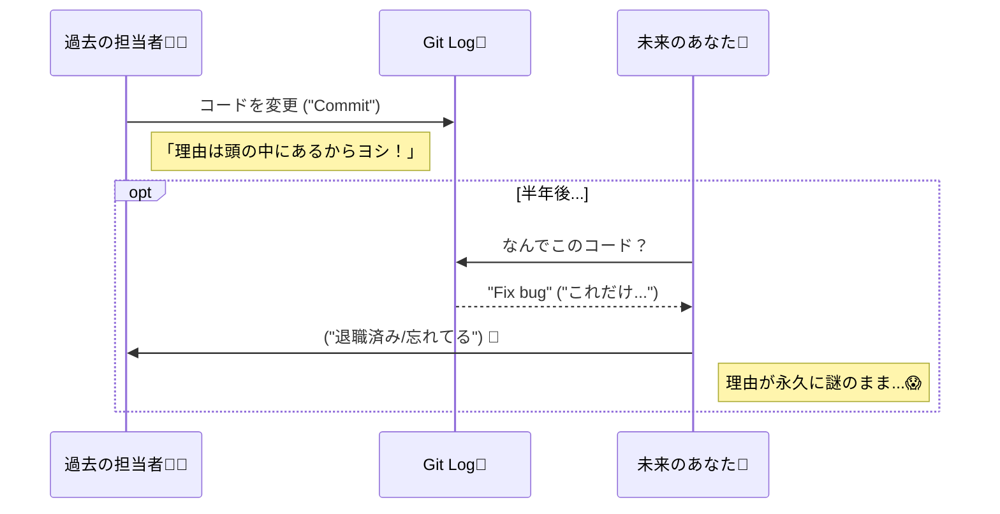

# 第01章：ADRってなに？「設計の理由」を未来に残すノート📒🌸

## この章のゴール🎯✨

読み終わったら、こんな状態になってればOKだよ〜😊💕

* ADRは「メモ」じゃなくて **“判断の証拠＆説明書”** だってわかる📌
* 「なんで必要なの？」が腹落ちする（未来の自分が救われる）🛟✨
* TypeScript開発で **判断が増えるポイント** が思い当たるようになる💡
* 直近の「迷った判断」を1つ、材料として用意できる✍️🌱

---

## 1) ADRってなに？ひとことで言うと📝✨


ADR（Architecture Decision Record）は、**重要な設計判断を**
「どういう状況で（Context）」「何を決めて（Decision）」「その結果どうなるか（Consequences）」
の形で残す短いドキュメントだよ📄✨ ([GitHub][1])

ポイントはここ👇💡
**“何をしたか”より、”なぜそう決めたか”を未来に渡す**ってこと🎁🕰️

---

## 2) なんでADRが必要になるの？あるある😵‍💫💥


### あるある①：数ヶ月後の自分が、他人になる👻

* 「え、なんでこのライブラリ選んだんだっけ…？」
* 「なんでここだけ例外処理が特殊なの…？」
* 「当時の前提って何…？誰が決めたの…？」

人は忘れる。マジで忘れる🥹🌀
だから “判断の理由” を残しておくと、未来の自分が泣かない😭✨



### あるある②：チーム（or 将来の自分の複数人格）で話がループする🔁

同じ論点を何度も繰り返すやつ…👀💦
ADRがあると、

* 「前にこういう前提でこう決めたよね」
* 「前提が変わったから、今は置き換えよう」

って会話ができるようになる🧠✨ ([Wantedly Engineering Handbook][2])

### あるある③：レビューが“好みバトル”になりがち⚔️🥲

「俺はこっち派」「私はこっち派」みたいなやつね…😂
ADRに **比較軸** や **トレードオフ** が残ると、議論が落ち着く🌿✨

---

## 3) ADRは「議事録」や「README」と何が違うの？🧩


ざっくりこんな感じ👇（覚え方：**判断の“芯”だけ残す**）✨

* 議事録：会話の流れが中心🗣️📝
* README：使い方や概要が中心📚
* Issue/PR：作業や変更の履歴が中心🔧
* **ADR：重要な判断の “理由・選択肢・結果” が中心** 🎯✨ ([GitHub][1])

---

## 4) TypeScript開発って、判断が増えやすい😳🧠✨


TypeScriptって、便利なぶん「設計の選択ポイント」がめっちゃ多いのね🍰💦
たとえば👇

* 型をどこまで厳しくする？（`strict` 系）🧷
* APIのデータ、実行時チェックどうする？（validation）🔍
* エラーの扱い：例外？Resultっぽく返す？⚠️
* 依存ライブラリの選定（HTTP、日付、状態管理…）📦
* 境界の引き方：UI層／ドメイン層／API層どう分ける？🧱
* モノレポにする？しない？🗂️
* テスト方針：どこまで？何を？🧪

こういう「後から変えると痛い判断」ほど、ADRが効くよ💉✨

---

## 5) ADRが「メモ」じゃなくなる境界線📌✨


ADRは、**“重要な判断”** を書くものなんだけど、ここが超大事👇

### ✅ ADRが価値を出すのは「理由」があるとき

* どういう制約があった？（期限、既存仕様、チームの慣れ…）⏳📌
* 他にどんな選択肢があった？（最低2つ）🌱🌱
* 何を捨てて、何を取った？（トレードオフ）⚖️

これが入ると、ADRは一気に“設計の資産”になる💎✨ ([Architectural Decision Records][3])

---

## 6) ミニサンプル：ADRってこんな雰囲気📝🌸


まだテンプレは次章でやるけど、「雰囲気」だけ先に見せるね👀✨

```md
# ADR-0001: APIレスポンスの実行時バリデーションを導入する

## Context
TypeScriptの型だけだと、外部APIから来るデータの「実体」が壊れていても実行時に気づけない。
不正データで画面が落ちたことがある。

## Decision
APIレスポンスは受け取り直後に実行時バリデーションを通し、失敗したら統一エラーとして扱う。

## Consequences
+ 変なデータでアプリが落ちにくくなる
+ バグ調査が速くなる
- スキーマを書く手間が増える
- 依存が1つ増える
```

「短いけど、“理由と結果” がちゃんと残る」感じがイメージできればOK〜😊✨

---

## 7) 🧪ワーク（1分✍️）：最近の「迷った判断」を1つ書き出そう🌱


スマホでもOK📱✨ ほんとに1分でいいよ〜⏱️💕

**Q：最近「うーん🤔」って迷った判断、1個だけ思い出して！**

例）

* 「HTTPはfetch直書き？ラッパ作る？」
* 「型は厳しめ？ゆるめ？」
* 「例外投げる？戻り値で返す？」 などなど

書くのはこの3つだけ👇

* 何を迷った？（テーマ）🎯
* どっちで迷った？（選択肢）⚖️
* 決め手は何だった？（理由）🔑

---

## 8) 🤖AI活用：メリ/デメを“秒速で”出してもらう✨🪄

ここはAIがめちゃ頼れるところ〜🤝💕
さっきのワークのテーマを使って、こんな感じで投げると強いよ💪✨

### コピペOKプロンプト集📌🤖


```txt
次の設計判断について、メリット/デメリットを箇条書きで出して。
前提：TypeScriptプロジェクト。読み手は未来の自分。
判断テーマ：{ここにテーマ}
選択肢A：{A}
選択肢B：{B}
できれば「運用面」「学習コスト」「型安全」「保守性」「パフォーマンス」も触れて。
```

さらにもう一段強くするなら😈✨（反対意見を出させる）

```txt
上の判断について「反対派（悪魔の代弁者）」として、最も刺さる反論を5つ出して。
それぞれに対して、こちら側の反論（対策案）もセットで。
```

こうすると、ADRの中身が一気に“筋が通った文章”になりやすいよ🧠✨

---

## 9) 章末チェック✅📌（3問だけ！）

1. ADRは「何」を残すもの？（やったこと？理由？）🧐
2. ADRの基本3点セットは？（Context / Decision / もう1つ！）🎁
3. 「TypeScriptで判断が増える場面」1つ言える？💡

全部ふわっとでも言えたら合格〜🎉😊

---

## 次章へのつなぎ🧩✨

この章で「ADRって必要そう…！」って気持ちになれたら最高🌸
次は、**迷わず書ける“型（テンプレ）”** を手に入れて、書くハードルを下げていくよ〜📝💕 ([GitHub][4])

[1]: https://github.com/joelparkerhenderson/architecture-decision-record?utm_source=chatgpt.com "Architecture decision record (ADR) examples for software ..."
[2]: https://docs.wantedly.dev/fields/dev-process/adr?utm_source=chatgpt.com "アーキテクチャディシジョンレコード(ADR)"
[3]: https://adr.github.io/madr/?utm_source=chatgpt.com "About MADR"
[4]: https://github.com/adr/madr?utm_source=chatgpt.com "adr/madr: Markdown Architectural Decision Records"
