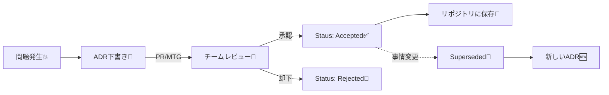

# 第02章：ADRの基本テンプレ（型）を手に入れよう🧩📝

この章は「**とりあえず迷わず書き始められる“型”**」を手に入れる回だよ〜！😊✨
ADRは、**重要な設計判断**を **Context（背景）/ Decision（結論）/ Consequences（結果）** とセットで残すドキュメントだよ📒💡 ([GitHub][1])

---

## 2-0 この章のゴール🎯🌸

読み終わったら、こんな状態になってるはず！💪✨

* ADRの最小構成 **Context / Decision / Consequences** を説明できる✅ ([AWS ドキュメント][2])
* **コピペで使えるテンプレ**を自分のリポジトリに置ける📁✨
* **Status（状態）**を付けて、後で見返しても迷子にならない🧭
* “長文作文”にならず、**短く強いADR**を書ける✍️🔥

---

## 2-1 なんでテンプレが必要なの？🧠💭


テンプレがないと起きがちなのがコレ👇😵‍💫

* 背景を書き忘れて「なんでこうしたの？」が未来で謎になる🕰️💦
* 結論がぼやけて「結局どっち？」になる😇
* メリットしか書かず、デメリットが後で爆発💥

AWSのガイダンスでも「最低限、**Context / Decision / Consequences** は入れようね」って考え方になってるよ📌 ([AWS ドキュメント][2])
つまりこの3つが “核” なんだ〜！🧩✨

---

## 2-2 最小3点セット：Context / Decision / Consequences ✅✅✅


ここがADRの心臓🫀✨
まずは **この3つだけ**で成立するようにしよっ😊

### A) Context（背景）📌

「どんな状況で」「何が困ってて」「何を優先してるか」を書くよ🗺️

入れると強い要素はこのへん👇

* いま困ってること（痛み）😣
* 制約（期限/互換性/運用/既存事情）📎
* 優先順位（安全性？速度？開発体験？）⚖️

**よくあるミス**：

* ✖️「とりあえず流行ってるから」
* ✖️「なんか良さそう」
  → 未来の自分が泣くやつ😭

---

### B) Decision（結論）✅

**一文で言い切る**のがコツ！✍️✨

* ○「〇〇を採用する」
* ○「△△は採用しない」
* ○「□□はこの範囲だけ適用する」

**よくあるミス**：

* ✖️「どっちも良さそうなので様子見」
  → ADRとしては弱い🥺（“今は決めない”ならそれもDecisionとして明記しちゃおう！）

---

### C) Consequences（結果）💎💦

ここが一番大事になりやすい！
Cognitect（Michael Nygardの有名記事）でも「**良いことだけじゃなく全部書こう**」って強調されてるよ📌 ([Cognitect.com][3])

最低これを入れると強い👇

* 良い点👍
* 悪い点👎
* 影響（運用・学習コスト・保守）🧹📚
* リスク⚠️
* 追加でやること（フォローアップ）🔧

**よくあるミス**：

* ✖️メリット3つだけ書いて終わり
  → デメリット未記載は、未来の地雷💥

---

## 2-3 “軽量ADR（5点セット）”がいちばん使いやすい🪶📄


最小3点に、実務で便利な2つを足したのがこの形👇

* Title（タイトル）
* Status（状態）
* Context
* Decision
* Consequences

この5点セットは、ADRの定番としてよく紹介される形だよ🧩✨ ([北海道札幌市・宮城県仙台市のVR・ゲーム・システム開発 インフィニットループ][4])

---

## 2-4 Status（状態）って何？どう使うの？🔁🧭


Statusは「この判断、いまどういう扱い？」を一発で分かるようにするやつ💡
例：**Proposed / Accepted / Superseded / Deprecated / Rejected** みたいな感じ✨ ([Embedded Artistry][5])

AWSの説明だと、流れはざっくりこう👇

* Proposed（提案）→レビュー
* Accepted（採用）→**採用されたら基本“固定（immutable）”**
* 事情が変わったら、新しいADRを作って **前のADRをSuperseded** にする🔁 ([AWS ドキュメント][2])

この「**古いADRを編集して歴史を書き換えない**」って感覚、めちゃ大事だよ〜！📚✨ ([AWS ドキュメント][2])



---

## 2-5 “短くて強いADR”にするコツ✍️✨


初心者が一番ハマりやすい罠は「全部書こうとして長文」😵‍💫
ADRは**未来の自分が読み返せる長さ**が正義だよ👑✨

おすすめルール（迷ったらコレ）👇

* Context：箇条書き中心でOK🧾
* Decision：1〜2文で言い切る✅
* Consequences：良い/悪い/運用 だけは必ず書く💎
* 詳細設計や実装手順は、Issue/PR/READMEに逃がしてリンク🔗

---

## 2-6 コピペで使えるADRテンプレ（Markdown）📄🧩

まずはこれを `docs/adr/` とかに置いちゃおう😊
（ファイル名は好きでOKだけど、番号を付ける文化もよくあるよ🔢✨ ([Embedded Artistry][5])）

```md
# ADR-0001: （ここに短いタイトル）

- Status: Proposed
- Date: 2026-01-14
- Related: （Issue/PR/Docsリンクがあれば）

## Context
- （いま困ってること / 背景）
- （制約：期限・互換性・運用など）
- （優先したいこと：安全性/DX/速度/保守性…）

## Decision
（例）私たちは **〇〇** を採用する。適用範囲は **△△** とする。

## Consequences
### 👍 Positive
- （良いこと1）
- （良いこと2）

### 👎 Negative / Trade-offs
- （悪いこと1）
- （悪いこと2）

### ⚠️ Risks / Mitigations
- Risk: （リスク）
  - Mitigation: （対策）

### 🔧 Follow-ups
- （やること：設定追加、ガイド作成、計測、移行…）
```

---

## 2-7 サンプルADR（TypeScriptっぽいテーマ）🍪🧠


例として「実行時バリデーションどうする？」をADRにするとこんな感じ👇
（“型があるのに実行時に壊れる”問題、ありがちだよねぇ…😇）

```md
# ADR-0001: 入力データの runtime validation を導入する

- Status: Accepted
- Date: 2026-01-14
- Related: #123 (API入力の不正で落ちた)

## Context
- 外部から来るJSONが、型定義とズレることがある
- その結果、実行時に例外が起きて原因調査コストが増えている
- なるべく「早く」「分かりやすく」失敗させたい

## Decision
私たちは API境界で **runtime validation** を行う。
境界以外（内部ロジック）では TypeScript の型を信頼する。

## Consequences
### 👍 Positive
- 不正データを入口で止められる（バグ調査が楽）
- エラーレスポンスを統一しやすい

### 👎 Negative / Trade-offs
- バリデーション記述が増える
- 少しだけ実行コストが増える

### ⚠️ Risks / Mitigations
- Risk: バリデーションが散らばって運用がしんどい
  - Mitigation: 入口層に集約し、ガイドをREADMEに追記する

### 🔧 Follow-ups
- 入力DTOの配置ルールを docs に書く
- 代表的なバリデーション例をスニペット化する
```

---

## 2-8 ワーク（15分）🖍️✍️✨


### ワーク1：色分けゲーム（3分）🎮

上のサンプルADRを読んで、行頭に印を付けてみて〜！

* Contextっぽい行：🟦
* Decisionっぽい行：🟩
* Consequencesっぽい行：🟧

“これができる”だけで、ADR読むのが急にラクになるよ😊✨

### ワーク2：自分の判断を1個だけADRに（12分）🌸

最近迷ったやつでOK！小さめでいいよ🙆‍♀️

1. Contextを箇条書きで3行
2. Decisionを1文
3. Consequencesを「良い2 / 悪い2」で書く

---

## 2-9 AI活用：テンプレに“整形”してもらう魔法🪄🤖✨


### そのまま使えるプロンプト例💬

* 「次のメモを ADR の **Context/Decision/Consequences** に整理して。短く、箇条書き中心で。デメリットも必ず入れて」
* 「Decision文を **一文で言い切り**にして。適用範囲も添えて」
* 「Consequencesの **見落としがちなデメリット** を3つ追加して」

### “悪魔の代弁者😈”も便利！

* 「このDecisionに反対する人の主張を3つ出して。それに対する返しも考えて」

（MADRみたいに “Options” を厚めに書く型もあるけど、まずはこの章のテンプレで十分だよ〜！MADR自体もテンプレを提供していて、最近は **MADR 4.0.0** の案内も出てるよ📌） ([Architectural Decision Records][6])

---

## 章末チェック✅🌷

* [ ] Contextに「困りごと/制約/優先」が入ってる？📌
* [ ] Decisionが一文で言い切れてる？✅
* [ ] Consequencesにデメリットが書けてる？👎💦 ([Cognitect.com][3])
* [ ] Statusで「いまの状態」が分かる？🧭 ([AWS ドキュメント][2])

---

次は（第3章の内容に合わせて）「**いつADRを書く？**」の判断ルールに進むと、ADRが“増えすぎ問題”も防げてめちゃ楽になるよ〜！😊🌸

[1]: https://github.com/joelparkerhenderson/architecture-decision-record "GitHub - joelparkerhenderson/architecture-decision-record: Architecture decision record (ADR) examples for software planning, IT leadership, and template documentation"
[2]: https://docs.aws.amazon.com/prescriptive-guidance/latest/architectural-decision-records/adr-process.html "ADR process - AWS Prescriptive Guidance"
[3]: https://www.cognitect.com/blog/2011/11/15/documenting-architecture-decisions?utm_source=chatgpt.com "Documenting Architecture Decisions - Cognitect.com"
[4]: https://www.infiniteloop.co.jp/tech-blog/2023/03/what-is-adr/?utm_source=chatgpt.com "ADR – アーキテクチャ上の設計判断を記録しよう｜技術ブログ"
[5]: https://embeddedartistry.com/fieldmanual-terms/architecture-decision-record/?utm_source=chatgpt.com "Architecture Decision Record"
[6]: https://adr.github.io/madr/ "About MADR | MADR"
