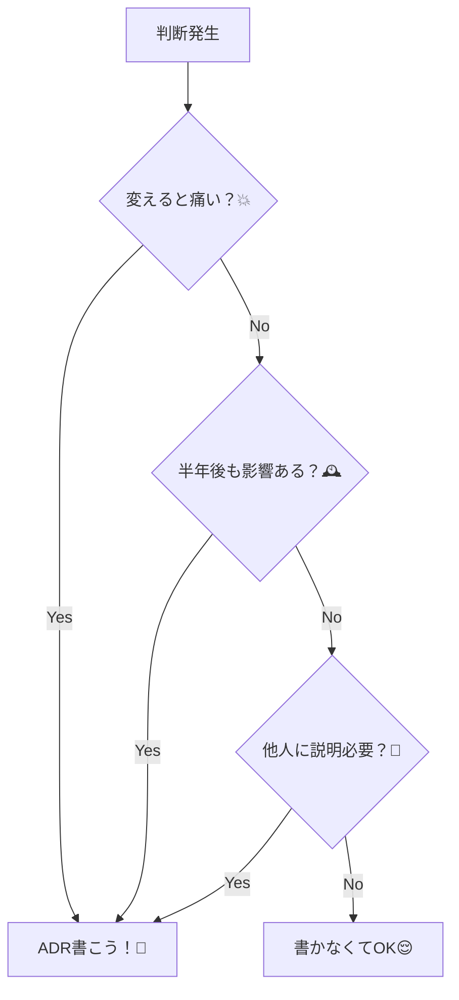

# 第03章：いつADRを書く？“書きどき判定”ルール🎯✅

この章のゴールはひとつだけ！
**「ADRを書くべき判断」と「書かなくていい判断」を、サクッと見分けられるようになること**です🕵️‍♀️💡

ADRってそもそも「**重要な設計判断を、背景（Context）と結果（Consequences）つきで残す短い記録**」なんだよね📒✨（重要＝アーキテクチャ的に大事なやつ） ([Cognitect.com][1])
だから、**何でもかんでもADRにすると逆に死ぬ**😇💦
この章では「ちょうどいい量」にする判定ルールを身につけよう〜！🌸

---

## 3-1. まず結論：ADRを書くのは「あとで困る」判断だけ😵‍💫🧠

ADRの価値って、超ざっくり言うとこれ👇

* **未来の自分／未来の誰か**が「なんでそうしたの？」って聞いたときに答えられる🙋‍♀️
* 同じ議論を**何度も繰り返さなくて済む**🔁
* 「決めた」だけじゃなくて、**決めた理由とトレードオフ**が残る⚖️✨ ([Cognitect.com][1])

---

## 3-2. “書きどき判定”の超シンプル3条件🎯✨


迷ったらまずこれ！👇
**1個でも当てはまったら、ADR候補**だよ✅

### ✅ 条件A：後戻りコストがデカい💥

例：

* APIの方針（REST / GraphQL / tRPC など）
* DBやORM選定
* モノレポにするかどうか
  → 後から変えると、コードも運用も泣く😭

### ✅ 条件B：長く効く（寿命が長い）🕰️

例：

* エラーハンドリング方針（例外？Result風？）
* 型の厳しさ方針（strict強め？ゆるめ？）
* ディレクトリ構成や境界（層／モジュールの切り方）
  → 何ヶ月も効いて、チームの習慣になるやつ🔥

### ✅ 条件C：影響範囲が広い（人・機能・チーム）👥🌍

例：

* 共通ライブラリ導入
* コーディング規約の強制ルール（lint/format）
* 認証方式や権限管理
  → 「その判断、全員が巻き込まれる」やつ💡

---

## 3-3. さらに精度UP！“ADR向き度”5問チェック🧪📊

次は「ちゃんと判断する」ための質問セット✨
YESが多いほどADR向きだよ✅

1. **他の選択肢が現実的にある？**（AかBで迷った？）🤔
2. **選ぶとトレードオフがある？**（良い点も悪い点もある？）⚖️
3. **間違えると痛い？**（障害・コスト・遅延・炎上🔥）
4. **説明責任が必要？**（レビューで突っ込まれそう？）👀
5. **3ヶ月後に忘れそう？**（未来の自分が記憶喪失）🧠💫

> だいたい **「YESが2〜3以上」→ADR候補** にしちゃってOK🙆‍♀️✨
> ADRは「重要な設計判断のログ」を作る考え方だよ〜 ([AWS ドキュメント][2])



---

## 3-4. ADR不要ゾーン🙅‍♀️🍃（ここ超大事！）


ADRを書かなくていい判断も、ちゃんと決めよう✨
**ADRにしない方が健全**なやつ👇

* 変数名や関数名の軽いリネーム✏️
* UIのちょい修正（色・余白・文言）🎨
* 小さいバグ修正🐛
* すぐ捨てる試作（1日PoC）🧪
* 依存パッケージのパッチアップデート（影響小）📦

こういうのは、PR説明やIssueで十分なことが多いよ👍
ADRは「重要な判断」だけに集中させるのがコツ🌟

---

## 3-5. 「判断がデカすぎる問題」✂️😇 → 分割ルール


ADRにしたいテーマが巨大すぎると、だいたい失敗する💦
（読む気がなくなるやつ…😵‍💫）

### ✅ 分割のコツ：1ADR = 1つの結論

たとえば「APIまわり全部」って大きすぎ！
こう割ると強いよ👇

* ADR-000X：APIスタイルは **REST** にする
* ADR-000Y：契約は **OpenAPI** で管理する
* ADR-000Z：認証は **JWT + Refresh** にする

**それぞれ別の結論**だから、別ADRの方が読みやすい📚✨

---

## 3-6. “早すぎ問題”と“遅すぎ問題”⏱️💦

### 😭 遅すぎ：実装してから「あ、書くの忘れた」

→ だいたい理由が抜け落ちて「結論だけ」になりがち💀

### 😭 早すぎ：何も決まってないのにADRを書き始める

→ ふわふわした作文になりがち☁️

### ✅ ちょうどいい：状態（Status）で解決する✨

AWSのADRガイドみたいに、ADRは**状態を持つ**運用が相性いいよ👍
例：Proposed → Accepted → Superseded（置き換え） ([AWS ドキュメント][3])

つまり…

* 迷ってる最中は **Proposed** で「叩き台」を置く📝
* 決まったら **Accepted** にする✅
* 後で方針変えたら **Superseded** にする🔁

これで「早すぎ/遅すぎ」両方が救える〜！🎉

---

## 3-7. VS Codeで“書きどき”を逃さない小ワザ📌🧭

### ✅ 小ワザ1：判断が出たPRに「ADRいる？」を入れる

PRテンプレ（または自分のチェック）にこれを追加👇

* 「このPR、後戻りコスト大きい？」💥
* 「長く効く？」🕰️
* 「影響範囲広い？」👥

### ✅ 小ワザ2：Node系のADR CLIを使って“書くハードル”を下げる🤖✨

TypeScript界隈なら、たとえば **@meza/adr-tools** みたいにnpmで入るADRツールがあるよ📦
`adr new ...` で番号付け＆テンプレでファイル生成してくれるやつ💡 ([GitHub][4])

（元祖の adr-tools も「Markdownをリポジトリに置いてログ管理する」流れを作った代表例だよ） ([GitHub][5])

---

## 3-8. ワーク🗂️✨：「ADR必要/不要」仕分け10連発🔥

次の10個を、直感で3つに分けてみてね👇

* ✅ ADR必要
* 🤔 迷う（状況次第）
* 🙅‍♀️ ADR不要

1. runtime validation を zod に統一する
2. `tsconfig` を strict 強制にする
3. 一部画面の文言を変更する
4. API層を `fetch直書き` から `ラッパ` に変える
5. ESLintルールを少し厳しくする（warning→error）
6. 状態管理を導入する（例：何かしら採用）
7. テストフレームワークを置き換える
8. 変数名をいくつか読みやすくする
9. 認証方式を変更する
10. 使い捨てPoCで1日だけ試す

### ✅ 例：よくある答え（参考）

* ✅ ADR必要：1,2,4,6,7,9
* 🙅‍♀️ ADR不要：3,8,10
* 🤔 迷う：5（規模と影響次第！）

ポイントは「**後戻りコスト・寿命・影響範囲**」だったよね🎯✨

---

## 3-9. AI活用🤖💕：ADR向き度を“採点”させるプロンプト

コピペで使えるやつ置いとくね🪄✨（短くて強い）

**プロンプト例①：ADR向き度を判定**

```text
次の判断がADRを書くべきか判定して。
判断内容：<ここに判断>
評価軸：後戻りコスト／長期影響／影響範囲／トレードオフの有無／リスク
出力：①ADR必要度(0-10) ②理由 ③書くならタイトル案 ④Contextに入れるべき情報
```

**プロンプト例②：テンプレに当てはめて下書き**

```text
次の判断を、Context/Decision/Consequencesの最小ADRにして。
短く、曖昧語（たぶん、場合によって）を減らして。
判断内容：<ここに判断>
検討した選択肢：<A/B/C>
制約：<納期、既存、スキルなど>
```

あと、Copilot向けにADR作成プロンプトの雛形も公開されてたりするので、チームで型を揃えたいときに便利だよ📎✨ ([GitHub][6])

---

## まとめ：第3章の“合格ライン”🎓🌸

次が言えたらこの章クリア✅✨

* ADRを書くのは「重要で、あとで困る判断」だけ📒
* 判定は **後戻りコスト💥／長く効く🕰️／影響範囲👥** が軸🎯
* 迷ったら「5問チェック」でYESが増えたらADR候補🧪
* 巨大判断は「1ADR=1結論」で分割✂️
* Proposed/Accepted/Supersededみたいな状態運用で、早すぎ遅すぎ問題を解決🔁 ([AWS ドキュメント][3])

---

次は第4章の「比較軸と選択肢の出し方⚖️✨」で、**“筋の良い決め方”**に進むよ〜！🚀💕

[1]: https://www.cognitect.com/blog/2011/11/15/documenting-architecture-decisions?utm_source=chatgpt.com "Documenting Architecture Decisions - Cognitect.com"
[2]: https://docs.aws.amazon.com/prescriptive-guidance/latest/architectural-decision-records/welcome.html?utm_source=chatgpt.com "Using architectural decision records to streamline technical ..."
[3]: https://docs.aws.amazon.com/prescriptive-guidance/latest/architectural-decision-records/adr-process.html?utm_source=chatgpt.com "ADR process - AWS Prescriptive Guidance"
[4]: https://github.com/meza/adr-tools "GitHub - meza/adr-tools: A typescript remake of Nat Pryce's ADR-Tools"
[5]: https://github.com/npryce/adr-tools "GitHub - npryce/adr-tools: Command-line tools for working with Architecture Decision Records"
[6]: https://github.com/github/awesome-copilot/blob/main/prompts/create-architectural-decision-record.prompt.md?utm_source=chatgpt.com "create-architectural-decision-record.prompt.md"
