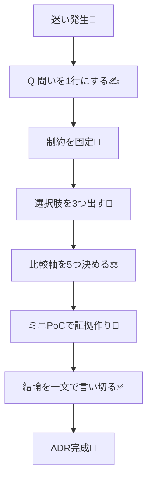

# 第04章：TypeScript向け「判断の作り方」— 比較軸と選択肢の出し方⚖️✨

## 4.0 この章のゴール🎯💗

この章を終えると、こんな状態になれます👇✨

* 「なんとなく」じゃなく、**筋の通った決め方**ができる🙆‍♀️
* **選択肢（Options）を2〜3個**ちゃんと出せる🌱
* **比較軸（Decision Drivers）**を用意して、説明できる🧠
* そのまま第5章以降の **Context / Decision / Consequences** に落とし込める📝
  （ADRは “背景・結論・結果” を残すやつだよ〜ってやつ💕） ([Architectural Decision Records][1])

---

## 4.1 なんで「判断」がグダるの？😵‍💫💦

設計の判断が迷子になる理由、だいたいこれ👇

* **選択肢が1個しか出てない**（＝比較できない）🫠
* **比較軸が頭の中だけ**（言語化できてない）🌫️
* **制約が曖昧**（納期・既存・チーム事情など）📌
* **理想だけ見て、運用の現実を見落とす**（保守・更新・教育コスト）🧹

なので、この章では「迷いにくい型」を先に渡します🎁✨

---

## 4.2 判断の“型”はこれだけでOK！6ステップ🧩✨


迷ったら、毎回これで進めてね👇（ほんとに強い💪💞）

### Step1：判断の問いを1行にする✍️


* 悪い例：
  「APIまわりどうしよう…」😵
* 良い例：
  「外部APIのレスポンス検証を **どの方式** でやる？」✅

👉 **“どれにする？”が答えになる問い**にするのがコツ！

---

### Step2：制約を先に固定する📌


ここがブレてると、全部ブレるよ〜！💦
例：

* 期限：今月中に出す⏰
* 既存：fetch直書きが多い、改善したい🧽
* 学習：難しすぎるのは避けたい📚
* 運用：半年後も回る形にしたい🧹

---

### Step3：選択肢を2〜3個出す🌱（＋できれば “何もしない” も）

目安はこれ👇

* **Option A：いちばん堅実**
* **Option B：いちばん軽い**
* **Option C：将来性高い（でも難しい）**
* （Option 0：現状維持 = 何もしない）🫣

👉 ここで大事なのは「正解を当てる」じゃなくて、**比較可能な形を作る**ことだよ💗

---

### Step4：比較軸を5つ以内で決める⚖️


比較軸を増やしすぎると、逆に迷う〜😂
だから **最大5つ**がちょうどいい✨

---

### Step5：証拠をちょびっと作る🔎（ミニPoCでOK）


* 30分だけ試す
* 既存コードに当ててみる
* 型が崩れないか確認
* 例外処理が地獄にならないか見る

TypeScriptは型が強いぶん、**型の重さ・推論の効き・開発体験**が判断に直結しがち。
最近のTypeScriptは型の表示や複雑型の扱いが改善され続けてるので、型が重いライブラリを選ぶときは「今の体験」で軽く確かめるのが安心だよ🧪✨ ([typescriptlang.org][2])

---

### Step6：結論は「一文」で言い切る✅

最後はこれ！

* 「〇〇を採用する。適用範囲は△△。例外は□□。」みたいに✨

（この“一文”が次の章の Decision をめちゃ助ける💞）



---

## 4.3 TypeScript開発でよく使う比較軸カタログ📚✨


ここから選べばOK！迷ったらまずこれ👇

### 開発体験（DX）🧁

* 型補完が気持ちいい？
* エラーメッセージが読める？
* 型が複雑すぎてホバーが辛くない？
  （TypeScript/エディタ側で表示改善も入ってるよ〜） ([typescriptlang.org][2])

### 型安全🧷

* “any漏れ”が起きにくい？
* 境界（API/Storage/外部入力）で型が守れる？

### 実行時安全（Runtime）🛡️

* 外部データをちゃんと検証できる？
* 「型はあるのに実行時に壊れる」事故を防げる？

### 学習コスト📚

* 初見で理解できる？
* チームに広げられる？
* 書き方がクセ強すぎない？

### 運用・保守性🧹

* 依存更新が地獄にならない？
* ルールを守り続けやすい？
* テストが書きやすい？

（他にも性能🚀、バンドルサイズ📦、移行しやすさ🔁…はあるけど、まずは上の5つが鉄板✨）

---

## 4.4 比較表テンプレ（コピペ用）🧾✨


この表、めっちゃ使えるよ〜！💗

| 比較軸       | 重み(1-3) | Option A | Option B | Option C | メモ |
| --------- | ------: | -------: | -------: | -------: | -- |
| DX        |         |          |          |          |    |
| 型安全       |         |          |          |          |    |
| Runtime安全 |         |          |          |          |    |
| 学習コスト     |         |          |          |          |    |
| 運用・保守     |         |          |          |          |    |

* 点数は 1〜5（5が最高）とかでOK🙆‍♀️
* **重み**をつけると「今の優先」が表に出て良い✨

---

## 4.5 例題①：外部データの検証（Runtime validation）🧪🛡️

### 問い（1行）✍️

「APIレスポンスを **どの方式** で検証する？」

### 制約📌

* 事故りやすい画面がある
* なるべく簡単にしたい
* テストは増やしたい

### 選択肢🌱

* A：検証ライブラリを使う（代表例：いろいろある）
* B：最小限の自作ガード関数で守る
* C：重要箇所だけ検証して、他は割り切る（境界だけ堅く）

### 比較軸⚖️（5つ）

DX / 型安全 / Runtime安全 / 学習コスト / 運用

### ミニPoC🔎

* “実データっぽいJSON”を1つ用意
* 1画面ぶんだけ適用して、型推論とエラー体験を確認
* 「書くのが苦痛じゃない」かチェック😂

👉 ここまでやると、Decisionがスパッと書けるようになるよ✨

---

## 4.6 例題②：API呼び出し層をどう切る？🔌✨


### 問い✍️

「API呼び出しを **直書き**にする？ **ラッパ関数**に寄せる？ **専用層**を作る？」

### 選択肢🌱

* A：fetch直書き（速いけど散らかりやすい）🫠
* B：薄いラッパ（共通ヘッダ・共通エラーだけ）🧁
* C：APIクライアント層（型・検証・リトライ等まで面倒見る）🏗️

### 比較軸⚖️

DX / 型安全 / 運用 / 変更耐性（API変更に強い？） / 学習コスト

👉 TypeScriptは「型をどこまで寄せるか」で未来が変わるので、ここADR向きになりがちだよ📝✨

---

## 4.7 例題③：エラー方針（例外？Result風？）💥🧯

### 問い✍️

「エラーを **throw中心**にする？ **Result型**っぽく返す？ **統一エラー型**で包む？」

### ありがちな比較軸⚖️

* DX（呼び出し側が簡単？）
* 型安全（握りつぶしにくい？）
* 運用（ログ/通知/再現が楽？）
* テスト（テスト書きやすい？）
* 学習コスト

---

## 4.8 AI活用：比較を“雑に強く”するコツ🤖💞


CopilotやCodex系は、**比較の材料づくり**が得意だよ〜！✨
（チャットで質問して、表にしてもらうのが最強🧾）

GitHub Copilot ChatはIDE内で会話しながらコードや設計の相談ができるよ、って公式にもまとまってるよ〜。([GitHub Docs][3])

### 使えるプロンプト例💬✨

（そのまま貼ってOK🙆‍♀️）

```text
次の設計判断について、選択肢を3つ出して。
そのあと「比較軸を5つ」提案して、各選択肢のメリ/デメも短く。

判断のテーマ：{ここにテーマ}
制約：{納期/既存/学習コスト/運用など}
前提：TypeScriptプロジェクト
```

```text
あなたは悪魔の代弁者😈
私の候補Aの弱点を3つ、運用で起きるトラブルを2つ挙げて。
あと「それでもAを選ぶなら条件は何？」も書いて。
```

```text
比較表（軸5つ、点数1-5、重み1-3）を作って。
最後に「結論を一文」で言い切って。
```

#### おまけ：VS Codeの“エージェント機能”系も育ってきてるよ🧠✨

最近のVS Codeの更新では、エージェント関連（セッション管理やスキル）も拡充されてるので、「判断づくり」を手順化して手伝わせる発想もアリだよ〜！ ([Visual Studio Code][4])

---

## 4.9 ワーク（この章の成果物）📌🌸

所要：20〜30分くらい⌛💕

1. テーマを1つ決める🎯
2. **制約**を3つ書く📌
3. **選択肢を3つ**出す🌱
4. **比較軸を5つ**選ぶ⚖️
5. 比較表を埋める🧾
6. 結論を一文で書く✅

### 提出物（自分用でOK）🎁

* 比較表（軸5つ×選択肢3つ）
* 結論の一文
* 「迷ったポイント」1行メモ

---

## 4.10 よくある失敗あるある😂💦（回避策つき）

* ❌ 比較軸が多すぎて決まらない
  → ✅ 5つに絞る（増やすより削る！）✂️
* ❌ “好き嫌い”で決めてしまう
  → ✅ 制約と運用を軸に戻す🧹
* ❌ 選択肢がA vs Bの2択で、どっちも微妙
  → ✅ “C案（折衷/段階導入）”を作る🌱
* ❌ PoCせずに決めて爆死
  → ✅ 30分だけ試す🧪（小さく！）

---

## 4.11 まとめ🎀✨

この章でいちばん大事なのはこれ👇💗

* **問いを1行**✍️
* **制約を固定**📌
* **選択肢を3つ**🌱
* **比較軸は5つまで**⚖️
* **ちょいPoCで証拠**🔎
* **結論は一文**✅

次の第5章では、今日作った材料を使って **Context（背景）** を「短く強く」書けるようにするよ〜📌🗺️💕

[1]: https://adr.github.io/?utm_source=chatgpt.com "Architectural Decision Records"
[2]: https://www.typescriptlang.org/docs/handbook/release-notes/typescript-5-9.html?utm_source=chatgpt.com "Documentation - TypeScript 5.9"
[3]: https://docs.github.com/en/copilot/get-started/features?utm_source=chatgpt.com "GitHub Copilot features"
[4]: https://code.visualstudio.com/updates "December 2025 (version 1.108)"
