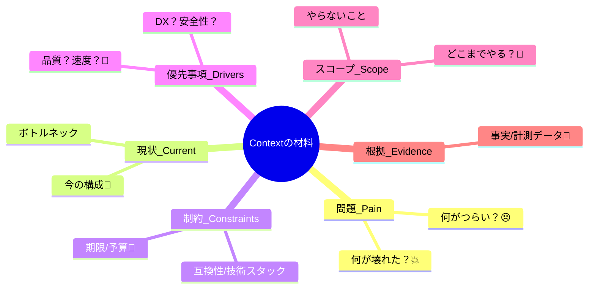

# 第05章：書き方① Context（背景）を短く強く！📌🗺️

この章は「**読んだ人が“状況を再現できる”Contextを書く**」がゴールだよ〜！😊💕
ADRって「結論（Decision）」が目立つんだけど、実は **Contextが弱いとDecisionも全部弱くなる**のです…！💥

---

## 5.1 Contextって何？（いちばん短い説明）🧠✨

**Context = “なぜこの判断が必要になったのか”を、未来の人が理解できる材料セット** 📦

未来の自分や、あとから入った人が読んだときに、

* 「あ〜、それならその判断になるね」😮‍💨
* 「今の条件なら、別案もありかも」🤔

って “追体験” できるのが強いContextだよ💪🌸


---

## 5.2 良いContextの条件はこの3つだけ！✅✅✅

### ✅ 条件1：状況が再現できる

「何が起きて」「何が困ってて」「今どうなってる」が分かる😣➡️😐

### ✅ 条件2：優先順位が分かる


速度？品質？安全？運用？コスト？
どれを大事にしてる判断なのかが見える✨

### ✅ 条件3：制約と範囲が分かる


「できないこと」「やらないこと」が明確だと、読み手が迷子にならない🧭

---

## 5.3 Contextに“入れるべきもの”チェックリスト📝🔎




Contextは **ぜんぶ書かない**のがコツ！
でも、このへんは入ってると強いよ💎✨

### A) 問題（Pain）😣

* 何がつらい？何が壊れた？何が遅い？
* 具体例が1つあると最高👍

### B) 現状（Current）📌

* いまどう作ってる？（現状の構成・流れ）
* 何がボトルネック？

### C) 制約（Constraints）🧱

* 締切・予算・運用体制・既存資産・互換性…
* 「これがあるから自由に選べない」が大事！

### D) 優先事項（Decision Drivers）🎯

* 例：型安全🧷 / DX🧁 / 変更容易性🧹 / 実行時安全⚠️ / パフォーマンス🚀

### E) スコープ（Scope）🧷

* どこまでの話？（この層だけ／この機能だけ／このリポジトリだけ）

### F) 根拠のヒント（Evidence）🔬

* 軽い計測・実験・事実が1つあると強い（例：障害件数、ビルド時間、バグ原因の傾向）

---

## 5.4 Contextに“入れないほうがいいもの”🙅‍♀️💦


Contextが太りがちな原因トップ3！😵‍💫

* **結論（Decision）を書いちゃう**
  → Contextは「背景」！結論は次の章で✨
* **実装の細部で埋め尽くす**
  → 「理解に必要な粒度」までで止める✋
* **歴史が長すぎる年表**
  → “いま判断が必要になった理由” に寄せて圧縮✂️

---

## 5.5 TypeScriptだとContextに入りやすい“背景ネタ”あるある🧩✨

### ①「型で安心」vs「実行時は別世界」問題🌍


TypeScriptはコンパイル時の型。実行時には型が消えるので、**入力の検証（runtime validation）** が論点になりがちだよね🧪

### ② tsconfig・モジュール方式で沼る🌀

ESM/CJS、Nodeの挙動、ビルドの前提などが絡むと判断が増える！
最近のTypeScriptは `--module node20` みたいに **Nodeの特定バージョン挙動に寄せた安定オプション**も出てるので、Contextに「どの前提で揃えるか」を書けると強いよ📌✨ ([typescriptlang.org][1])

### ③ “いつのTypeScript？” が地味に重要🧷

ADRは未来まで残るから、**使ってるTSのバージョン**も背景として価値があることがあるよ〜！
（今だと TypeScript 5.9 系のリリースが見えるね） ([GitHub][2])

---

## 5.6 Contextを書く「最短レシピ」🍳✨（迷ったらこれ）


Contextはこの順で書くと、短くまとまりやすいよ✍️💕

1. **一文で問題を書く**（何が困ってる？）😣
2. **現状を2〜3行**（いまどうしてる？）📌
3. **制約を箇条書き**（動かせない条件）🧱
4. **優先事項を3つ**（今回の勝ち筋）🎯
5. **スコープを書く**（ここだけの話）🧷
6. **根拠を1つ**（事実 or 軽い観測）🔬

---

## 5.7 悪いContext → 良いContext（3パターン）🎮🖍️


### パターン1：情報不足でフワフワ😵‍💫

❌悪い例

> 「APIの入力チェックを入れたい。」

✅良い例（短いのに強い💪✨）

> 「外部APIから受け取るpayloadが不正な形で届くことがあり、実行時エラーが月に数回発生している。現状はTypeScriptの型だけで扱っており、境界での検証がない。運用負荷を下げたい一方、開発速度も落としたくない。対象は“外部入力が入る境界”に限定する。」

---

### パターン2：歴史が長すぎて読者が寝る😴💤

❌悪い例

> 「昔はAを使っていて、そのあとBにして、でもCも試して…（長文）」

✅良い例（いま必要なところだけ残す✂️）

> 「これまで境界での検証を省略してきたが、外部連携が増えて“境界由来の障害”が目立ってきたため、入力検証の方針を決める必要がある。」

---

### パターン3：Contextに結論が混入しちゃう🙅‍♀️

❌悪い例

> 「zodを採用する。なぜなら便利だから。」

✅良い例（結論は書かない！）

> 「境界での入力検証が必要。候補としては既存ライブラリ利用か自前実装がある。優先は“運用で壊れにくいこと”と“型との整合性”。」

---

## 5.8 ワーク（手を動かすよ〜！）✍️💕🧪

### 🧪ワーク1（3分）：Contextの材料を集める🗂️

次の穴埋めを自分のテーマで埋めてね😊

* 困ってること（Pain）：
* 現状（Current）：
* 制約（Constraints）：
* 優先事項（Drivers）：
* 範囲（Scope）：
* 根拠（Evidence）：

---

### 🧪ワーク2（10分）：悪いContextを直す（3問）🎮

下の3つを「レシピ」に沿って書き直してみてね！

1. 「型を厳しくしたい」
2. 「エラー処理を統一したい」
3. 「API呼び出しの書き方がバラバラ」

💡ポイント：**1つにつき5〜10行で止める**（短く！強く！）✂️💪

---

### 🧪ワーク3（15分）：自分のADR 0001のContext草案を書く📄✨

この章のゴールはこれ！
`Context` だけでOK。結論はまだ書かないよ🙌

---

## 5.9 AI活用コーナー🤖💞（Contextを強化する魔法の頼み方）

VS Codeのチャット機能は「質問→修正→反映」の往復が速いので、Context磨きと相性いいよ✨ ([Visual Studio Code][3])
Copilot ChatもIDE内で使える機能として整理されてるよ📌 ([GitHub Docs][4])

### 🪄プロンプト1：足りない情報を“質問”で出してもらう

```text
あなたはADRレビュワーです。
以下のContextを読んで、足りない情報を「質問」の形で最大8個ください。
（Yes/Noで答えられない質問を優先して）
--- Context ---
（ここに貼る）
```

### 🪄プロンプト2：Contextを“短く強く”圧縮してもらう✂️

```text
以下のContextを、5〜10行に圧縮してください。
ただし「問題」「現状」「制約」「優先事項」「スコープ」は落とさないでください。
--- Context ---
（ここに貼る）
```

### 🪄プロンプト3：Decision Drivers（優先事項）を3つに絞る🎯

```text
以下のContextから、今回のDecision Drivers（優先順位）を3つに絞って提案してください。
それぞれ「なぜ重要か」も1行で。
--- Context ---
（ここに貼る）
```

### 🪄プロンプト4：悪魔の代弁者😈（Contextの弱点探し）

```text
このContextの弱い点・誤解されそうな点を、厳しめに5個指摘してください。
そのあと、各指摘に対して「1行の改善案」もください。
--- Context ---
（ここに貼る）
```

---

## 5.10 章末チェックリスト（提出前にここだけ見て！）✅🧾✨

* [ ] 問題が“一文”で言える😣
* [ ] 現状が2〜3行で分かる📌
* [ ] 制約が書いてある🧱
* [ ] 優先事項が3つくらい見える🎯
* [ ] スコープが明確🧷
* [ ] 結論（Decision）を書いてない🙅‍♀️
* [ ] 長すぎない（目安：10〜20行くらい）✂️

---

## ミニ宿題🎒💕

今日書いた `Context` を `docs/adr/0001-xxx.md` に入れて、**まずは草案としてコミット**してみよ〜！🌱✨
（次の章でDecisionを書いたとき、Contextが弱いとすぐバレるから、ここで勝っておくのがコツだよ💪😆）

---

[1]: https://www.typescriptlang.org/docs/handbook/release-notes/typescript-5-9.html?utm_source=chatgpt.com "Documentation - TypeScript 5.9"
[2]: https://github.com/microsoft/typescript/releases?utm_source=chatgpt.com "Releases · microsoft/TypeScript"
[3]: https://code.visualstudio.com/docs/copilot/chat/copilot-chat?utm_source=chatgpt.com "Get started with chat in VS Code"
[4]: https://docs.github.com/en/copilot/get-started/features?utm_source=chatgpt.com "GitHub Copilot features"
